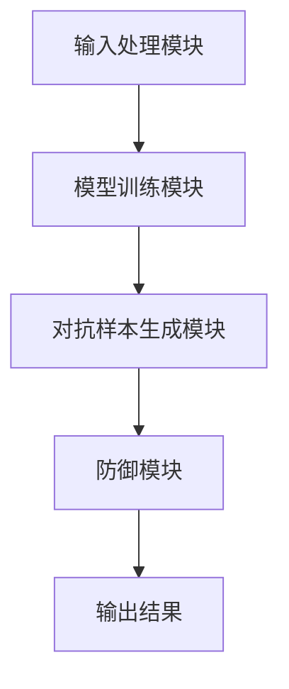
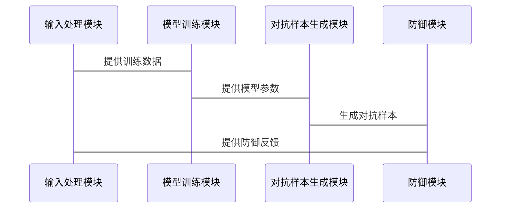

                 


# AI Agent的对抗性攻击防御策略

> **关键词**：AI Agent, 对抗性攻击, 防御策略, 鲁棒性, 机器学习

> **摘要**：  
本文深入探讨了AI Agent在对抗性攻击下的防御策略，分析了对抗性攻击的原理与方法，并提出了基于模型鲁棒性、对抗训练和数据增强的防御技术。文章结合实际案例，详细讲解了AI Agent的系统架构设计、算法实现和项目实战，为读者提供了一套完整的对抗性攻击防御方案。

---

# 引言

## 1.1 AI Agent的背景与概念

### 1.1.1 AI Agent的定义与分类  
AI Agent是一种能够感知环境、自主决策并执行任务的智能实体。根据功能可分为工具型Agent、实用型Agent和价值型Agent。  

### 1.1.2 AI Agent的核心功能与特点  
- **感知能力**：通过传感器或数据输入感知环境。  
- **决策能力**：基于感知信息做出最优决策。  
- **自主性**：无需外部干预即可完成任务。  
- **适应性**：能够根据环境变化调整行为。  

### 1.1.3 AI Agent的应用场景与发展趋势  
AI Agent广泛应用于自动驾驶、智能助手、机器人等领域，随着技术进步，其应用范围和复杂性不断增加。

---

## 1.2 对抗性攻击的背景与概念

### 1.2.1 对抗性攻击的定义与分类  
对抗性攻击是指通过恶意手段干扰或破坏AI Agent的正常运行，使其产生错误决策或行为。常见类型包括黑盒攻击和白盒攻击。

### 1.2.2 对抗性攻击的动机与目标  
攻击者通常希望通过干扰AI Agent来达到窃取信息、破坏系统或获取经济利益的目的。

### 1.2.3 对抗性攻击对AI Agent的威胁  
对抗性攻击可能导致AI Agent决策失误、数据泄露或系统崩溃，严重威胁其安全性和可靠性。

---

## 1.3 AI Agent与对抗性攻击的关系

### 1.3.1 对抗性攻击对AI Agent的威胁  
对抗性攻击针对AI Agent的感知和决策能力，可能导致其功能失效或行为异常。

### 1.3.2 AI Agent在对抗性攻击中的脆弱性  
AI Agent通常依赖于特定算法和数据，这些成为对抗性攻击的突破口。

### 1.3.3 对抗性攻击防御的必要性与挑战  
随着AI Agent的应用越来越广泛，防御对抗性攻击已成为保障其安全的核心任务。

---

## 1.4 本章小结  
本章介绍了AI Agent的基本概念及其在对抗性攻击中的脆弱性，强调了防御对抗性攻击的必要性。

---

# 第二部分: 对抗性攻击的原理与方法

## 2.1 对抗性攻击的核心原理

### 2.1.1 对抗性攻击的数学模型  
对抗性攻击通常基于优化问题，目标函数为：  
$$ \min_{x} \max_{\delta} \mathcal{L}(f(x + \delta), y) $$  
其中，$\delta$为对抗扰动，$\mathcal{L}$为损失函数。

### 2.1.2 对抗性攻击的目标函数与优化方法  
- **目标函数**：最大化模型的损失。  
- **优化方法**：使用梯度下降等优化算法生成对抗样本。

### 2.1.3 对抗性攻击的生成过程与步骤  
1. 选择目标模型。  
2. 计算模型的梯度。  
3. 生成对抗样本。  
4. 验证攻击效果。

---

## 2.2 常见的对抗性攻击方法

### 2.2.1 基于梯度的攻击方法  
- **FGSM**：Fast Gradient Sign Method，通过单次梯度上升生成对抗样本。  
- **I-FGSM**：Iterative FGSM，通过多次迭代增强对抗样本。

### 2.2.2 黑盒攻击与白盒攻击  
- **黑盒攻击**：攻击者仅知道模型的输入输出，无法访问模型参数。  
- **白盒攻击**：攻击者掌握模型的详细参数，可以进行精确的对抗样本生成。

### 2.2.3 针对特定模型的攻击策略  
- 针对深度神经网络的攻击：利用模型的非线性特性生成对抗样本。  
- 针对决策树模型的攻击：干扰特征选择过程。

---

## 2.3 对抗性攻击的评估与测量

### 2.3.1 对抗性样本的生成与检测  
- **生成**：通过扰动原始样本生成对抗样本。  
- **检测**：基于鲁棒性检测算法识别对抗样本。

### 2.3.2 对抗性攻击的成功率与鲁棒性评估  
- **成功率**：对抗样本导致模型错误分类的概率。  
- **鲁棒性**：模型在对抗样本攻击下的准确率。

### 2.3.3 对抗性攻击的防御与缓解方法  
- **防御技术**：基于模型鲁棒性增强、对抗训练等方法。  
- **缓解方法**：通过数据增强、模型优化降低对抗样本的影响。

---

## 2.4 本章小结  
本章详细分析了对抗性攻击的原理与方法，并介绍了常见攻击策略及其评估方法。

---

# 第三部分: AI Agent的对抗性攻击防御策略

## 3.1 对抗性攻击防御的核心思想

### 3.1.1 预防性防御策略  
- **模型鲁棒性**：通过模型优化提高对抗样本的检测能力。  
- **数据增强**：引入多样化的训练数据增强模型的泛化能力。

### 3.1.2 检测性防御策略  
- **异常检测**：基于统计方法或深度学习模型检测对抗样本。  
- **行为分析**：通过分析AI Agent的行为模式识别异常输入。

### 3.1.3 响应性防御策略  
- **实时响应**：快速识别对抗样本并采取应对措施。  
- **自适应调整**：根据攻击特征动态调整防御策略。

---

## 3.2 常见的对抗性攻击防御技术

### 3.2.1 基于模型鲁棒性的防御方法  
- **对抗训练**：在训练过程中引入对抗样本，增强模型的鲁棒性。  
- **防御性GAN**：利用生成对抗网络生成多样化的训练样本。

### 3.2.2 基于对抗训练的防御方法  
- **双管GAN**：通过生成器和判别器的对抗训练提高模型的鲁棒性。  
- **防御网络**：构建专门的防御网络识别并消除对抗样本。

### 3.2.3 基于数据增强的防御方法  
- **数据预处理**：对输入数据进行标准化、去噪等处理。  
- **数据多样性**：引入多领域数据增强模型的泛化能力。

---

## 3.3 对抗性攻击防御的综合策略

### 3.3.1 预防与检测的结合  
- **多层次防御**：结合预防和检测技术，构建多层防御体系。  
- **动态调整**：根据攻击强度动态调整防御策略。

### 3.3.2 数据与模型的协同防御  
- **数据多样性**：通过多样化的训练数据增强模型的鲁棒性。  
- **模型优化**：通过模型压缩、知识蒸馏等技术提高模型的抗干扰能力。

---

## 3.4 本章小结  
本章提出了基于模型鲁棒性、数据增强和对抗训练的防御策略，并强调了预防与检测结合的重要性。

---

# 第四部分: 系统架构与实现

## 4.1 系统架构设计

### 4.1.1 系统功能设计  
- **输入处理**：接收外部输入并进行预处理。  
- **模型训练**：构建鲁棒的AI Agent模型。  
- **对抗样本生成**：用于训练和测试的对抗样本生成工具。  
- **防御模块**：实现对抗样本的检测与防御。

### 4.1.2 系统架构图  


### 4.1.3 系统接口设计  
- **输入接口**：接收原始数据和对抗样本。  
- **输出接口**：返回处理结果和防御反馈。

### 4.1.4 系统交互流程  


---

## 4.2 算法实现与优化

### 4.2.1 对抗样本生成算法  
```python
def generate_adversarial_sample(x, y, model, epsilon=0.1):
    x_perturbed = x + epsilon * np.sign(model.grad(x, y))
    return x_perturbed
```

### 4.2.2 防御算法实现  
```python
def defend(x, model):
    x_normalized = normalize(x)
    prediction = model.predict(x_normalized)
    return prediction
```

### 4.2.3 算法优化与加速  
- **梯度加速**：使用动量优化算法加速对抗样本生成。  
- **并行计算**：通过多线程或分布式计算加速训练过程。

---

## 4.3 项目实战

### 4.3.1 实战环境搭建  
- **工具安装**：安装TensorFlow、Keras等深度学习框架。  
- **数据准备**：收集和整理训练数据集。  
- **模型训练**：构建AI Agent模型并进行对抗训练。

### 4.3.2 核心代码实现  
```python
# 对抗训练代码示例
def adversarial_training(model, x_train, y_train, epsilon=0.1, epochs=10):
    for epoch in range(epochs):
        for x, y in zip(x_train, y_train):
            x_perturbed = x + epsilon * np.sign(model.grad(x, y))
            model.train_on_batch(x_perturbed, y)
```

### 4.3.3 实战案例分析  
- **案例背景**：某AI Agent在对抗攻击下的表现。  
- **攻击效果**：对抗样本导致的分类错误率。  
- **防御效果**：防御策略下的分类准确率提升。

---

## 4.4 本章小结  
本章详细讲解了AI Agent的系统架构设计、算法实现与优化，并通过实战案例展示了防御策略的应用。

---

# 第五部分: 总结与展望

## 5.1 本章总结  
本文系统地探讨了AI Agent的对抗性攻击防御策略，从原理分析到实战应用，提出了多种有效的防御方法。

## 5.2 未来研究方向  
- **鲁棒模型设计**：研究更具鲁棒性的AI Agent模型。  
- **多模态防御技术**：结合多种模态信息增强防御效果。  
- **动态防御机制**：研究动态调整的防御策略，应对复杂攻击场景。

## 5.3 最佳实践Tips  
- **数据多样性**：在训练中引入多样化的数据增强模型的泛化能力。  
- **模型鲁棒性**：通过对抗训练等方法提升模型的鲁棒性。  
- **实时监控**：建立实时监控机制，快速识别和应对对抗攻击。

## 5.4 注意事项  
- **防御策略的权衡**：防御策略可能会影响模型的性能，需权衡利弊。  
- **攻击与防御的动态平衡**：随着攻击技术的发展，防御策略需不断更新。

## 5.5 拓展阅读  
- **推荐书籍**：《对抗性机器学习》、《深度学习的对抗训练》  
- **推荐论文**：相关领域的最新研究论文。

---

## 5.6 本章小结  
本文总结了AI Agent的对抗性攻击防御策略，并展望了未来的研究方向和实践中的注意事项。

---

# 结语

AI Agent的对抗性攻击防御是一个复杂而重要的任务，需要结合理论与实践，不断探索和优化防御策略。通过本文的探讨，我们希望为AI Agent的安全防护提供有价值的参考和指导。

---

