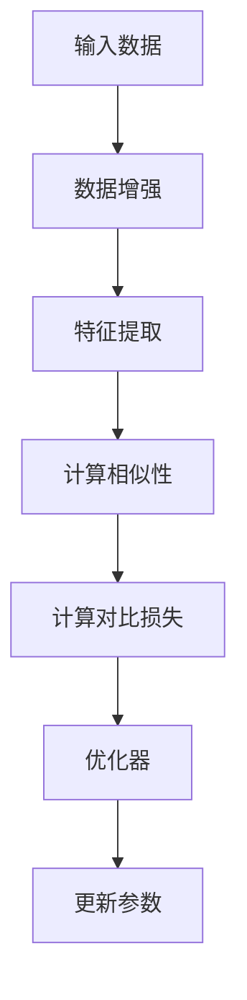
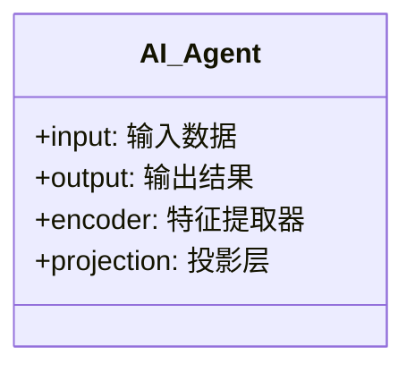
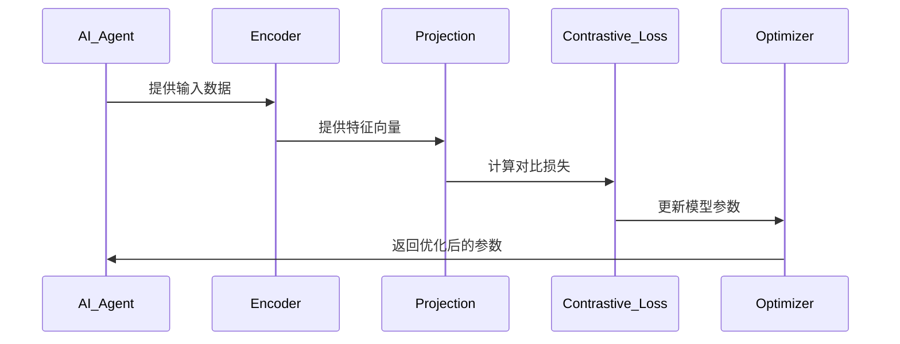

                 


# AI Agent的对比学习与表示学习

## 关键词：AI Agent，对比学习，表示学习，算法原理，系统架构

## 摘要：  
本文系统地探讨了AI Agent在对比学习与表示学习中的应用。首先介绍了AI Agent、对比学习和表示学习的基本概念及其发展背景。接着深入分析了对比学习与表示学习的核心原理，并通过具体案例展示了它们在AI Agent中的实际应用。文章还详细讲解了对比学习的经典算法SimCLR的原理与实现，分析了系统的架构设计，并通过项目实战帮助读者更好地理解相关技术。最后，总结了AI Agent中对比学习与表示学习的最佳实践和未来发展方向。

---

## 第一章: AI Agent、对比学习与表示学习概述

### 1.1 AI Agent的基本概念

#### 1.1.1 AI Agent的定义与特点  
AI Agent（人工智能代理）是指能够感知环境、执行任务并做出决策的智能实体。其特点包括：  
1. **自主性**：能够自主决策，无需外部干预。  
2. **反应性**：能够实时感知环境并做出反应。  
3. **目标导向**：基于目标驱动行为。  
4. **学习能力**：能够通过学习提升任务执行能力。  

#### 1.1.2 AI Agent的核心功能与应用场景  
AI Agent的核心功能包括感知、推理、规划和执行。其应用场景广泛，如智能助手、自动驾驶、机器人控制等。  

#### 1.1.3 对比学习与表示学习的定义  
- **对比学习**：通过比较不同样本的相似性或差异性，学习样本的特征表示。  
- **表示学习**：通过降维或编码技术，将数据转换为低维向量表示。  

---

### 1.2 对比学习与表示学习的背景

#### 1.2.1 对比学习的起源与发展  
对比学习起源于深度学习领域，近年来在图像识别、自然语言处理等领域取得了显著进展。  

#### 1.2.2 表示学习的演变历程  
表示学习经历了从浅层模型到深度学习的演变，广泛应用于特征提取和数据降维。  

#### 1.2.3 AI Agent与对比学习、表示学习的关系  
AI Agent需要通过对比学习和表示学习来提升感知和决策能力。  

---

### 1.3 对比学习与表示学习的应用领域

#### 1.3.1 对比学习在图像识别中的应用  
通过对比学习，AI Agent可以更有效地识别图像中的相似物体。  

#### 1.3.2 表示学习在自然语言处理中的应用  
表示学习帮助AI Agent理解文本语义并生成自然语言回复。  

#### 1.3.3 AI Agent在多模态数据处理中的应用  
AI Agent结合对比学习和表示学习，能够处理图像、文本等多种数据类型。  

---

## 第二章: 对比学习与表示学习的核心概念与原理

### 2.1 对比学习的核心原理

#### 2.1.1 对比学习的理论基础  
对比学习通过最大化正样本对的相似性，同时最小化负样本对的相似性，来学习样本的特征表示。  

#### 2.1.2 对比学习的关键特征  
对比学习的关键特征包括：  
1. **相似性度量**：通过损失函数定义样本的相似性。  
2. **数据增强**：通过数据增强技术生成多样化的样本。  
3. **负样本选择**：通过负样本采样技术优化学习效果。  

#### 2.1.3 对比学习的优缺点对比  
| **优点**       | **缺点**       |  
|----------------|----------------|  
| 特征表示能力强 | 对比损失计算复杂 |  
| 具备数据增强能力 | 需要大量标注数据 |  

### 2.2 表示学习的核心概念

#### 2.2.1 表示学习的定义与特点  
表示学习通过降维技术将高维数据映射到低维空间，便于后续任务处理。  

#### 2.2.2 表示学习的关键技术  
- **主成分分析（PCA）**：一种经典的降维技术。  
- **自动编码器（AE）**：通过编码器和解码器结构提取特征表示。  

#### 2.2.3 表示学习与对比学习的联系与区别  
- **联系**：对比学习依赖于表示学习，表示学习为对比学习提供基础。  
- **区别**：对比学习更关注样本之间的相似性，表示学习更关注数据的降维。  

---

## 第三章: 对比学习算法原理

### 3.1 对比学习算法的基本流程

#### 3.1.1 数据预处理与特征提取  
通过数据增强技术生成多样化的样本，并提取特征向量。  

#### 3.1.2 对比损失函数的计算  
对比损失函数用于度量正样本对与负样本对的相似性差异。  

#### 3.1.3 对比学习的优化方法  
通过优化器（如Adam）对模型参数进行调整，以最小化对比损失函数。  

### 3.2 对比学习的经典算法

#### 3.2.1 SimCLR算法

##### 3.2.1.1 SimCLR算法流程图  


##### 3.2.1.2 SimCLR算法代码实现  
```python
import torch
import torch.nn as nn
import torch.optim as optim

class SimCLR(nn.Module):
    def __init__(self, encoder, hidden_dim=128):
        super(SimCLR, self).__init__()
        self.encoder = encoder
        self.projection = nn.Linear(hidden_dim, 128)

    def forward(self, x):
        features = self.encoder(x)
        projections = self.projection(features)
        return projections

def contrastive_loss(x, y, temperature=0.1):
    x_normalized = x / (x.norm(dim=1).unsqueeze(1))
    y_normalized = y / (y.norm(dim=1).unsqueeze(1))
    similarity_matrix = torch.mm(x_normalized, y_normalized.T)
    labels = torch.arange(len(x)).long().to(x.device)
    loss = (similarity_matrix[labels] - similarity_matrix[~(torch.eye(len(x), dtype=bool))].mean()).mean()
    return loss

# 示例代码
encoder = nn.Sequential(
    nn.Conv2d(3, 64, 4, 2, 1),
    nn.ReLU(),
    nn.Conv2d(64, 128, 4, 2, 1),
    nn.ReLU()
)
model = SimCLR(encoder)
criterion = contrastive_loss
optimizer = optim.Adam(model.parameters())
```

##### 3.2.1.3 SimCLR算法的数学模型  
$$
\text{损失函数} = \frac{1}{N}\sum_{i=1}^{N} \log(\frac{e^{s_{i,j}}}{\sum_{k} e^{s_{i,k}}})
$$  
其中，$s_{i,j}$ 表示正样本对的相似性得分，$s_{i,k}$ 表示负样本对的相似性得分。  

---

## 第四章: 系统架构设计

### 4.1 系统功能设计

#### 4.1.1 领域模型设计  


#### 4.1.2 系统架构设计  


---

## 第五章: 项目实战

### 5.1 环境安装与配置

#### 5.1.1 安装依赖  
```bash
pip install torch==1.9.0
pip install numpy==1.21.0
pip install matplotlib==3.5.1
```

#### 5.1.2 硬件配置  
- CPU：建议使用多核处理器。  
- GPU：推荐使用NVIDIA显卡，加速计算。  

---

### 5.2 核心代码实现

#### 5.2.1 数据加载与预处理  
```python
import torch
import torchvision
import torchvision.transforms as transforms

transform = transforms.Compose([
    transforms.Resize((224, 224)),
    transforms.ToTensor(),
    transforms.Normalize(mean=[0.485, 0.456, 0.406], std=[0.229, 0.224, 0.225]),
])

train_dataset = torchvision.datasets.CIFAR10(root='./data', train=True, download=True, transform=transform)
train_loader = torch.utils.data.DataLoader(train_dataset, batch_size=32, shuffle=True)
```

#### 5.2.2 模型训练与评估  
```python
def train(model, optimizer, criterion, device, train_loader):
    model.train()
    for images, labels in train_loader:
        images = images.to(device)
        optimizer.zero_grad()
        features = model.encoder(images)
        projections = model.projection(features)
        loss = criterion(projections, labels.to(device))
        loss.backward()
        optimizer.step()
    return model

# 示例训练
model = SimCLR(encoder).to(device)
optimizer = optim.Adam(model.parameters(), lr=1e-4)
criterion = contrastive_loss
for epoch in range(10):
    model = train(model, optimizer, criterion, device, train_loader)
```

---

## 第六章: 最佳实践与总结

### 6.1 小结  
通过对比学习和表示学习，AI Agent能够更高效地感知和决策。  

### 6.2 注意事项  
- 数据质量对对比学习和表示学习的效果至关重要。  
- 需要合理选择对比损失函数和优化器。  

### 6.3 拓展阅读  
推荐阅读《Deep Learning》和《Pattern Recognition and Machine Learning》等书籍。  

---

## 总结  
本文系统地介绍了AI Agent中的对比学习与表示学习，从理论到实践，深入分析了其原理与应用。希望读者通过本文能够更好地理解这些技术，并在实际项目中灵活应用。

