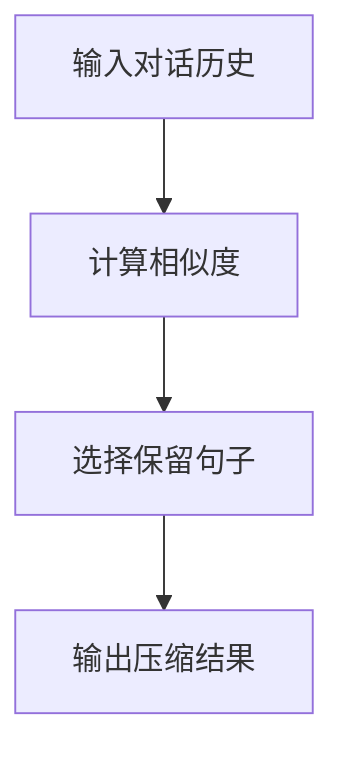
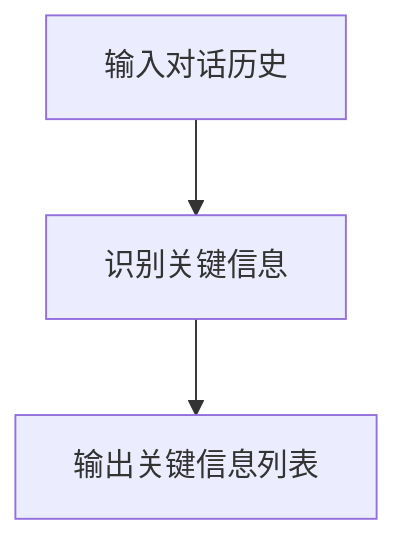
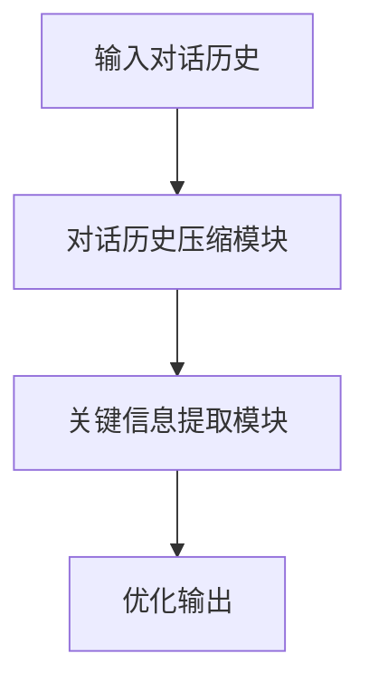
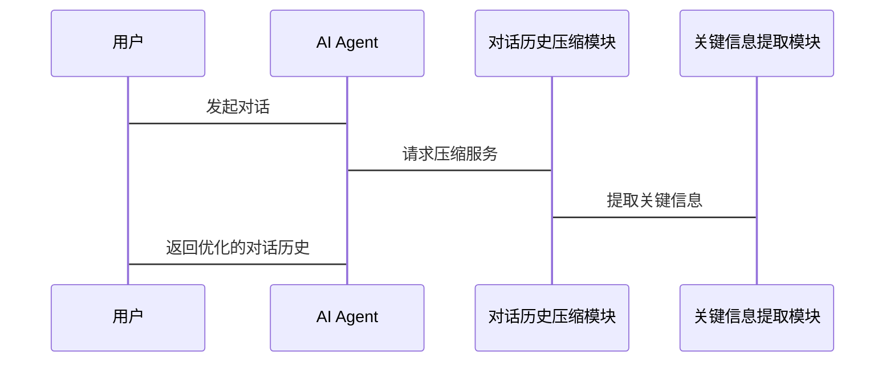

                 


```markdown
# AI Agent的对话历史压缩与关键信息提取

> 关键词：AI Agent、对话历史压缩、关键信息提取、自然语言处理、算法原理

> 摘要：本文深入探讨了AI Agent在对话系统中对话历史压缩与关键信息提取的核心技术，分析了其实现原理、算法优化策略，以及在实际应用中的系统架构设计和项目实现。文章从背景介绍、核心概念、算法原理、系统架构、项目实战到总结展望，全面解析了这一领域的关键技术与实践应用。

---

## 第一部分: 背景介绍

### 第1章: 问题背景

#### 1.1 对话历史压缩的背景
随着AI Agent在客服、智能助手、教育等领域中的广泛应用，对话系统处理的对话历史数据量急剧增加。如何有效管理这些数据，提升系统的响应速度和准确性，成为一项重要挑战。

#### 1.2 关键信息提取的必要性
在对话过程中，关键信息的提取有助于AI Agent更快理解上下文，提升对话效率和准确性。例如，在医疗咨询场景中，提取病人的主诉和症状信息，对于快速诊断至关重要。

#### 1.3 AI Agent的角色
AI Agent作为对话系统的核心，负责接收用户输入、处理信息、生成回复。其性能高度依赖于对对话历史的处理能力。

### 第2章: 问题描述

#### 2.1 对话历史压缩的定义
对话历史压缩是对多轮对话内容进行简化，保留关键信息，同时保持语义的完整性。

#### 2.2 关键信息提取的定义
关键信息提取是从对话历史中识别出对当前对话最有价值的信息。

#### 2.3 问题解决的目标
通过压缩对话历史和提取关键信息，优化AI Agent的处理效率和准确性。

### 第3章: 问题解决方法

#### 3.1 对话历史压缩的方法
- **基于相似度的方法**：通过计算对话内容的相似度，选择保留相似度高的句子。
- **基于摘要的方法**：使用文本摘要技术，生成对话的压缩版本。
- **基于规则的方法**：根据预设的规则，筛选和保留关键信息。

#### 3.2 关键信息提取的方法
- **基于关键词的方法**：识别对话中的关键词，提取相关句子。
- **基于句法分析的方法**：分析句子结构，提取关键名词或短语。
- **基于语义理解的方法**：使用自然语言处理模型，理解语义，提取关键信息。

---

## 第二部分: 核心概念与联系

### 第4章: 对话历史压缩的核心原理

#### 4.1 算法选择与优化
对话历史压缩的算法选择直接影响压缩效果。常见的算法包括：
- **TF-IDF**：基于词频-逆文档频率，提取关键词。
- **Levenshtein距离**：计算字符串的编辑距离，用于相似度计算。
- **BM25**：基于概率模型的检索算法，用于信息检索。

#### 4.2 算法对比分析
| 对比维度 | TF-IDF | BM25 | Levenshtein距离 |
|----------|--------|------|----------------|
| 优势     | 简单高效 | 更准确 | 适用于短文本 |
| 劣势     | 对语义理解不足 | 计算复杂 | 适用于长文本 |
| 适用场景 | 关键词提取 | 检索排序 | 相似度计算 |

#### 4.3 优化策略
- **分段压缩**：将对话历史分为多个段落，分别进行压缩。
- **动态调整**：根据对话主题变化，动态调整压缩策略。

### 第5章: 关键信息提取的核心原理

#### 5.1 算法选择与优化
关键信息提取的算法选择同样重要，常见的算法包括：
- **CRF（条件随机场）**：用于序列标注任务，提取命名实体。
- **BERT**：基于预训练模型的语义理解，提取关键信息。
- **LDA（主题模型）**：用于主题提取，辅助关键信息识别。

#### 5.2 算法对比分析
| 对比维度 | CRF | BERT | LDA |
|----------|-----|------|-----|
| 优势     | 精确度高 | 语义理解能力强 | 主题提取能力强 |
| 劣势     | 需大量标注数据 | 计算资源消耗大 | 无法提取具体信息 |
| 适用场景 | 实体识别 | 语义理解 | 主题分析 |

#### 5.3 优化策略
- **多模型融合**：结合多种算法，提升提取准确率。
- **上下文感知**：根据对话上下文，动态调整提取策略。

---

## 第三部分: 算法原理讲解

### 第6章: 对话历史压缩算法

#### 6.1 算法流程


#### 6.2 代码实现
```python
def compress_dialogue(dialogue_history, threshold=0.7):
    # 计算相似度矩阵
    similarity_matrix = compute_similarity(dialogue_history)
    # 选择相似度高于阈值的句子
    compressed = [sentence for sentence, sim in zip(dialogue_history, similarity_matrix) if sim > threshold]
    return compressed
```

#### 6.3 数学模型与公式
对话历史压缩的相似度计算公式：
$$ \text{sim}(s_1, s_2) = \frac{\sum_{i=1}^{n} \min(w_i, w_i')}{\sqrt{\sum_{i=1}^{n} w_i^2} \cdot \sqrt{\sum_{i=1}^{n} {w_i'}^2}}} $$
其中，$w_i$ 和 $w_i'$ 是句子 $s_1$ 和 $s_2$ 中第 $i$ 个词的权重。

### 第7章: 关键信息提取算法

#### 7.1 算法流程


#### 7.2 代码实现
```python
def extract_keywords(dialogue_history, model='BERT'):
    if model == 'BERT':
        return bert_extractor(dialogue_history)
    elif model == 'CRF':
        return crf_extractor(dialogue_history)
    else:
        return lda_extractor(dialogue_history)
```

#### 7.3 数学模型与公式
关键信息提取的BERT模型编码公式：
$$ \text{BERT}(x) = \text{FFN}(x) $$
其中，$x$ 是输入的对话历史，FFN是前馈神经网络。

---

## 第四部分: 系统分析与架构设计

### 第8章: 系统架构设计

#### 8.1 问题场景
- **数据输入**：多轮对话历史。
- **功能需求**：压缩对话历史、提取关键信息。
- **性能需求**：处理速度需满足实时对话要求。

#### 8.2 系统功能设计
- **对话历史压缩模块**：实现对话内容的压缩。
- **关键信息提取模块**：提取关键信息。
- **综合优化模块**：整合压缩和提取结果，优化输出。

#### 8.3 系统架构图


### 第9章: 接口设计与交互流程

#### 9.1 系统接口
- **输入接口**：接收对话历史字符串。
- **输出接口**：输出压缩后的对话流和关键信息列表。

#### 9.2 交互流程


---

## 第五部分: 项目实战

### 第10章: 环境安装与代码实现

#### 10.1 环境安装
- 安装Python和必要的库（如numpy、transformers）。
- 安装BERT模型和CRF模型。

#### 10.2 核心代码实现
```python
import numpy as np
from transformers import BertTokenizer, BertModel

def compute_similarity(sentences):
    tokenizer = BertTokenizer.from_pretrained('bert-base-uncased')
    model = BertModel.from_pretrained('bert-base-uncased')
    embeddings = []
    for sent in sentences:
        inputs = tokenizer(sent, return_tensors='np')
        outputs = model(**inputs)
        embeddings.append(outputs.last_hidden_state.numpy().mean(axis=1))
    return np.array(embeddings)

def compress_dialogue(dialogue_history, threshold=0.8):
    similarity_matrix = compute_similarity(dialogue_history)
    compressed = []
    for i in range(len(dialogue_history)):
        if i == 0 or np.max(similarity_matrix[i, :i]) < threshold:
            compressed.append(dialogue_history[i])
    return compressed
```

#### 10.3 代码解读
- **compute_similarity**：计算句子的相似度矩阵。
- **compress_dialogue**：基于相似度阈值进行对话历史压缩。

### 第11章: 实际案例分析

#### 11.1 案例背景
医疗咨询场景，用户描述症状，AI Agent提取关键信息。

#### 11.2 案例分析
输入对话历史：
- "我最近总是感觉疲倦。"
- "还有咳嗽，尤其是在晚上。"
- "我可能感冒了，或者有其他问题。"

压缩后：
- "我最近总是感觉疲倦，咳嗽尤其是在晚上。"

提取的关键信息：
- 疲倦、咳嗽、晚上。

#### 11.3 总结
压缩后的对话保留了关键信息，AI Agent可以快速理解用户状况，提供准确的诊断建议。

---

## 第六部分: 总结与展望

### 第12章: 总结

#### 12.1 最佳实践
- 在实际应用中，结合具体场景选择合适的算法。
- 定期更新模型，提升准确率。

#### 12.2 小结
对话历史压缩与关键信息提取是提升AI Agent性能的重要技术，合理选择和优化算法，能够显著提升系统的效率和用户体验。

### 第13章: 展望

#### 13.1 技术趋势
- 更深度的语义理解。
- 实时对话处理能力的提升。

#### 13.2 挑战与未来方向
- 处理更复杂对话场景的技术挑战。
- 结合多模态信息的对话处理。

---

通过本文的详细分析，读者可以全面了解AI Agent对话历史压缩与关键信息提取的技术原理和实践应用。希望本文能为相关领域的研究和开发提供有价值的参考。
```

