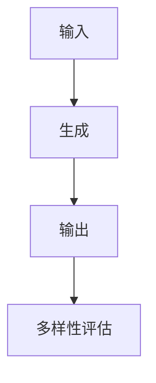
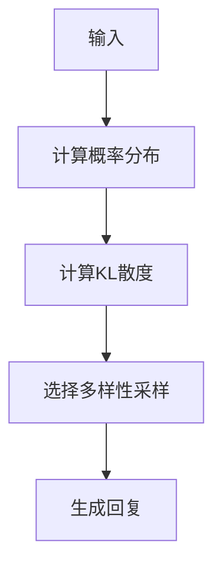
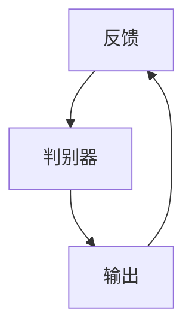
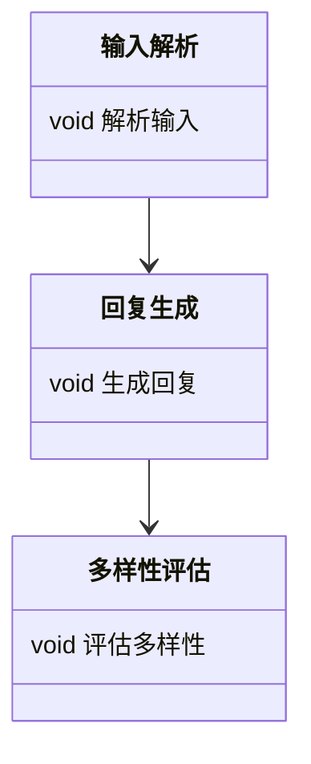
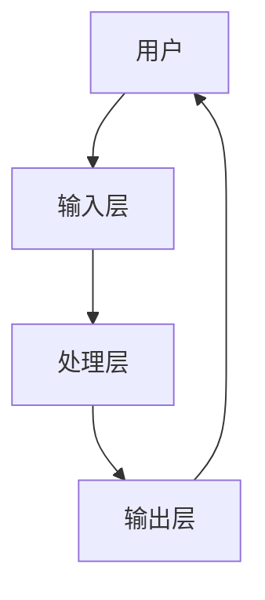

                 


# AI Agent的对话生成多样性：避免单调回复

> 关键词：AI Agent，对话生成，生成式AI，多样性生成，强化学习，语言模型

> 摘要：本文详细探讨了AI Agent在对话生成中的多样性问题，分析了单调回复的原因，并提出了多种解决方案，包括数据增强、模型优化和多样性采样方法。通过数学模型和实际案例，展示了如何提升对话生成的多样性和用户体验。

---

# 第1章: AI Agent与对话生成多样性概述

## 1.1 AI Agent的基本概念

### 1.1.1 AI Agent的定义与特点
AI Agent（人工智能代理）是指能够感知环境并采取行动以实现目标的智能实体。其特点包括自主性、反应性、目标导向和社会能力。

### 1.1.2 对话生成的基本原理
对话生成是AI Agent与用户交互的核心部分，涉及自然语言处理和生成技术。基本原理包括理解输入、生成回应和优化输出。

### 1.1.3 生成多样性的重要性
多样性生成是指生成不同但相关回复的能力，有助于提升用户体验和交互效率。

## 1.2 对话生成的背景与问题背景

### 1.2.1 当前对话生成技术的现状
当前技术在生成多样性方面存在不足，导致回复单调。

### 1.2.2 单调回复的问题描述
单调回复影响用户体验，限制了AI Agent的应用场景。

### 1.2.3 生成多样性对用户体验的影响
多样性的生成可以提升用户满意度和交互效率。

## 1.3 生成多样性与AI Agent的结合

### 1.3.1 生成多样性在AI Agent中的应用
通过多样性生成，AI Agent能够提供更丰富的交互体验。

### 1.3.2 AI Agent对话生成的边界与外延
对话生成的边界包括输入理解和输出优化，外延涉及多轮对话和上下文管理。

### 1.3.3 核心概念与核心要素分析
核心要素包括语言模型、强化学习和多样性采样方法。

---

# 第2章: 对话生成的核心概念与联系

## 2.1 生成式AI的基本原理

### 2.1.1 生成式AI的定义与核心原理
生成式AI利用深度学习模型生成文本，常用技术包括循环神经网络和变压器模型。

### 2.1.2 对话系统的生成机制
对话系统通过理解输入，生成多样化的回复，涉及多轮对话管理和上下文跟踪。

### 2.1.3 多样性生成的关键技术
关键技术包括数据增强、模型优化和对抗训练。

## 2.2 对话系统的多样性生成机制

### 2.2.1 多样性生成的定义
多样性生成指生成多个相关但不同的回复。

### 2.2.2 基于语言模型的多样性生成
通过修改语言模型的损失函数，如使用交叉熵损失，可以生成更多样化的回复。

### 2.2.3 基于强化学习的多样性生成
强化学习通过奖励机制，鼓励模型生成多样化的回复。

## 2.3 核心概念对比与ER实体关系图

### 2.3.1 核心概念属性对比表格
| 概念 | 输入 | 输出 | 方法 |
|------|------|------|------|
| 单轮生成 | 单条输入 | 单条输出 | 基于语言模型 |
| 多轮生成 | 多轮输入 | 多轮输出 | 基于记忆网络 |

### 2.3.2 ER实体关系图的Mermaid流程图


---

# 第3章: 多样性生成的问题分析

## 3.1 单调回复的原因分析

### 3.1.1 数据偏差对生成的影响
训练数据的偏差导致生成回复的单一性。

### 3.1.2 模型训练中的偏差问题
模型在训练过程中倾向于生成最常见的回复，缺乏多样性。

### 3.1.3 模型输出的单一性问题
模型输出的多样性受到限制，无法生成丰富的回复。

## 3.2 生成多样性问题的解决方案

### 3.2.1 数据增强技术
通过数据增强技术，如数据重采样和人工注释，增加训练数据的多样性。

### 3.2.2 模型优化策略
优化模型结构，如使用多层变压器模型，提升生成多样性。

### 3.2.3 多样性采样方法
采用多样性的采样方法，如Top-k采样和温度采样，生成更多样化的回复。

## 3.3 生成多样性与用户体验的关系

### 3.3.1 多样性对用户体验的影响
多样性生成能够提升用户满意度和交互体验。

### 3.3.2 用户对生成多样性的需求分析
用户希望AI Agent能够生成多样化的回复，满足不同情境下的需求。

### 3.3.3 多样性生成的边界与限制
多样性生成受到模型能力、计算资源和应用场景的限制。

---

# 第4章: 多样性生成的算法原理

## 4.1 基于KL散度的采样方法

### 4.1.1 KL散度的定义
KL散度衡量两个概率分布之间的差异，公式为：
$$ D_{KL}(P||Q) = \sum P_i \log \frac{P_i}{Q_i} $$

### 4.1.2 采样方法的实现
通过调整KL散度，生成多样化的回复，具体步骤包括计算概率分布、选择多样性采样策略。

## 4.2 对抗训练的策略

### 4.2.1 对抗训练的基本原理
通过生成器和判别器的对抗训练，提升生成多样性。

### 4.2.2 对抗训练的实现步骤
1. 初始化生成器和判别器。
2. 训练判别器以区分真实数据和生成数据。
3. 调整生成器以生成更难被判别器识别的数据。

## 4.3 算法实现的Mermaid流程图

### 4.3.1 基于KL散度的采样算法流程图


### 4.3.2 对抗训练的流程图


---

# 第5章: 系统分析与架构设计

## 5.1 系统功能设计

### 5.1.1 领域模型设计
领域模型包括输入解析、回复生成和多样性评估模块。

### 5.1.2 系统架构设计
系统架构采用分层设计，包括数据层、算法层和交互层。

## 5.2 系统架构设计的Mermaid图

### 5.2.1 领域模型类图


### 5.2.2 系统架构图


---

# 第6章: 项目实战

## 6.1 环境安装与配置

### 6.1.1 环境要求
需要安装Python、TensorFlow和Keras等库。

### 6.1.2 安装步骤
使用pip安装必要的库，如`pip install numpy tensorflow`.

## 6.2 核心代码实现

### 6.2.1 数据增强代码
```python
import numpy as np
from tensorflow.keras.preprocessing.sequence import pad_sequences

def data_augmentation(sentences):
    augmented = []
    for sentence in sentences:
        # 随机删除部分词汇
        words = sentence.split()
        num_words = len(words)
        num_augment = int(num_words * 0.2)
        for _ in range(num_augment):
            new_sentence = ' '.join(words[:-1])
            augmented.append(new_sentence)
    return augmented
```

### 6.2.2 多样性采样代码
```python
import numpy as np
import tensorflow as tf

def diverse_sampling(logits, temperature=1.0):
    # 使用Top-k采样
    top_k = 5
    top_logits = tf.argsort(logits, axis=-1, reverse=True)
    sampled_ids = top_logits[:, :top_k]
    return sampled_ids
```

## 6.3 实际案例分析

### 6.3.1 案例介绍
以客服对话系统为例，展示如何提升回复多样性。

### 6.3.2 代码应用解读
详细解读上述代码在实际系统中的应用，包括数据增强和多样性采样的具体实现。

---

# 第7章: 最佳实践与注意事项

## 7.1 最佳实践 tips

### 7.1.1 数据增强技巧
建议使用多种数据增强方法，如同义词替换和句式变化。

### 7.1.2 模型优化建议
采用预训练模型和迁移学习，提升生成效果。

### 7.1.3 系统设计注意事项
确保系统架构合理，模块化设计，便于维护和扩展。

## 7.2 小结与展望

### 7.2.1 本章小结
总结了AI Agent对话生成多样性的关键点和实现方法。

### 7.2.2 未来研究方向
探讨更高效的生成算法和更丰富的多样性生成策略。

---

# 附录

## 附录A: 参考文献
列出相关文献和资源。

## 附录B: 工具资源
推荐相关的工具和库，如Hugging Face和Keras。

---

# 结束语
通过本文的详细讲解，读者可以全面理解AI Agent对话生成多样性的实现方法和最佳实践，为实际应用提供有力支持。

