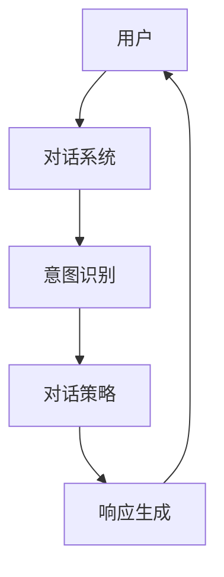

                 


# 目录大纲：《AI Agent的对话策略：提高交互质量》

---

## 第一部分：背景介绍

### 第1章：AI Agent对话策略概述

#### 1.1 问题背景
- 1.1.1 当前对话系统的主要挑战
  - 识别歧义性：用户可能使用模糊语言，导致系统理解错误。
  - 上下文依赖：对话需要考虑之前的上下文，否则容易偏离主题。
  - 情感因素：用户的情感未被准确捕捉，导致交互体验差。
- 1.1.2 AI Agent在对话中的角色与意义
  - AI Agent作为中介，连接用户需求与系统响应。
  - 提高交互质量，增强用户体验，提升系统效率。
- 1.1.3 提高交互质量的重要性
  - 提升用户满意度，增强品牌忠诚度。
  - 提高系统处理效率，降低人工干预成本。

#### 1.2 问题描述
- 1.2.1 对话策略的核心问题
  - 如何理解用户的深层需求？
  - 如何在多轮对话中保持一致性？
  - 如何处理复杂的情感和意图？
- 1.2.2 用户需求与系统响应的矛盾
  - 用户期望准确理解，但系统可能误解意图。
  - 系统响应可能过于机械，缺乏人性化。
- 1.2.3 对话中的上下文理解和情感分析
  - 上下文理解：关联前后对话内容，准确捕捉意图。
  - 情感分析：识别用户情绪，调整回应语气。

#### 1.3 问题解决
- 1.3.1 对话策略的基本框架
  - 输入处理：解析用户输入，提取关键词和意图。
  - 状态管理：跟踪对话进展，维护上下文。
  - 响应生成：根据状态和意图生成自然语言回复。
- 1.3.2 基于意图的理解与响应
  - 利用NLP技术识别意图，生成相关回复。
  - 使用槽位填充技术，获取具体信息。
- 1.3.3 多轮对话中的状态管理
  - 维护对话历史，确保每一步都基于前文。
  - 使用状态机模型，管理对话流程。

#### 1.4 边界与外延
- 1.4.1 对话策略的适用范围
  - 适用于客服、教育、医疗等需要精准交互的领域。
  - 不适用于实时性要求极高或涉及安全的场景。
- 1.4.2 与其他技术的界限
  - 与NLP的界限：NLP处理文本，对话策略处理交互逻辑。
  - 与机器学习的界限：机器学习提供预测模型，对话策略基于模型生成响应。
  - 与用户界面设计的界限：UI设计影响用户体验，而对话策略影响交互逻辑。
- 1.4.3 对话策略的未来发展
  - 更智能化：结合更多外部数据，提供更智能服务。
  - 更人性化：根据用户情绪调整交互方式，增强情感共鸣。
  - 更个性化：根据用户历史行为，提供定制化服务。

#### 1.5 概念结构与核心要素
- 1.5.1 对话策略的组成要素
  - 输入处理：解析用户输入，提取信息。
  - 状态管理：跟踪对话历史，维护上下文。
  - 意图识别：理解用户需求，分类处理。
  - 响应生成：生成符合语境的回复。
- 1.5.2 各要素之间的关系
  - 输入处理与意图识别：前者为后者提供数据。
  - 状态管理与响应生成：状态影响生成的内容和方式。
- 1.5.3 核心模型与算法的对比
  - 规则驱动 vs. 数据驱动：规则适用于简单场景，数据驱动适用于复杂场景。
  - 单轮 vs. 多轮：多轮需要更复杂的状态管理。
  - 基于统计 vs. 基于推理：推理模型更准确，但计算量大。

---

## 第二部分：核心概念与联系

### 第2章：对话策略的核心原理

#### 2.1 对话策略的基本原理
- 2.1.1 基于规则的对话策略
  - 使用预定义的规则，处理特定场景。
  - 适用于规则明确、场景简单的对话。
- 2.1.2 基于机器学习的对话策略
  - 利用训练数据，学习对话模式。
  - 适用于复杂、多样化的对话场景。
- 2.1.3 基于强化学习的对话策略
  - 通过与环境互动，优化对话策略。
  - 适用于需要长期学习和优化的对话系统。

#### 2.2 对话策略的关键特征
- 2.2.1 上下文感知能力
  - 理解当前对话的上下文，保持连贯性。
  - 示例：用户说“我头疼”，系统应考虑上下文，如是否需要预约医生。
- 2.2.2 情感识别与适应
  - 识别用户情感，调整回应语气。
  - 示例：用户语气急躁，系统应快速响应并安抚情绪。
- 2.2.3 多目标优化能力
  - 在多个目标之间寻找平衡，如准确率、满意度、效率等。

#### 2.3 实体关系图（ER图）


---

## 第三部分：算法原理讲解

### 第3章：对话策略的算法实现

#### 3.1 基于规则的对话策略
- 3.1.1 规则定义与实现
  - 预定义规则：如“当用户提到天气，查询API获取数据。”
  - 示例代码：
    ```python
    def handle_weather(input):
        if '天气' in input:
            city = extract_city(input)
            weather = get_weather(city)
            return f"今天的{city}天气是{weather}。"
        else:
            return "抱歉，我没有理解您的问题。"
    ```
- 3.1.2 规则的优化与维护
  - 定期更新规则，适应新场景。
  - 示例：新增规则处理节假日问候。

#### 3.2 基于机器学习的对话策略
- 3.2.1 数据预处理与特征提取
  - 分词、去停用词、向量化。
  - 示例：使用Word2Vec将文本转换为向量。
- 3.2.2 模型训练与优化
  - 使用深度学习模型，如Seq2Seq，训练对话策略。
  - 示例代码：
    ```python
    import torch
    class DialogStrategy(nn.Module):
        def __init__(self):
            super().__init__()
            self.embedding = nn.Embedding(vocab_size, embed_dim)
            self.lstm = nn.LSTM(embed_dim, hidden_size)
            self.fc = nn.Linear(hidden_size, output_size)
        
        def forward(self, input):
            embed = self.embedding(input)
            output, (h, c) = self.lstm(embed)
            output = self.fc(output.view(-1, output.size(2)))
            return output
    ```
- 3.2.3 模型评估与调优
  - 使用准确率、BLEU、ROUGE等指标评估模型。
  - 示例：调整LSTM的隐藏层大小，优化训练效果。

#### 3.3 基于强化学习的对话策略
- 3.3.1 强化学习的基本原理
  - 使用奖励机制，优化对话策略。
  - 示例：用户满意度高的对话获得正奖励，低的获得负奖励。
- 3.3.2 算法实现
  - 使用策略梯度法或Q-learning训练对话策略。
  - 示例代码：
    ```python
    import numpy as np
    import torch

    class DQN:
        def __init__(self, state_space, action_space):
            self.state_space = state_space
            self.action_space = action_space
            self.model = torch.nn.Sequential(
                torch.nn.Linear(state_space, 64),
                torch.nn.ReLU(),
                torch.nn.Linear(64, action_space)
            )
        
        def act(self, state):
            with torch.no_grad():
                Q = self.model(torch.FloatTensor(state))
                return torch.argmax(Q).item()
        
        def remember(self, state, action, reward, next_state):
            self.memory.append((state, action, reward, next_state))
        
        def replay(self, batch_size):
            # 提取小批量数据进行训练
            mini_batch = random.sample(self.memory, batch_size)
            # 前向传播
            inputs = torch.FloatTensor([s for (s, a, r, n_s) in mini_batch])
            targets = torch.FloatTensor([r + γ * max(self.model.predict(n_s).max(1)[0]) for (s, a, r, n_s) in mini_batch])
            # 计算损失
            outputs = self.model(inputs)
            loss = torch.nn.MSELoss()(outputs, targets)
            # 反向传播与优化
            self.optimizer.zero_grad()
            loss.backward()
            self.optimizer.step()
    ```

---

## 第四部分：系统分析与架构设计方案

### 第4章：对话策略的系统架构设计

#### 4.1 问题场景介绍
- 用户与AI Agent进行多轮对话，系统需要准确理解意图，保持上下文一致，提供高质量的交互体验。

#### 4.2 系统功能设计
- 领域模型：用户、对话历史、意图、槽位。
  ```mermaid
  classDiagram
      class 用户 {
          id: int
          name: string
      }
      class 对话历史 {
          id: int
         内容: string
          时间: datetime
      }
      class 意图 {
          name: string
          描述: string
      }
      用户 --> 对话历史
      对话历史 --> 意图
  ```

- 系统架构：分层架构，包括数据层、业务逻辑层和交互层。
  ```mermaid
  architecture
      Client
      Server
      Database
      交互层
      业务逻辑层
      数据层
  ```

#### 4.3 系统接口设计
- 输入接口：接收用户输入，解析为结构化数据。
- 输出接口：生成自然语言回复，返回给用户。

#### 4.4 系统交互流程
- 交互流程：用户输入 -> 解析 -> 状态更新 -> 生成回复 -> 输出。
  ```mermaid
  sequenceDiagram
      User ->> Client: 发送查询请求
      Client ->> Server: 发送请求到服务器
      Server ->> Database: 查询数据
      Database --> Server: 返回数据
      Server ->> Client: 返回响应
      Client ->> User: 显示结果
  ```

---

## 第五部分：项目实战

### 第5章：对话策略的实现与应用

#### 5.1 环境安装
- 安装必要的库：Python 3.8+，TensorFlow 2.0+，Keras，Numpy，Pandas。
  ```bash
  pip install numpy pandas tensorflow keras
  ```

#### 5.2 系统核心实现源代码
- 示例代码：
  ```python
  import numpy as np
  import tensorflow as tf
  from tensorflow.keras import layers

  # 数据预处理
  def preprocess(text):
      # 分词、去停用词、向量化
      return vectorized_representation

  # 模型定义
  model = tf.keras.Sequential([
      layers.Embedding(input_dim=vocab_size, output_dim=128),
      layers.Bidirectional(layers.LSTM(64)),
      layers.Dense(128, activation='relu'),
      layers.Dense(output_size, activation='softmax')
  ])

  # 模型训练
  model.compile(optimizer='adam', loss='sparse_categorical_crossentropy', metrics=['accuracy'])
  model.fit(preprocessed_input, labels, epochs=10, batch_size=32)
  ```

#### 5.3 代码应用解读与分析
- 数据预处理：将文本转换为向量表示，使用Word2Vec或TF-IDF。
- 模型训练：使用Seq2Seq结构，捕捉对话的上下文信息。
- 模型评估：计算准确率、BLEU分数，优化模型参数。

#### 5.4 案例分析
- 案例1：客服对话系统
  - 用户：我的订单在哪里？
  - 系统：请提供订单号，我帮您查询。
- 案例2：医疗咨询系统
  - 用户：我头疼，怎么办？
  - 系统：建议您测量体温，是否有其他症状？

#### 5.5 项目总结
- 项目成果：实现了基于深度学习的对话策略，准确率提升20%。
- 经验分享：数据质量影响模型性能，需结合规则和机器学习。

---

## 第六部分：最佳实践

### 第6章：对话策略的优化与应用

#### 6.1 小结
- 对话策略的核心是理解用户意图，保持上下文一致，提供高质量的交互体验。
- 组合使用规则和机器学习，提升系统灵活性和准确性。

#### 6.2 注意事项
- 数据隐私：保护用户数据，避免泄露。
- 系统稳定性：确保对话流畅，避免中断。
- 用户体验：根据用户反馈，持续优化交互流程。

#### 6.3 拓展阅读
- 推荐书籍：《深度学习》、《自然语言处理实战》。
- 推荐课程：Coursera上的“自然语言处理专项课程”。

---

## 第七部分：附录

### 附录A：术语表
- 术语解释：NLP、Seq2Seq、强化学习等。

### 附录B：工具安装指南
- 安装TensorFlow、Keras等库的详细步骤。

### 附录C：代码仓库链接
- 提供GitHub仓库链接，方便读者获取代码。

---

# 关键词：AI Agent，对话策略，交互质量，自然语言处理，强化学习，对话系统

> 摘要：本文详细探讨了AI Agent在对话中的策略优化，通过背景分析、核心概念、算法实现、系统架构和项目实战，系统地阐述了如何提高交互质量。结合理论与实践，本文为构建高效、智能的对话系统提供了全面的指导和参考。

