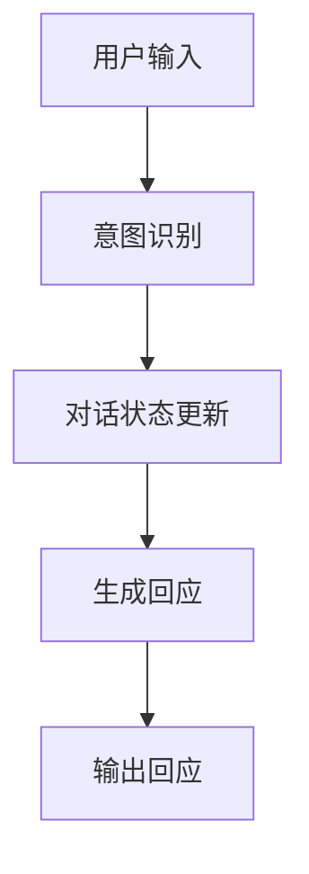
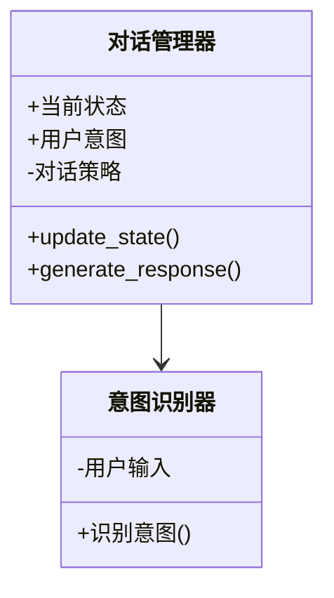
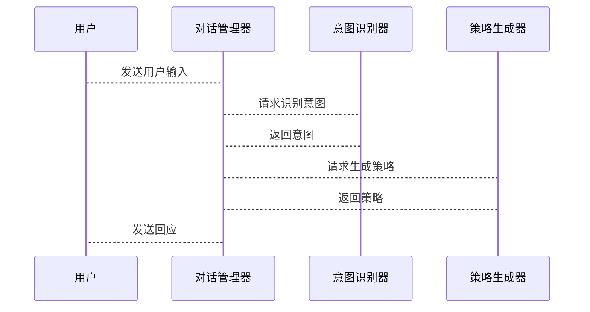

                 


# AI Agent的对话管理策略与实现

> **关键词**：AI Agent, 对话管理, 自然语言处理, 意图识别, 对话策略, 系统架构

> **摘要**：本文详细探讨了AI Agent对话管理的核心策略与实现方法，涵盖对话管理的基本概念、算法原理、系统架构设计及项目实战。通过深入分析对话状态、用户意图和对话策略，结合具体案例，展示了如何通过算法实现高效的对话管理，并提供了系统设计和优化的实用建议。

---

# 目录大纲

1. [背景介绍](#背景介绍)
2. [核心概念与联系](#核心概念与联系)
3. [算法原理讲解](#算法原理讲解)
4. [系统分析与架构设计](#系统分析与架构设计)
5. [项目实战](#项目实战)
6. [总结与展望](#总结与展望)

---

## 第1章 背景介绍

### 1.1 问题背景

AI Agent（人工智能代理）在现代人机交互系统中扮演着重要角色，负责处理用户的请求和反馈。对话管理是AI Agent的核心功能之一，它决定了系统如何理解和响应用户的输入，直接影响用户体验和系统效率。

#### 1.1.1 AI Agent的基本概念

AI Agent是一种能够感知环境、执行任务并与其他实体（用户或其他系统）交互的智能体。AI Agent的目标是通过自动化方式完成特定任务，提升效率和用户体验。

#### 1.1.2 对话管理的重要性

对话管理是AI Agent与用户交互的核心环节。通过有效管理对话，AI Agent能够准确理解用户需求，提供符合期望的响应，从而提升用户体验和系统满意度。

#### 1.1.3 当前对话管理技术的挑战

当前对话管理技术面临以下挑战：

- **语义理解的复杂性**：用户输入可能包含模糊或歧义信息，准确识别意图需要复杂的自然语言处理技术。
- **对话上下文的管理**：对话过程中的上下文信息需要被准确捕捉和更新，以确保后续交互的连贯性。
- **多轮对话的不确定性**：在多轮对话中，用户的意图和需求可能发生变化，系统需要动态调整策略以应对不确定性。

### 1.2 问题描述

对话管理涉及多个关键问题，包括：

- **对话状态表示**：如何有效表示对话的状态，捕捉关键信息。
- **用户意图识别**：如何准确识别用户的显式和隐式意图。
- **对话策略生成**：如何根据当前状态和用户意图生成合适的对话策略。

### 1.3 问题解决方法

针对上述问题，当前主要采用以下方法：

- **基于规则的方法**：通过预定义的规则和模式匹配来处理对话。
- **基于机器学习的方法**：利用深度学习模型（如神经网络）进行对话理解和生成。
- **混合方法**：结合规则和机器学习的优势，实现更灵活和高效的对话管理。

### 1.4 边界与外延

对话管理的边界主要集中在用户与AI Agent之间的交互过程，不包括后端任务执行和数据存储部分。其外延则涉及自然语言处理、用户行为分析和人机交互设计等领域。

### 1.5 核心概念与组成

对话管理的核心概念包括：

- **对话状态**：反映当前对话的上下文信息，如用户身份、当前任务等。
- **用户意图**：用户希望通过对话实现的目标或需求。
- **对话策略**：系统根据当前状态和用户意图制定的响应策略。

---

## 第2章 核心概念与联系

### 2.1 核心概念原理

- **对话状态**：通过状态机或上下文表示模型来表示对话的当前情况。
- **用户意图**：通过自然语言处理技术识别用户的显式和隐式意图。
- **对话策略**：基于当前状态和意图生成合适的回应，确保对话流畅和高效。

### 2.2 概念属性特征对比表

| 概念      | 属性特征               |
|-----------|------------------------|
| 对话状态   | 当前对话上下文信息     |
| 用户意图   | 显式或隐式需求         |
| 对话策略   | 系统生成的回应策略     |

### 2.3 ER实体关系图

```mermaid
erd
    entity 对话状态 {
        id 对话ID
        timestamp 时间戳
        context 上下文信息
    }
    entity 用户意图 {
        id 用户ID
        intent 意图类型
        confidence 置信度
    }
    entity 对话策略 {
        id 对话ID
        response 回应内容
        strategy_type 策略类型
    }
    对话状态 --> 对话策略
    用户意图 --> 对话策略
```

---

## 第3章 算法原理讲解

### 3.1 对话状态表示与更新算法

#### 3.1.1 算法原理

对话状态表示的核心在于捕捉关键信息，常用的方法包括：

- **基于向量的表示**：将对话状态转换为向量形式，便于计算和处理。
- **基于规则的表示**：通过预定义的规则提取关键信息。

#### 3.1.2 mermaid流程图



#### 3.1.3 Python实现代码

```python
def update_state(current_state, user_input):
    intent = identify_intent(user_input)
    new_state = update(current_state, intent)
    return new_state
```

#### 3.1.4 数学模型与公式

对话状态更新的数学模型可以表示为：

$$
\text{new\_state} = f(\text{current\_state}, \text{intent})
$$

其中，\( f \) 表示对话状态更新的函数，\( \text{intent} \) 是用户的意图。

---

## 第4章 系统分析与架构设计

### 4.1 系统场景介绍

系统场景包括用户与AI Agent的交互过程，涉及意图识别、对话策略生成和回应输出等环节。

### 4.2 项目介绍

本项目旨在设计和实现一个高效的对话管理系统，支持多种对话策略和灵活的对话流程。

### 4.3 系统功能设计

#### 4.3.1 领域模型类图



### 4.4 系统架构设计

#### 4.4.1 系统架构图

```mermaid
architectural
    客户端 --> 对话管理器
    对话管理器 --> 意图识别器
    对话管理器 --> 策略生成器
    策略生成器 --> 响应生成器
```

#### 4.4.2 系统接口设计

主要接口包括：

- `update_state()`
- `generate_response()`
- `identify_intent()`

#### 4.4.3 交互序列图



---

## 第5章 项目实战

### 5.1 环境安装

安装必要的库：

```bash
pip install numpy
pip install scikit-learn
pip install transformers
```

### 5.2 系统核心实现源代码

#### 5.2.1 意图识别代码

```python
from sklearn.feature_extraction.text import TfidfVectorizer
from sklearn.naive_bayes import MultinomialNB

def train Intent_classifier(X_train, y_train):
    vectorizer = TfidfVectorizer()
    X = vectorizer.fit_transform(X_train)
    clf = MultinomialNB()
    clf.fit(X, y_train)
    return clf, vectorizer

def predict	Intent_classifier(classifier, vectorizer, X_test):
    X = vectorizer.transform(X_test)
    y_pred = classifier.predict(X)
    return y_pred
```

#### 5.2.2 对话策略生成代码

```python
def generate_response(current_state, intent):
    # 根据当前状态和意图生成回应
    response = f"针对意图{intent}和状态{current_state}，生成合适的回应。"
    return response
```

### 5.3 代码应用解读与分析

- **意图识别代码**：使用TF-IDF和朴素贝叶斯算法，对用户输入进行意图分类。
- **对话策略生成代码**：根据当前状态和识别出的意图，生成合适的回应。

### 5.4 实际案例分析

案例：用户输入“我需要帮助预订机票”。

1. **意图识别**：识别出用户的意图是“预订机票”。
2. **对话状态更新**：更新对话状态，包含用户信息和需求。
3. **生成回应**：系统生成回应，询问具体信息，如日期和目的地。

### 5.5 项目小结

通过实战项目，我们实现了从意图识别到对话策略生成的完整流程，验证了算法的有效性和系统的可行性。

---

## 第6章 总结与展望

### 6.1 最佳实践 tips

- **数据质量**：确保训练数据的多样性和代表性。
- **模型优化**：结合规则和机器学习，提升系统鲁棒性。
- **用户反馈**：利用用户反馈不断优化对话策略。

### 6.2 小结

本文全面介绍了AI Agent对话管理的核心策略与实现方法，从理论到实践，详细讲解了算法原理和系统设计，为实际应用提供了参考。

### 6.3 注意事项

- **数据隐私**：确保用户数据的安全性和隐私性。
- **模型解释性**：提升模型的可解释性，便于用户理解和信任。

### 6.4 拓展阅读

- **推荐书籍**：《自然语言处理实战》、《深度学习入门》
- **推荐论文**：相关领域的最新研究论文

---

通过本文的学习，读者可以深入理解AI Agent对话管理的实现细节，并能够将其应用于实际项目中，提升系统的对话能力和用户体验。

