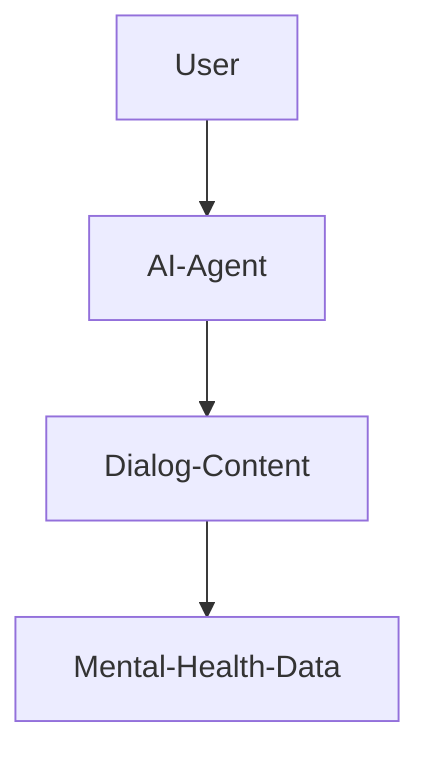
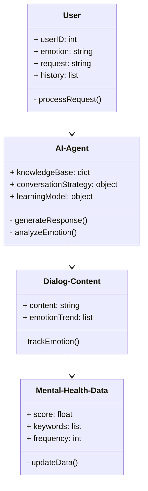
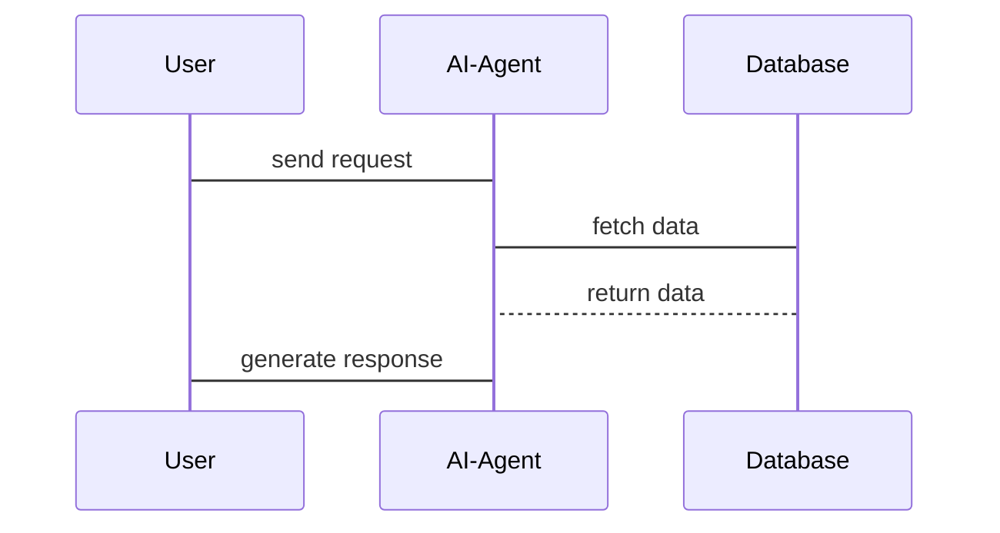

                 


# AI Agent的对话系统在心理健康领域的应用

> 关键词：AI Agent, 对话系统, 心理健康, 自然语言处理, 情感计算, 人机交互, 机器学习

> 摘要：本文探讨AI Agent在心理健康对话系统中的应用，从背景介绍、核心概念、算法原理到系统设计和项目实战，详细分析其在心理健康支持中的潜力与挑战。通过技术与心理学的结合，揭示如何利用AI技术提升心理健康服务的可及性和有效性。

---

# 第一部分: AI Agent的对话系统在心理健康领域的应用概述

## 第1章: AI Agent与心理健康对话系统的背景介绍

### 1.1 AI Agent的基本概念

#### 1.1.1 AI Agent的定义
AI Agent（人工智能代理）是指能够感知环境、自主决策并执行任务的智能实体。在心理健康领域，AI Agent通常以对话系统的形式出现，通过自然语言处理技术与用户进行交互。

#### 1.1.2 AI Agent的核心特征
- **自主性**：能够在没有人工干预的情况下运行。
- **反应性**：能够实时感知用户输入并做出响应。
- **学习能力**：通过机器学习技术不断优化对话策略。
- **适应性**：能够根据用户的反馈调整对话内容。

#### 1.1.3 AI Agent与传统对话系统的区别
- **智能化**：AI Agent具备自主学习和决策能力，而传统对话系统依赖预设规则。
- **个性化**：AI Agent能够根据用户情绪和需求动态调整对话内容，而传统系统通常采用固定的响应策略。

### 1.2 心理健康对话系统的背景与需求

#### 1.2.1 心理健康问题的现状
- 全球范围内，心理健康问题呈现上升趋势，尤其是抑郁症、焦虑症等常见心理疾病。
- 传统心理健康服务资源有限，难以覆盖所有需求人群。

#### 1.2.2 对话系统在心理健康中的作用
- **实时支持**：为用户提供24/7的心理咨询和情绪支持。
- **隐私保护**：用户可以在匿名环境下倾诉，减少心理负担。
- **初步筛查**：通过对话系统初步识别潜在的心理健康问题，及时引导用户寻求专业帮助。

#### 1.2.3 用户需求与系统功能的匹配
- **情感支持**：用户需要情感上的慰藉和理解。
- **问题解决**：用户希望系统能够帮助分析问题并提供建议。
- **个性化推荐**：根据用户的情绪和需求，推荐相关资源或行动步骤。

### 1.3 AI Agent在心理健康领域的应用前景

#### 1.3.1 AI Agent的潜在应用场景
- **心理咨询助手**：帮助心理咨询师更高效地处理初步咨询。
- **24/7支持**：为用户提供全天候的心理支持服务。
- **健康监测**：通过长期对话记录，监测用户情绪变化，预警潜在问题。

#### 1.3.2 AI Agent在心理健康中的优势
- **高效性**：能够快速响应用户需求，减少等待时间。
- **可及性**：突破地域限制，让更多人能够获得心理健康服务。
- **隐私性**：用户可以在匿名环境下获得帮助，减少心理负担。

#### 1.3.3 AI Agent应用的挑战与机遇
- **技术挑战**：如何确保对话系统具备高度的情感理解和应对能力。
- **伦理挑战**：如何保护用户隐私，避免数据滥用。
- **社会接受度**：公众对AI在心理健康领域的信任度仍需提升。

### 1.4 本章小结
本章介绍了AI Agent的基本概念及其在心理健康对话系统中的应用背景，分析了其在心理健康支持中的潜力与挑战。接下来将深入探讨AI Agent对话系统的核心概念与联系。

---

## 第2章: AI Agent对话系统的核心概念与联系

### 2.1 AI Agent对话系统的实体关系

#### 2.1.1 用户实体
- **属性**：用户ID、情绪状态、需求类型、对话历史。
- **行为**：提出问题、表达情绪、接收反馈。

#### 2.1.2 AI Agent实体
- **属性**：对话策略、知识库、学习模型、情绪识别模块。
- **行为**：解析用户输入、生成回应、调整对话策略。

#### 2.1.3 对话内容实体
- **属性**：内容主题、情感倾向、对话上下文。
- **行为**：信息传递、情感表达、意图识别。

#### 2.1.4 心理健康数据实体
- **属性**：情绪评分、关键词提取、对话频率。
- **行为**：数据收集、分析、反馈生成。

### 2.2 实体关系属性对比表

| 实体 | 属性 | 行为 |
|------|------|------|
| 用户 | 用户ID、情绪状态 | 提出问题、表达情绪 |
| AI Agent | 对话策略、知识库 | 解析用户输入、生成回应 |
| 对话内容 | 内容主题、情感倾向 | 信息传递、情感表达 |
| 心理健康数据 | 情绪评分、关键词提取 | 数据收集、分析 |

### 2.3 实体关系Mermaid流程图


### 2.4 本章小结
本章通过分析AI Agent对话系统的实体关系，揭示了系统各组成部分之间的联系。接下来将深入探讨对话生成的算法原理。

---

## 第3章: 对话生成算法原理

### 3.1 基于规则的对话生成

#### 3.1.1 基于规则的对话生成流程
1. **用户输入解析**：识别用户的问题类型和情感倾向。
2. **规则匹配**：根据预设规则生成响应。
3. **响应生成**：输出符合规则的对话内容。

#### 3.1.2 规则设计与实现
- **规则示例**：
  - 如果用户提到“抑郁”，则生成安慰性语言。
  - 如果用户提到“压力”，则提供放松技巧。

#### 3.1.3 规则优化
- **动态调整**：根据用户反馈优化规则权重。
- **上下文依赖**：考虑对话上下文生成更精准的回应。

### 3.2 基于机器学习的对话生成

#### 3.2.1 神经网络模型
- **模型选择**：使用预训练的大型语言模型（如GPT）进行微调。
- **训练数据**：心理健康领域的对话数据。

#### 3.2.2 对话生成流程
1. **输入处理**：将用户输入转换为模型可处理的格式。
2. **生成响应**：模型基于输入生成多个候选响应。
3. **选择最优响应**：根据情感评分选择最佳回应。

#### 3.2.3 情感评分机制
- **情感评分公式**：
  $$ \text{score} = \sum_{i=1}^{n} w_i \cdot e_i $$
  其中，\( w_i \) 是情感词权重，\( e_i \) 是情感词的积极或消极值。

### 3.3 算法比较与选择
- **基于规则的优势**：简单易实现，适用于特定场景。
- **基于机器学习的优势**：灵活性高，能够处理复杂对话。

### 3.4 本章小结
本章分析了两种主要的对话生成算法，并讨论了其优缺点。接下来将探讨系统分析与架构设计。

---

## 第4章: 系统分析与架构设计

### 4.1 问题场景介绍

#### 4.1.1 问题背景
- 用户通过对话系统寻求心理健康支持。
- 系统需要实时处理用户的输入并生成合适的回应。

### 4.2 系统功能设计

#### 4.2.1 领域模型Mermaid类图


#### 4.2.2 系统架构设计Mermaid架构图


#### 4.2.3 系统接口设计
- **输入接口**：用户输入文本或语音。
- **输出接口**：系统输出文本或语音回应。
- **数据接口**：与心理健康数据库交互。

#### 4.2.4 交互流程Mermaid序列图


### 4.3 本章小结
本章通过系统分析与架构设计，明确了AI Agent对话系统的实现路径。接下来将通过项目实战进一步探讨其具体实现。

---

## 第5章: 项目实战

### 5.1 环境安装与配置

#### 5.1.1 安装Python环境
```bash
python --version
pip install --upgrade pip
```

#### 5.1.2 安装依赖库
```bash
pip install numpy
pip install pandas
pip install transformers
pip install scikit-learn
```

### 5.2 核心代码实现

#### 5.2.1 对话生成模块
```python
from transformers import AutoModelWithLMHead, AutoTokenizer

class DialogGenerator:
    def __init__(self, model_name):
        self.tokenizer = AutoTokenizer.from_pretrained(model_name)
        self.model = AutoModelWithLMHead.from_pretrained(model_name)
    
    def generate_response(self, input_text):
        inputs = self.tokenizer(input_text, return_tensors="pt")
        outputs = self.model.generate(inputs.input_ids, max_length=50)
        response = self.tokenizer.decode(outputs[0], skip_special_tokens=True)
        return response
```

#### 5.2.2 情感识别模块
```python
from sklearn.feature_extraction.text import TfidfVectorizer
from sklearn.svm import SVC

class EmotionAnalyzer:
    def __init__(self):
        self.vectorizer = TfidfVectorizer()
        self.classifier = SVC()
    
    def train(self, X, y):
        self.vectorizer.fit(X)
        X_vec = self.vectorizer.transform(X)
        self.classifier.fit(X_vec, y)
    
    def predict(self, text):
        X_vec = self.vectorizer.transform([text])
        prediction = self.classifier.predict(X_vec)[0]
        return prediction
```

### 5.3 代码应用解读与分析

#### 5.3.1 对话生成模块分析
- **模型选择**：使用预训练的GPT模型进行微调。
- **生成策略**：根据用户输入生成多个候选响应，选择情感评分最高的作为最终回应。

#### 5.3.2 情感识别模块分析
- **特征提取**：使用TF-IDF提取文本特征。
- **分类器选择**：采用支持向量机进行情感分类。

### 5.4 实际案例分析与详细讲解
- **案例背景**：用户因工作压力过大，情绪低落，寻求帮助。
- **系统处理**：AI Agent识别用户情绪后，生成安慰性语言并推荐放松技巧。

### 5.5 项目小结
本章通过实际项目实战，展示了AI Agent对话系统的具体实现过程。接下来将总结最佳实践和注意事项。

---

## 第6章: 最佳实践与注意事项

### 6.1 最佳实践

#### 6.1.1 模型选择
- 使用预训练的大模型进行微调，确保对话质量。
- 定期更新模型，适应新的对话模式。

#### 6.1.2 数据处理
- 保证训练数据的多样性和代表性。
- 保护用户隐私，避免数据泄露。

### 6.2 注意事项

#### 6.2.1 技术风险
- 对话生成的准确性和自然度需要不断优化。
- 情感识别的准确性直接影响用户体验。

#### 6.2.2 伦理问题
- 确保用户数据的隐私和安全。
- 避免过度承诺，明确系统的能力与局限。

### 6.3 拓展阅读
- 推荐阅读《深度学习入门》、《自然语言处理实战》等相关书籍。
- 关注心理健康领域的最新研究成果。

### 6.4 本章小结
本章总结了AI Agent对话系统在心理健康应用中的最佳实践和注意事项，并提供了进一步学习的资源。

---

## 第7章: 结语

### 7.1 总结
AI Agent对话系统在心理健康领域的应用潜力巨大，能够为用户提供高效、便捷的心理支持服务。通过技术与心理学的结合，AI Agent有望成为未来心理健康服务的重要组成部分。

### 7.2 展望
随着AI技术的不断进步，AI Agent在心理健康领域的应用将更加智能化、个性化。未来的研究方向包括优化对话生成算法、提升情感识别的准确性、探索更丰富的交互形式。

---

# 结束语

通过本文的详细探讨，我们了解了AI Agent在心理健康对话系统中的重要作用和实现路径。希望本文能够为相关领域的研究者和实践者提供有价值的参考和启发。

