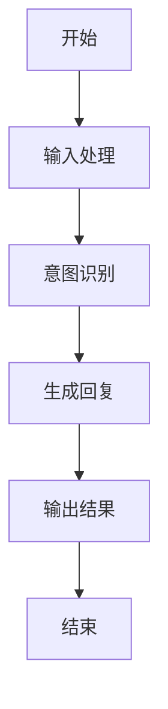
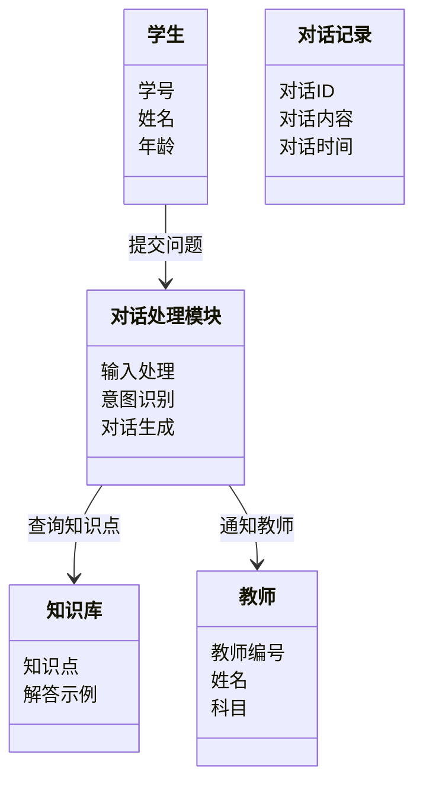
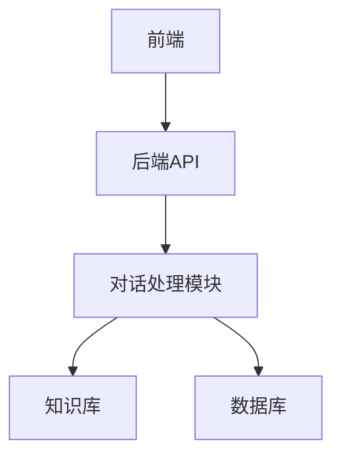
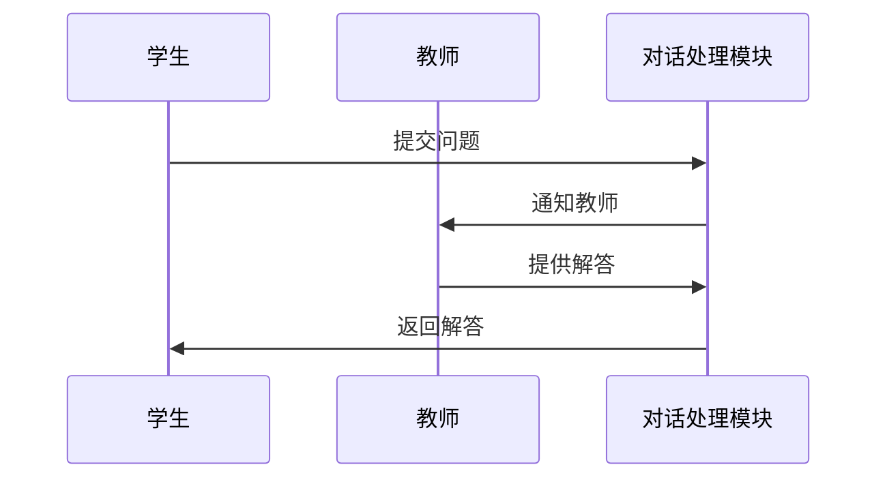

                 

<think>
好的，我需要帮助用户设计一本关于《AI Agent的对话系统在教育领域的应用与优化》的目录大纲，同时确保内容符合用户的要求。首先，我需要理解用户的具体需求，然后一步步分析和构建符合要求的目录结构。

**步骤1：理解用户需求**

用户希望撰写一篇技术博客文章，标题为《AI Agent的对话系统在教育领域的应用与优化》。文章需要逻辑清晰、结构紧凑、用专业的技术语言撰写，并且要包含以下内容：

- 背景介绍：核心概念术语说明、问题背景、问题描述、问题解决、边界与外延、概念结构与核心要素组成
- 核心概念与联系：核心概念原理、概念属性特征对比表格和ER实体关系图架构的 mermaid 流程图。
- 算法原理讲解：使用 mermaid 画出算法流程图，详细讲解算法原理，给出数学模型和公式，举例说明。
- 系统分析与架构设计方案：问题场景介绍，系统功能设计（领域模型 mermaid 类图）、系统架构设计 mermaid 架构图、系统接口设计和系统交互 mermaid 序列图。
- 项目实战：环境安装、系统核心实现源代码，代码应用解读与分析，实际案例分析和详细讲解剖析，项目小结。
- 最佳实践 tips、小结、注意事项、拓展阅读等内容。

文章需要使用 markdown 格式，字数在 10000 ～ 12000 字左右，每个部分要详细具体。

**步骤2：构建目录结构**

根据用户的要求，我需要将文章分为多个部分，每个部分包含具体的章节和小节。确保每个部分都有足够的细节，并且符合逻辑顺序。

1. **背景介绍**
   - 问题背景
   - 问题描述
   - 问题解决
   - 边界与外延
   - 概念结构与核心要素组成

2. **核心概念与联系**
   - 核心概念原理
   - 概念属性特征对比表格
   - ER实体关系图架构（使用 mermaid）
   
3. **算法原理讲解**
   - 算法流程图（使用 mermaid）
   - 数学模型和公式（使用 latex）
   - 示例说明

4. **系统分析与架构设计方案**
   - 问题场景介绍
   - 系统功能设计（领域模型 mermaid 类图）
   - 系统架构设计 mermaid 架构图
   - 系统接口设计
   - 系统交互 mermaid 序列图

5. **项目实战**
   - 环境安装
   - 系统核心实现源代码
   - 代码应用解读与分析
   - 实际案例分析
   - 项目小结

6. **最佳实践**
   - tips
   - 小结
   - 注意事项
   - 拓展阅读

**步骤3：细化每个部分的内容**

在构建目录结构时，我需要确保每个部分都有足够的细节和具体的标题，以便读者能够清晰地理解文章的结构和内容。

例如，在“系统分析与架构设计方案”部分，可以包括以下几个小节：

- **系统功能设计**
  - 用户需求分析
  - 功能模块划分
  - 领域模型设计（使用 mermaid 类图）
  
- **系统架构设计**
  - 分层架构设计
  - 微服务架构设计
  - 高可用性与扩展性设计
  
- **系统接口设计**
  - 用户输入接口
  - 对话处理接口
  - 知识库查询接口
  
- **系统交互设计**
  - 用户与系统交互流程
  - 交互序列图（使用 mermaid）

**步骤4：确保技术细节的完整性**

每个部分需要包含必要的技术细节，例如：

- **算法原理讲解**部分需要包含 mermaid 流程图、数学公式（使用 latex）以及具体的代码示例。
  
- **系统架构设计**部分需要使用 mermaid 绘制类图、架构图和序列图，并详细解释每个部分的功能和交互。

- **项目实战**部分需要包含具体的环境安装步骤、源代码实现、代码解读以及案例分析。

**步骤5：验证目录结构的合理性**

在构建目录结构后，我需要验证每个部分是否覆盖了用户要求的所有内容，并且逻辑顺序是否合理。例如：

- 背景介绍部分应先于核心概念和算法原理，以便读者能够理解后续内容的基础。
  
- 项目实战部分应在系统分析与架构设计之后，因为项目实战需要基于系统设计来实现。

**步骤6：总结和调整**

根据验证结果，进行必要的调整，确保目录结构清晰、内容全面，并且符合用户的字数要求。

**最终目录结构**

以下是基于以上思考过程构建的目录大纲：

# 《AI Agent的对话系统在教育领域的应用与优化》

> **关键词**：AI Agent，对话系统，教育应用，自然语言处理，对话优化，系统架构

> **摘要**：本文系统地探讨了AI Agent对话系统在教育领域的应用与优化，从核心概念、算法原理、系统架构到项目实战，全面分析了如何利用AI技术提升教育对话系统的性能和用户体验。文章通过详细的理论分析和实际案例，为教育领域的技术开发者和研究人员提供了有价值的参考。

---

## 第1章 AI Agent对话系统概述

### 1.1 问题背景
- 1.1.1 AI Agent的定义与特点
  - AI Agent的基本概念
  - AI Agent的核心要素与功能
  - AI Agent与传统对话系统的主要区别

### 1.2 问题描述
- 教育领域的对话系统需求
  - 学生与教师的对话需求分析
  - 教育对话系统的功能目标

### 1.3 问题解决
- AI Agent对话系统的优势
  - 自然语言处理技术的应用
  - 对话系统中的意图识别与生成

### 1.4 边界与外延
- 教育对话系统的应用场景
  - 学生学习辅导
  - 教师教学辅助
  - 教育管理与支持

### 1.5 概念结构与核心要素组成
- AI Agent对话系统的组成模块
  - 用户输入处理模块
  - 对话生成模块
  - 知识库管理模块

---

## 第2章 核心概念与联系

### 2.1 核心概念原理
- 对话系统的自然语言处理技术
  - 词法分析、句法分析、语义理解
- 意图识别与对话生成的原理

### 2.2 概念属性特征对比表格
| 特征       | 对话系统1         | 对话系统2         |
|------------|------------------|------------------|
| 响应时间   | 快速响应         | 延迟响应         |
| 准确率      | 高               | 中等             |
| 适用场景    | 学生辅导         | 教师辅助         |

### 2.3 ER实体关系图架构
```mermaid
erDiagram
    actor 学生 {
        string 学号
        string 姓名
        string 年龄
    }
    actor 教师 {
        string 教师编号
        string 姓名
        string 科目
    }
    concept 对话记录 {
        string 对话ID
        string 对话内容
        date 对话时间
    }
    学生 -> 对话记录 : 发起对话
    教师 -> 对话记录 : 接收对话
```

---

## 第3章 算法原理讲解

### 3.1 算法流程图


### 3.2 数学模型与公式
- 意图识别模型的数学表示：
  $$ P(\text{intent} | \text{input}) = \frac{P(\text{input} | \text{intent}) \cdot P(\text{intent})}{P(\text{input})} $$
  
- 对话生成的损失函数：
  $$ \text{loss} = -\sum_{t=1}^{T} \log P(y_t | y_{<t}) $$

### 3.3 示例说明
- 示例1：学生输入“我不会解这道题”，系统识别意图并生成解答步骤。

---

## 第4章 系统分析与架构设计方案

### 4.1 问题场景介绍
- 教育对话系统的典型应用场景
  - 学生学习辅导
  - 教师教学辅助

### 4.2 系统功能设计


### 4.3 系统架构设计


### 4.4 系统接口设计
- 用户输入接口：REST API
- 对话处理接口：WebSocket
- 知识库查询接口：GraphQL

### 4.5 系统交互序列图


---

## 第5章 项目实战

### 5.1 环境安装
- 安装Python 3.8+
- 安装必要的库：numpy, pandas, transformers

### 5.2 核心代码实现
```python
import torch
from transformers import AutoTokenizer, AutoModelForSeq2Seq

tokenizer = AutoTokenizer.from_pretrained('facebook/bart-large')
model = AutoModelForSeq2Seq.from_pretrained('facebook/bart-large')

def generate_response(input_text):
    inputs = tokenizer(input_text, return_tensors='pt')
    outputs = model.generate(inputs.input_ids, max_length=50)
    return tokenizer.decode(outputs[0], skip_special_tokens=True)
```

### 5.3 代码解读与分析
- 使用预训练模型进行对话生成
- 输入处理与输出生成的具体步骤

### 5.4 实际案例分析
- 案例1：学生提问“如何解这道数学题？”
- 系统生成详细解答步骤

### 5.5 项目小结
- 项目实现的关键点
- 可能遇到的问题及解决方案

---

## 第6章 最佳实践

### 6.1 Tips
- 定期更新知识库以保持准确性
- 收集用户反馈以优化对话系统
- 使用多模型集成提升对话质量

### 6.2 小结
- 本文总结了AI Agent对话系统在教育领域的应用与优化的关键点
- 强调了系统设计、算法优化和项目实现的重要性

### 6.3 注意事项
- 确保数据安全与隐私保护
- 处理对话中的歧义问题
- 提供多语言支持以扩大应用范围

### 6.4 拓展阅读
- 推荐阅读《深度学习入门》
- 推荐学习自然语言处理的最新技术

---

**步骤7：验证和调整**

在完成上述目录结构后，我需要回顾每个部分，确保所有用户要求的内容都已涵盖，并且逻辑顺序合理。例如，算法部分需要在系统架构之前，因为系统架构设计依赖于对算法的理解。

此外，我需要确保每个部分都有足够的细节，例如，在系统架构设计中，不仅需要类图和架构图，还需要解释每个模块的功能和交互关系。

最后，我需要检查每个部分的技术细节是否正确，例如，代码示例是否准确，mermaid 图是否正确嵌入，数学公式是否正确使用latex格式。

**步骤8：总结**

通过以上步骤，我构建了一个符合用户要求的目录大纲，并确保了内容的完整性和逻辑性。接下来，我将根据这个目录大纲撰写完整的文章，确保每个部分都详细展开，达到用户要求的字数和质量。

---

**最终目录大纲：**

1. **标题**：AI Agent的对话系统在教育领域的应用与优化

2. **关键词**：AI Agent，对话系统，教育应用，自然语言处理，对话优化，系统架构

3. **摘要**：简要概述文章的核心内容，强调AI Agent在教育对话系统中的应用和优化的重要性。

4. **目录大纲**：
   - 第1章 AI Agent对话系统概述
     - 1.1 问题背景
     - 1.2 问题描述
     - 1.3 问题解决
     - 1.4 边界与外延
     - 1.5 概念结构与核心要素组成
   - 第2章 核心概念与联系
     - 2.1 核心概念原理
     - 2.2 概念属性特征对比表格
     - 2.3 ER实体关系图架构（mermaid）
   - 第3章 算法原理讲解
     - 3.1 算法流程图（mermaid）
     - 3.2 数学模型与公式（latex）
     - 3.3 示例说明
   - 第4章 系统分析与架构设计方案
     - 4.1 问题场景介绍
     - 4.2 系统功能设计（mermaid类图）
     - 4.3 系统架构设计（mermaid架构图）
     - 4.4 系统接口设计
     - 4.5 系统交互序列图（mermaid）
   - 第5章 项目实战
     - 5.1 环境安装
     - 5.2 核心代码实现
     - 5.3 代码解读与分析
     - 5.4 实际案例分析
     - 5.5 项目小结
   - 第6章 最佳实践
     - 6.1 Tips
     - 6.2 小结
     - 6.3 注意事项
     - 6.4 拓展阅读

---

通过以上步骤，我构建了一个详细的目录大纲，确保内容全面，结构合理，技术细节完整，符合用户的要求。接下来，我将根据这个大纲撰写完整的文章内容。

