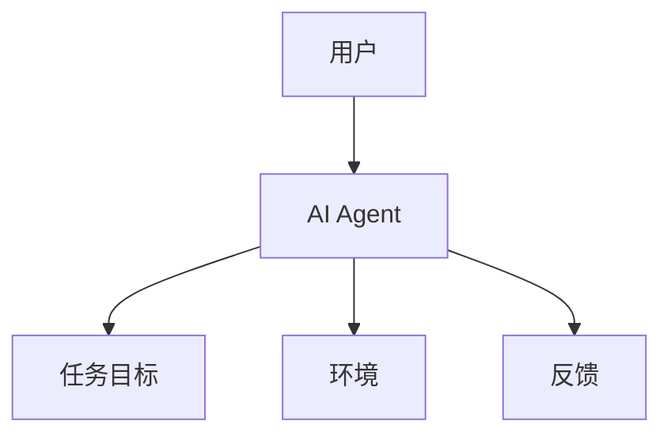
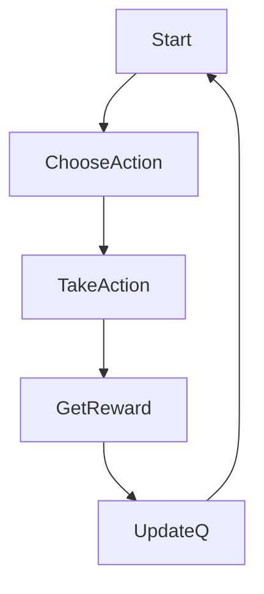
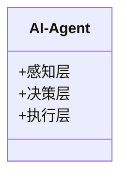
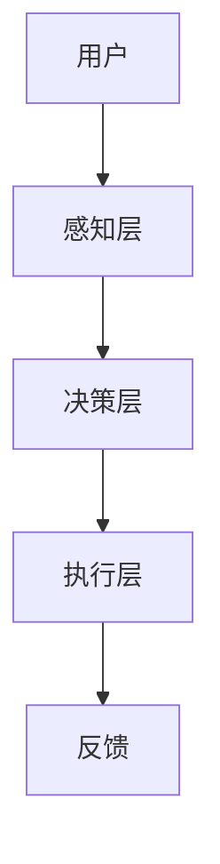

                 


```markdown
# AI Agent的应用场景：从客服到创意助手

> 关键词：AI Agent, 人工智能助手, 客服应用, 创意助手, 强化学习, 系统架构, 项目实战

> 摘要：本文将全面探讨AI Agent在客服到创意助手等领域的应用场景，从基础概念、算法原理、系统架构到项目实战，深入分析AI Agent的核心技术与实际应用案例，帮助读者全面理解AI Agent的应用潜力与未来发展方向。

---

## 第一部分：AI Agent的核心概念与技术基础

### 第1章：AI Agent的基本概念与背景

#### 1.1 什么是AI Agent？
- AI Agent的定义与核心特征
- AI Agent与传统软件的区别
- AI Agent的历史发展与现状

#### 1.2 AI Agent的主要类型
- 基于规则的AI Agent
- 基于模型的AI Agent
- 基于强化学习的AI Agent

#### 1.3 AI Agent的应用场景
- 客服助手
- 创意助手
- 金融投资
- 游戏AI

### 第2章：AI Agent的核心概念与原理

#### 2.1 AI Agent的核心模块
- 感知层：数据输入与处理
- 决策层：策略制定与优化
- 执行层：任务执行与反馈

#### 2.2 AI Agent的工作流程
1. 感知环境
2. 分析需求
3. 制定策略
4. 执行任务
5. 反馈优化

#### 2.3 AI Agent的实体关系图


---

## 第二部分：AI Agent的算法原理与数学模型

### 第3章：AI Agent的算法原理

#### 3.1 基于规则的AI Agent
- 规则引擎的实现
- 优点与局限性
- 适用场景

#### 3.2 基于模型的AI Agent
- 深度学习模型的应用
- Transformer架构
- 多轮对话模型

#### 3.3 基于强化学习的AI Agent
- Q-learning算法
- Deep Q-Network (DQN)
- 策略梯度方法

#### 3.4 算法对比分析
| 算法类型 | 优点 | 缺点 |
|----------|------|------|
| 基于规则 | 简单易实现 | 需要手动编写规则 |
| 基于模型 | 高效准确 | 对数据依赖性强 |
| 强化学习 | 自适应能力强 | 需大量数据与计算资源 |

### 第4章：AI Agent的数学模型

#### 4.1 状态空间与动作空间
- 状态空间：$S = \{s_1, s_2, ..., s_n\}$
- 动作空间：$A = \{a_1, a_2, ..., a_m\}$

#### 4.2 奖励函数
- 奖励函数定义：$R(s, a) = r$
- Q-learning公式：
  $$ Q(s, a) = Q(s, a) + \alpha (r + \gamma \max Q(s', a') - Q(s, a)) $$

#### 4.3 强化学习流程图


---

## 第三部分：AI Agent的系统架构与设计

### 第5章：系统功能设计

#### 5.1 需求分析
- 功能需求：任务处理、反馈优化、自适应学习
- 性能需求：响应速度、准确率、资源消耗

#### 5.2 功能模块划分
- 感知模块：数据采集与预处理
- 决策模块：策略选择与优化
- 执行模块：任务执行与反馈

#### 5.3 领域模型设计


### 第6章：系统架构设计

#### 6.1 系统架构图


#### 6.2 接口设计
- 输入接口：API定义
- 输出接口：数据格式与反馈机制

#### 6.3 交互流程图
```mermaid
graph TD
    User --> Agent: 请求
    Agent --> User: 响应
    Agent --> Database: 查询
    Database --> Agent: 数据
    Agent --> Log: 记录
```

---

## 第四部分：项目实战

### 第7章：项目实战

#### 7.1 环境安装
- Python 3.8+
- TensorFlow/PyTorch
- 其他依赖库安装

#### 7.2 核心实现
```python
class AIAgent:
    def __init__(self):
        self.model = self.build_model()
    
    def build_model(self):
        # 模型构建代码
        pass
    
    def perceive(self, input):
        # 数据处理代码
        pass
    
    def decide(self, state):
        # 策略选择代码
        pass
    
    def execute(self, action):
        # 任务执行代码
        pass
```

#### 7.3 实际案例分析
- 客服场景：解决用户问题
- 创意场景：生成文案

---

## 第五部分：总结与展望

### 第8章：总结与展望

#### 8.1 全文总结
- AI Agent的核心技术与应用场景
- 优势与局限性

#### 8.2 未来展望
- 技术趋势：强化学习与深度学习的结合
- 应用前景：更多领域中的应用

#### 8.3 最佳实践
- 数据质量的重要性
- 算法选择的策略
- 系统优化建议

---

## 参考文献

- 《深度学习》—— Ian Goodfellow
- 《强化学习》—— Richard S. Sutton
- 《自然语言处理实战》—— 李开复
```

这个大纲覆盖了AI Agent从基础到实战的各个方面，从概念、算法、系统架构到项目实现，帮助读者逐步深入理解AI Agent的应用场景和技术细节。每个部分都包含了理论分析和实际案例，确保内容的全面性和实用性。

