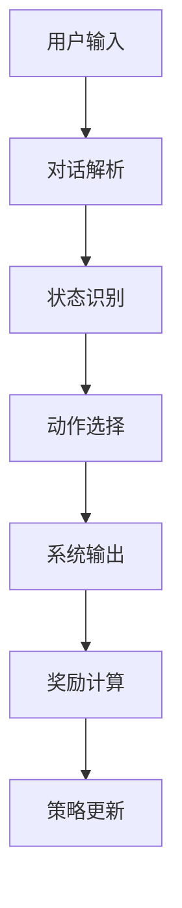
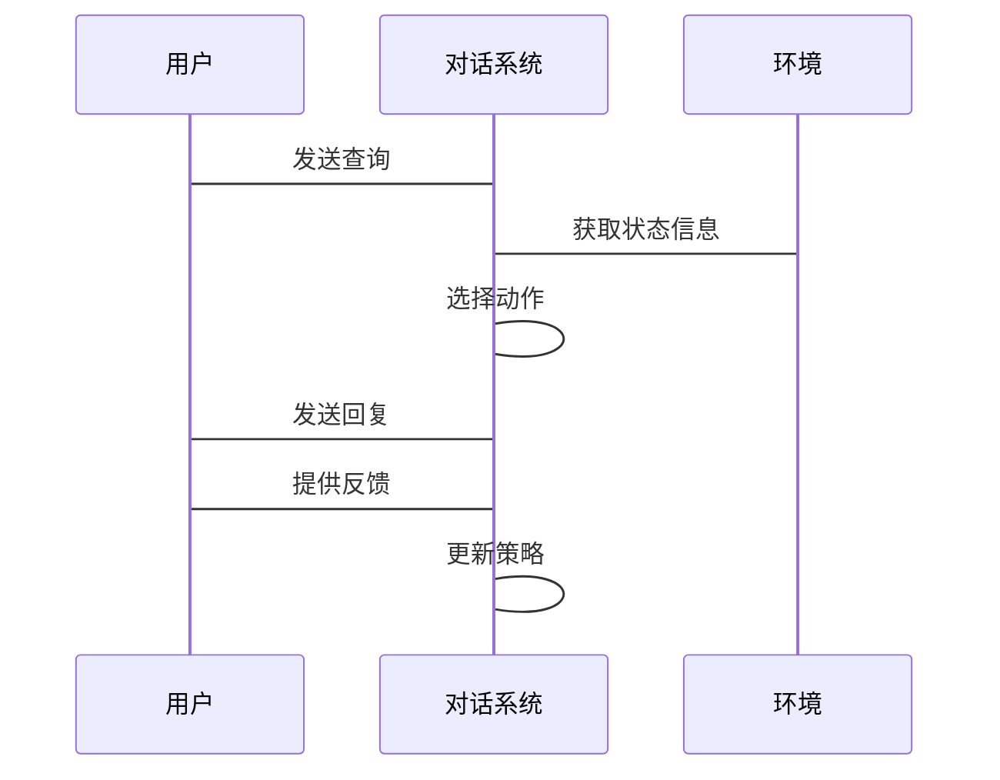

                 


# AI Agent的强化学习在对话策略优化中的应用

> 关键词：AI Agent, 强化学习, 对话策略优化, 算法原理, 系统架构, 项目实战

> 摘要：本文将深入探讨AI Agent的强化学习在对话策略优化中的应用，从基础概念到算法实现，再到系统架构和项目实战，全面解析如何通过强化学习提升对话系统的性能和用户体验。

---

## 第一部分: AI Agent与强化学习基础

### 第1章: AI Agent与强化学习概述

#### 1.1 AI Agent的基本概念
- 1.1.1 AI Agent的定义与分类
  - 定义：AI Agent是具有感知和决策能力的智能体，能够根据环境信息做出最优选择。
  - 分类：基于任务型、对话型和通用型的AI Agent，及其应用场景的对比表格。
  
- 1.1.2 强化学习的基本原理
  - 状态、动作、奖励的定义与作用。
  - 策略与价值函数的对比，以及强化学习与监督学习的区别。

- 1.1.3 对话策略优化的背景与意义
  - 对话系统的输入输出关系及其在人机交互中的重要性。
  - 强化学习在对话系统中的应用及其优势。

#### 1.2 强化学习的核心概念
- 1.2.1 状态、动作、奖励的定义
  - 状态空间的构建方法，动作空间的设计策略，奖励函数的作用与设计原则。

- 1.2.2 策略与价值函数的对比
  - 策略直接决定动作选择的概率分布，价值函数评估状态-动作对的优劣，两者的数学表达式对比。

- 1.2.3 强化学习与监督学习的区别
  - 数据来源、目标函数、反馈机制的对比表格。

#### 1.3 对话策略优化的背景介绍
- 1.3.1 对话系统的发展历程
  - 从规则驱动到数据驱动，再到强化学习驱动的演进过程。

- 1.3.2 强化学习在对话系统中的应用
  - 提高对话的流畅性和智能性，解决传统方法的局限性。

- 1.3.3 当前研究的挑战与机遇
  - 状态空间的复杂性、奖励函数的设计难题，以及多目标优化的挑战。

#### 1.4 本章小结
- 总结AI Agent和强化学习的基本概念，强调对话策略优化的重要性和应用前景。

---

## 第二部分: 对话策略优化的核心概念与联系

### 第2章: 对话策略优化的核心概念

#### 2.1 对话策略优化的问题背景
- 2.1.1 对话系统的输入输出关系
  - 输入：用户查询或上下文信息；输出：系统回复或动作选择。

- 2.1.2 对话策略优化的目标函数
  - 最大化期望奖励，如提高用户满意度或任务完成率。

- 2.1.3 优化过程中的约束条件
  - 系统资源限制、隐私保护、实时性要求等。

#### 2.2 对话策略优化的核心要素
- 2.2.1 状态空间的构建
  - 对话历史、用户意图、上下文信息的整合方法。

- 2.2.2 动作空间的设计
  - 回复生成、信息查询、任务执行等动作的选择策略。

- 2.2.3 奖励函数的定义
  - 基于用户反馈、任务完成度、对话流畅度的多维奖励设计。

#### 2.3 核心概念的对比分析
- 2.3.1 不同策略优化方法的对比表格
  - 基于值函数（Q-learning）与基于策略梯度（PG）方法的优劣对比。

- 2.3.2 实体关系图的ER架构
  - 对话策略优化中的实体（用户、系统、环境）及其关系的ER图。

- 2.3.3 对话策略优化的流程图（Mermaid）
  ```mermaid
  graph TD
      A[用户输入] --> B[系统处理]
      B --> C[状态识别]
      C --> D[动作选择]
      D --> E[奖励反馈]
      E --> F[策略更新]
  ```

---

## 第三部分: 强化学习算法原理与数学模型

### 第3章: 强化学习算法原理

#### 3.1 强化学习的基本算法
- 3.1.1 Q-learning算法的原理
  - 离线学习，通过更新Q表中的值来逼近最优策略。

- 3.1.2 Deep Q-Networks (DQN)的实现
  - 使用深度神经网络近似Q函数，解决高维状态空间的问题。

- 3.1.3 算法流程图（Mermaid）
  ```mermaid
  graph TD
      S[状态s] --> A[动作a]
      A --> R[奖励r]
      S' --> S
      S,A --> Q-learning更新Q(s,a)
  ```

#### 3.2 对话策略优化的数学模型
- 3.2.1 状态转移矩阵的定义
  - P(s' | s, a)：从状态s采取动作a后转移到状态s'的概率。

- 3.2.2 动作选择的概率分布
  - π(a | s)：在状态s下选择动作a的概率，基于策略函数。

- 3.2.3 奖励函数的数学表达式
  $$ R(s, a) = r \in \mathbb{R} $$

#### 3.3 算法实现的Python代码示例
- 3.3.1 Q-learning算法实现
  ```python
  import numpy as np

  class QLearning:
      def __init__(self, state_space, action_space):
          self.q_table = np.zeros((state_space, action_space))
      
      def choose_action(self, state, epsilon=0.1):
          if np.random.random() < epsilon:
              return np.random.randint(0, action_space)
          else:
              return np.argmax(self.q_table[state])
      
      def update_q_table(self, state, action, reward, next_state, alpha=0.1):
          self.q_table[state][action] = self.q_table[state][action] + alpha * (reward + gamma * np.max(self.q_table[next_state]) - self.q_table[state][action])
  ```

#### 3.4 算法的数学推导与举例
- 3.4.1 Q-learning的更新公式
  $$ Q(s, a) = Q(s, a) + \alpha (r + \gamma \max Q(s', a') - Q(s, a)) $$

---

## 第四部分: 系统分析与架构设计方案

### 第4章: 系统分析与架构设计

#### 4.1 系统分析
- 问题场景介绍：一个智能对话系统需要通过强化学习优化对话策略，以提高用户体验。

#### 4.2 系统功能设计
- 领域模型：对话系统的功能模块，如自然语言处理、策略选择、奖励机制等。

#### 4.3 系统架构设计（Mermaid）


#### 4.4 系统接口设计
- API定义：用户输入接口、系统输出接口、奖励反馈接口。

#### 4.5 系统交互设计（Mermaid）


---

## 第五部分: 项目实战

### 第5章: 项目实战

#### 5.1 环境安装
- 安装Python、TensorFlow、Keras等依赖库。

#### 5.2 系统核心实现源代码
- 对话策略优化的Python代码实现，包括数据预处理、模型训练、策略评估等部分。

#### 5.3 代码应用解读与分析
- 解释代码的结构和实现细节，分析算法的收敛速度和性能优化。

#### 5.4 实际案例分析
- 使用具体案例展示强化学习在对话策略优化中的应用效果。

#### 5.5 项目小结
- 总结项目实现的关键点和经验教训。

---

## 第六部分: 总结与展望

### 第6章: 总结与展望

#### 6.1 最佳实践 tips
- 强化学习在对话策略优化中的关键成功因素和常见问题解决方法。

#### 6.2 小结
- 回顾全文内容，强调强化学习在对话策略优化中的重要性和应用前景。

#### 6.3 注意事项
- 算法选择、数据质量、奖励函数设计等方面的注意事项。

#### 6.4 拓展阅读
- 推荐相关领域的书籍、论文和资源，供读者进一步学习。

---

## 结语
通过本文的系统讲解，读者将能够全面理解AI Agent的强化学习在对话策略优化中的应用，并掌握从理论到实践的完整流程。

