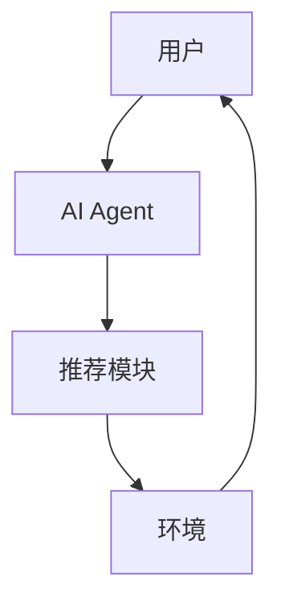

                 


# AI Agent的强化学习在推荐系统中的应用

## 关键词：
AI Agent, 强化学习, 推荐系统, Q-learning, DQN, 马尔可夫决策过程, 实时反馈机制

## 摘要：
本文探讨AI Agent在推荐系统中的应用，重点分析强化学习技术如何优化推荐策略。通过背景介绍、核心概念、算法原理、系统架构、项目实战和最佳实践，详细阐述强化学习在动态环境下的推荐优化，帮助读者理解并应用相关技术。

---

# 目录大纲：《AI Agent的强化学习在推荐系统中的应用》

## 第一部分：引言

### 第1章：引言
#### 1.1 强化学习与推荐系统的背景
- 1.1.1 强化学习的基本概念
- 1.1.2 推荐系统的概述
- 1.1.3 强化学习在推荐系统中的应用意义

#### 1.2 本书的目的与结构
- 1.2.1 本书的目标
- 1.2.2 目录结构概述

## 第二部分：AI Agent与强化学习基础

### 第2章：AI Agent的基本概念
#### 2.1 AI Agent的定义与分类
- 2.1.1 AI Agent的定义
- 2.1.2 分类与应用场景

#### 2.2 强化学习的基本原理
- 2.2.1 强化学习的定义
- 2.2.2 核心概念：状态、动作、奖励

## 第三部分：强化学习算法原理

### 第3章：强化学习的核心算法
#### 3.1 Q-learning算法
- 3.1.1 算法原理
- 3.1.2 数学模型：$$ Q(s,a) = Q(s,a) + \alpha (r + \gamma \max Q(s',a') - Q(s,a)) $$
- 3.1.3 使用Mermaid图展示Q-learning流程
  ```mermaid
  graph TD
    A[状态s] --> B[动作a]
    B --> C[状态s']
    C --> D[奖励r]
    D --> A'
  ```

#### 3.2 Deep Q-Networks（DQN）算法
- 3.2.1 DQN的基本原理
- 3.2.2 算法实现：经验回放和目标网络
- 3.2.3 使用Mermaid图展示DQN架构
  ```mermaid
  graph TD
    A[环境] --> B[代理]
    B --> C[神经网络]
    C --> D[动作a]
    D --> E[状态s']
    E --> F[奖励r]
  ```

## 第四部分：推荐系统中的强化学习应用

### 第4章：推荐系统的强化学习应用
#### 4.1 动态推荐
- 4.1.1 动态推荐的定义
- 4.1.2 基于强化学习的动态推荐案例

#### 4.2 个性化推荐
- 4.2.1 个性化推荐的核心要素
- 4.2.2 基于强化学习的个性化推荐策略

## 第五部分：系统架构与设计

### 第5章：推荐系统的系统架构
#### 5.1 推荐系统整体架构
- 5.1.1 系统组件概述
- 5.1.2 使用Mermaid图展示系统架构
  ```mermaid
  graph TD
    U[用户] --> E[环境]
    E --> A[AI Agent]
    A --> R[推荐模块]
    R --> U[用户]
  ```

#### 5.2 AI Agent的集成
- 5.2.1 AI Agent在推荐系统中的角色
- 5.2.2 使用Mermaid图展示系统交互流程
  ```mermaid
  graph TD
    U[用户] --> A[AI Agent]
    A --> E[环境]
    E --> R[推荐结果]
    R --> U[用户]
  ```

## 第六部分：项目实战

### 第6章：基于强化学习的推荐系统实现
#### 6.1 项目环境安装
- 6.1.1 安装Python和相关库（如TensorFlow、Keras）

#### 6.2 系统核心实现源代码
- 6.2.1 DQN算法实现代码
  ```python
  import numpy as np
  import tensorflow as tf

  class DQN:
      def __init__(self, state_space, action_space):
          self.state_space = state_space
          self.action_space = action_space
          self.model = self.build_model()

      def build_model(self):
          model = tf.keras.Sequential([
              tf.keras.layers.Dense(32, activation='relu', input_dim=self.state_space),
              tf.keras.layers.Dense(self.action_space, activation='linear')
          ])
          return tf.keras.Model(inputs=model.inputs, outputs=model.output)
  ```

- 6.2.2 训练过程代码
  ```python
  def train(self, state, action, reward, next_state):
      target = self.model.predict(np.array([state]))
      next_target = self.model.predict(np.array([next_state]))
      target[0][action] = reward + 0.95 * np.max(next_target[0])
      self.model.fit(np.array([state]), target, epochs=1, verbose=0)
  ```

#### 6.3 项目小结
- 6.3.1 项目实现的关键点总结
- 6.3.2 实践中的注意事项

## 第七部分：最佳实践与未来展望

### 第7章：最佳实践
#### 7.1 实践中的注意事项
- 7.1.1 数据预处理的重要性
- 7.1.2 超参数调谐的技巧

#### 7.2 未来的研究方向
- 7.2.1 多智能体协作在推荐系统中的应用
- 7.2.2 连续动作空间的强化学习探索

## 结语
本文系统地探讨了AI Agent的强化学习在推荐系统中的应用，通过理论分析和实践案例，为读者提供了深入的理解和实用的技术指导。未来的研究将致力于优化现有算法并探索新的应用领域，以期在推荐系统中实现更高效的用户互动和个性化体验。

---

### 附录
#### 附录A：强化学习算法的数学公式汇总
- Q-learning公式：$$ Q(s,a) = Q(s,a) + \alpha (r + \gamma \max Q(s',a') - Q(s,a)) $$
- DQN目标网络更新公式：$$ \theta_{target} = \theta_{main} + \epsilon \cdot (\theta_{target} - \theta_{main}) $$

#### 附录B：推荐系统架构的Mermaid图


---

以上是《AI Agent的强化学习在推荐系统中的应用》的文章正文内容，涵盖了各个必要的部分，详细讲解了强化学习在推荐系统中的应用及其具体实现。

