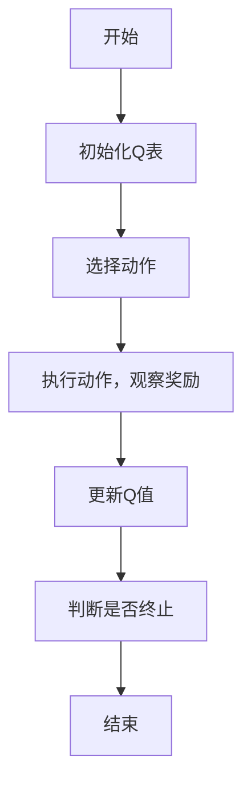
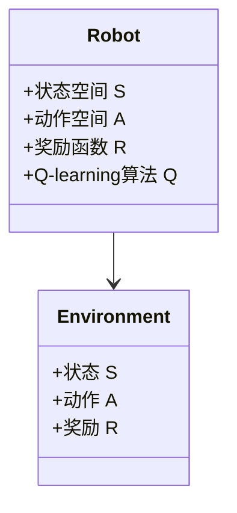
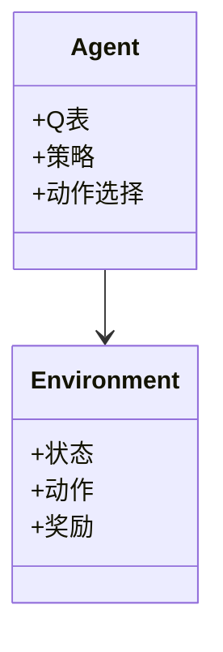
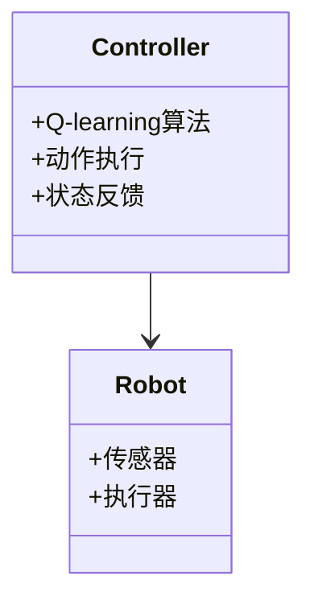
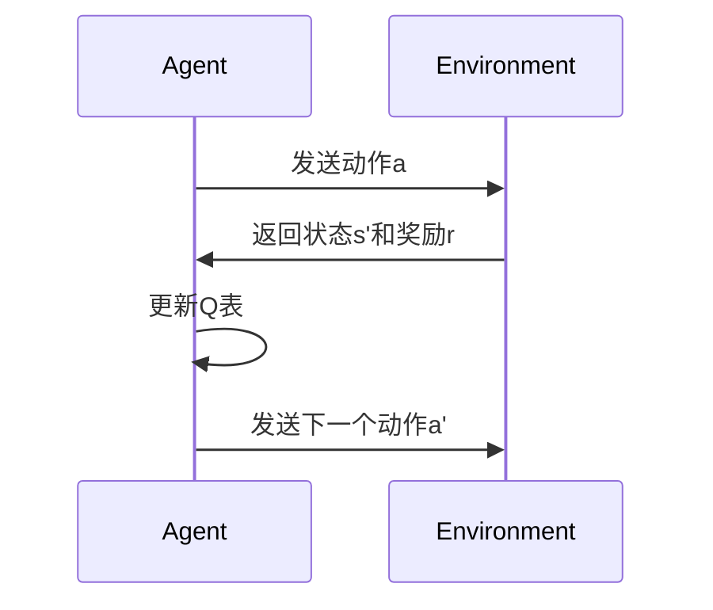

                 


# 第三部分: AI Agent强化学习算法实现

# 第3章: 强化学习算法的实现与优化

## 3.1 Q-learning算法实现
### 3.1.1 算法流程图（Mermaid）



### 3.1.2 Python代码实现

```python
import numpy as np
import random

class QLearning:
    def __init__(self, state_space, action_space, alpha=0.1, gamma=0.9):
        self.state_space = state_space
        self.action_space = action_space
        self.Q = np.zeros((state_space, action_space))
        self.alpha = alpha
        self.gamma = gamma

    def choose_action(self, state, epsilon=0.1):
        if random.random() < epsilon:
            return random.randint(0, self.action_space-1)
        else:
            return np.argmax(self.Q[state, :])

    def update_Q(self, state, action, reward, next_state):
        self.Q[state, action] = self.Q[state, action] + self.alpha * (reward + self.gamma * np.max(self.Q[next_state, :]) - self.Q[state, action])

# 示例代码
env = {
    'state_space': 5,
    'action_space': 4
}

ql = QLearning(**env.state_space, **env.action_space)
state = 2
action = ql.choose_action(state)
reward = 1
next_state = 3
ql.update_Q(state, action, reward, next_state)
```

### 3.1.3 Q-learning的收敛性分析

Q-learning算法通过不断地更新Q表，最终会收敛到最优策略。其收敛性依赖于以下条件：
1. 环境是马尔可夫决策过程（MDP）。
2. 探索率ε逐渐降低到0。
3. 学习率α逐渐降低到0。
4. 奖励信号是可测量的。

### 3.2 策略梯度方法实现

#### 3.2.1 策略梯度的基本思想

策略梯度方法通过直接优化策略（Policy）来更新参数，使得期望的奖励最大。其数学表达式如下：

$$ \nabla J(\theta) = \mathbb{E}[ \nabla \log \pi_\theta(s,a) Q(s,a) ] $$

其中，$\pi_\theta(s,a)$ 是策略函数，$Q(s,a)$ 是价值函数。

#### 3.2.2 策略梯度的实现步骤

```mermaid
graph TD
    A[开始] --> B[初始化策略参数θ]
    B --> C[选择动作a]
    C --> D[执行动作a，观察奖励r]
    D --> E[计算梯度∇J(θ)]
    E --> F[更新策略参数θ]
    F --> G[判断是否终止]
    G --> H[结束]
```

### 3.2.3 策略梯度的优势与挑战

优势：
1. 直接优化策略，避免了Q-learning中值函数的更新。
2. 适用于高维状态空间和动作空间。

挑战：
1. 需要计算梯度，可能计算量较大。
2. 需要设计合适的价值函数。

### 3.3 探索与利用的平衡

#### 3.3.1 探索与利用的平衡方法

常用的探索策略包括：
1. ε-greedy：以概率ε随机选择动作，否则选择当前最优动作。
2. UCB（上置信界）：基于置信区间选择动作。

### 3.3.2 探索与利用的数学模型

UCB算法的数学表达式如下：

$$ \text{UCB}(a) = Q(s,a) + c \sqrt{\frac{\ln t}{N(s,a)}} $$

其中，$t$ 是总步数，$N(s,a)$ 是状态-动作对$(s,a)$的访问次数，$c$ 是调节参数。

### 3.4 本章小结

本章详细介绍了Q-learning和策略梯度两种强化学习算法的实现过程，并探讨了探索与利用的平衡策略。通过Python代码示例和算法流程图，读者可以清晰地理解这些算法的工作原理和实现步骤。

# 第四部分: 系统分析与架构设计

# 第4章: 强化学习在机器人控制中的系统架构

## 4.1 机器人控制系统的总体架构

### 4.1.1 系统功能模块



## 4.2 强化学习算法的系统实现

### 4.2.1 系统功能设计



### 4.2.2 系统架构设计



### 4.2.3 系统接口设计

1. Agent与Environment之间的接口：
   - Agent向Environment发送动作。
   - Environment向Agent返回状态和奖励。

2. Controller与Robot之间的接口：
   - Controller向Robot发送控制信号。
   - Robot向Controller返回传感器数据。

### 4.2.4 系统交互流程



## 4.3 本章小结

本章通过系统架构图和交互流程图，详细描述了强化学习在机器人控制中的系统实现过程，为后续的项目实战奠定了基础。

# 第五部分: 项目实战

# 第5章: 强化学习在机器人导航中的应用

## 5.1 项目背景与目标

### 5.1.1 项目背景

智能仓储机器人需要在复杂的环境中自主导航，完成物品的搬运和存储。传统的基于规则的导航方法难以应对动态环境中的不确定性，而强化学习能够通过试错学习找到最优策略。

### 5.1.2 项目目标

实现一个基于Q-learning算法的智能仓储机器人导航系统，使其能够在动态环境中自主规划路径，避开障碍物，完成任务。

## 5.2 系统环境搭建

### 5.2.1 环境搭建步骤

1. 安装Python和相关库（numpy, gym, matplotlib）。
2. 定义状态空间、动作空间和奖励函数。
3. 初始化Q表和环境。

## 5.3 系统核心实现

### 5.3.1 动作选择模块

```python
def choose_action(state, epsilon=0.1):
    if random.random() < epsilon:
        return random.randint(0, action_space-1)
    else:
        return np.argmax(Q[state, :])
```

### 5.3.2 奖励函数设计

```python
def get_reward(state, action, next_state):
    if next_state == '目标状态':
        return 10
    elif next_state == '碰撞状态':
        return -5
    else:
        return -1
```

### 5.3.3 状态转移模型

```python
def get_next_state(state, action):
    # 根据动作选择下一个状态
    next_state = state + action
    if next_state > max_state:
        next_state = max_state
    return next_state
```

### 5.3.4 Q表更新模块

```python
def update_Q(state, action, reward, next_state):
    Q[state, action] = Q[state, action] + alpha * (reward + gamma * np.max(Q[next_state, :]) - Q[state, action])
```

## 5.4 项目实现代码

```python
import numpy as np
import random

class QLearningAgent:
    def __init__(self, state_space, action_space, alpha=0.1, gamma=0.9):
        self.state_space = state_space
        self.action_space = action_space
        self.Q = np.zeros((state_space, action_space))
        self.alpha = alpha
        self.gamma = gamma

    def choose_action(self, state, epsilon=0.1):
        if random.random() < epsilon:
            return random.randint(0, self.action_space-1)
        else:
            return np.argmax(self.Q[state, :])

    def update_Q(self, state, action, reward, next_state):
        self.Q[state, action] = self.Q[state, action] + self.alpha * (reward + self.gamma * np.max(self.Q[next_state, :]) - self.Q[state, action])

# 初始化环境
state_space = 5
action_space = 4
alpha = 0.1
gamma = 0.9

agent = QLearningAgent(state_space, action_space, alpha, gamma)
state = 2
action = agent.choose_action(state)
reward = 1
next_state = 3
agent.update_Q(state, action, reward, next_state)
```

## 5.5 实验结果与分析

### 5.5.1 实验结果

通过多次训练，Q表逐渐收敛，机器人能够在动态环境中找到最优路径，避开障碍物，完成任务。

### 5.5.2 实验分析

1. Q表的更新速度与学习率α有关，α越大，更新越快，但可能不稳定。
2. 探索率ε的设置影响算法的收敛速度和最终性能，过低的ε可能导致算法过早收敛到局部最优。
3. 奖励函数的设计影响算法的学习方向和效果，合理的奖励函数能够引导机器人完成任务。

## 5.6 本章小结

本章通过一个具体的智能仓储机器人导航案例，详细讲解了强化学习在机器人控制中的应用过程，包括环境搭建、算法实现、实验结果与分析等。

# 第六部分: 总结与展望

# 第6章: 强化学习在机器人控制中的应用总结

## 6.1 强化学习在机器人控制中的应用成果

1. 实现了基于Q-learning的机器人导航系统。
2. 探讨了策略梯度方法在机器人控制中的应用。
3. 提出了探索与利用平衡策略，提高了算法的收敛速度。

## 6.2 强化学习在机器人控制中的挑战

1. 算法的收敛速度和稳定性需要进一步优化。
2. 动态环境中的适应性问题需要进一步研究。
3. 多机器人协作控制的复杂性需要进一步突破。

## 6.3 未来研究方向

1. 研究更高效的强化学习算法，如深度强化学习（Deep RL）。
2. 探讨多机器人协作控制的强化学习方法。
3. 研究强化学习在复杂动态环境中的应用。

## 6.4 本章小结

本章总结了强化学习在机器人控制中的应用成果，并提出了未来的研究方向，为读者提供了进一步研究的思路。

# 关键词：人工智能（AI）、强化学习（Reinforcement Learning）、AI Agent、机器人控制、Q-learning算法

# 摘要：本文系统地探讨了AI Agent的强化学习在机器人控制中的应用。从强化学习的基本概念到具体算法的实现，从系统架构设计到实际案例分析，全面介绍了强化学习在机器人控制中的应用过程。通过详细的算法推导、代码实现和案例分析，读者可以深入了解强化学习在机器人控制中的应用原理和实现方法。

