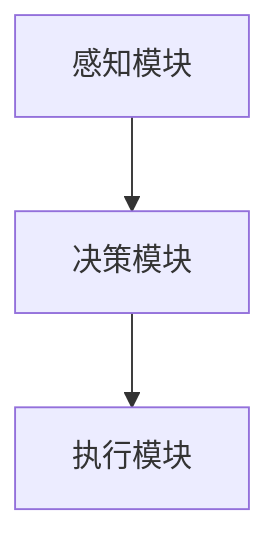
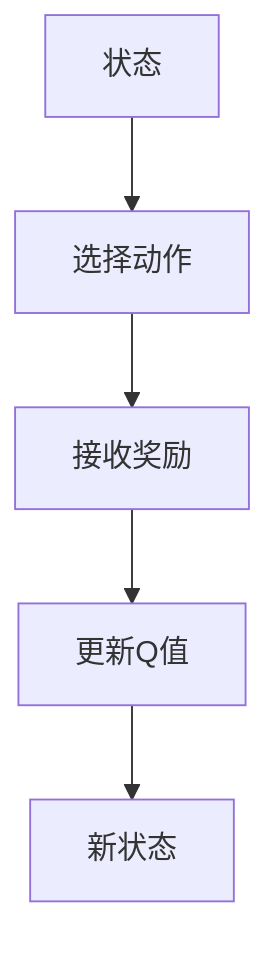

                 


# AI Agent的强化学习在游戏AI中的应用

> 关键词：AI Agent, 强化学习, 游戏AI, Q-learning, DQN, 多智能体协作

> 摘要：本文深入探讨了AI Agent在游戏AI中的应用，特别是强化学习在其中的关键作用。文章从强化学习的基本原理到其在游戏AI中的具体应用进行了详细分析，并通过实际案例展示了AI Agent的实现过程。最后，本文总结了当前的研究成果，并展望了未来的发展方向。

---

# 第1章: 强化学习与AI Agent基础

## 1.1 强化学习的基本概念
强化学习是一种机器学习范式，其中智能体通过与环境交互来学习如何做出决策。智能体会通过试错的方式，根据接收到的奖励信号来调整自己的行为策略。

## 1.2 AI Agent的核心要素
AI Agent是一种能够感知环境并采取行动以实现目标的实体。它通常由感知模块、决策模块和执行模块组成。

## 1.3 游戏AI中的强化学习
在游戏AI中，强化学习广泛应用于游戏人物的自动控制、策略游戏的智能玩家以及复杂游戏环境的自适应设计。

---

# 第2章: 强化学习算法原理

## 2.1 Q-learning算法
Q-learning是一种经典的强化学习算法，适用于离散动作空间和状态空间。其核心思想是通过Q表记录状态-动作对的价值，并通过贝尔曼方程进行更新。

### Q-learning的数学模型
$$ Q(s,a) = Q(s,a) + \alpha \left( r + \gamma \max_{a'} Q(s',a') - Q(s,a) \right) $$

## 2.2 Deep Q-Network (DQN)算法
DQN通过使用深度神经网络近似Q值函数，解决了Q-learning在高维状态空间中的计算难题。其核心思想是利用经验回放和目标网络来稳定训练过程。

### DQN的网络结构
- 输入层：接收环境状态
- 隐藏层：提取特征
- 输出层：预测每个动作的Q值

### DQN的训练流程
1. 从经验回放池中随机抽取一批样本
2. 计算目标Q值：$$ Q_{\text{target}} = r + \gamma \max_{a'} Q_{\text{target}}(s',a') $$
3. 计算当前Q值：$$ Q_{\text{current}}(s,a) = \theta \cdot \phi(s,a) $$
4. 更新权重：最小化$$ \mathbb{E}\left[(Q_{\text{target}} - Q_{\text{current}})^2\right] $$

---

# 第3章: AI Agent在游戏AI中的应用

## 3.1 游戏AI的建模
游戏AI的建模需要考虑状态表示、动作选择和奖励设计。例如，在经典游戏Atari中，状态可以表示为屏幕像素，动作可以表示为按键组合。

## 3.2 多智能体协作与竞争
在多人游戏中，AI Agent需要与其他智能体协作或竞争。通过分布式强化学习，多个智能体可以学会合作策略。

### 多智能体协作的实现
1. 每个智能体维护自己的Q表
2. 通过共享奖励机制促进协作

---

# 第4章: 系统架构与实现

## 4.1 游戏AI系统的架构设计
游戏AI系统通常包括感知模块、决策模块和执行模块。感知模块负责收集环境信息，决策模块基于强化学习算法做出决策，执行模块负责执行动作。

### 系统架构图


## 4.2 强化学习训练流程
1. 初始化Q表或神经网络
2. 与环境交互，获取状态、动作和奖励
3. 更新Q值或训练神经网络
4. 重复直到收敛

### 训练流程图


---

# 第5章: 项目实战

## 5.1 环境搭建
- 安装Python和相关库（如OpenAI Gym）
- 配置训练环境

## 5.2 代码实现
以下是使用DQN算法实现游戏AI的Python代码示例：

```python
import gym
import numpy as np
import tensorflow as tf

class DQNetwork:
    def __init__(self, state_size, action_size, hidden_size=256):
        self.model = tf.keras.Sequential([
            tf.keras.layers.Dense(hidden_size, activation='relu', input_shape=(state_size,)),
            tf.keras.layers.Dense(action_size, activation='linear')
        ])
        self.optimizer = tf.keras.optimizers.Adam(learning_rate=0.001)
    
    def call(self, state):
        return self.model(state)
    
    def train(self, states, targets):
        with tf.GradientTape() as tape:
            predictions = self.model(states)
            loss = tf.keras.losses.mean_squared_error(targets, predictions)
        grads = tape.gradient(loss, self.model.trainable_variables)
        self.optimizer.apply_gradients(zip(grads, self.model.trainable_variables))

def train_ai():
    env = gym.make('CartPole-v1')
    state_size = env.observation_space.shape[0]
    action_size = env.action_space.n
    agent = DQNetwork(state_size, action_size)
    
    episodes = 1000
    for episode in range(episodes):
        state = env.reset()
        total_reward = 0
        done = False
        while not done:
            # 环境渲染
            env.render()
            
            # 选择动作
            state_tensor = tf.convert_to_tensor(np.array([state], dtype=np.float32))
            Q_values = agent.call(state_tensor)
            action = np.argmax(Q_values.numpy()[0])
            
            # 执行动作
            next_state, reward, done, _ = env.step(action)
            total_reward += reward
            
            # 更新Q值
            target = reward + (0 if done else 0.99 * np.max(Q_values.numpy()[0]))
            target = tf.convert_to_tensor(np.array([target], dtype=np.float32))
            agent.train(tf.convert_to_tensor(np.array([state], dtype=np.float32)), target)
            
            state = next_state
        
        print(f"Episode {episode}: Reward = {total_reward}")

if __name__ == "__main__":
    train_ai()
```

## 5.3 实际案例分析
以上代码实现了一个简单的游戏AI，用于训练智能体在CartPole游戏中保持平衡。通过多次迭代，智能体可以学会如何控制杆子保持直立。

---

# 第6章: 总结与展望

## 6.1 本章小结
本文详细介绍了AI Agent在游戏AI中的应用，特别是强化学习在其中的核心作用。通过理论分析和实际案例，展示了如何利用强化学习算法实现智能游戏AI。

## 6.2 未来展望
未来的研究可以进一步探索分布式强化学习、多智能体协作以及更复杂的环境建模方法。

---

# 参考文献
1. Mnih, V., et al. "Human-level control through deep reinforcement learning." *Nature*, 2015.
2. Sutton, R. S., and A. G. Barto. *Reinforcement Learning: An Introduction*. MIT Press, 2018.

---

# 附录
## 附录A: 强化学习的数学公式
- 状态转移概率：$$ P(s', r | s, a) $$
- 价值函数：$$ V(s) = \max_a Q(s,a) $$

## 附录B: 代码实现细节
- 环境接口：使用OpenAI Gym库
- 网络结构：使用Keras构建深度神经网络

--- 

通过以上内容，读者可以全面了解AI Agent的强化学习在游戏AI中的应用，并能够通过实际代码实现自己的游戏AI项目。

