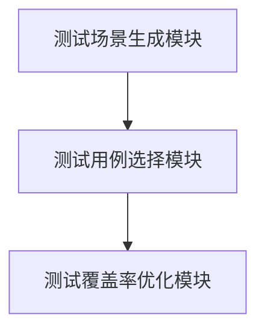

                 


# AI Agent的强化学习在自动化测试中的应用

> **关键词**：AI Agent, 强化学习, 自动化测试, 测试场景生成, 测试用例选择, 测试覆盖率优化

> **摘要**：  
本文探讨了AI Agent通过强化学习技术在自动化测试中的应用，重点分析了强化学习算法在测试场景生成、测试用例选择和测试覆盖率优化中的具体实现。通过详细阐述强化学习的数学基础、系统架构设计以及项目实战，本文为读者提供了一种从理论到实践的系统性方法，展示了如何利用AI Agent提升自动化测试的效率和质量。

---

## 第一部分: AI Agent与强化学习基础

### 第1章: AI Agent的定义与特点

#### 1.1 AI Agent的基本概念

##### 1.1.1 什么是AI Agent
AI Agent（人工智能代理）是指能够感知环境并采取行动以实现目标的智能体。它能够根据输入的信息做出决策，并在环境中执行动作以达到预定目标。

##### 1.1.2 AI Agent的核心特点
- **自主性**：AI Agent能够在没有外部干预的情况下自主决策。
- **反应性**：能够实时感知环境并做出反应。
- **目标导向**：所有行为都以实现特定目标为导向。
- **学习能力**：能够通过经验改进自身的决策能力。

##### 1.1.3 AI Agent与传统AI的区别
AI Agent不仅仅是一个静态的算法或模型，而是一个动态的、能够与环境交互的实体。它更注重与环境的实时互动和目标导向的行为。

#### 1.2 强化学习的基本概念

##### 1.2.1 强化学习的定义
强化学习是一种机器学习范式，通过智能体与环境的交互，智能体通过试错方法学习如何采取最优行动以最大化累计奖励。

##### 1.2.2 强化学习的核心要素
- **状态（State）**：环境在某一时刻的观测。
- **动作（Action）**：智能体在某一状态下采取的行为。
- **奖励（Reward）**：智能体采取行动后获得的反馈，用于评估行动的好坏。
- **策略（Policy）**：智能体选择动作的概率分布，通常表示为$\pi(a|s)$。

##### 1.2.3 强化学习与监督学习的区别
监督学习通过标记的训练数据学习映射关系，而强化学习通过与环境的交互学习最优策略，强调长期目标的优化。

#### 1.3 AI Agent在自动化测试中的应用前景

##### 1.3.1 自动化测试的现状与挑战
- **测试覆盖率低**：手动设计测试用例难以覆盖所有可能的场景。
- **测试效率低**：传统自动化测试框架依赖于预定义的测试用例，难以适应复杂场景。
- **测试用例维护成本高**：随着系统复杂度增加，测试用例的维护成本急剧上升。

##### 1.3.2 AI Agent在自动化测试中的潜在价值
- **自动化测试场景生成**：AI Agent可以通过强化学习生成多样化的测试场景。
- **智能测试用例选择**：AI Agent可以根据测试目标动态选择最优的测试用例。
- **动态测试覆盖率优化**：AI Agent可以实时调整测试策略，提高测试覆盖率。

##### 1.3.3 应用AI Agent的可能场景
- **复杂系统测试**：适用于复杂系统的功能测试和回归测试。
- **性能测试**：通过AI Agent动态调整测试策略，优化性能测试效率。
- **用户体验测试**：模拟真实用户行为，优化用户体验。

### 第2章: 强化学习的数学基础

#### 2.1 马尔可夫决策过程

##### 2.1.1 状态空间
状态空间$S$表示智能体可能遇到的所有状态集合。例如，在测试场景生成中，状态可以表示当前的测试步骤或系统状态。

##### 2.1.2 动作空间
动作空间$A$表示智能体在每个状态下可以采取的所有动作。例如，在测试用例选择中，动作可以是选择执行某个测试用例或跳过某个测试用例。

##### 2.1.3 奖励函数
奖励函数$r: S \times A \rightarrow \mathbb{R}$定义了智能体在某个状态下采取某个动作后获得的奖励。例如，在测试覆盖率优化中，奖励可以是测试用例执行后覆盖率的提升值。

##### 2.1.4 策略与价值函数
- **策略$\pi$**：策略是动作选择的概率分布，即$\pi(a|s)$表示在状态$s$下选择动作$a$的概率。
- **价值函数$Q$**：$Q(s,a)$表示在状态$s$下采取动作$a$的期望累积奖励。

#### 2.2 Q-learning算法

##### 2.2.1 Q-learning的基本原理
Q-learning是一种基于值的强化学习算法，通过更新Q值表$Q(s,a)$来学习最优策略。

##### 2.2.2 Q-learning的数学公式
$$ Q(s,a) = Q(s,a) + \alpha \left(r + \gamma \max_{a'} Q(s',a') - Q(s,a) \right) $$
其中，$\alpha$是学习率，$\gamma$是折扣因子，$s'$是下一个状态。

##### 2.2.3 Q-learning的收敛性分析
在离散状态和动作空间下，Q-learning算法可以收敛到最优Q值，前提是环境满足马尔可夫性质且奖励信号合理。

#### 2.3 策略梯度方法

##### 2.3.1 策略梯度的基本思想
策略梯度方法直接优化策略参数，通过梯度上升法最大化目标函数$J(\theta)$。

##### 2.3.2 策略梯度的数学公式
$$ \theta_{t+1} = \theta_t + \alpha \nabla_\theta J(\theta) $$
其中，$J(\theta)$是目标函数，$\nabla_\theta J(\theta)$是其梯度。

##### 2.3.3 策略梯度的优势与挑战
- **优势**：可以直接优化策略，避免值函数的计算。
- **挑战**：梯度估计的方差较大，收敛速度较慢。

### 第3章: AI Agent的强化学习算法实现

#### 3.1 算法选择与优化

##### 3.1.1 算法选择的依据
- **问题复杂度**：测试场景生成和测试用例选择问题可以转化为马尔可夫决策过程。
- **环境类型**：测试环境通常是确定性的，适合使用值迭代或策略迭代方法。

##### 3.1.2 算法优化的策略
- **经验回放**：通过存储历史经验，减少样本偏差，加快收敛速度。
- **目标网络**：通过维护两个Q值网络，减少参数更新的剧烈波动。

##### 3.1.3 算法实现的步骤
1. 初始化Q值表或策略参数。
2. 环境提供当前状态$s$。
3. 根据策略选择动作$a$。
4. 执行动作$a$，获得下一个状态$s'$和奖励$r$。
5. 更新Q值表或策略参数。
6. 重复步骤2-5，直到满足终止条件。

#### 3.2 强化学习的训练过程

##### 3.2.1 环境与状态的定义
在自动化测试中，环境可以是被测试的系统或模块，状态可以是系统的当前运行状态或测试进度。

##### 3.2.2 动作与奖励的设计
- **动作**：选择测试用例、执行测试步骤。
- **奖励**：测试用例执行后的覆盖率提升、错误发现情况。

##### 3.2.3 策略的更新与评估
通过不断与环境交互，智能体更新其策略，以最大化累积奖励。

#### 3.3 实验与结果分析

##### 3.3.1 实验设计
设计多个实验场景，比较不同算法在测试效率和覆盖率上的表现。

##### 3.3.2 实验结果的展示
通过图表展示不同算法的收敛速度和最终性能。

##### 3.3.3 实验结果的分析与改进
分析实验结果，找出算法的优缺点，并提出改进建议。

---

## 第二部分: AI Agent在自动化测试中的应用

### 第4章: 测试场景生成

#### 4.1 测试场景生成的必要性
测试场景生成是自动化测试的重要环节，能够帮助发现更多潜在问题。

#### 4.2 基于强化学习的测试场景生成

##### 4.2.1 测试场景生成的算法选择
选择适合的强化学习算法，如Q-learning或策略梯度方法。

##### 4.2.2 测试场景生成的系统架构
- **输入**：系统功能需求。
- **输出**：生成多样化的测试场景。
- **核心模块**：状态识别、动作选择、奖励计算。

#### 4.3 测试场景生成的实现

##### 4.3.1 状态与动作的定义
- **状态**：当前测试步骤或系统状态。
- **动作**：选择下一个测试步骤或测试用例。

##### 4.3.2 算法实现
基于Q-learning的测试场景生成算法，实现状态转移和动作选择。

### 第5章: 测试用例选择

#### 5.1 测试用例选择的挑战
传统测试用例选择方法依赖于人工经验，难以适应复杂场景。

#### 5.2 基于强化学习的测试用例选择

##### 5.2.1 测试用例选择的策略
通过强化学习算法选择最优的测试用例序列。

##### 5.2.2 系统架构设计
- **输入**：测试用例集合。
- **输出**：最优测试用例选择序列。
- **核心模块**：状态识别、动作选择、奖励计算。

#### 5.3 测试用例选择的实现

##### 5.3.1 状态与动作的定义
- **状态**：当前测试用例集合。
- **动作**：选择下一个测试用例。

##### 5.3.2 算法实现
基于强化学习的测试用例选择算法，实现测试用例的动态选择。

### 第6章: 测试覆盖率优化

#### 6.1 测试覆盖率的定义
测试覆盖率是衡量自动化测试效果的重要指标，通常包括代码覆盖率、功能覆盖率等。

#### 6.2 基于强化学习的测试覆盖率优化

##### 6.2.1 测试覆盖率优化的策略
通过强化学习算法动态调整测试策略，提高测试覆盖率。

##### 6.2.2 系统架构设计
- **输入**：系统代码或功能模块。
- **输出**：最优测试策略。
- **核心模块**：状态识别、动作选择、奖励计算。

#### 6.3 测试覆盖率优化的实现

##### 6.3.1 状态与动作的定义
- **状态**：当前测试覆盖率。
- **动作**：选择新的测试用例或调整测试顺序。

##### 6.3.2 算法实现
基于强化学习的测试覆盖率优化算法，实现动态调整测试策略。

---

## 第三部分: 系统实现与项目实战

### 第7章: 系统实现

#### 7.1 系统架构设计

##### 7.1.1 系统功能模块
- **测试场景生成模块**
- **测试用例选择模块**
- **测试覆盖率优化模块**

##### 7.1.2 系统架构图


#### 7.2 核心算法实现

##### 7.2.1 Q-learning算法实现
```python
class QAgent:
    def __init__(self, state_space, action_space):
        self.q_table = defaultdict(dict)
        for s in state_space:
            self.q_table[s] = {a: 0 for a in action_space}
    
    def choose_action(self, state, epsilon=0.1):
        if random.random() < epsilon:
            return random.choice(list(self.q_table[state].keys()))
        else:
            return max(self.q_table[state], key=lambda k: self.q_table[state][k])
    
    def update_q_table(self, state, action, reward, next_state, alpha=0.1, gamma=0.9):
        current_q = self.q_table[state][action]
        next_max_q = max(self.q_table[next_state].values())
        self.q_table[state][action] = current_q + alpha * (reward + gamma * next_max_q - current_q)
```

##### 7.2.2 测试框架实现
```python
class TestFramework:
    def __init__(self, test_cases):
        self.test_cases = test_cases
        self.coverage = 0
    
    def execute_test(self, test_case):
        # 执行测试用例并更新覆盖率
        self.coverage += 1
        return self.coverage
```

#### 7.3 数据采集与分析

##### 7.3.1 数据采集
记录每次测试用例的执行结果和覆盖率变化。

##### 7.3.2 数据分析
通过分析测试结果，优化强化学习算法的参数。

### 第8章: 项目实战

#### 8.1 项目环境安装

##### 8.1.1 安装依赖
```bash
pip install numpy matplotlib gym
```

#### 8.2 核心代码实现

##### 8.2.1 测试场景生成
```python
import gym
from gym import spaces

class TestCaseEnv(gym.Env):
    def __init__(self):
        self.action_space = spaces.Discrete(5)
        self.observation_space = spaces.Discrete(5)
        self.current_state = 0
    
    def reset(self):
        self.current_state = 0
        return self.current_state
    
    def step(self, action):
        next_state = self.current_state + 1
        reward = 1 if action == 4 else 0
        done = next_state == 5
        return next_state, reward, done, {}
```

##### 8.2.2 强化学习训练
```python
from gym_env import TestCaseEnv
import numpy as np

def train(env, episodes=1000):
    Q = np.zeros((env.observation_space.n, env.action_space.n))
    alpha = 0.1
    gamma = 0.9
    
    for episode in range(episodes):
        state = env.reset()
        for _ in range(100):
            action = np.argmax(Q[state])
            next_state, reward, done, _ = env.step(action)
            Q[state][action] += alpha * (reward + gamma * np.max(Q[next_state]) - Q[state][action])
            state = next_state
            if done:
                break
    return Q
```

#### 8.3 实际案例分析

##### 8.3.1 测试用例选择案例
通过强化学习算法选择最优的测试用例序列，提高测试效率。

##### 8.3.2 测试覆盖率优化案例
动态调整测试策略，确保关键功能模块的测试覆盖率。

#### 8.4 项目总结与优化

##### 8.4.1 项目总结
通过强化学习算法实现测试场景生成、测试用例选择和测试覆盖率优化，显著提高了自动化测试的效率和质量。

##### 8.4.2 优化建议
进一步优化强化学习算法，结合监督学习和无监督学习方法，提高测试效果。

---

## 第四部分: 附录

### 附录A: 参考资料

1. Mnih, V., et al. "Human-level control through deep reinforcement learning." *Nature*, 2015.
2. Sutton, R. S., and A. G. Barto. *Reinforcement Learning: An Introduction*. MIT Press, 2018.
3. OpenAI Gym官方文档：https://gym.openai.com/docs/

### 附录B: 工具与库

- **OpenAI Gym**：强化学习算法实现的基础框架。
- **TensorFlow**：深度强化学习的实现工具。
- **NumPy**：数值计算库。
- **Matplotlib**：数据可视化库。

---

通过以上详细的章节划分和内容设计，我们可以系统地探讨AI Agent的强化学习在自动化测试中的应用。从理论到实践，从算法实现到项目实战，本文为读者提供了一个全面的学习和应用指南。

