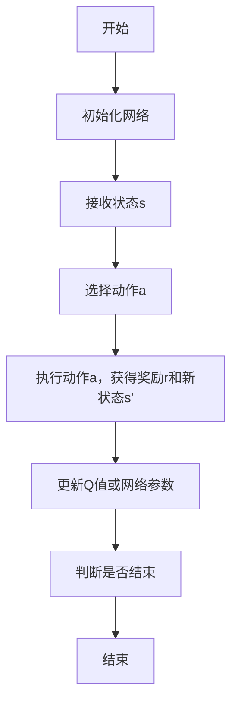
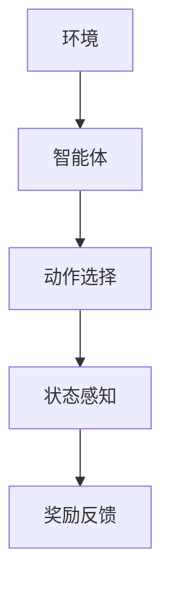
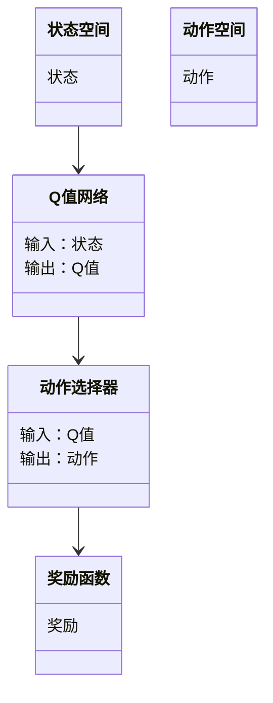
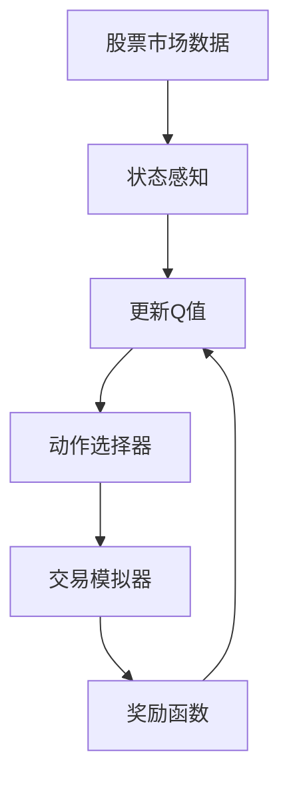
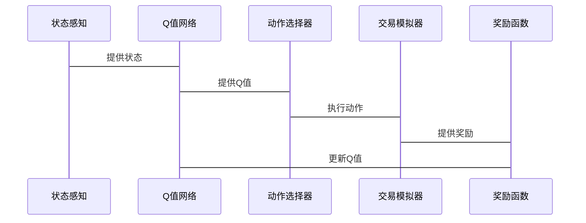

                 


# AI Agent的强化学习应用

## 关键词：AI Agent、强化学习、机器学习、Q-learning、DQN、数学模型、系统架构

## 摘要：本文将深入探讨AI Agent在强化学习中的应用，从基础概念到算法原理，再到系统架构设计，结合实际案例，全面解析AI Agent如何通过强化学习实现智能决策。

---

# 第一部分：AI Agent与强化学习概述

## 第1章：AI Agent与强化学习概述

### 1.1 AI Agent的基本概念

#### 1.1.1 AI Agent的定义与特点
AI Agent（人工智能代理）是指能够感知环境并采取行动以实现目标的智能体。AI Agent的特点包括：
- **自主性**：能够在没有外部干预的情况下独立运作。
- **反应性**：能够实时感知环境并做出反应。
- **目标导向**：通过目标驱动进行决策和行动。

#### 1.1.2 强化学习的基本概念
强化学习（Reinforcement Learning, RL）是一种机器学习范式，通过智能体与环境的交互，学习如何采取行动以最大化累积奖励。强化学习的核心要素包括：
- **状态（State）**：环境在某一时刻的表示。
- **动作（Action）**：智能体在某一状态下采取的行为。
- **奖励（Reward）**：智能体采取动作后获得的反馈，用于指导学习。

#### 1.1.3 AI Agent与强化学习的关系
AI Agent通过强化学习从环境中学习策略，以实现目标。强化学习为AI Agent提供了一种通过试错来优化决策的方法。

### 1.2 强化学习的核心原理

#### 1.2.1 状态、动作、奖励的定义
- **状态（State）**：智能体所处环境的描述，例如在迷宫中，智能体的位置。
- **动作（Action）**：智能体在某一状态下采取的行为，例如向左或向右移动。
- **奖励（Reward）**：智能体采取动作后获得的反馈，例如到达目标位置的奖励。

#### 1.2.2 Q-learning算法的基本原理
Q-learning是一种经典的强化学习算法，通过更新Q值表来学习最优策略。Q值表示在某一状态下采取某一动作的期望回报。

#### 1.2.3 策略与价值函数的定义
- **策略（Policy）**：决定智能体在某一状态下采取哪个动作的规则。
- **价值函数（Value Function）**：评估某状态下采取某个动作的长期回报。

### 1.3 AI Agent的应用场景

#### 1.3.1 游戏AI
在游戏AI中，强化学习被广泛应用于训练智能体在游戏中做出最优决策，例如在《英雄联盟》或《星际争霸》中。

#### 1.3.2 机器人控制
强化学习可以用于训练机器人在复杂环境中完成任务，例如自动驾驶汽车的路径规划。

#### 1.3.3 自动交易系统
在金融领域，强化学习可以用于训练智能交易系统，根据市场波动做出最优交易决策。

### 1.4 本章小结
本章介绍了AI Agent和强化学习的基本概念，解释了它们的关系，并通过实际应用场景展示了强化学习在AI Agent中的重要性。

---

# 第二部分：强化学习的数学模型与算法原理

## 第2章：强化学习的数学模型

### 2.1 状态空间与动作空间

#### 2.1.1 离散与连续状态空间的对比
- **离散状态空间**：状态是有限且可数的，例如在迷宫中，位置是离散的状态。
- **连续状态空间**：状态是无限且不可数的，例如在连续环境中，位置可以是任何实数。

#### 2.1.2 动作空间的定义与分类
- **离散动作空间**：动作是有限的，例如在游戏《超级马里奥》中，动作可以是左、右、上、下。
- **连续动作空间**：动作是连续的，例如在机器人控制中，动作可以是0到1之间的任何值。

### 2.2 Q-learning算法的数学推导

#### 2.2.1 Bellman方程的定义
Bellman方程描述了在马尔可夫决策过程中，最优价值函数的性质：
$$ V^*(s) = \max_{a} [r(s,a) + \gamma V^*(s')] $$
其中，\( V^*(s) \) 是状态 \( s \) 的最优价值函数，\( r(s,a) \) 是在状态 \( s \) 下采取动作 \( a \) 后获得的即时奖励，\( \gamma \) 是折扣因子，表示未来奖励的折扣率。

#### 2.2.2 Q-learning算法的更新公式
Q-learning算法通过更新Q值表来逼近最优策略：
$$ Q(s, a) = Q(s, a) + \alpha [r + \gamma \max Q(s', a') - Q(s, a)] $$
其中，\( \alpha \) 是学习率，\( r \) 是即时奖励，\( Q(s', a') \) 是下一状态的最大Q值。

### 2.3 Deep Q-Network (DQN) 的原理

#### 2.3.1 DQN的网络结构
DQN使用两个深度神经网络：主网络和目标网络。主网络负责选择动作，目标网络负责评估动作的价值。

#### 2.3.2 Experience Replay机制
Experience Replay是一种经验重放机制，通过随机抽取历史经验来训练网络，以减少样例之间的相关性，提高学习的稳定性。

#### 2.3.3 Target Network的作用
目标网络用于稳定学习过程，通过定期更新主网络的参数来提供一个稳定的基准。

### 2.4 算法流程图（Mermaid）



### 2.5 本章小结
本章详细介绍了Q-learning和DQN算法的数学模型和算法原理，并通过流程图展示了Q-learning算法的执行过程。

---

## 第3章：AI Agent的体系结构

### 3.1 基于模型的强化学习

#### 3.1.1 知识表示的定义
知识表示是AI Agent理解和表示环境信息的方式，例如使用马尔可夫决策过程（MDP）。

#### 3.1.2 状态转移模型的构建
状态转移模型描述了从当前状态到下一状态的概率分布，例如在马尔可夫决策过程中，状态转移概率 \( P(s' | s, a) \) 表示在状态 \( s \) 下采取动作 \( a \) 后转移到状态 \( s' \) 的概率。

#### 3.1.3 策略网络的设计
策略网络用于根据当前状态生成动作概率分布，例如使用全连接神经网络来预测动作。

### 3.2 基于无模型的强化学习

#### 3.2.1 动作选择策略
基于无模型的强化学习不需要环境的动态模型，直接根据经验更新策略，例如Q-learning算法。

#### 3.2.2 奖励函数的设计
奖励函数定义了智能体在采取动作后的反馈，例如在迷宫中找到出口的奖励为1，撞墙的惩罚为-1。

#### 3.2.3 探索与利用的平衡
在强化学习中，智能体需要在探索新动作和利用已知的最佳动作之间找到平衡，例如使用ε-greedy策略。

### 3.3 多智能体强化学习

#### 3.3.1 多智能体系统的定义
多智能体系统是指由多个智能体组成的系统，智能体之间可以协作或竞争以实现共同目标或个体目标。

#### 3.3.2 协作与竞争关系
在多智能体系统中，智能体之间可以协作（例如共同完成任务）或竞争（例如博弈）。

#### 3.3.3 联合策略的设计
联合策略是指多个智能体共同制定的策略，例如在机器人足球中，多个机器人需要协作完成进球。

### 3.4 系统架构图（Mermaid）



### 3.5 本章小结
本章介绍了AI Agent的体系结构，包括基于模型和无模型的强化学习，以及多智能体强化学习的相关概念。

---

## 第4章：系统分析与架构设计方案

### 4.1 问题场景介绍

#### 4.1.1 项目背景
假设我们正在开发一个智能投资顾问系统，该系统需要通过强化学习训练AI Agent在股票交易中做出最优决策。

#### 4.1.2 项目目标
通过强化学习训练AI Agent，使其能够在模拟股票交易环境中实现最大化的投资回报。

#### 4.1.3 系统边界与外延
系统边界包括股票市场数据接口、交易模拟器和强化学习训练模块。外延包括数据源和用户界面。

### 4.2 系统功能设计

#### 4.2.1 领域模型（Mermaid类图）


### 4.3 系统架构设计

#### 4.3.1 系统架构图（Mermaid架构图）


#### 4.3.2 系统接口设计
- **输入接口**：股票市场数据接口，提供实时或历史数据。
- **输出接口**：交易模拟器接口，执行智能体的交易决策。

#### 4.3.3 系统交互（Mermaid序列图）


### 4.4 本章小结
本章通过智能投资顾问系统的案例，详细介绍了系统分析与架构设计的过程，包括领域模型设计和系统架构设计。

---

# 第五部分：项目实战

## 第5章：AI Agent强化学习应用实战

### 5.1 项目介绍

#### 5.1.1 项目背景
我们开发一个智能投资顾问系统，使用强化学习训练AI Agent在股票交易中实现最大化的投资回报。

### 5.2 核心代码实现

#### 5.2.1 环境安装
首先安装必要的库：
```bash
pip install gym numpy tensorflow
```

#### 5.2.2 核心代码实现（Python）
```python
import gym
import numpy as np
import tensorflow as tf

# 定义环境
env = gym.make('StockTrading-v0')

# 定义Q值网络
class QNetwork:
    def __init__(self, state_space, action_space):
        self.model = tf.keras.Sequential([
            tf.keras.layers.Dense(64, activation='relu'),
            tf.keras.layers.Dense(64, activation='relu'),
            tf.keras.layers.Dense(action_space, activation='linear')
        ])
    
    def call(self, state):
        return self.model(state)
    
    def update(self, old_weights, new_weights):
        for i in range(len(self.model.layers)):
            self.model.layers[i].set_weights(old_weights[i])

# 初始化网络
state_space = env.observation_space.shape[0]
action_space = env.action_space.n
q_network = QNetwork(state_space, action_space)
target_network = QNetwork(state_space, action_space)

# 定义超参数
LEARNING_RATE = 0.001
GAMMA = 0.99
EPSILON = 0.1

# 定义Experience Replay缓冲区
class ExperienceBuffer:
    def __init__(self, buffer_size=1000):
        self.buffer = []
        self.buffer_size = buffer_size
    
    def add(self, experience):
        if len(self.buffer) < self.buffer_size:
            self.buffer.append(experience)
        else:
            self.buffer.pop(0)
    
    def sample(self, batch_size=32):
        indices = np.random.randint(0, len(self.buffer), batch_size)
        experiences = [self.buffer[i] for i in indices]
        return experiences

# 训练过程
experience_buffer = ExperienceBuffer()
optimizer = tf.keras.optimizers.Adam(LEARNING_RATE)

for episode in range(1000):
    state = env.reset()
    total_reward = 0
    done = False
    
    while not done:
        # 选择动作
        if np.random.random() < EPSILON:
            action = np.random.randint(0, action_space)
        else:
            state_tensor = tf.convert_to_tensor([state], dtype=tf.float32)
            q_values = q_network.call(state_tensor)
            action = tf.argmax(q_values, axis=1).numpy()[0]
        
        # 执行动作
        next_state, reward, done, _ = env.step(action)
        total_reward += reward
        
        # 学习
        experience = (state, action, reward, next_state, done)
        experience_buffer.add(experience)
        
        # 更新Q值网络
        batch = experience_buffer.sample()
        states = []
        actions = []
        rewards = []
        next_states = []
        dones = []
        
        for exp in batch:
            states.append(exp[0])
            actions.append(exp[1])
            rewards.append(exp[2])
            next_states.append(exp[3])
            dones.append(exp[4])
        
        states = tf.convert_to_tensor(states, dtype=tf.float32)
        next_states = tf.convert_to_tensor(next_states, dtype=tf.float32)
        
        q_values = q_network.call(states)
        next_q_values = target_network.call(next_states)
        max_next_q_values = tf.reduce_max(next_q_values, axis=1)
        
        target = rewards + (1 - dones) * GAMMA * max_next_q_values
        
        loss = tf.keras.losses.mean_squared_error(q_values, target)
        loss.backward()
        optimizer.minimize(loss, q_network.model.trainable_weights)
        
        # 更新目标网络
        q_network_weights = q_network.model.get_weights()
        target_network.update(q_network_weights)
    
    print(f"Episode {episode}, Total Reward: {total_reward}")
```

#### 5.2.3 代码解读与分析
- **QNetwork类**：定义Q值网络，包含两个全连接层，输出动作空间的Q值。
- **ExperienceBuffer类**：实现经验重放缓冲区，用于存储和采样经验。
- **训练过程**：包括环境重置、动作选择、执行动作、学习和更新网络。

### 5.3 项目小结
本章通过智能投资顾问系统的实战，展示了如何使用强化学习训练AI Agent，并通过代码实现了一个简单的股票交易系统。

---

# 第六部分：总结与展望

## 第6章：总结与展望

### 6.1 总结
本文详细介绍了AI Agent在强化学习中的应用，从基础概念到算法原理，再到系统架构设计，结合实际案例，全面解析了AI Agent如何通过强化学习实现智能决策。

### 6.2 展望
未来，AI Agent的强化学习应用将更加广泛，特别是在多智能体协作、复杂环境建模和实时决策等领域，仍有许多研究和应用的潜力。

---

# 附录

## 附录A：强化学习相关工具与框架

### A.1 环境搭建工具
- **OpenAI Gym**：强化学习环境库。
- **Unity ML-Agents**：用于多智能体强化学习的框架。

### A.2 深度学习框架
- **TensorFlow**：Google的深度学习框架。
- **PyTorch**：Facebook的深度学习框架。

## 附录B：参考文献

### B.1 经典论文
- Mnih, V., et al. "Human-level control through deep reinforcement learning." *Nature*, 2015.
- Silver, D., et al. "Mastering the game of Go with deep neural networks and tree search." *Nature*, 2016.

### B.2 经典书籍
- Sutton, R. S., & Barto, A. G. *Reinforcement learning: Theory and algorithms.* MIT Press, 2018.

---

# 结束语

感谢您的阅读！希望本文对您理解AI Agent的强化学习应用有所帮助。如果需要进一步探讨，欢迎随时联系！

