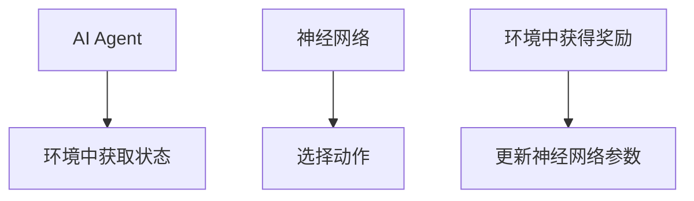

                 


# AI Agent的强化学习机制实现

## 关键词
- AI Agent
- 强化学习
- DQN算法
- 系统架构
- 项目实战

## 摘要
本文详细探讨了AI Agent的强化学习机制实现，从基本概念到算法原理，再到系统架构和项目实战，全面解析强化学习在AI Agent中的应用。通过实际案例分析，帮助读者理解如何设计和实现一个基于强化学习的AI Agent。

---

## 第一部分: AI Agent与强化学习机制概述

## 第1章: AI Agent与强化学习机制概述

### 1.1 AI Agent的基本概念
#### 1.1.1 AI Agent的定义与特点
AI Agent（智能体）是指能够感知环境并采取行动以实现目标的实体。AI Agent的特点包括自主性、反应性、目标导向性和社会性。

#### 1.1.2 强化学习的基本概念
强化学习是一种机器学习范式，通过智能体与环境的交互，学习采取最优行动以最大化累积奖励。强化学习的核心是通过试错机制优化策略。

#### 1.1.3 AI Agent与强化学习的关系
AI Agent通过强化学习机制与环境交互，学习最优策略以实现目标。强化学习为AI Agent提供了决策的框架和方法。

### 1.2 强化学习的背景与应用
#### 1.2.1 强化学习的发展历程
从简单的Q-learning到深度强化学习（DRL），强化学习经历了从浅层到深度的演变，广泛应用于游戏、机器人、自动驾驶等领域。

#### 1.2.2 强化学习在AI Agent中的应用
AI Agent通过强化学习在复杂环境中做出决策，如游戏AI、智能助手和自动驾驶等。

#### 1.2.3 强化学习的核心问题与挑战
强化学习的核心问题包括状态空间、动作空间和奖励设计。主要挑战是样本效率低、探索与利用的平衡以及复杂环境中的收敛性。

### 1.3 强化学习的基本原理
#### 1.3.1 状态、动作与奖励的定义
- **状态（State）**：智能体对环境的感知。
- **动作（Action）**：智能体采取的行动。
- **奖励（Reward）**：环境对智能体行动的反馈。

#### 1.3.2 基于模型与无模型强化学习的区别
- **基于模型**：智能体拥有环境的完整模型，如动态模型和奖励模型。
- **无模型**：智能体无法直接观察环境状态，只能通过试错学习。

#### 1.3.3 策略与价值函数的定义
- **策略（Policy）**：智能体在给定状态下选择动作的概率分布。
- **价值函数（Value Function）**：评估从当前状态开始采取某种策略的预期回报。

---

## 第二部分: 强化学习的核心概念与联系

## 第2章: 强化学习的核心概念

### 2.1 马尔可夫决策过程（MDP）
#### 2.1.1 MDP的定义与组成部分
MDP由状态空间、动作空间、转移概率、奖励函数和折扣因子组成。

#### 2.1.2 MDP中的状态、动作与奖励关系
状态转移由动作和环境决定，奖励是对智能体行为的反馈。

#### 2.1.3 MDP的分类与特点
MDP分为有限状态、无限状态、离散动作和连续动作空间等类型。

### 2.2 Q-learning算法
#### 2.2.1 Q-learning的基本原理
Q-learning通过Q表记录状态-动作对的期望奖励，逐步更新Q值以逼近最优策略。

#### 2.2.2 Q-learning的更新公式
$$ Q(s, a) \leftarrow Q(s, a) + \alpha [r + \gamma \max Q(s', a') - Q(s, a)] $$

#### 2.2.3 Q-learning的收敛性分析
Q-learning在离散状态空间中收敛到最优策略，但在连续空间中需要结合其他方法。

### 2.3 Deep Q-Networks（DQN）
#### 2.3.1 DQN的提出背景
为了解决Q-learning在连续状态和动作空间中的问题，DQN引入深度神经网络近似Q值函数。

#### 2.3.2 DQN的核心思想与改进
- 使用经验回放缓解样本偏差。
- 采用目标网络减少更新误差。

#### 2.3.3 DQN与Q-learning的区别
DQN通过神经网络近似Q值函数，解决高维状态空间的问题。

### 2.4 策略梯度

---

## 第三部分: 算法原理

## 第3章: DQN算法原理

### 3.1 DQN算法的数学模型
- 状态空间：$$ S \in \mathbb{R}^n $$
- 动作空间：$$ A \in \{1, 2, \dots, K\} $$
- 神经网络逼近Q值函数：$$ Q(s, a; \theta) $$

### 3.2 DQN算法的流程
1. 从经验回放中随机采样一批样本。
2. 计算目标Q值：$$ y = r + \gamma \max Q(s', a'; \theta^-) $$
3. 更新当前Q值网络：$$ \theta \leftarrow \theta + \alpha (y - Q(s, a; \theta)) $$

### 3.3 DQN算法的实现
```python
class DQNetwork:
    def __init__(self, input_dim, output_dim, hidden_dim=64):
        self.fc1 = nn.Linear(input_dim, hidden_dim)
        self.fc2 = nn.Linear(hidden_dim, output_dim)
    
    def forward(self, x):
        x = F.relu(self.fc1(x))
        x = self.fc2(x)
        return x

# 初始化网络
q_network = DQNetwork(state_dim, action_dim)
target_network = DQNetwork(state_dim, action_dim)
optimizer = torch.optim.Adam(q_network.parameters(), lr=0.001)
```

### 3.4 DQN算法的优缺点
- **优点**：适用于高维状态空间，经验回放减少样本偏差。
- **缺点**：训练不稳定，收敛速度慢。

---

## 第四部分: 系统分析与架构设计

## 第4章: 系统分析与架构设计

### 4.1 问题场景介绍
设计一个AI Agent在Flappy Bird游戏中通过强化学习学习飞行策略。

### 4.2 系统功能设计
- 状态感知：获取游戏屏幕信息。
- 动作选择：决定鸟儿是否跳跃。
- 奖励机制：奖励得分。

### 4.3 系统架构设计
使用Mermaid图展示系统的组件交互。



### 4.4 接口设计
- 输入接口：接收游戏屏幕信息。
- 输出接口：输出跳跃动作。

---

## 第五部分: 项目实战

## 第5章: 项目实战

### 5.1 环境安装
安装OpenAI Gym和其他相关库。

### 5.2 核心实现
实现DQN算法，训练AI Agent学习游戏策略。

### 5.3 案例分析
通过训练过程展示AI Agent如何逐步掌握游戏规则。

---

## 第六部分: 扩展与最佳实践

## 第6章: 扩展与最佳实践

### 6.1 研究热点
多智能体协作、分布式强化学习。

### 6.2 应用案例
自动驾驶、游戏AI、智能助手。

### 6.3 注意事项
训练效率、模型泛化能力、超参数调优。

---

## 第七章: 小结

本文全面讲解了AI Agent的强化学习机制，从基础概念到算法实现，再到实际应用，为读者提供了系统的知识框架。

