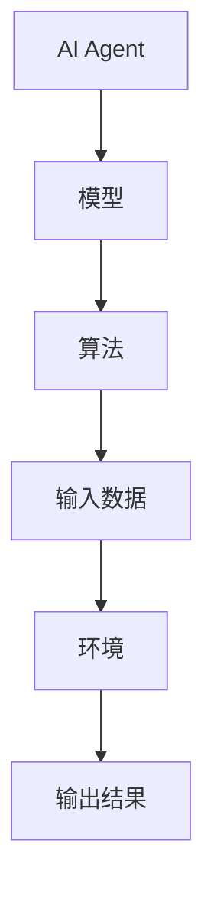
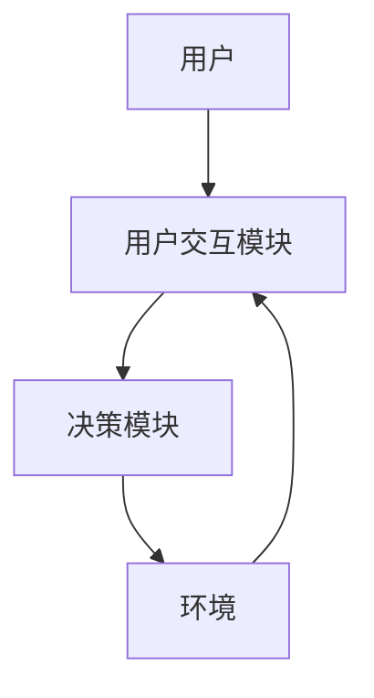
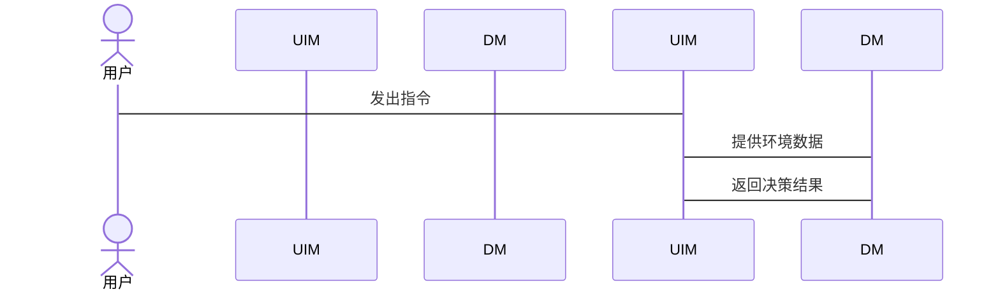

                 


# AI Agent的性能优化与效率提升策略

## 关键词：
AI Agent，性能优化，效率提升策略，算法优化，系统架构设计

## 摘要：
本文详细探讨了AI Agent的性能优化与效率提升策略。通过分析AI Agent的核心概念、算法原理、系统架构设计及实际项目案例，提出了多种优化方法，包括算法优化、数据优化和系统优化等。文章内容涵盖理论与实践，旨在为读者提供全面的优化策略，帮助他们在实际应用中提升AI Agent的性能和效率。

---

# 第一部分: AI Agent的性能优化与效率提升背景

## 第1章: AI Agent的定义与背景

### 1.1 AI Agent的基本概念
#### 1.1.1 什么是AI Agent
AI Agent（人工智能代理）是指能够感知环境、执行任务并做出决策的智能实体。它可以是一个软件程序、机器人或其他智能系统，通过与环境交互来实现特定目标。

#### 1.1.2 AI Agent的核心特点
- **自主性**：AI Agent能够在没有外部干预的情况下独立运行。
- **反应性**：能够实时感知环境变化并做出响应。
- **目标导向**：所有行为都以实现特定目标为导向。
- **学习能力**：通过经验或数据不断优化自身性能。

#### 1.1.3 AI Agent的应用场景
- **智能助手**：如Siri、Alexa等，帮助用户完成日常任务。
- **自动驾驶**：通过实时感知和决策实现无人驾驶。
- **推荐系统**：根据用户行为推荐个性化内容。
- **机器人控制**：用于工业自动化、物流配送等领域。

### 1.2 AI Agent的性能优化需求
#### 1.2.1 性能优化的必要性
AI Agent的性能决定了其任务完成效率和决策准确性。优化性能可以提高用户体验、减少资源消耗并降低成本。

#### 1.2.2 优化目标与关键指标
- **响应时间**：AI Agent对环境变化的反应速度。
- **准确率**：决策的正确性。
- **资源利用率**：计算资源的使用效率。
- **可扩展性**：系统能否处理更大的负载。

#### 1.2.3 优化的边界与外延
优化并非无限制，需要在性能、资源消耗和成本之间找到平衡点。优化的外延还包括安全性、可解释性和鲁棒性。

### 1.3 本章小结
本章介绍了AI Agent的基本概念、核心特点及应用场景，明确了性能优化的必要性及优化目标。

---

# 第二部分: AI Agent的核心概念与联系

## 第2章: AI Agent的核心概念与原理

### 2.1 AI Agent的模型结构
#### 2.1.1 模型的输入输出关系
AI Agent的输入通常包括环境状态、用户指令或传感器数据，输出则是决策、动作或反馈信息。

#### 2.1.2 模型的训练与推理过程
- **训练阶段**：通过大量数据训练模型，使其能够识别模式并做出预测。
- **推理阶段**：基于训练好的模型，对新的输入数据进行处理并生成输出。

#### 2.1.3 模型的可解释性
模型的可解释性是指模型决策过程的透明度。高可解释性的模型更容易被理解和信任。

### 2.2 AI Agent的算法原理
#### 2.2.1 常见的AI Agent算法
- **基于规则的算法**：通过预定义的规则进行决策，适用于简单任务。
- **基于机器学习的算法**：通过数据学习模式，适用于复杂任务。
- **基于强化学习的算法**：通过与环境互动，学习最优策略。

#### 2.2.2 算法的优缺点对比
| 算法类型       | 优点                           | 缺点                           |
|----------------|--------------------------------|--------------------------------|
| 基于规则       | 简单易懂，易于部署             | 需手动编写规则，难以应对复杂场景 |
| 基于机器学习     | 可处理复杂数据，泛化能力强       | 需大量数据，训练时间长           |
| 基于强化学习     | 能够通过试错优化策略           | 需大量交互，训练时间长           |

#### 2.2.3 算法的数学模型
以强化学习中的Q-learning算法为例，其目标函数为：
$$ Q(s, a) = r + \gamma \max Q(s', a') $$
其中，\( Q(s, a) \) 表示状态 \( s \) 下动作 \( a \) 的价值，\( r \) 是奖励，\( \gamma \) 是折扣因子，\( Q(s', a') \) 是下一个状态的最大价值。

### 2.3 AI Agent的优化策略
#### 2.3.1 算法层面的优化
- **优化算法选择**：选择适合任务的优化算法，如Adam优化器。
- **超参数调优**：通过调整学习率、批量大小等参数提升性能。

#### 2.3.2 数据层面的优化
- **数据增强**：增加训练数据的多样性，提高模型的泛化能力。
- **数据预处理**：对数据进行清洗和标准化，减少无效数据的影响。

#### 2.3.3 系统层面的优化
- **并行计算**：利用多核处理器或分布式计算加速训练过程。
- **缓存优化**：减少数据访问时间，提升I/O效率。

### 2.4 AI Agent的核心概念对比分析

#### 2.4.1 AI Agent与传统AI的区别
| 特性         | AI Agent                      | 传统AI                       |
|--------------|-------------------------------|-----------------------------|
| 自主性       | 高                           | 低                           |
| 交互能力     | 强，能实时与环境互动           | 弱，通常只能处理静态数据       |
| 适应性       | 强，能根据环境变化调整策略     | 弱，模型固定后难以更改         |

#### 2.4.2 不同AI Agent模型的对比
| 模型类型       | 优点                           | 缺点                           |
|----------------|--------------------------------|--------------------------------|
| 基于规则       | 易部署，开发周期短             | 难以应对复杂场景               |
| 基于机器学习     | 可处理复杂数据，效果好         | 需大量数据，训练时间长         |
| 基于强化学习     | 能通过试错优化策略             | 需大量交互，训练时间长         |

#### 2.4.3 核心概念的ER实体关系图


---

# 第三部分: AI Agent的算法原理与数学模型

## 第3章: AI Agent的核心算法原理

### 3.1 常见AI Agent算法介绍
#### 3.1.1 梯度下降算法
梯度下降是一种优化算法，用于最小化损失函数。其更新公式为：
$$ w_{new} = w - \eta \cdot \frac{\partial L}{\partial w} $$
其中，\( \eta \) 是学习率，\( \frac{\partial L}{\partial w} \) 是损失函数对权重 \( w \) 的偏导数。

#### 3.1.2 Adam优化算法
Adam结合了动量和自适应学习率的优点，其更新公式为：
$$ m_t = \beta_1 m_{t-1} + (1 - \beta_1) g_t $$
$$ v_t = \beta_2 v_{t-1} + (1 - \beta_2) g_t^2 $$
$$ \theta_{t} = \theta_{t-1} - \alpha \frac{m_t}{\sqrt{v_t + \epsilon}} $$
其中，\( m_t \) 和 \( v_t \) 分别是梯度的一阶矩和二阶矩估计，\( \alpha \) 是学习率，\( \epsilon \) 是防止除零的小量。

#### 3.1.3 其他优化算法
包括AdaGrad、RMSprop等，各有优缺点，适用于不同的场景。

### 3.2 算法的数学模型
以强化学习中的策略梯度算法为例，其目标函数为：
$$ J(\theta) = \mathbb{E}_{\tau \sim \pi_\theta} [\log \pi_\theta(a|s) Q(s, a)] $$
其中，\( \tau \) 是轨迹，\( \pi_\theta \) 是策略，\( Q(s, a) \) 是价值函数。

---

# 第四部分: AI Agent的系统架构设计与实现

## 第4章: AI Agent的系统架构设计

### 4.1 项目介绍
本项目旨在设计一个高效的AI Agent系统，用于智能助手的应用场景。

### 4.2 系统功能设计
- **用户交互模块**：接收用户的输入并解析需求。
- **环境感知模块**：通过传感器或API获取环境数据。
- **决策模块**：基于模型进行决策并生成输出。

### 4.3 系统架构设计


### 4.4 系统接口设计
- **输入接口**：接收用户的指令或传感器数据。
- **输出接口**：输出决策结果或反馈信息。

### 4.5 系统交互设计


---

## 第5章: AI Agent的项目实战

### 5.1 环境安装
安装Python、TensorFlow、Keras等必要的库。

### 5.2 核心实现代码
```python
import tensorflow as tf
from tensorflow.keras import layers

# 定义模型
model = tf.keras.Sequential([
    layers.Dense(64, activation='relu'),
    layers.Dense(1, activation='sigmoid')
])

# 定义损失函数和优化器
loss = tf.keras.losses.BinaryCrossentropy()
optimizer = tf.keras.optimizers.Adam(learning_rate=0.001)

# 编译模型
model.compile(optimizer=optimizer, loss=loss, metrics=['accuracy'])
```

### 5.3 案例分析与实现
通过训练一个分类模型，展示如何优化AI Agent的性能。

### 5.4 总结与经验教训
优化过程中需要注意数据质量、算法选择和系统设计的合理性。

---

## 第6章: AI Agent的优化策略与展望

### 6.1 优化策略
- **算法优化**：选择适合的优化算法，如Adam。
- **数据优化**：通过数据增强和清洗提升模型性能。
- **系统优化**：通过并行计算和缓存优化提升效率。

### 6.2 展望
未来的研究方向包括更高效的算法设计、更强大的模型架构以及更智能的决策机制。

---

## 第7章: 总结与注意事项

### 7.1 总结
本文详细探讨了AI Agent的性能优化与效率提升策略，从理论到实践，为读者提供了全面的优化方法。

### 7.2 注意事项
- **数据隐私**：在处理数据时需要注意隐私保护。
- **模型鲁棒性**：确保模型在异常情况下仍能正常运行。
- **可解释性**：提升模型的可解释性，便于调试和优化。

### 7.3 扩展阅读
推荐阅读《深度学习》、《强化学习入门》等书籍，深入了解AI Agent的理论基础。

---

通过以上结构，您可以根据实际需求补充具体内容，确保文章的完整性和深度。

