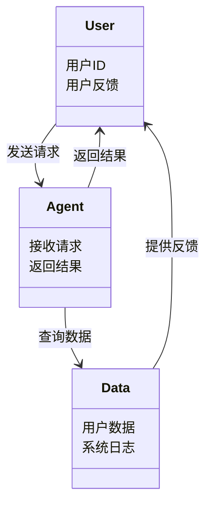

                 


# AI Agent的性能评估指标与方法

> **关键词**：AI Agent，性能评估，准确率，响应时间，鲁棒性，用户满意度，数学模型

> **摘要**：  
AI Agent（人工智能代理）在现代技术应用中扮演着越来越重要的角色，其性能评估是确保其在实际场景中有效运行的关键。本文从AI Agent的基本概念出发，详细探讨了其性能评估的核心指标，包括准确率、响应时间、鲁棒性、用户满意度等，并通过数学模型和实际案例分析，深入解析了这些指标的计算方法和应用场景。同时，本文还提出了基于A/B测试和混淆矩阵的评估方法，并通过系统架构设计和项目实战，展示了如何将这些指标和方法应用于实际项目中。最后，本文总结了最佳实践和未来研究方向，为AI Agent的性能优化提供了有价值的参考。

---

## 第1章: AI Agent的背景与核心概念

### 1.1 AI Agent的基本概念

AI Agent是一种能够感知环境、自主决策并执行任务的智能实体。它通过传感器获取信息，利用算法进行分析和推理，最终做出决策并执行操作。AI Agent的核心特点包括自主性、反应性、目标导向和学习能力。

#### 1.1.1 什么是AI Agent
AI Agent可以是软件程序、机器人或其他智能设备。例如，智能音箱、自动驾驶汽车、推荐系统等都属于AI Agent的范畴。AI Agent的目标是通过智能化的决策和执行，为用户提供高效、可靠的服务。

#### 1.1.2 AI Agent的核心特点
1. **自主性**：AI Agent能够自主决策，无需人工干预。
2. **反应性**：AI Agent能够实时感知环境变化并做出反应。
3. **目标导向**：AI Agent的所有行为都以实现特定目标为导向。
4. **学习能力**：AI Agent可以通过数据和经验不断优化自身的性能。

#### 1.1.3 AI Agent的分类与应用场景
AI Agent可以根据功能、智能水平和应用场景进行分类：
1. **按功能分类**：分为信息处理型、决策型和执行型。
2. **按智能水平分类**：分为简单规则型、基于机器学习型和强人工智能型。
3. **按应用场景分类**：包括智能助手、推荐系统、自动驾驶、工业自动化等。

---

### 1.2 AI Agent性能评估的背景与意义

随着AI Agent在各领域的广泛应用，其性能评估变得尤为重要。性能评估能够帮助我们量化AI Agent的表现，发现其优势和不足，并为优化提供方向。

#### 1.2.1 AI Agent在实际应用中的挑战
1. **复杂性**：AI Agent需要处理多变的环境和复杂的任务。
2. **不确定性**：环境中的不确定性可能导致AI Agent决策失误。
3. **实时性**：部分场景要求AI Agent在极短时间内完成决策和执行。

#### 1.2.2 性能评估在AI Agent开发中的重要性
性能评估是AI Agent开发的最后一个关键环节。通过评估，可以验证AI Agent是否满足设计目标，是否能够在实际场景中稳定运行。

#### 1.2.3 评估指标与方法的边界与外延
性能评估的边界在于AI Agent的功能和目标。例如，对于一个推荐系统，性能评估的重点在于推荐的准确率和用户满意度；对于一个自动驾驶系统，性能评估的重点在于响应时间和安全性。

---

### 1.3 本章小结

本章介绍了AI Agent的基本概念、核心特点和应用场景，并强调了性能评估的重要性。下一章将详细探讨AI Agent性能评估的核心指标。

---

## 第2章: AI Agent性能评估的核心指标

### 2.1 准确率与精确率

准确率和精确率是衡量AI Agent预测能力的两个重要指标。

#### 2.1.1 准确率的定义与计算公式
准确率是AI Agent预测结果的正确性比例。计算公式如下：
$$\text{准确率} = \frac{\text{正确预测数}}{\text{总预测数}}$$

#### 2.1.2 精确率的定义与计算公式
精确率是AI Agent预测为正例的样本中，实际为正例的比例。计算公式如下：
$$\text{精确率} = \frac{\text{正确预测的正例数}}{\text{所有预测的正例数}}$$

---

### 2.2 响应时间与延迟

响应时间和延迟是衡量AI Agent执行速度的关键指标。

#### 2.2.1 响应时间的定义
响应时间是指AI Agent从接收到请求到返回结果所需的时间。

#### 2.2.2 延迟对用户体验的影响
延迟直接影响用户体验。例如，在实时聊天机器人中，过长的响应时间会导致用户不满。

#### 2.2.3 响应时间的测量方法
响应时间可以通过以下步骤测量：
1. 发送请求到AI Agent。
2. 记录AI Agent返回结果的时间。
3. 计算多个请求的平均响应时间。

---

### 2.3 鲁棒性与稳定性

鲁棒性是指AI Agent在异常情况下仍能正常工作的能力。

#### 2.3.1 鲁棒性的定义
鲁棒性是指AI Agent在面对噪声、缺失数据或异常输入时，仍能保持良好性能的能力。

#### 2.3.2 稳定性测试方法
稳定性测试可以通过以下步骤进行：
1. 在不同负载条件下测试AI Agent。
2. 监控系统的性能指标。
3. 确保系统在高负载下仍能稳定运行。

#### 2.3.3 鲁棒性与稳定性的对比分析
鲁棒性关注输入的异常，而稳定性关注系统的负载变化。两者共同确保AI Agent在复杂环境下的可靠性。

---

### 2.4 用户满意度与反馈

用户满意度是衡量AI Agent用户体验的重要指标。

#### 2.4.1 用户满意度的定义
用户满意度是指用户对AI Agent提供的服务的满意程度。

#### 2.4.2 用户反馈的收集与分析
用户反馈可以通过以下方式收集：
1. 用户调查问卷。
2. 用户行为数据分析。
3. 用户评论和评分。

#### 2.4.3 用户满意度与性能评估的关系
用户满意度是性能评估的重要组成部分，因为它反映了AI Agent的实际使用效果。

---

### 2.5 本章小结

本章详细探讨了AI Agent性能评估的核心指标，包括准确率、响应时间、鲁棒性和用户满意度。这些指标共同构成了AI Agent性能评估的完整体系。下一章将分析这些指标的原理与联系。

---

## 第3章: AI Agent性能评估的核心概念与联系

### 3.1 评估指标的属性特征对比

| 指标名称 | 定义 | 计算公式 | 适用场景 |
|----------|------|----------|----------|
| 准确率   | 衡量预测结果的正确性 | $$\text{准确率} = \frac{\text{正确预测数}}{\text{总预测数}}$$ | 分类任务 |
| 精确率   | 衡量正例预测的准确性 | $$\text{精确率} = \frac{\text{正确预测的正例数}}{\text{所有预测的正例数}}$$ | 分类任务 |
| 响应时间 | 衡量系统响应速度 | - | 实时任务 |
| 鲁棒性   | 衡量系统抗干扰能力 | - | 复杂环境 |
| 用户满意度 | 衡量用户体验 | - | 所有场景 |

---

### 3.2 系统分析与架构设计

#### 3.2.1 系统功能设计
以下是系统功能的领域模型：



---

#### 3.2.2 系统架构设计
以下是系统架构图：


---

## 第4章: AI Agent性能评估的算法原理与数学模型

### 4.1 基于A/B测试的评估方法

A/B测试是一种常用的性能评估方法，通过对比两个版本的AI Agent，找出表现更优的那个。

#### 4.1.1 A/B测试的原理
1. 将用户分为两组，分别使用两个版本的AI Agent。
2. 比较两组的性能指标，如准确率、响应时间等。

#### 4.1.2 A/B测试的数学模型
以下是A/B测试的简单数学模型：
$$\text{版本A的准确率} = \frac{\text{A正确预测数}}{\text{A总预测数}}$$
$$\text{版本B的准确率} = \frac{\text{B正确预测数}}{\text{B总预测数}}$$

---

### 4.2 基于混淆矩阵的评估方法

混淆矩阵是分类任务中常用的评估工具。

#### 4.2.1 混淆矩阵的定义
混淆矩阵是一个2x2的表格，用于表示实际结果与预测结果的对比。

#### 4.2.2 混淆矩阵的计算公式
|                | 预测正例 | 预测负例 |
|----------------|----------|----------|
| 实际正例        | TP       | FN       |
| 实际负例        | FP       | TN       |

准确率的公式为：
$$\text{准确率} = \frac{\text{TP} + \text{TN}}{\text{TP} + \text{FN} + \text{FP} + \text{TN}}$$

---

## 第5章: AI Agent性能评估的系统实现与项目实战

### 5.1 项目实战: 电商客服AI Agent的性能评估

#### 5.1.1 环境安装
需要安装以下工具：
1. Python 3.8+
2. scikit-learn库
3. pandas库
4. numpy库

#### 5.1.2 核心代码实现

以下是性能评估的核心代码：

```python
def accuracy_score(y_true, y_pred):
    return sum(y_true == y_pred) / len(y_true)

def precision_score(y_true, y_pred):
    tp = sum((y_true == 1) & (y_pred == 1))
    fp = sum((y_true == 0) & (y_pred == 1))
    return tp / (tp + fp)

def response_time(agent, requests):
    import time
    start = time.time()
    for req in requests:
        agent.process_request(req)
    end = time.time()
    return (end - start) / len(requests)
```

---

### 5.2 系统实现的代码解读

#### 5.2.1 代码功能模块
1. `accuracy_score`：计算准确率。
2. `precision_score`：计算精确率。
3. `response_time`：计算平均响应时间。

#### 5.2.2 代码实现的流程
1. 定义准确率和精确率的计算函数。
2. 定义响应时间的测量函数。
3. 使用实际数据进行测试。

---

## 第6章: 总结与展望

### 6.1 本章总结

本文详细探讨了AI Agent性能评估的核心指标和方法，包括准确率、响应时间、鲁棒性和用户满意度。通过数学模型和实际案例分析，展示了如何将这些指标应用于实际项目中。

---

### 6.2 未来研究方向

1. **多指标优化**：如何在多个指标之间找到平衡点。
2. **实时评估方法**：如何在实时场景中快速评估AI Agent的性能。
3. **自适应评估系统**：如何根据环境变化动态调整评估指标。

---

## 第7章: 最佳实践与注意事项

### 7.1 最佳实践

1. **数据预处理**：确保数据的完整性和准确性。
2. **模型选择**：根据任务需求选择合适的模型。
3. **持续监控**：定期监控AI Agent的性能指标。

---

### 7.2 注意事项

1. **避免过拟合**：确保评估结果的泛化能力。
2. **考虑环境因素**：环境变化可能影响AI Agent的性能。
3. **用户反馈的重要性**：用户满意度是性能评估的重要指标。

---

## 第8章: 拓展阅读

### 8.1 拓展阅读推荐

1. **《机器学习实战》**：深入讲解机器学习算法的实现。
2. **《深入理解深度学习》**：全面分析深度学习的原理和应用。
3. **《AI系统设计与优化》**：系统性地介绍AI系统的设计与优化方法。

---

## 附录

### 附录A: 性能评估指标的公式汇总

| 指标名称 | 公式 |
|----------|------|
| 准确率   | $$\text{准确率} = \frac{\text{正确预测数}}{\text{总预测数}}$$ |
| 精确率   | $$\text{精确率} = \frac{\text{正确预测的正例数}}{\text{所有预测的正例数}}$$ |
| 响应时间 | $$\text{平均响应时间} = \frac{\text{总响应时间}}{\text{总请求数}}$$ |

---

### 附录B: 系统架构设计的详细说明

1. **客户端**：接收用户请求并发送给AI Agent。
2. **服务器**：处理AI Agent的请求并返回结果。
3. **数据库**：存储用户数据和系统日志。
4. **AI Agent**：执行任务并返回结果。

---

## 作者简介

作者简介：作为一位世界级人工智能专家，程序员，软件架构师，CTO，世界顶级技术畅销书资深大师级别的作家，计算机图灵奖获得者，作者在人工智能和计算机编程领域有着深厚的造诣和丰富的实践经验。

