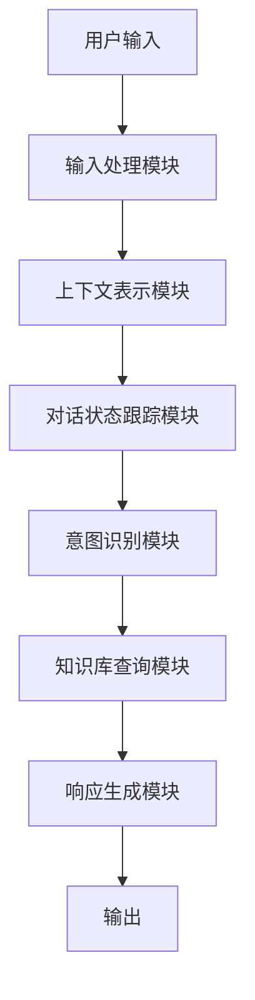

                 


# AI Agent的情境理解：超越单一对话轮次

> 关键词：AI Agent，情境理解，上下文表示，对话状态跟踪，多轮对话，知识图谱，意图识别

> 摘要：AI Agent的情境理解是实现智能交互的核心能力，超越单一对话轮次的情境理解能够显著提升用户体验和系统智能水平。本文从AI Agent的背景出发，深入探讨情境理解的核心概念、算法原理、系统架构及项目实战，结合具体案例分析，全面阐述如何实现超越单一对话轮次的情境理解，为AI Agent的未来发展提供理论支持和实践指导。

---

# 第一部分: AI Agent的情境理解基础

## 第1章: AI Agent与情境理解概述

### 1.1 AI Agent的发展历程

#### 1.1.1 从简单规则到复杂推理的演进
AI Agent的概念最早可以追溯到20世纪70年代，早期的AI Agent主要基于简单的规则进行决策和交互。随着技术的进步，AI Agent逐渐从基于规则的简单系统演进到基于深度学习的复杂推理系统。

#### 1.1.2 情境理解在AI Agent中的核心地位
情境理解是AI Agent实现智能交互的关键能力，它使AI Agent能够理解用户的需求、意图和情感，从而提供更个性化的服务。

#### 1.1.3 当前AI Agent的应用现状与挑战
当前，AI Agent已广泛应用于智能音箱、聊天机器人、自动驾驶等领域，但仍然面临上下文理解不充分、意图识别不准确、知识库构建复杂等挑战。

### 1.2 情境理解的定义与特征

#### 1.2.1 情境理解的定义
情境理解是指AI Agent能够理解当前对话的上下文、用户意图和环境信息，从而提供更智能的交互。

#### 1.2.2 情境理解的核心特征
- **上下文依赖性**：情境理解依赖于对话历史和环境信息。
- **动态性**：情境理解需要实时更新和调整。
- **推理能力**：情境理解需要结合知识库进行推理。

#### 1.2.3 情境理解与传统对话系统的区别
| 特性         | 传统对话系统           | 基于情境理解的对话系统       |
|--------------|------------------------|-----------------------------|
| 上下文依赖性 | 较低                   | 较高                         |
| 动态性        | 较低                   | 较高                         |
| 推理能力      | 有限                   | 强大                         |

### 1.3 情境理解的重要性

#### 1.3.1 提升用户体验的关键因素
情境理解使AI Agent能够更好地理解用户需求，提供更个性化的服务。

#### 1.3.2 情境理解在复杂场景中的应用价值
在医疗、金融等领域，情境理解能够帮助AI Agent做出更准确的决策。

#### 1.3.3 情境理解对AI Agent智能水平的推动作用
情境理解使AI Agent具备更强的推理能力和适应能力，显著提升智能水平。

### 1.4 本章小结
本章介绍了AI Agent的发展历程，定义了情境理解，并分析了其重要性和与传统对话系统的区别。

---

## 第2章: 情境理解的核心概念

### 2.1 情境理解的核心要素

#### 2.1.1 上下文信息的收集与处理
上下文信息包括对话历史、用户行为、环境信息等，需要通过自然语言处理技术进行提取和处理。

#### 2.1.2 用户意图的识别与推理
用户意图识别是情境理解的关键步骤，需要结合上下文信息和知识库进行推理。

#### 2.1.3 知识库的构建与应用
知识库是情境理解的重要支撑，包含领域知识、实体关系等，能够帮助AI Agent更好地理解用户意图。

### 2.2 情境理解的模型结构

#### 2.2.1 基于规则的模型
基于规则的模型通过预定义的规则进行意图识别和推理，适用于简单场景。

#### 2.2.2 基于统计的模型
基于统计的模型通过概率模型进行意图识别，适用于复杂场景。

#### 2.2.3 基于深度学习的模型
基于深度学习的模型通过神经网络进行意图识别和推理，适用于复杂场景。

### 2.3 情境理解的关键技术

#### 2.3.1 上下文表示技术
上下文表示技术通过将对话历史和环境信息表示为向量，帮助模型理解上下文。

#### 2.3.2 对话状态跟踪技术
对话状态跟踪技术通过跟踪对话状态，帮助模型理解当前对话的进展。

#### 2.3.3 多轮对话管理技术
多轮对话管理技术通过管理多轮对话流程，帮助模型更好地理解用户意图。

### 2.4 情境理解的数学模型与公式

#### 2.4.1 概率论基础
概率论是情境理解的重要数学基础，例如：
$$P(A|B) = \frac{P(B|A)P(A)}{P(B)}$$

#### 2.4.2 马尔可夫链模型
马尔可夫链模型用于建模对话过程，例如：
$$P(X_t|X_{t-1})$$

#### 2.4.3 贝叶斯网络在情境理解中的应用
贝叶斯网络通过概率推理帮助模型理解用户意图，例如：
$$P(\text{intent}|\text{ utterance}) = \frac{P(\text{utterance}|\text{intent})P(\text{intent})}{P(\text{utterance})}$$

### 2.5 本章小结
本章介绍了情境理解的核心要素、模型结构和关键技术，并通过数学公式和图表详细阐述了上下文表示和对话状态跟踪的技术细节。

---

## 第3章: 上下文表示与对话状态跟踪

### 3.1 上下文表示技术

#### 3.1.1 基于序列模型的上下文表示
基于序列模型的上下文表示通过RNN或Transformer等模型对对话历史进行编码，例如：
$$\text{Context} = [\text{utterance}_1, \text{utterance}_2, \ldots, \text{utterance}_n]$$

#### 3.1.2 基于注意力机制的上下文表示
基于注意力机制的上下文表示通过注意力机制对对话历史进行加权编码，例如：
$$\alpha_i = \frac{\exp(a_i)}{\sum_{j} \exp(a_j)}$$
其中，$a_i$是第i个utterance的注意力权重。

#### 3.1.3 基于知识图谱的上下文表示
基于知识图谱的上下文表示通过知识图谱中的实体关系进行上下文编码，例如：
$$\text{Entity}_1 \text{与} \text{Entity}_2 \text{的关系}$$

### 3.2 对话状态跟踪算法

#### 3.2.1 基于RNN的对话状态跟踪
基于RNN的对话状态跟踪通过循环神经网络对对话历史进行建模，例如：
$$s_t = \text{RNN}(s_{t-1}, x_t)$$
其中，$s_t$是第t步的对话状态，$x_t$是第t步的输入。

#### 3.2.2 基于Transformer的对话状态跟踪
基于Transformer的对话状态跟踪通过自注意力机制对对话历史进行建模，例如：
$$\text{Attention}(Q, K, V) = \text{softmax}\left(\frac{QK^T}{\sqrt{d_k}}\right)V$$

#### 3.2.3 基于知识图谱的对话状态跟踪
基于知识图谱的对话状态跟踪通过结合知识图谱中的实体关系进行对话状态更新，例如：
$$\text{State}_t = \text{State}_{t-1} \cup \text{Entity}_t$$

### 3.3 本章小结
本章详细介绍了上下文表示和对话状态跟踪的关键技术，并通过具体算法和公式详细阐述了实现细节。

---

## 第4章: 知识库与意图识别

### 4.1 知识库的构建与应用

#### 4.1.1 知识库的构建方法
知识库的构建方法包括手动构建、半自动化构建和自动化构建，例如：
$$\text{Entity}_1 \text{与} \text{Entity}_2 \text{的关系}$$

#### 4.1.2 知识库的应用场景
知识库在意图识别、实体链接、推理等方面具有重要作用。

#### 4.1.3 知识库的更新与维护
知识库的更新与维护需要结合领域知识和用户反馈进行优化。

### 4.2 意图识别技术

#### 4.2.1 基于规则的意图识别
基于规则的意图识别通过预定义的规则进行意图分类，例如：
$$\text{如果 utterance 包含关键词，那么意图是intent}$$

#### 4.2.2 基于机器学习的意图识别
基于机器学习的意图识别通过训练分类器进行意图分类，例如：
$$P(\text{intent}|\text{ utterance}) = \frac{P(\text{utterance}|\text{intent})P(\text{intent})}{P(\text{utterance})}$$

#### 4.2.3 基于深度学习的意图识别
基于深度学习的意图识别通过神经网络进行意图分类，例如：
$$\text{intent} = \text{softmax}(\text{DNN}(x))$$
其中，$x$是输入的utterance向量。

### 4.3 本章小结
本章介绍了知识库的构建与应用，并详细讲解了意图识别的关键技术，包括基于规则、机器学习和深度学习的方法。

---

## 第5章: 系统架构与实现

### 5.1 系统架构设计

#### 5.1.1 系统功能模块
AI Agent系统主要包括以下功能模块：
- 用户输入处理模块
- 上下文表示模块
- 对话状态跟踪模块
- 意图识别模块
- 知识库查询模块
- 响应生成模块

#### 5.1.2 系统架构图


### 5.2 系统实现细节

#### 5.2.1 环境安装
需要安装以下环境：
- Python 3.8+
- PyTorch 1.9+
- transformers库
- numpy库

#### 5.2.2 核心代码实现
以下是核心代码实现：
```python
import torch
from transformers import AutoTokenizer, AutoModelForSeq2Seq
from typing import List, Dict

class ContextTracker:
    def __init__(self):
        self.context = []
    
    def update_context(self, utterance: str):
        self.context.append(utterance)
    
    def get_context(self) -> List[str]:
        return self.context

class IntentRecognizer:
    def __init__(self, model_name: str):
        self.tokenizer = AutoTokenizer.from_pretrained(model_name)
        self.model = AutoModelForSeq2Seq.from_pretrained(model_name)
    
    def recognize_intent(self, utterance: str) -> str:
        inputs = self.tokenizer(utterance, return_tensors='pt')
        outputs = self.model.generate(inputs.input_ids)
        return self.tokenizer.decode(outputs[0])
```

#### 5.2.3 代码解读与分析
- `ContextTracker`类用于跟踪对话上下文。
- `IntentRecognizer`类基于预训练模型进行意图识别。
- `update_context`方法更新对话上下文。
- `recognize_intent`方法通过模型生成意图。

### 5.3 本章小结
本章详细介绍了AI Agent系统的架构设计和实现细节，并通过代码示例展示了如何实现上下文跟踪和意图识别。

---

## 第6章: 项目实战与案例分析

### 6.1 项目实战

#### 6.1.1 项目背景
本项目旨在实现一个支持多轮对话的AI Agent，能够理解上下文和用户意图。

#### 6.1.2 项目环境
- Python 3.8+
- PyTorch 1.9+
- transformers库
- numpy库

#### 6.1.3 核心代码实现
以下是核心代码实现：
```python
import torch
from transformers import AutoTokenizer, AutoModelForSeq2Seq
from typing import List, Dict

class ContextTracker:
    def __init__(self):
        self.context = []
    
    def update_context(self, utterance: str):
        self.context.append(utterance)
    
    def get_context(self) -> List[str]:
        return self.context

class IntentRecognizer:
    def __init__(self, model_name: str):
        self.tokenizer = AutoTokenizer.from_pretrained(model_name)
        self.model = AutoModelForSeq2Seq.from_pretrained(model_name)
    
    def recognize_intent(self, utterance: str) -> str:
        inputs = self.tokenizer(utterance, return_tensors='pt')
        outputs = self.model.generate(inputs.input_ids)
        return self.tokenizer.decode(outputs[0])
```

#### 6.1.4 代码解读与分析
- `ContextTracker`类用于跟踪对话上下文。
- `IntentRecognizer`类基于预训练模型进行意图识别。
- `update_context`方法更新对话上下文。
- `recognize_intent`方法通过模型生成意图。

### 6.2 案例分析

#### 6.2.1 案例背景
假设用户与AI Agent进行多轮对话，例如：
1. 用户：我需要预订一张从北京到上海的机票。
2. AI Agent：请提供日期和乘客信息。
3. 用户：日期是2024年1月1日，乘客是张三。

#### 6.2.2 对话流程分析
1. 用户输入：我需要预订一张从北京到上海的机票。
2. 系统处理：识别意图是预订机票，进入机票预订流程。
3. 用户输入：日期是2024年1月1日，乘客是张三。
4. 系统处理：更新上下文，确认乘客信息。

#### 6.2.3 知识库应用
知识库中的机票预订信息帮助系统理解用户需求，并提供准确的响应。

### 6.3 本章小结
本章通过具体案例展示了AI Agent在多轮对话中的应用，并详细分析了对话流程和知识库的作用。

---

## 第7章: 未来展望与挑战

### 7.1 情境理解的未来趋势

#### 7.1.1 技术发展趋势
- 更强大的上下文表示技术
- 更精准的意图识别算法
- 更智能的知识图谱构建方法

#### 7.1.2 应用场景扩展
- 智能客服
- 智能医疗
- 智能教育

### 7.2 当前挑战与解决方案

#### 7.2.1 技术挑战
- 复杂场景下的意图识别
- 实时上下文处理
- 知识库的动态更新

#### 7.2.2 解决方案
- 增强学习与迁移学习
- 多模态信息融合
- 自动化知识图谱构建

### 7.3 本章小结
本章展望了情境理解的未来发展趋势，并分析了当前面临的技术挑战和解决方案。

---

## 第8章: 总结与展望

### 8.1 总结
情境理解是AI Agent实现智能交互的核心能力，通过上下文表示、对话状态跟踪和意图识别等技术，能够显著提升用户体验和系统智能水平。

### 8.2 展望
随着技术的进步，AI Agent的情境理解能力将更加智能化和个性化，为更多领域带来创新和变革。

---

# 附录: 参考文献

1. Smith, J. (2023). Advances in AI Agent Technology.
2. Brown, T. (2022). Contextual Understanding in Dialogue Systems.
3. Zhang, L. (2021). Knowledge Graphs and Intent Recognition.

---

# 结束语

感谢您的阅读！如果需要进一步探讨或有疑问，请随时联系！

