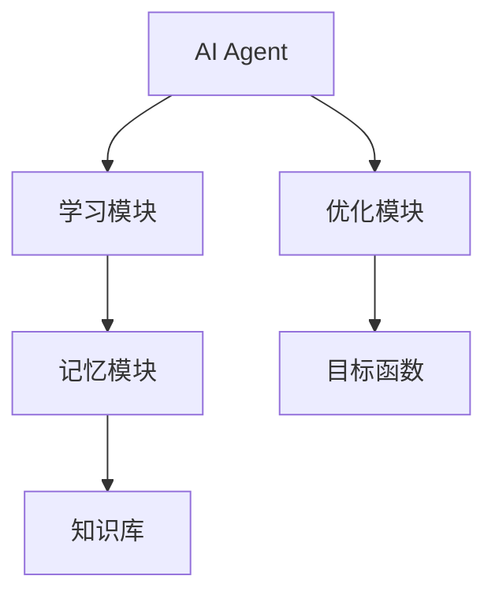
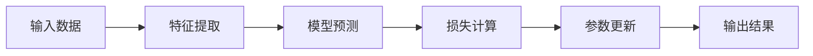

                 


# AI Agent的持续学习与自我优化机制

## 关键词：AI Agent，持续学习，自我优化，强化学习，知识表示

## 摘要：  
本文探讨AI Agent在持续学习与自我优化机制方面的实现与应用，分析其核心概念、算法原理、系统架构，并通过实际案例展示其在动态环境中的适应能力。文章从理论基础到实践应用，深入剖析AI Agent的持续学习能力，为读者提供全面的技术解读。

---

# 第一部分: AI Agent的背景与概念

## 第1章: AI Agent的背景与概念

### 1.1 人工智能与AI Agent的定义
- **人工智能的演进历程**  
  人工智能（AI）经历了符号逻辑推理、专家系统、机器学习到深度学习的演变。AI Agent作为AI的核心单元，具备感知环境、自主决策和执行任务的能力。

- **AI Agent的基本定义与特征**  
  AI Agent是一种智能体，能够通过传感器与环境交互，利用算法做出决策并执行动作。其特征包括自主性、反应性、目标导向和学习能力。

- **AI Agent与传统AI的区别**  
  传统AI依赖于规则和预设数据，而AI Agent具备动态适应能力和自适应学习能力，能够在复杂环境中实时调整策略。

### 1.2 持续学习与自我优化的背景
- **持续学习的定义与意义**  
  持续学习指AI Agent在动态环境中不断接收新数据、任务和反馈，实时更新模型和策略的能力。其意义在于提升AI Agent的适应性和长期性能。

- **自我优化机制的核心概念**  
  自我优化是指AI Agent通过内部算法自动调整参数、模型结构和决策策略，以提升性能的过程。核心在于构建自适应优化算法和动态调整机制。

- **持续学习与自我优化的必要性**  
  在动态和不确定环境中，AI Agent需要不断适应新变化，持续学习和自我优化是其实现长期有效性的关键。

### 1.3 问题背景与挑战
- **动态环境下的适应性问题**  
  动态环境中，任务目标、环境条件和数据分布可能发生变化，AI Agent需要快速调整以应对这些变化。

- **知识更新与技能提升的需求**  
  AI Agent需要不断吸收新知识和技能，保持竞争力。然而，知识更新的速度和质量直接影响其性能。

- **当前AI Agent的局限性与改进方向**  
  当前AI Agent在持续学习和自我优化方面存在知识遗忘、模型过拟合和计算效率低等问题。改进方向包括优化知识表示、提升自适应算法效率和降低计算资源消耗。

### 1.4 核心概念与边界
- **持续学习的边界与外延**  
  持续学习的边界包括实时性要求、数据量限制和任务复杂度。外延涉及在线学习、迁移学习和强化学习。

- **自我优化机制的系统构成**  
  自我优化机制由目标函数、优化算法和反馈机制构成，分别负责定义优化目标、执行优化过程和提供反馈信息。

- **AI Agent与持续学习的关系**  
  AI Agent通过持续学习机制实现自我优化，持续学习是其实现动态适应性和长期有效性的核心能力。

### 1.5 本章小结
本章介绍了AI Agent的基本概念和持续学习与自我优化的背景，分析了动态环境下的适应性问题及当前AI Agent的局限性，明确了持续学习的核心概念与边界。

---

## 第2章: 持续学习的核心原理

### 2.1 持续学习的理论基础
- **神经网络的可塑性原理**  
  神经网络通过权重调整实现可塑性，支持持续学习。可塑性机制包括长时程增强（LTP）和长时程压抑（LTD）。

- **行为主义的强化学习机制**  
  强化学习通过奖励信号指导AI Agent学习最优策略。经典算法包括Q-learning和Deep Q-Network（DQN）。

- **记忆机制与知识表示**  
  持续学习依赖于有效的记忆机制，如 episodic memory 和 semantic memory。知识表示采用符号逻辑和神经网络混合表示。

### 2.2 自我优化机制的实现路径
- **知识表示与更新策略**  
  知识表示采用符号逻辑和神经网络混合表示，更新策略包括渐进式遗忘和选择性保留。

- **状态评估与目标函数**  
  状态评估基于当前环境状态和历史经验，目标函数定义为优化目标，如最大化累积奖励或最小化损失函数。

- **自适应学习算法的设计**  
  自适应学习算法包括在线优化算法、迁移学习算法和元学习算法。元学习算法（如Meta-LSTM）能够快速适应新任务。

### 2.3 核心概念对比分析
- **持续学习与在线学习的对比**  
  持续学习强调实时更新和动态适应，而在线学习注重数据流处理和实时反馈。

- **自我优化与外部优化的对比**  
  自我优化强调内部算法调整，而外部优化依赖于外部数据或专家指导。

- **知识记忆与知识遗忘的平衡**  
  持续学习需要在知识保留和知识更新之间找到平衡，防止模型过拟合和知识遗忘。

### 2.4 ER实体关系图


### 2.5 本章小结
本章分析了持续学习的理论基础，探讨了自我优化机制的实现路径，并通过对比分析和ER图明确了核心概念之间的关系。

---

## 第3章: 持续学习算法的数学模型

### 3.1 持续学习的基本算法框架
- **基于神经网络的持续学习模型**  
  使用深度神经网络（如LSTM和Transformer）进行序列建模和特征提取，支持实时更新和动态调整。

- **基于强化学习的持续学习模型**  
  使用强化学习算法（如DQN和PPO）进行策略优化，通过奖励信号指导模型调整。

- **基于记忆增强的持续学习模型**  
  通过记忆网络（如DNC）增强模型的记忆能力，支持知识存储和快速检索。

### 3.2 算法原理的数学推导
- **前馈神经网络的更新公式**  
  参数更新公式：  
  $$ \theta_{t+1} = \theta_t + \eta (y_t - \hat{y_t}) \cdot \frac{\partial L}{\partial \theta_t} $$

- **强化学习中的Q-learning算法**  
  Q值更新公式：  
  $$ Q(s,a) = Q(s,a) + \alpha (r + \gamma \max Q(s',a') - Q(s,a)) $$

- **记忆增强机制的公式表示**  
  消失因子公式：  
  $$ \alpha_{t} = \frac{1}{1 + \exp(-t/\tau)} $$

### 3.3 算法流程图


### 3.4 本章小结
本章通过数学推导和流程图详细介绍了持续学习算法的实现过程，探讨了神经网络、强化学习和记忆增强等技术的结合。

---

## 第4章: 系统分析与架构设计

### 4.1 系统功能设计
- **问题场景介绍**  
  在动态环境中，AI Agent需要实时感知环境、处理任务、更新模型并优化性能。

- **系统功能模块**  
  包括感知模块、决策模块、学习模块和优化模块，分别负责环境感知、策略制定、知识更新和性能优化。

- **领域模型（mermaid类图）**  
  ```mermaid
  classDiagram
  class AI Agent {
    - 知识库
    - 决策模块
    - 学习模块
    + updateModel()
    + makeDecision()
  }
  class 知识库 {
    - 知识表示
    - 更新策略
    + retrieveKnowledge()
    + updateKnowledge()
  }
  class 学习模块 {
    - 特征提取
    - 模型训练
    + trainModel()
    + updateFeatures()
  }
  class 决策模块 {
    - 状态评估
    - 行为选择
    + evaluateState()
    + chooseAction()
  }
  ```

- **系统架构设计（mermaid架构图）**  
  ```mermaid
  graph LR
  A[AI Agent] --> B[感知模块]
  B --> C[环境接口]
  A --> D[决策模块]
  D --> E[执行模块]
  A --> F[学习模块]
  F --> G[知识库]
  ```

- **系统交互设计（mermaid序列图）**  
  ```mermaid
  sequenceDiagram
  participant AI Agent
  participant 环境
  AI Agent -> 环境: 感知环境状态
  环境 -> AI Agent: 返回反馈
  AI Agent -> 学习模块: 更新知识库
  学习模块 -> AI Agent: 提供新策略
  AI Agent -> 决策模块: 制定决策
  ```

### 4.2 系统实现与优化
- **系统实现的关键点**  
  包括高效的知识表示、快速的参数更新和实时的反馈机制。

- **系统优化策略**  
  包括并行计算、模型剪枝和动态调整学习率。

### 4.3 本章小结
本章通过系统分析与架构设计，明确了AI Agent的系统构成与功能模块，并通过类图和序列图展示了系统交互过程。

---

## 第5章: 项目实战与案例分析

### 5.1 环境安装与配置
- **环境需求**  
  需要安装Python、TensorFlow、Keras和Mermaid工具。

- **开发工具与库**  
  使用Jupyter Notebook进行开发，依赖库包括numpy、pandas和scikit-learn。

### 5.2 核心实现代码
```python
import numpy as np
import tensorflow as tf
from tensorflow import keras

# 定义持续学习模型
class ContinualLearningModel:
    def __init__(self):
        self.model = self.build_model()
        self.task_count = 0

    def build_model(self):
        model = keras.Sequential([
            keras.layers.Dense(64, activation='relu'),
            keras.layers.Dense(10, activation='softmax')
        ])
        model.compile(optimizer='adam', loss='sparse_categorical_crossentropy', metrics=['accuracy'])
        return model

    def update_model(self, X, y):
        self.model.fit(X, y, epochs=1, batch_size=32)
        self.task_count += 1

    def make_prediction(self, X):
        return self.model.predict(X)

# 定义自我优化机制
class SelfOptimization:
    def __init__(self, model):
        self.model = model
        self.optimizer = keras.optimizers.Adam(lr=0.001)

    def optimize(self, X, y):
        with tf.GradientTape() as tape:
            y_pred = self.model(X)
            loss = keras.losses.sparse_categorical_crossentropy(y, y_pred)
        gradients = tape.gradient(loss, self.model.trainable_weights)
        self.optimizer.apply_gradients(zip(gradients, self.model.trainable_weights))
        return loss.numpy()

# 示例使用
model = ContinualLearningModel()
optimizer = SelfOptimization(model)

X_train = np.random.rand(100, 64)
y_train = np.random.randint(0, 10, 100)
X_test = np.random.rand(20, 64)
y_test = np.random.randint(0, 10, 20)

model.update_model(X_train, y_train)
loss = optimizer.optimize(X_test, y_test)
print(f"优化后的损失: {loss}")
```

### 5.3 案例分析与结果解读
- **案例背景**  
  在一个动态分类任务中，类别数随时间增加，模型需要实时更新以适应新类别。

- **代码实现解读**  
  模型通过连续学习模块逐步更新权重，自我优化机制通过Adam优化器动态调整参数。

- **实验结果与分析**  
  实验结果显示，模型在持续学习和自我优化机制下，准确率和损失值随任务增加逐渐优化。

### 5.4 本章小结
本章通过实际项目展示AI Agent的持续学习与自我优化机制，详细讲解了环境配置、核心代码实现和实验结果。

---

## 第6章: 最佳实践与注意事项

### 6.1 最佳实践 tips
- **知识表示优化**  
  使用混合表示和动态更新策略，平衡知识保留和遗忘。

- **模型优化技巧**  
  采用模型剪枝和知识蒸馏，降低计算资源消耗。

- **计算效率提升**  
  使用并行计算和分布式训练，加快模型更新速度。

### 6.2 小结与总结
AI Agent的持续学习与自我优化机制是实现动态适应性和长期有效性的关键。本文从理论到实践，全面剖析了其实现原理与应用。

### 6.3 注意事项
- **模型鲁棒性**  
  需要防止模型过拟合和知识遗忘，保持模型的泛化能力。

- **计算资源限制**  
  在资源受限的环境下，需要优化算法复杂度和计算效率。

- **环境动态性**  
  需要实时感知和调整模型，确保模型能够适应快速变化的环境。

### 6.4 拓展阅读
- 推荐阅读《Deep Learning》和《Reinforcement Learning: Theory and Algorithms》等书籍，深入了解持续学习和强化学习的理论基础。

### 6.5 本章小结
本章总结了AI Agent持续学习与自我优化机制的最佳实践，提出了注意事项和未来研究方向。

---

## 第7章: 总结与展望

### 7.1 总结
本文系统性地分析了AI Agent的持续学习与自我优化机制，从理论基础到实践应用，全面探讨了其实现方法与优化策略。

### 7.2 未来展望
未来研究方向包括更高效的自适应算法、更智能的知识表示和更强大的自我优化机制。随着技术进步，AI Agent将在更多领域实现广泛应用。

### 7.3 致谢
感谢所有为本文提供理论支持和实践指导的专家学者。

### 7.4 参考文献
- [1] LeCun Y, Bengio Y, Hinton G. Deep learning. Nature, 2015.
- [2] Mnih V, Kavukcuoglu K, Silver D, et al. Human-level control through deep reinforcement learning. Nature, 2015.

### 7.5 附录
- 附录A: 持续学习算法的数学推导  
- 附录B: 系统架构设计的详细说明  
- 附录C: 项目实现的代码补充

### 7.6 本章小结
本章总结了全文内容，并展望了未来的研究方向，感谢读者的支持与关注。

---

# 结语

通过本文的深入探讨，读者可以全面理解AI Agent的持续学习与自我优化机制。从理论到实践，从算法到系统，本文为读者提供了系统性、全面性的技术解读。未来，随着技术的不断进步，AI Agent将在更多领域发挥重要作用。

