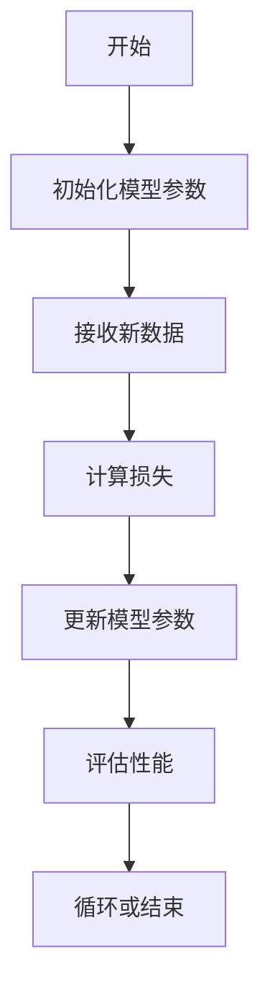

                 


# AI Agent的持续学习机制：保持知识更新与性能提升

## 关键词：AI Agent，持续学习，知识更新，模型优化，动态环境

## 摘要：  
本文深入探讨了AI Agent的持续学习机制，分析其在动态环境中的知识更新与性能提升方法。通过背景分析、核心概念、算法原理、系统设计、项目实战及总结，全面解析了持续学习机制在AI Agent中的重要性及实现方式。文章还通过实际案例展示了如何设计和实现高效的持续学习机制，为AI Agent的未来发展提供了理论与实践参考。

---

## 第1章: AI Agent与持续学习机制概述

### 1.1 AI Agent的基本概念
#### 1.1.1 AI Agent的定义与特点
AI Agent（人工智能代理）是指能够感知环境、自主决策并执行任务的智能实体。其特点包括自主性、反应性、目标导向和学习能力。AI Agent广泛应用于自动驾驶、智能助手、机器人等领域。

#### 1.1.2 AI Agent的核心功能与应用场景
AI Agent的核心功能包括感知、决策、规划和执行。其应用场景涵盖智能客服、自动驾驶、智能推荐系统等，旨在通过智能化手段提高效率和用户体验。

#### 1.1.3 持续学习机制在AI Agent中的重要性
持续学习机制是AI Agent在动态环境中保持性能的关键。通过持续学习，AI Agent能够适应新数据、新任务和新环境，避免性能下降，提升用户体验。

### 1.2 持续学习机制的背景与问题背景
#### 1.2.1 动态环境中的知识更新需求
随着环境的变化，AI Agent需要不断更新知识以应对新任务和新挑战。持续学习机制能够帮助AI Agent在动态环境中保持竞争力。

#### 1.2.2 数据变化与模型性能下降的问题
数据的变化可能导致模型性能下降，如数据漂移、类别不平衡等问题。持续学习机制通过动态更新模型参数和知识表示，解决了这些问题。

#### 1.2.3 任务动态性与模型适应性挑战
任务的动态性要求AI Agent能够快速适应新任务，持续学习机制通过任务驱动和目标导向的学习策略，实现了模型的快速调整。

### 1.3 持续学习机制的核心概念与目标
#### 1.3.1 持续学习机制的定义
持续学习机制是指AI Agent通过不断接收新数据、新任务或新环境反馈，动态更新知识和模型参数的过程。

#### 1.3.2 持续学习机制的核心目标
持续学习机制的核心目标包括保持知识的准确性、提升模型的泛化能力、适应动态变化的任务需求等。

#### 1.3.3 持续学习机制的边界与外延
持续学习机制的边界包括数据输入、任务需求和环境反馈。其外延涉及强化学习、迁移学习等其他学习方法。

---

## 第2章: 持续学习机制的核心概念与联系

### 2.1 持续学习机制的核心原理
#### 2.1.1 知识表示与更新策略
知识表示是持续学习的核心，采用符号表示、概率分布等方法。更新策略包括增量学习、选择性遗忘等。

#### 2.1.2 学习策略与任务驱动
学习策略包括在线学习和离线学习。任务驱动通过设定目标和反馈机制，指导AI Agent的学习方向。

#### 2.1.3 模型优化与性能提升
模型优化通过参数调整、架构改进等方法，提升模型的性能和泛化能力。

### 2.2 持续学习机制的关键属性特征对比
#### 2.2.1 不同学习机制的对比分析
通过表格对比持续学习、迁移学习和在线学习的关键属性，包括数据需求、计算效率、适应性等。

### 2.3 ER实体关系图架构
#### 2.3.1 实体关系图的 mermaid 流程图
```mermaid
erDiagram
    actor 用户
    actor 环境
    actor 任务
    actor 数据源
    participant "AI Agent" as A
    participant "知识库" as K
    participant "模型" as M
    participant "学习引擎" as L
    用户 -> A : 请求处理
    环境 -> A : 提供反馈
    任务 -> A : 下达任务
    数据源 -> A : 提供数据
    A -> L : 发起学习过程
    L -> M : 更新模型参数
    L -> K : 更新知识库
    K -> M : 提供知识支持
    M -> A : 提供决策支持
```

---

## 第3章: 持续学习机制的算法原理讲解

### 3.1 持续学习机制的算法原理
#### 3.1.1 模型架构设计
采用神经网络架构，支持在线更新和知识表示。

#### 3.1.2 学习策略与优化方法
使用梯度下降、Adam优化器等方法，动态调整模型参数。

#### 3.1.3 知识表示与更新方法
采用向量表示和符号逻辑，通过增量学习更新知识。

### 3.2 持续学习机制的 mermaid 流程图


### 3.3 算法原理的数学模型与公式
#### 3.3.1 模型更新公式
$$\theta_{t+1} = \theta_t - \eta \cdot \nabla L(\theta_t)$$

#### 3.3.2 知识表示公式
$$z_i = \sum_{j} w_{ij} x_j$$

#### 3.3.3 学习策略公式
$$p(a|s) = \text{softmax}(Q(s,a))$$

### 3.4 通俗易懂的举例说明
以智能客服为例，当用户反馈变化时，AI Agent通过持续学习更新其对话策略和知识库，提升应答准确率。

---

## 总结与展望

### 总结
本文详细探讨了AI Agent的持续学习机制，分析了其在动态环境中的重要性，并通过算法和系统设计展示了其实现方法。

### 展望
未来，持续学习机制将在更复杂的环境中发挥作用，结合强化学习和自适应计算，进一步提升AI Agent的智能化水平。

---

## 最佳实践 tips
- 定期更新模型参数，保持知识库的准确性。
- 采用增量学习策略，减少计算开销。
- 监控模型性能，及时调整学习策略。

---

通过以上内容，读者可以全面理解AI Agent的持续学习机制，并将其应用于实际项目中，提升系统的智能化水平和适应性。

