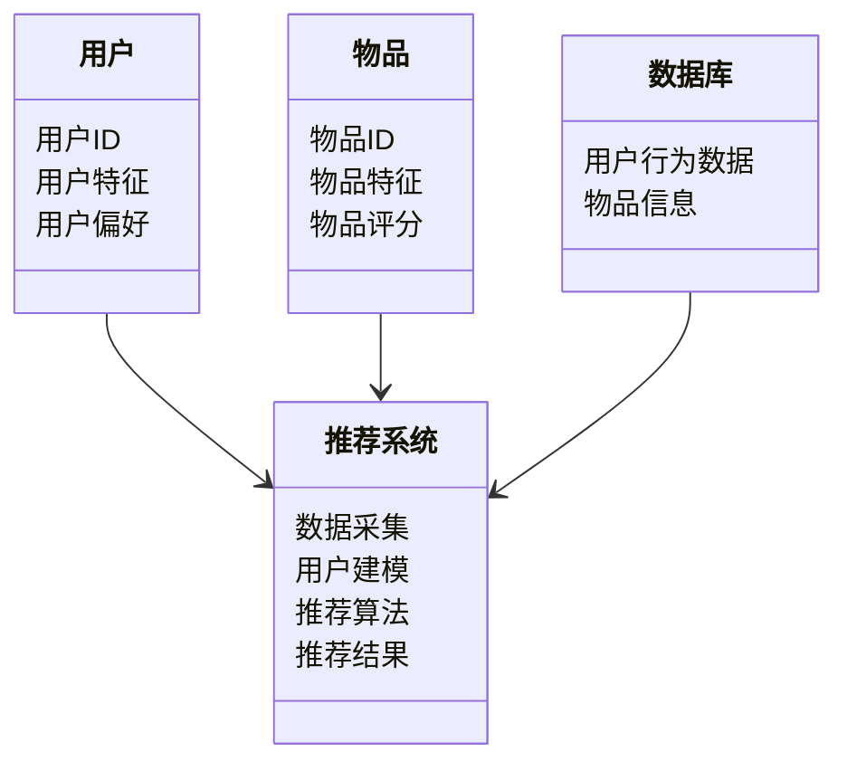

                 


# AI Agent的推荐系统：个性化内容推送

## 关键词
- AI Agent
- 推荐系统
- 个性化内容推送
- 协同过滤
- 深度学习
- 系统架构

## 摘要
本文深入探讨了AI Agent在推荐系统中的应用，特别是个性化内容推送的实现。从基础概念到高级算法，结合实际案例分析，详细讲解了协同过滤、基于内容的推荐以及深度学习在推荐系统中的应用。通过系统架构设计和项目实战，展示了如何构建高效、个性化的推荐系统。

---

## 第一部分: AI Agent与推荐系统基础

## 第1章: 推荐系统的概念与发展

### 1.1 推荐系统的概念

#### 1.1.1 推荐系统的定义
推荐系统是一种信息过滤技术，旨在通过分析用户的行为和偏好，向用户推荐相关的内容或产品。其核心目标是提升用户体验，提高用户满意度和产品粘性。

#### 1.1.2 推荐系统的分类
推荐系统主要分为基于协同过滤、基于内容的推荐、基于知识的推荐以及混合推荐四种类型。其中，协同过滤和基于内容的推荐是最常见的两类。

#### 1.1.3 推荐系统的应用场景
推荐系统广泛应用于电子商务、社交媒体、视频平台、音乐流媒体等多个领域。例如，Netflix使用推荐系统为用户提供个性化电影推荐，Spotify则通过推荐系统生成个性化的音乐播放列表。

---

### 1.2 AI Agent在推荐系统中的作用

#### 1.2.1 AI Agent的基本概念
AI Agent是一种智能代理，能够感知环境并执行任务以实现目标。在推荐系统中，AI Agent负责收集用户数据、分析用户偏好并生成推荐结果。

#### 1.2.2 AI Agent在推荐系统中的应用
AI Agent可以用于实时推荐、个性化定制以及动态调整推荐策略。例如，在电商平台上，AI Agent可以根据用户的浏览和购买历史实时推荐相关产品。

#### 1.2.3 AI Agent的优势与挑战
优势：提高推荐的准确性和实时性，增强用户体验。挑战：数据隐私问题、计算资源消耗以及模型的可解释性。

---

## 第2章: 推荐系统的核心概念

### 2.1 协同过滤推荐

#### 2.1.1 基于用户的协同过滤
基于用户的协同过滤是通过分析用户的行为和偏好，找到与目标用户相似的用户群体，并推荐这些用户喜欢的内容。例如，在Netflix中，如果用户A和用户B的观看历史相似，则推荐用户B喜欢的电影给用户A。

#### 2.1.2 基于物品的协同过滤
基于物品的协同过滤是通过分析物品之间的相似性，找到与目标用户已感兴趣物品相似的其他物品进行推荐。例如，在音乐流媒体平台上，如果用户喜欢歌曲A，系统会推荐与歌曲A相似的其他歌曲。

#### 2.1.3 协同过滤的优缺点
优点：简单易实现，推荐结果与用户兴趣高度相关。缺点：数据稀疏性问题，计算复杂度高。

---

### 2.2 基于内容的推荐

#### 2.2.1 基于内容的推荐原理
基于内容的推荐是通过分析物品的属性特征，找到与用户兴趣匹配的物品进行推荐。例如，在新闻推荐系统中，系统会分析文章的主题、关键词和标签，推荐与用户阅读历史相关的文章。

#### 2.2.2 内容特征的提取方法
内容特征提取方法包括文本挖掘、主题建模和关键词提取等。例如，使用TF-IDF算法提取文本关键词，或使用LDA模型进行主题建模。

#### 2.2.3 基于内容的推荐优缺点
优点：推荐结果与用户兴趣高度相关，计算效率高。缺点：难以捕捉用户的隐含兴趣，推荐结果可能过于单一。

---

### 2.3 混合推荐

#### 2.3.1 混合推荐的定义
混合推荐是将协同过滤和基于内容的推荐相结合，利用两者的优势互补，提升推荐系统的准确性和多样性。

#### 2.3.2 协同过滤与内容推荐的结合
例如，在电影推荐系统中，系统可以结合用户的历史观看记录和电影的 genre、导演、演员等信息，推荐既符合用户观看习惯又具有相似内容特征的电影。

#### 2.3.3 混合推荐的优势
混合推荐能够同时利用用户行为数据和物品属性特征，推荐结果更加准确和多样化。

---

## 第3章: 推荐系统的算法原理

### 3.1 协同过滤算法

#### 3.1.1 基于用户的协同过滤算法
基于用户的协同过滤算法可以通过以下步骤实现：

1. **数据预处理**：收集用户行为数据，构建用户-物品评分矩阵。
2. **计算相似度**：使用余弦相似度或皮尔逊相关系数计算用户之间的相似度。
3. **生成推荐**：基于相似用户的评分，预测目标用户的评分，推荐评分高的物品。

例如，假设用户A和用户B的相似度为0.8，用户B对电影X的评分为5，而用户A对电影X的评分为未评分，则推荐电影X给用户A的概率较高。

#### 3.1.2 基于物品的协同过滤算法
基于物品的协同过滤算法的步骤如下：

1. **数据预处理**：收集用户行为数据，构建用户-物品评分矩阵。
2. **计算相似度**：使用余弦相似度或皮尔逊相关系数计算物品之间的相似度。
3. **生成推荐**：基于目标用户已评分的物品，推荐与其相似的其他物品。

例如，如果用户A喜欢电影X，系统会推荐与电影X相似的电影Y给用户A。

#### 3.1.3 协同过滤的数学模型
协同过滤的数学模型可以通过以下公式表示：

$$
相似度 = \frac{\sum_{i=1}^n (r_{u_i} - \bar{r_u})(r_{u_j} - \bar{r_u})}{\sqrt{\sum_{i=1}^n (r_{u_i} - \bar{r_u})^2} \sqrt{\sum_{i=1}^n (r_{u_j} - \bar{r_u})^2}}
$$

其中，$r_{u_i}$表示用户u对物品i的评分，$\bar{r_u}$表示用户u的平均评分。

---

### 3.2 基于内容的推荐算法

#### 3.2.1 基于内容的相似度计算
基于内容的推荐算法可以通过以下步骤实现：

1. **提取特征**：对物品进行特征提取，例如文本中的关键词、图片的特征向量等。
2. **计算相似度**：使用余弦相似度或欧氏距离计算物品之间的相似度。
3. **生成推荐**：基于目标用户的兴趣特征，推荐相似度高的物品。

例如，在新闻推荐系统中，系统会分析文章的主题、关键词和标签，推荐与用户阅读历史相关的文章。

#### 3.2.2 基于内容的推荐模型
基于内容的推荐模型可以通过以下公式表示：

$$
相似度 = \frac{\sum_{i=1}^n w_i \cdot (f_{u_i} \cdot f_{v_i})}{\sqrt{\sum_{i=1}^n w_i^2 (f_{u_i})^2} \sqrt{\sum_{i=1}^n w_i^2 (f_{v_i})^2}}
$$

其中，$w_i$表示特征i的重要性权重，$f_{u_i}$表示目标物品i的特征值，$f_{v_i}$表示候选物品i的特征值。

#### 3.2.3 内容推荐的数学模型
内容推荐的数学模型可以通过以下公式表示：

$$
p(u, v) = \sum_{i=1}^n w_i \cdot s(f_u, f_v)
$$

其中，$p(u, v)$表示用户u对物品v的兴趣概率，$s(f_u, f_v)$表示基于内容的相似度得分。

---

### 3.3 深度学习在推荐系统中的应用

#### 3.3.1 基于神经网络的推荐模型
基于神经网络的推荐模型可以通过以下步骤实现：

1. **特征提取**：对用户和物品的特征进行深度学习模型提取，例如使用卷积神经网络（CNN）或循环神经网络（RNN）提取文本、图像等的特征。
2. **模型训练**：使用用户行为数据，训练深度学习模型，预测用户对物品的评分或点击概率。
3. **生成推荐**：基于模型预测结果，生成个性化推荐列表。

例如，在视频推荐系统中，系统可以使用深度学习模型提取视频的特征，结合用户的观看历史和评分数据，生成个性化推荐列表。

#### 3.3.2 深度学习推荐算法的优缺点
优点：能够捕捉复杂的用户行为模式和物品特征，推荐结果更加准确和多样化。缺点：计算资源消耗高，模型训练复杂，需要大量数据支持。

---

## 第4章: 推荐系统的数学模型与公式

### 4.1 协同过滤的数学模型

#### 4.1.1 基于用户的协同过滤公式
协同过滤的数学模型可以通过以下公式表示：

$$
\hat{r}_{u,i} = \bar{r_u} + \sum_{v \in N(u)} w_{u,v} (r_{v,i} - \bar{r_v})
$$

其中，$\hat{r}_{u,i}$表示用户u对物品i的预测评分，$\bar{r_u}$表示用户u的平均评分，$N(u)$表示与用户u相似的用户集合，$w_{u,v}$表示用户u和用户v的相似度权重，$r_{v,i}$表示用户v对物品i的评分，$\bar{r_v}$表示用户v的平均评分。

---

### 4.2 基于内容的推荐数学模型

#### 4.2.1 基于内容的推荐公式
基于内容的推荐数学模型可以通过以下公式表示：

$$
p(u, i) = \sum_{k=1}^n w_k \cdot f_k(u) \cdot f_k(i)
$$

其中，$p(u, i)$表示用户u对物品i的兴趣概率，$w_k$表示特征k的重要性权重，$f_k(u)$表示用户u的特征k的值，$f_k(i)$表示物品i的特征k的值。

---

### 4.3 深度学习推荐数学模型

#### 4.3.1 基于神经网络的推荐公式
深度学习推荐数学模型可以通过以下公式表示：

$$
p(u, i) = \sigma(W_u u + W_i i + b)
$$

其中，$u$表示用户u的特征向量，$i$表示物品i的特征向量，$W_u$和$W_i$表示权重矩阵，$b$表示偏置项，$\sigma$表示sigmoid函数。

---

## 第5章: 系统架构与设计

### 5.1 问题场景介绍
推荐系统需要解决的问题包括数据收集、用户建模、推荐算法设计以及推荐结果的实时性等问题。

### 5.2 系统功能设计

#### 5.2.1 系统功能模块
- 数据采集模块：负责收集用户行为数据，如点击、浏览、评分等。
- 用户建模模块：负责构建用户画像，提取用户特征。
- 推荐算法模块：负责基于用户特征和物品特征，生成推荐结果。
- 推荐结果展示模块：负责将推荐结果呈现给用户。

#### 5.2.2 系统功能设计的领域模型
以下是推荐系统的领域模型：



---

### 5.3 系统架构设计

#### 5.3.1 系统架构设计
以下是推荐系统的架构设计：

```mermaid
--- architecture
推荐系统架构 {
    前端：负责用户交互和展示推荐结果
    后端：负责处理用户请求、运行推荐算法
    数据库：存储用户行为数据和物品信息
}
```

---

### 5.4 系统接口设计

#### 5.4.1 系统接口设计
以下是推荐系统的接口设计：

```mermaid
--- sequence
用户 --> 推荐系统：发送推荐请求
推荐系统 --> 数据库：查询用户历史行为
数据库 --> 推荐系统：返回用户历史行为数据
推荐系统 --> 推荐算法：运行推荐算法
推荐算法 --> 推荐系统：返回推荐结果
推荐系统 --> 用户：展示推荐结果
```

---

### 5.5 系统交互设计

#### 5.5.1 系统交互设计
以下是推荐系统的交互设计：

```mermaid
--- sequence
用户 --> 推荐系统：选择推荐类型（协同过滤或基于内容的推荐）
推荐系统 --> 数据采集模块：收集用户行为数据
数据采集模块 --> 数据库：存储用户行为数据
推荐系统 --> 推荐算法模块：运行推荐算法
推荐算法模块 --> 推荐系统：返回推荐结果
推荐系统 --> 用户：展示推荐结果
```

---

## 第6章: 项目实战

### 6.1 环境搭建

#### 6.1.1 环境要求
- Python 3.6+
- Scikit-learn
- Pandas
- NumPy
- TensorFlow

#### 6.1.2 安装依赖
```bash
pip install scikit-learn pandas numpy tensorflow
```

---

### 6.2 系统核心实现源代码

#### 6.2.1 数据预处理
```python
import pandas as pd
import numpy as np

# 读取数据
data = pd.read_csv('user_ratings.csv')

# 填充缺失值
data.fillna(0, inplace=True)

# 转换为评分矩阵
ratings = data.pivot_table(index='user_id', columns='item_id', values='rating')
```

#### 6.2.2 协同过滤算法实现
```python
from sklearn.metrics.pairwise import cosine_similarity

# 计算相似度矩阵
similarity_matrix = cosine_similarity(ratings.values)

# 定义推荐函数
def recommend(user_id, similarity_matrix, ratings, top_n=5):
    user_index = user_id - 1  # 转换为0-based索引
    similar_users = np.argsort(similarity_matrix[user_index])[::-1][:top_n]
    recommended_items = []
    for user in similar_users:
        recommended_items.extend(ratings.columns[ ratings.iloc[user] > 0 ])
    return recommended_items
```

#### 6.2.3 基于内容的推荐算法实现
```python
from sklearn.feature_extraction.text import TfidfVectorizer

# 提取物品特征
vectorizer = TfidfVectorizer()
item_features = vectorizer.fit_transform(items)

# 计算相似度
similarity = item_features * item_features.T

# 定义推荐函数
def content_based_recommend(user_profile, similarity_matrix, top_n=5):
    user_vector = vectorizer.transform([user_profile])
    similar_items = np.argsort(similarity[user_vector])[::-1][:top_n]
    recommended_items = items[recommended_items]
    return recommended_items
```

#### 6.2.4 深度学习推荐算法实现
```python
import tensorflow as tf
from tensorflow.keras import layers

# 定义模型
model = tf.keras.Sequential()
model.add(layers.Dense(64, activation='relu'))
model.add(layers.Dense(1, activation='sigmoid'))

# 编译模型
model.compile(optimizer='adam', loss='binary_crossentropy', metrics=['accuracy'])

# 训练模型
model.fit(x_train, y_train, epochs=10, batch_size=32)
```

---

### 6.3 代码应用解读与分析

#### 6.3.1 数据预处理代码解读
上述代码首先读取数据并填充缺失值，然后将数据转换为评分矩阵，以便后续处理。

#### 6.3.2 协同过滤算法实现解读
协同过滤算法通过计算用户之间的相似度，找到与目标用户相似的用户，推荐这些用户喜欢的物品。

#### 6.3.3 基于内容的推荐算法实现解读
基于内容的推荐算法通过提取物品的特征，计算物品之间的相似度，推荐与目标用户兴趣匹配的物品。

#### 6.3.4 深度学习推荐算法实现解读
深度学习推荐算法通过神经网络模型提取用户和物品的特征，预测用户对物品的评分或点击概率，生成推荐结果。

---

## 第7章: 总结与展望

### 7.1 总结
本文详细介绍了AI Agent在推荐系统中的应用，从协同过滤到基于内容的推荐，再到深度学习的应用，展示了推荐系统的多样性和复杂性。通过系统架构设计和项目实战，进一步加深了对推荐系统的理解和应用。

### 7.2 未来展望
未来，推荐系统将更加智能化和个性化，深度学习和强化学习的应用将更加广泛。同时，推荐系统的可解释性和实时性也将成为研究的重要方向。

---

## 第8章: 最佳实践与注意事项

### 8.1 最佳实践
- 数据预处理：确保数据质量，处理缺失值和异常值。
- 模型选择：根据具体场景选择合适的推荐算法。
- 模型优化：通过交叉验证和超参数调优提升模型性能。

### 8.2 注意事项
- 数据隐私：保护用户数据隐私，遵守相关法律法规。
- 计算资源：深度学习推荐算法需要大量的计算资源，需合理配置硬件资源。
- 模型可解释性：推荐系统的可解释性对于用户体验和模型优化至关重要。

---

## 第9章: 拓展阅读

### 9.1 推荐系统相关书籍
- 《推荐系统实践》
- 《深度学习推荐系统》
- 《协同过滤与推荐系统》

### 9.2 推荐系统相关论文
- Collaborative Filtering推荐算法的经典论文。
- 基于深度学习的推荐系统的最新研究成果。

---

## 附录: 参考文献

### 附录A: 数据来源
- 数据来源说明
- 数据预处理步骤
- 数据格式要求

### 附录B: 代码实现细节
- 代码实现说明
- 代码运行环境
- 代码依赖管理

### 附录C: 模型训练细节
- 模型训练参数
- 模型评估指标
- 模型优化策略

---

通过以上内容，读者可以系统地了解AI Agent在推荐系统中的应用，掌握推荐系统的实现方法和优化技巧，为实际应用提供参考。

