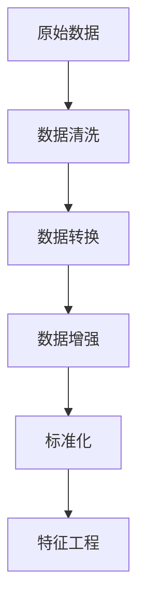
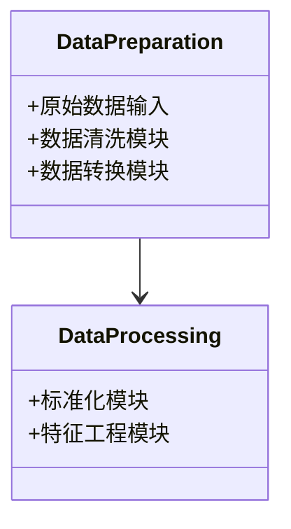
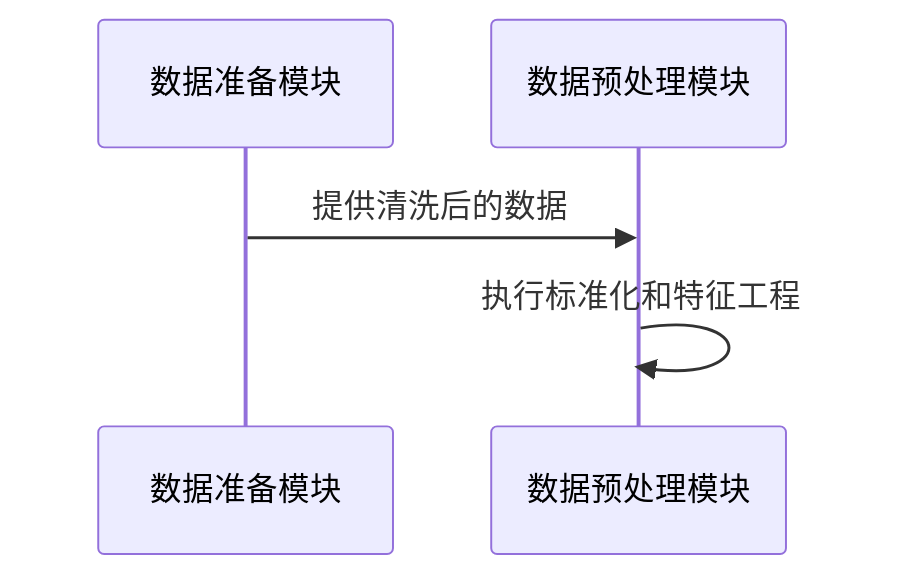

                 


# AI Agent的数据准备和预处理技巧

> 关键词：AI Agent, 数据准备, 数据预处理, 数据清洗, 数据转换, 数据增强

> 摘要：AI Agent的数据准备和预处理是实现智能化决策的关键步骤。本文详细探讨了AI Agent数据准备的核心概念、预处理的算法原理、系统架构设计以及项目实战技巧，通过丰富的案例和代码示例，帮助读者掌握高效的数据处理方法。

---

## 第一部分：AI Agent数据准备与预处理的背景介绍

### 第1章：问题背景与核心概念

#### 1.1 问题背景
在AI Agent的应用中，数据是决策的基础。无论是自然语言处理、图像识别还是推荐系统，数据的质量和结构直接影响模型的性能。AI Agent需要处理多样化的数据源，包括结构化数据（如数据库表）、非结构化数据（如文本、图像）以及时间序列数据。然而，这些数据往往存在噪声、缺失值、格式不一致等问题，这需要通过数据准备和预处理来解决。

#### 1.2 问题描述
数据准备和预处理的主要挑战包括：
1. 数据质量：数据中的噪声、异常值和缺失值会影响模型的准确性。
2. 数据格式：不同数据源的格式差异可能导致数据不一致。
3. 数据分布：数据分布的偏斜可能影响模型的泛化能力。

#### 1.3 问题解决与边界
数据准备和预处理的目标是将原始数据转化为适合模型输入的形式，包括数据清洗、转换、增强等步骤。边界在于数据准备和预处理仅解决数据层面的问题，不涉及模型训练和推理阶段的优化。

#### 1.4 核心概念与组成
- 数据准备：指将原始数据转化为结构化的数据，包括数据抽取、数据清洗和数据转换。
- 数据预处理：指对数据进行标准化、归一化、特征工程等操作，以提高模型的性能。

---

## 第二部分：AI Agent数据准备与预处理的核心概念与联系

### 第2章：核心概念与联系

#### 2.1 数据准备与预处理的原理
数据准备和预处理是AI Agent的基石，通过消除数据噪声、填补缺失值和统一数据格式，为后续的模型训练提供高质量的数据。

#### 2.2 数据特征对比
| 特征 | 数据准备 | 数据预处理 |
|------|----------|------------|
| 目标 | 数据抽取与清洗 | 数据标准化与特征工程 |
| 输入 | 原始数据 | 清洗后的数据 |
| 输出 | 结构化数据 | 模型输入数据 |

#### 2.3 ER图与数据模型
```mermaid
erd
    title 数据模型
    Student
    Course
    Enrollment
    Student --1--> Course
    Student --n--> Enrollment
    Course --n--> Enrollment
```

---

## 第三部分：AI Agent数据准备与预处理的算法原理

### 第3章：算法原理

#### 3.1 数据预处理流程


#### 3.2 数据清洗算法
```python
def data_cleaning(data):
    # 去除缺失值
    data = data.dropna()
    # 去除重复值
    data = data.drop_duplicates()
    # 填充缺失值（示例：用均值填充）
    data['age'].fillna(data['age'].mean(), inplace=True)
    return data
```

#### 3.3 数据增强算法
```python
import tensorflow as tf
from tensorflow.keras.preprocessing.image import ImageDataGenerator

# 图像数据增强
datagen = ImageDataGenerator(
    rotation_range=20,
    width_shift_range=0.2,
    height_shift_range=0.2,
    shear_range=0.2,
    zoom_range=0.2,
    horizontal_flip=True
)
```

#### 3.4 数据标准化公式
标准化公式：
$$ x_{\text{normalized}} = \frac{x - \mu}{\sigma} $$
其中，$\mu$ 是均值，$\sigma$ 是标准差。

---

## 第四部分：AI Agent数据准备与预处理的系统架构设计

### 第4章：系统架构设计

#### 4.1 系统功能设计


#### 4.2 系统架构图


#### 4.3 系统接口设计


---

## 第五部分：AI Agent数据准备与预处理的项目实战

### 第5章：项目实战

#### 5.1 环境安装
```bash
pip install numpy pandas scikit-learn tensorflow
```

#### 5.2 核心代码实现
```python
import pandas as pd
from sklearn.preprocessing import StandardScaler

# 数据清洗
data = pd.read_csv('data.csv')
data_clean = data.dropna()

# 数据转换
data_clean['age'] = data_clean['age'].astype(int)

# 数据增强（示例：文本数据增强）
from tensorflow.keras.preprocessing.text import Tokenizer
tokenizer = Tokenizer()
tokenizer.fit_on_texts(data_clean['text'])
```

#### 5.3 案例分析
以图像分类任务为例，使用数据增强技术提高模型的泛化能力：
```python
# 数据增强
datagen = ImageDataGenerator(rotation_range=20, horizontal_flip=True)
generator = datagen.flow_from_directory('images/', batch_size=32)
```

---

## 第六部分：AI Agent数据准备与预处理的最佳实践

### 第6章：总结与最佳实践

#### 6.1 总结
数据准备和预处理是AI Agent的核心步骤，通过消除数据噪声、统一数据格式和增强数据多样性，可以显著提高模型的性能。

#### 6.2 最佳实践
1. 在数据清洗阶段，优先处理缺失值和重复值。
2. 在数据转换阶段，选择适合业务需求的转换方法。
3. 在数据增强阶段，结合具体任务选择合适的技术。

#### 6.3 注意事项
- 避免过度清洗数据，以免失去数据的原始信息。
- 在数据增强时，注意避免数据泄漏。

#### 6.4 拓展阅读
推荐学习《Hands-On Machine Learning with Scikit-Learn, Keras, and TensorFlow》一书，深入理解数据预处理的技巧。

---

通过以上步骤，读者可以系统地掌握AI Agent数据准备和预处理的核心技巧，并在实际项目中灵活应用。

