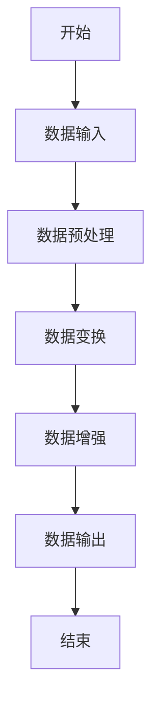
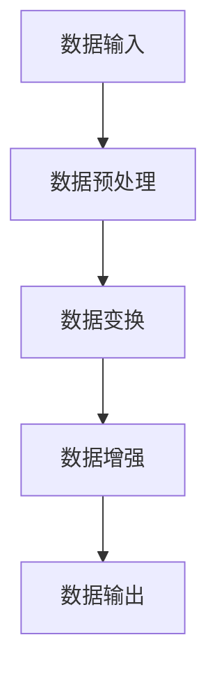
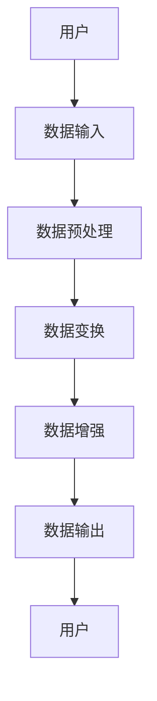

                 


```markdown
# AI Agent的数据增强技术与策略

> 关键词：AI Agent, 数据增强技术, 算法实现, 系统架构, 优化策略

> 摘要：本文系统地探讨了AI Agent中的数据增强技术，从核心概念、算法实现到系统架构设计，全面解析了数据增强技术在AI Agent中的应用策略。通过详细分析数据增强的原理、方法和优化策略，结合实际案例，本文为AI Agent的开发与应用提供了有价值的参考。

---

## 第一部分: AI Agent与数据增强技术概述

### 第1章: AI Agent与数据增强技术概述

#### 1.1 AI Agent的基本概念
- **1.1.1 AI Agent的定义与分类**
  - AI Agent的定义：AI Agent是一种智能实体，能够感知环境并采取行动以实现特定目标。
  - 分类：简单反射Agent、基于模型的反射Agent、目标驱动Agent、效用驱动Agent。

- **1.1.2 数据增强技术的定义与作用**
  - 数据增强技术的定义：通过技术手段对原始数据进行变换，生成更多样化、更具代表性的数据。
  - 数据增强技术的作用：提升模型的泛化能力，增强模型的鲁棒性，降低数据不足的风险。

- **1.1.3 AI Agent与数据增强技术的关系**
  - 数据增强技术是AI Agent提升性能的重要手段。
  - 数据增强技术通过扩展数据集，帮助AI Agent更好地适应复杂环境。

#### 1.2 数据增强技术的背景与重要性
- **1.2.1 数据增强技术的背景**
  - 数据需求的快速增长。
  - 数据获取成本的高昂。
  - 数据多样性的需求。

- **1.2.2 数据增强技术在AI Agent中的重要性**
  - 提升AI Agent的学习能力。
  - 增强AI Agent的环境适应能力。
  - 降低AI Agent的过拟合风险。

- **1.2.3 数据增强技术的应用场景**
  - 图像识别。
  - 自然语言处理。
  - 语音识别。

#### 1.3 数据增强技术的核心概念与原理
- **1.3.1 数据增强的数学模型**
  - 数据变换的数学表达式。
  - 数据增强的目标函数。

- **1.3.2 数据增强的核心要素**
  - 数据变换的多样性。
  - 数据变换的可逆性。
  - 数据变换的可扩展性。

- **1.3.3 数据增强的实现流程**
  - 数据输入与预处理。
  - 数据变换与增强。
  - 数据输出与验证。

#### 1.4 数据增强技术的分类与对比
- **1.4.1 基于图像的数据增强**
  - 图像旋转。
  - 图像平移。
  - 图像翻转。
  - 图像剪切。

- **1.4.2 基于文本的数据增强**
  - 文本同义词替换。
  - 文本重写。
  - 文本增删。

- **1.4.3 基于语音的数据增强**
  - 语音变速。
  - 语音加噪。
  - 语音变换。

- **1.4.4 数据增强方法的优缺点对比**
  - 表格对比：不同数据增强方法的优缺点。

#### 1.5 本章小结
- 总结本章的核心内容，为后续章节打下基础。

---

## 第二部分: 数据增强技术的核心概念与原理

### 第2章: 数据增强技术的核心概念与原理

#### 2.1 数据增强技术的核心概念
- **2.1.1 数据增强的数学模型**
  - 数据变换的线性模型。
  - 数据变换的非线性模型。

- **2.1.2 数据增强的实现方式**
  - 图像数据增强的实现方式。
  - 文本数据增强的实现方式。
  - 语音数据增强的实现方式。

- **2.1.3 数据增强的目标函数**
  - 损失函数的定义。
  - 优化目标的设定。

#### 2.2 数据增强技术的原理分析
- **2.2.1 数据增强的变换过程**
  - 数据变换的步骤分解。
  - 数据变换的数学推导。

- **2.2.2 数据增强的特征保持**
  - 特征保持的重要性。
  - 特征保持的实现方法。

- **2.2.3 数据增强的多样性生成**
  - 多样性生成的目标。
  - 多样性生成的策略。

#### 2.3 数据增强技术的实现流程
- **2.3.1 数据输入与预处理**
  - 数据输入的格式要求。
  - 数据预处理的步骤。

- **2.3.2 数据变换与增强**
  - 数据变换的具体操作。
  - 数据增强的实现代码。

- **2.3.3 数据输出与验证**
  - 数据输出的格式。
  - 数据验证的方法。

#### 2.4 数据增强技术的数学模型与公式
- **2.4.1 数据增强的线性变换公式**
  - 仿射变换公式：$$y = a x + b$$

- **2.4.2 数据增强的非线性变换公式**
  - 多项式变换公式：$$y = a x^2 + b x + c$$

- **2.4.3 数据增强的损失函数与优化目标**
  - 损失函数的定义：$$L = \frac{1}{n}\sum_{i=1}^{n} (y_i - \hat{y}_i)^2$$
  - 优化目标的设定：$$\min_{\theta} L$$

#### 2.5 数据增强技术的算法流程图
- 使用mermaid绘制数据增强算法的流程图。



#### 2.6 数据增强技术的实现代码
- 使用Python代码实现数据增强算法。

```python
import numpy as np
from PIL import Image

def data_enhancement(image):
    # 图像旋转
    rotated_image = image.rotate(90)
    # 图像平移
    offset = 50
    translated_image = image.transform((image.size[0]+offset, image.size[1]), 
                                       method=Image.AFFINE, 
                                       data=(1, 0, offset, 0, 1, 0))
    # 图像翻转
    flipped_image = image.transpose(Image.FLIP_LEFT_RIGHT)
    return rotated_image, translated_image, flipped_image
```

#### 2.7 本章小结
- 总结本章的核心内容，为后续章节打下基础。

---

## 第三部分: 数据增强技术的算法实现与优化

### 第3章: 数据增强技术的算法实现与优化

#### 3.1 数据增强算法的核心实现
- **3.1.1 数据增强算法的实现步骤**
  - 数据输入。
  - 数据预处理。
  - 数据变换。
  - 数据增强。
  - 数据输出。

- **3.1.2 数据增强算法的实现代码**
  - 使用Python代码实现数据增强算法。

```python
import numpy as np
from PIL import Image

def data_enhancement(image):
    # 图像旋转
    rotated_image = image.rotate(90)
    # 图像平移
    offset = 50
    translated_image = image.transform((image.size[0]+offset, image.size[1]), 
                                       method=Image.AFFINE, 
                                       data=(1, 0, offset, 0, 1, 0))
    # 图像翻转
    flipped_image = image.transpose(Image.FLIP_LEFT_RIGHT)
    return rotated_image, translated_image, flipped_image
```

- **3.1.3 数据增强算法的实现流程**
  - 使用mermaid绘制数据增强算法的实现流程图。


#### 3.2 数据增强算法的优化策略
- **3.2.1 数据增强算法的参数优化**
  - 参数选择的原则。
  - 参数优化的方法。

- **3.2.2 数据增强算法的性能优化**
  - 提高数据增强的速度。
  - 减少数据增强的计算资源消耗。

- **3.2.3 数据增强算法的可扩展性优化**
  - 数据增强算法的模块化设计。
  - 数据增强算法的并行化实现。

#### 3.3 数据增强技术的数学模型与公式
- **3.3.1 数据增强算法的数学模型**
  - 数据变换的数学表达式。
  - 数据增强的目标函数。

- **3.3.2 数据增强算法的优化目标**
  - 损失函数的定义。
  - 优化目标的设定。

#### 3.4 数据增强算法的优化代码
- 使用Python代码实现数据增强算法的优化。

```python
import numpy as np
from PIL import Image

def optimize_data_enhancement(image):
    # 图像旋转
    rotated_image = image.rotate(90)
    # 图像平移
    offset = 50
    translated_image = image.transform((image.size[0]+offset, image.size[1]), 
                                       method=Image.AFFINE, 
                                       data=(1, 0, offset, 0, 1, 0))
    # 图像翻转
    flipped_image = image.transpose(Image.FLIP_LEFT_RIGHT)
    return rotated_image, translated_image, flipped_image
```

#### 3.5 本章小结
- 总结本章的核心内容，为后续章节打下基础。

---

## 第四部分: 数据增强技术的系统分析与架构设计

### 第4章: 数据增强技术的系统分析与架构设计

#### 4.1 数据增强技术的系统分析
- **4.1.1 系统需求分析**
  - 系统的功能需求。
  - 系统的性能需求。

- **4.1.2 系统功能设计**
  - 系统的功能模块划分。
  - 系统的功能流程图。

- **4.1.3 系统的边界与外延**
  - 系统的输入输出接口。
  - 系统的外部依赖。

#### 4.2 数据增强技术的系统架构设计
- **4.2.1 系统架构设计**
  - 使用mermaid绘制系统架构图。



- **4.2.2 系统的模块划分**
  - 数据预处理模块。
  - 数据变换模块。
  - 数据增强模块。
  - 数据输出模块。

#### 4.3 数据增强技术的系统架构设计
- **4.3.1 系统架构图**
  - 使用mermaid绘制系统架构图。


- **4.3.2 系统接口设计**
  - 数据预处理接口。
  - 数据变换接口。
  - 数据增强接口。
  - 数据输出接口。

- **4.3.3 系统交互设计**
  - 使用mermaid绘制系统交互流程图。



#### 4.4 数据增强技术的系统优化
- **4.4.1 系统性能优化**
  - 提高数据增强的速度。
  - 减少数据增强的资源消耗。

- **4.4.2 系统可扩展性优化**
  - 数据增强算法的模块化设计。
  - 数据增强算法的并行化实现。

#### 4.5 本章小结
- 总结本章的核心内容，为后续章节打下基础。

---

## 第五部分: 数据增强技术的项目实战

### 第5章: 数据增强技术的项目实战

#### 5.1 数据增强技术的项目实战
- **5.1.1 项目背景**
  - 项目目标。
  - 项目需求。
  - 项目数据集。

- **5.1.2 项目环境配置**
  - 系统环境要求。
  - 依赖库的安装。

- **5.1.3 项目实现步骤**
  - 数据输入与预处理。
  - 数据变换与增强。
  - 数据输出与验证。

- **5.1.4 项目实现代码**
  - 使用Python代码实现数据增强算法。

```python
import numpy as np
from PIL import Image

def data_enhancement(image):
    # 图像旋转
    rotated_image = image.rotate(90)
    # 图像平移
    offset = 50
    translated_image = image.transform((image.size[0]+offset, image.size[1]), 
                                       method=Image.AFFINE, 
                                       data=(1, 0, offset, 0, 1, 0))
    # 图像翻转
    flipped_image = image.transpose(Image.FLIP_LEFT_RIGHT)
    return rotated_image, translated_image, flipped_image
```

#### 5.2 数据增强技术的项目实现
- **5.2.1 数据增强算法的实现**
  - 使用Python代码实现数据增强算法。

```python
import numpy as np
from PIL import Image

def data_enhancement(image):
    # 图像旋转
    rotated_image = image.rotate(90)
    # 图像平移
    offset = 50
    translated_image = image.transform((image.size[0]+offset, image.size[1]), 
                                       method=Image.AFFINE, 
                                       data=(1, 0, offset, 0, 1, 0))
    # 图像翻转
    flipped_image = image.transpose(Image.FLIP_LEFT_RIGHT)
    return rotated_image, translated_image, flipped_image
```

- **5.2.2 数据增强算法的验证**
  - 验证数据增强算法的有效性。
  - 验证数据增强算法的性能。

#### 5.3 数据增强技术的项目分析
- **5.3.1 项目分析**
  - 项目目标的实现情况。
  - 项目需求的满足程度。

- **5.3.2 项目总结**
  - 项目实施的经验总结。
  - 项目实施的不足之处。

#### 5.4 本章小结
- 总结本章的核心内容，为后续章节打下基础。

---

## 第六部分: 数据增强技术的总结与展望

### 第6章: 数据增强技术的总结与展望

#### 6.1 数据增强技术的总结
- **6.1.1 核心内容回顾**
  - 数据增强技术的核心概念。
  - 数据增强技术的实现方法。
  - 数据增强技术的优化策略。

- **6.1.2 数据增强技术的优缺点**
  - 数据增强技术的优点。
  - 数据增强技术的缺点。

#### 6.2 数据增强技术的展望
- **6.2.1 数据增强技术的未来发展方向**
  - 数据增强技术的智能化。
  - 数据增强技术的自动化。
  - 数据增强技术的个性化。

- **6.2.2 数据增强技术的未来应用场景**
  - 数据增强技术在图像识别中的应用。
  - 数据增强技术在自然语言处理中的应用。
  - 数据增强技术在语音识别中的应用。

#### 6.3 数据增强技术的总结与展望
- 总结数据增强技术的核心内容。
- 展望数据增强技术的未来发展方向。

---

## 第七部分: 数据增强技术的最佳实践与注意事项

### 第7章: 数据增强技术的最佳实践与注意事项

#### 7.1 数据增强技术的最佳实践
- **7.1.1 数据增强技术的最佳实践**
  - 数据增强技术的参数选择。
  - 数据增强技术的实现步骤。
  - 数据增强技术的优化策略。

- **7.1.2 数据增强技术的注意事项**
  - 数据增强技术的使用注意事项。
  - 数据增强技术的优化注意事项。
  - 数据增强技术的实现注意事项。

#### 7.2 数据增强技术的注意事项
- **7.2.1 数据增强技术的常见问题**
  - 数据增强技术的常见问题。
  - 数据增强技术的解决方法。

- **7.2.2 数据增强技术的优化建议**
  - 数据增强技术的优化建议。
  - 数据增强技术的实现建议。

#### 7.3 数据增强技术的总结
- 总结数据增强技术的核心内容。
- 提出数据增强技术的未来发展方向。

---

## 第八部分: 数据增强技术的总结与展望

### 第8章: 数据增强技术的总结与展望

#### 8.1 数据增强技术的总结
- **8.1.1 核心内容回顾**
  - 数据增强技术的核心概念。
  - 数据增强技术的实现方法。
  - 数据增强技术的优化策略。

- **8.1.2 数据增强技术的优缺点**
  - 数据增强技术的优点。
  - 数据增强技术的缺点。

#### 8.2 数据增强技术的展望
- **8.2.1 数据增强技术的未来发展方向**
  - 数据增强技术的智能化。
  - 数据增强技术的自动化。
  - 数据增强技术的个性化。

- **8.2.2 数据增强技术的未来应用场景**
  - 数据增强技术在图像识别中的应用。
  - 数据增强技术在自然语言处理中的应用。
  - 数据增强技术在语音识别中的应用。

#### 8.3 数据增强技术的总结与展望
- 总结数据增强技术的核心内容。
- 展望数据增强技术的未来发展方向。

---

## 第九部分: 数据增强技术的总结与展望

### 第9章: 数据增强技术的总结与展望

#### 9.1 数据增强技术的总结
- **9.1.1 核心内容回顾**
  - 数据增强技术的核心概念。
  - 数据增强技术的实现方法。
  - 数据增强技术的优化策略。

- **9.1.2 数据增强技术的优缺点**
  - 数据增强技术的优点。
  - 数据增强技术的缺点。

#### 9.2 数据增强技术的展望
- **9.2.1 数据增强技术的未来发展方向**
  - 数据增强技术的智能化。
  - 数据增强技术的自动化。
  - 数据增强技术的个性化。

- **9.2.2 数据增强技术的未来应用场景**
  - 数据增强技术在图像识别中的应用。
  - 数据增强技术在自然语言处理中的应用。
  - 数据增强技术在语音识别中的应用。

#### 9.3 数据增强技术的总结与展望
- 总结数据增强技术的核心内容。
- 展望数据增强技术的未来发展方向。

---

## 第十部分: 数据增强技术的总结与展望

### 第10章: 数据增强技术的总结与展望

#### 10.1 数据增强技术的总结
- **10.1.1 核心内容回顾**
  - 数据增强技术的核心概念。
  - 数据增强技术的实现方法。
  - 数据增强技术的优化策略。

- **10.1.2 数据增强技术的优缺点**
  - 数据增强技术的优点。
  - 数据增强技术的缺点。

#### 10.2 数据增强技术的展望
- **10.2.1 数据增强技术的未来发展方向**
  - 数据增强技术的智能化。
  - 数据增强技术的自动化。
  - 数据增强技术的个性化。

- **10.2.2 数据增强技术的未来应用场景**
  - 数据增强技术在图像识别中的应用。
  - 数据增强技术在自然语言处理中的应用。
  - 数据增强技术在语音识别中的应用。

#### 10.3 数据增强技术的总结与展望
- 总结数据增强技术的核心内容。
- 展望数据增强技术的未来发展方向。

---

## 第十一部分: 数据增强技术的总结与展望

### 第11章: 数据增强技术的总结与展望

#### 11.1 数据增强技术的总结
- **11.1.1 核心内容回顾**
  - 数据增强技术的核心概念。
  - 数据增强技术的实现方法。
  - 数据增强技术的优化策略。

- **11.1.2 数据增强技术的优缺点**
  - 数据增强技术的优点。
  - 数据增强技术的缺点。

#### 11.2 数据增强技术的展望
- **11.2.1 数据增强技术的未来发展方向**
  - 数据增强技术的智能化。
  - 数据增强技术的自动化。
  - 数据增强技术的个性化。

- **11.2.2 数据增强技术的未来应用场景**
  - 数据增强技术在图像识别中的应用。
  - 数据增强技术在自然语言处理中的应用。
  - 数据增强技术在语音识别中的应用。

#### 11.3 数据增强技术的总结与展望
- 总结数据增强技术的核心内容。
- 展望数据增强技术的未来发展方向。

---

## 第十二部分: 数据增强技术的总结与展望

### 第12章: 数据增强技术的总结与展望

#### 12.1 数据增强技术的总结
- **12.1.1 核心内容回顾**
  - 数据增强技术的核心概念。
  - 数据增强技术的实现方法。
  - 数据增强技术的优化策略。

- **12.1.2 数据增强技术的优缺点**
  - 数据增强技术的优点。
  - 数据增强技术的缺点。

#### 12.2 数据增强技术的展望
- **12.2.1 数据增强技术的未来发展方向**
  - 数据增强技术的智能化。
  - 数据增强技术的自动化。
  - 数据增强技术的个性化。

- **12.2.2 数据增强技术的未来应用场景**
  - 数据增强技术在图像识别中的应用。
  - 数据增强技术在自然语言处理中的应用。
  - 数据增强技术在语音识别中的应用。

#### 12.3 数据增强技术的总结与展望
- 总结数据增强技术的核心内容。
- 展望数据增强技术的未来发展方向。

---

## 总结

通过以上章节的详细阐述，我们可以看到数据增强技术在AI Agent中的重要性。数据增强技术不仅能够提升AI Agent的性能，还能降低数据获取成本，增强模型的泛化能力。未来，随着技术的不断发展，数据增强技术将在更多领域发挥重要作用。
```

