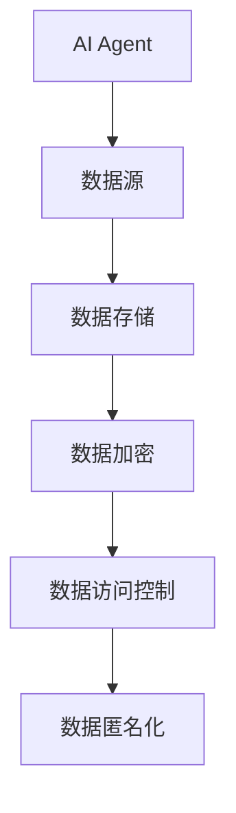

                 


# AI Agent的数据安全与隐私保护措施

> 关键词：AI Agent，数据安全，隐私保护，数据加密，访问控制，隐私计算

> 摘要：随着AI Agent技术的广泛应用，数据安全与隐私保护成为关键挑战。本文系统探讨AI Agent在数据处理中的安全措施，涵盖技术、法律、伦理等方面，提出解决方案，确保数据处理的合规性和安全性。

---

## 第一部分: AI Agent与数据安全、隐私保护的背景介绍

### 第1章: 背景介绍

#### 1.1 数据安全与隐私保护的重要性

- **问题背景**：AI Agent在各行业的应用日益广泛，数据泄露风险增加。
- **问题描述**：AI Agent处理大量敏感数据，存在数据被篡改、泄露风险。
- **问题解决**：通过技术手段保护数据安全，确保隐私合规。
- **边界与外延**：数据安全涵盖存储、传输等，隐私保护涉及用户同意与授权。

#### 1.2 AI Agent的核心概念与原理

- **AI Agent的定义**：智能主体，具备感知和自主决策能力。
- **核心特点**：自主性、反应性、目标导向。
- **分类**：基于智能水平分为简单和复杂两类。
- **数据处理流程**：从数据采集到分析和共享的全过程。

#### 1.3 数据安全与隐私保护的核心概念

- **数据安全**：保护数据完整性、机密性和可用性。
- **隐私保护**：防止未经授权的数据使用，确保个人隐私。
- **关系**：数据安全是手段，隐私保护是目标。

---

## 第二部分: AI Agent的数据安全与隐私保护的核心概念与联系

### 第2章: 核心概念与原理

#### 2.1 AI Agent的数据处理流程

- **数据采集**：从多源获取数据，需确保合法性。
- **数据存储**：采用加密存储，防止未授权访问。
- **数据分析**：使用匿名化处理，减少隐私风险。
- **数据共享**：通过安全通道传输，确保数据完整。

#### 2.2 数据安全与隐私保护的核心原理

- **数据加密**：确保数据在传输和存储中的机密性。
- **访问控制**：基于角色的访问控制（RBAC）。
- **数据匿名化**：去除或加密敏感信息，防止识别个人。
- **最小化原则**：仅收集必要的数据。

#### 2.3 数据安全与隐私保护的实体关系图



---

## 第三部分: 数据安全与隐私保护的法律与伦理框架

### 第3章: 法律框架

#### 3.1 国内法规

- **《网络安全法》**：规定网络运营者的安全责任。
- **《个人信息保护法》**：明确个人隐私保护措施。
- **《数据安全法》**：规范数据处理活动，确保数据安全。

#### 3.2 国际法规

- **GDPR**：严格的数据保护和隐私法规，影响全球。
- **CCPA**：赋予消费者对其数据更多的控制权。

#### 3.3 伦理原则

- **透明性**：告知用户数据使用方式。
- **数据最小化**：仅收集实现目的所需的最少数据。
- **用户同意**：在处理敏感数据前获得明确同意。

---

## 第四部分: AI Agent数据安全与隐私保护的技术措施

### 第4章: 技术措施

#### 4.1 数据加密技术

- **对称加密**：速度快，适用于大量数据加密。
  - 示例算法：AES。
  - 代码示例：
    ```python
    from cryptography.fernet import Fernet
    key = Fernet.generate_key()
    cipher = Fernet(key)
    encrypted_data = cipher.encrypt(b"敏感数据")
    ```
- **非对称加密**：用于安全通信，如RSA。
  - 示例代码：
    ```python
    from cryptography.hazmat.primitives.asymmetric import padding
    private_key = ...  # 私钥
    public_key = ...   # 公钥
    encrypted_data = private_key.encrypt(data, padding.RS256())
    ```

#### 4.2 数据访问控制技术

- **基于角色的访问控制（RBAC）**
  - 示例：
    ```python
    # 用户角色和权限定义
    roles = {
        'admin': ['read', 'write', 'delete'],
        'user': ['read']
    }
    # 根据用户角色决定访问权限
    def access_check(user, action, resource):
        return action in roles.get(user['role'], [])
    ```

---

## 第五部分: 系统架构与设计

### 第5章: 系统架构设计方案

#### 5.1 系统功能设计

- **功能模块**：数据采集、存储、处理、共享。
- **领域模型**：使用类图展示模块关系。
  ```mermaid
  classDiagram
      class AI-Agent {
          - 数据源
          - 数据存储
          - 数据处理
          - 数据共享
      }
  ```

#### 5.2 系统架构设计

- **分层架构**：展示层、业务逻辑层、数据访问层。
  ```mermaid
  architecture
      frontend --1--> backend
      backend --1--> database
      backend --1--> security-module
  ```

---

## 第六部分: 项目实战与案例分析

### 第6章: 项目实战

#### 6.1 案例场景

- **医疗数据共享**：确保患者隐私，支持医疗研究。

#### 6.2 环境安装

- **工具与库**：安装必要的数据加密库和访问控制库。

#### 6.3 核心代码实现

- **数据匿名化**：
  ```python
  def anonymize_data(data):
      # 移除敏感字段
      anonymized = data.drop(columns=['patient_id', 'dob'])
      return anonymized
  ```

#### 6.4 案例分析

- **数据匿名化**：通过移除或加密敏感字段，保护患者隐私。
- **访问控制**：确保只有授权的研究人员可以访问数据。

---

## 第七部分: 总结与展望

### 第7章: 总结与展望

#### 7.1 总结

- 本文系统阐述了AI Agent的数据安全与隐私保护措施，涵盖技术、法律、伦理等方面。

#### 7.2 展望

- 预测未来技术发展，如隐私计算和AI的结合，进一步提升数据保护能力。

---

## 附录

### 附录A: 相关法律法规

- 国内法规：网络安全法、个人信息保护法、数据安全法。
- 国际法规：GDPR、CCPA。

### 附录B: 技术资源

- 数据加密库：Cryptography.io。
- 访问控制框架：Django、Spring Security。

---

通过以上结构，文章详细探讨了AI Agent在数据安全与隐私保护中的措施，结合实际案例和系统设计，为读者提供全面的视角和解决方案。

