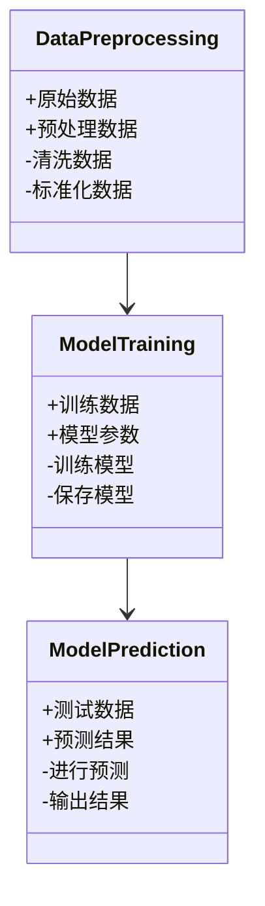
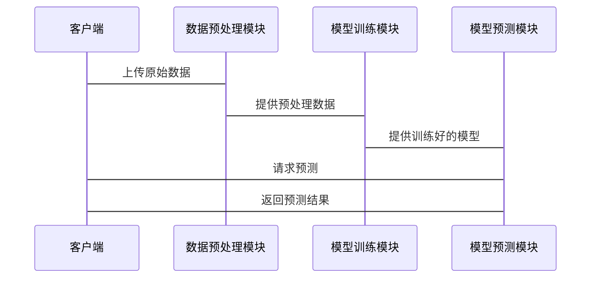

                 


# AI Agent的时序数据处理与预测

## 关键词：AI Agent，时序数据，预测，机器学习，深度学习，强化学习

## 摘要：本文将详细探讨AI Agent在时序数据处理与预测中的应用。从时序数据的基本概念到AI Agent的核心原理，从数学模型的构建到系统架构的设计，再到实际项目的实现与分析，全面解析AI Agent如何高效地处理和预测时序数据，帮助读者掌握这一领域的核心知识和实际应用技巧。

---

## 第一部分: AI Agent的时序数据处理与预测基础

## 第1章: 时序数据与AI Agent概述

### 1.1 时序数据的基本概念

#### 1.1.1 时序数据的定义与特征
时序数据是指按照时间顺序记录的数据，通常具有以下特征：
- **时间依赖性**：数据点之间存在时间上的依赖关系。
- **趋势性**：数据可能呈现长期上升或下降的趋势。
- **周期性**：数据可能在固定的时间周期内重复出现相似的模式。
- **随机性**：数据中可能包含不可预测的随机波动。

#### 1.1.2 时序数据的常见应用场景
- **金融领域**：股票价格预测、汇率预测。
- **工业领域**：设备故障预测、生产流程优化。
- **交通领域**：交通流量预测、智能调度。
- **气象领域**：天气预测、气候分析。

#### 1.1.3 AI Agent与时序数据的结合方式
AI Agent可以通过以下方式与时序数据结合：
- **数据驱动**：AI Agent基于时序数据进行分析和预测。
- **反馈机制**：AI Agent根据预测结果调整行为，进一步优化预测模型。
- **实时互动**：AI Agent实时处理时序数据，动态调整策略。

### 1.2 AI Agent的基本概念

#### 1.2.1 AI Agent的定义与分类
AI Agent是一种智能体，能够感知环境、做出决策并执行动作。根据智能体的决策方式，可以分为：
- **基于规则的AI Agent**：通过预定义的规则进行决策。
- **基于强化学习的AI Agent**：通过与环境互动，学习最优策略。
- **基于深度学习的AI Agent**：利用神经网络学习复杂的模式。

#### 1.2.2 AI Agent的核心能力
- **感知能力**：通过传感器或数据源获取信息。
- **决策能力**：基于感知信息做出最优决策。
- **执行能力**：通过执行机构或接口实现决策。

#### 1.2.3 AI Agent在时序数据处理中的作用
AI Agent可以用于时序数据的处理与预测，帮助实现：
- **实时监控**：对时序数据进行实时分析，发现异常。
- **预测与优化**：基于历史数据预测未来趋势，并优化决策。

### 1.3 时序数据处理与预测的背景与挑战

#### 1.3.1 时序数据处理的常见挑战
- **数据的不稳定性**：时序数据容易受到随机噪声的影响。
- **复杂性**：时序数据可能包含趋势、周期性和随机性等多种特征。
- **计算资源需求**：处理大量时序数据需要高性能计算资源。

#### 1.3.2 AI Agent在时序预测中的优势
- **智能化**：AI Agent能够自动学习和适应数据的变化。
- **实时性**：AI Agent可以实时处理数据，快速做出响应。
- **灵活性**：AI Agent可以根据不同的场景调整预测模型。

#### 1.3.3 时序数据处理与预测的边界与外延
- **边界**：时序数据处理与预测的范围和限制，例如数据的连续性和完整性。
- **外延**：时序数据处理与预测的应用范围，例如结合其他类型的数据进行分析。

### 1.4 本章小结
本章介绍了时序数据的基本概念、常见应用场景，以及AI Agent的核心概念和在时序数据处理中的作用。通过分析时序数据处理的挑战和AI Agent的优势，为后续内容奠定了基础。

---

## 第2章: 时序数据的特征与处理方法

### 2.1 时序数据的特征分析

#### 2.1.1 时间依赖性
时序数据的时间依赖性可以通过自相关函数（ACF）和偏自相关函数（PACF）进行分析。

#### 2.1.2 趋势性与周期性
趋势性可以通过线性回归或指数平滑法进行建模，周期性可以通过傅里叶变换或季节性分解进行分析。

#### 2.1.3 随机性与异常值
随机性可以通过白噪声检验进行分析，异常值可以通过箱线图或孤立森林算法进行检测。

### 2.2 时序数据的预处理方法

#### 2.2.1 数据清洗与缺失值处理
- **数据清洗**：去除异常值和重复值。
- **缺失值处理**：使用均值、中位数或插值法填补缺失值。

#### 2.2.2 数据标准化与归一化
- **标准化**：通过Z-score方法将数据标准化到均值为0，方差为1的分布。
- **归一化**：通过Min-Max方法将数据缩放到0到1的范围。

#### 2.2.3 数据分段与滑动窗口技术
- **数据分段**：将时序数据划分为训练集、验证集和测试集。
- **滑动窗口技术**：通过滑动窗口提取时序数据的局部特征。

### 2.3 时序数据的特征提取

#### 2.3.1 基于滑动窗口的特征提取
- **滑动窗口平均值**：计算窗口内数据的平均值。
- **滑动窗口标准差**：计算窗口内数据的标准差。

#### 2.3.2 基于差分的特征提取
- **一阶差分**：计算相邻数据点的差值。
- **二阶差分**：计算一阶差分的差值。

#### 2.3.3 基于统计学的特征提取
- **统计指标**：计算均值、中位数、标准差等统计指标。

### 2.4 本章小结
本章详细介绍了时序数据的特征分析和预处理方法，为后续的时序预测奠定了基础。

---

## 第3章: AI Agent的核心概念与原理

### 3.1 AI Agent的基本原理

#### 3.1.1 基于规则的AI Agent
基于规则的AI Agent通过预定义的规则进行决策，适用于规则简单且固定的场景。

#### 3.1.2 基于强化学习的AI Agent
基于强化学习的AI Agent通过与环境互动，学习最优策略，适用于复杂动态的场景。

#### 3.1.3 基于深度学习的AI Agent
基于深度学习的AI Agent利用神经网络学习复杂的模式，适用于非线性特征明显的场景。

### 3.2 AI Agent的感知与决策机制

#### 3.2.1 状态表示与感知
- **状态表示**：通过时序数据的状态特征表示当前环境的状态。
- **感知机制**：通过传感器或数据源获取环境信息。

#### 3.2.2 行动选择与策略
- **行动选择**：基于当前状态选择最优行动。
- **策略优化**：通过强化学习算法优化策略。

#### 3.2.3 奖励机制与优化
- **奖励机制**：定义奖励函数，衡量AI Agent的决策效果。
- **优化方法**：通过梯度下降等优化方法优化策略。

### 3.3 AI Agent与时序数据的结合

#### 3.3.1 时序数据驱动的AI Agent
- **数据驱动**：AI Agent通过分析时序数据做出决策。
- **反馈机制**：AI Agent根据预测结果调整行为。

#### 3.3.2 AI Agent驱动的时序数据分析
- **主动学习**：AI Agent主动选择数据进行分析。
- **动态调整**：AI Agent根据环境变化动态调整分析策略。

#### 3.3.3 时序数据与AI Agent的双向互动
- **实时互动**：AI Agent实时处理时序数据，动态调整预测模型。
- **反馈闭环**：通过反馈机制优化预测模型。

### 3.4 本章小结
本章详细介绍了AI Agent的核心概念和基本原理，重点分析了AI Agent在时序数据处理中的作用。

---

## 第4章: 时序数据预测的数学模型与算法

### 4.1 时序预测的经典模型

#### 4.1.1 自动回归积分移动平均模型（ARIMA）
ARIMA模型是一种常用的时序预测模型，由自回归（AR）和移动平均（MA）部分组成，适用于具有趋势性和周期性的数据。

ARIMA模型的数学表达式为：
$$ ARIMA(p, d, q) = y_t = \phi_1 y_{t-1} + \phi_2 y_{t-2} + \dots + \phi_p y_{t-p} + \epsilon_t + \theta_1 \epsilon_{t-1} + \dots + \theta_q \epsilon_{t-q} $$

#### 4.1.2 长短期记忆网络（LSTM）
LSTM是一种基于循环神经网络（RNN）的变体，能够有效捕捉时序数据中的长程依赖关系。

LSTM的结构包括输入门（Input Gate）、遗忘门（Forget Gate）和输出门（Output Gate），数学表达式如下：
$$
\begin{align*}
i_t &= \sigma(W_i x_t + U_i h_{t-1} + b_i) \\
f_t &= \sigma(W_f x_t + U_f h_{t-1} + b_f) \\
o_t &= \sigma(W_o x_t + U_o h_{t-1} + b_o) \\
g_t &= \tanh(W_g x_t + U_g h_{t-1} + b_g) \\
h_t &= i_t \cdot g_t + f_t \cdot h_{t-1}
\end{align*}
$$

### 4.2 基于深度学习的时序预测算法

#### 4.2.1 Transformer模型
Transformer模型通过自注意力机制捕捉时序数据中的全局依赖关系，适用于长序列的预测。

#### 4.2.2 图神经网络（GNN）
图神经网络通过构建图结构，将时序数据与空间信息结合，适用于复杂依赖关系的预测。

### 4.3 本章小结
本章介绍了时序预测的经典模型和基于深度学习的算法，重点分析了ARIMA和LSTM模型的数学原理和应用场景。

---

## 第5章: 时序数据处理与预测的系统架构设计

### 5.1 问题场景介绍
假设我们有一个股票价格预测的场景，需要设计一个基于AI Agent的时序预测系统。

### 5.2 系统功能设计

#### 5.2.1 领域模型（领域模型Mermaid类图）


### 5.3 系统架构设计

#### 5.3.1 系统架构图（系统架构Mermaid架构图）


### 5.4 系统接口设计
- **输入接口**：接收原始时序数据。
- **输出接口**：输出预测结果和模型评估指标。

### 5.5 系统交互设计（系统交互Mermaid序列图）


### 5.6 本章小结
本章通过股票价格预测的场景，详细介绍了系统功能设计、架构设计和接口设计。

---

## 第6章: 时序数据处理与预测的项目实战

### 6.1 环境安装

#### 6.1.1 安装Python
```bash
python --version
```

#### 6.1.2 安装依赖库
```bash
pip install numpy pandas scikit-learn tensorflow
```

### 6.2 系统核心实现源代码

#### 6.2.1 数据预处理代码
```python
import numpy as np
import pandas as pd

# 加载数据
data = pd.read_csv('stock_price.csv')

# 数据清洗
data = data.dropna()

# 标准化处理
from sklearn.preprocessing import StandardScaler
scaler = StandardScaler()
data_scaled = scaler.fit_transform(data)
```

#### 6.2.2 模型训练代码
```python
from tensorflow.keras.models import Sequential
from tensorflow.keras.layers import LSTM, Dense

# 构建LSTM模型
model = Sequential()
model.add(LSTM(50, input_shape=(1, 1)))
model.add(Dense(1))
model.compile(loss='mean_squared_error', optimizer='adam')

# 训练模型
model.fit(X_train, y_train, epochs=100, batch_size=32)
```

#### 6.2.3 模型预测代码
```python
# 进行预测
y_pred = model.predict(X_test)

# 输出结果
print(y_pred)
```

### 6.3 代码应用解读与分析
- **数据预处理**：对原始数据进行清洗和标准化处理，确保数据适合模型训练。
- **模型训练**：使用LSTM模型进行训练，优化模型参数。
- **模型预测**：利用训练好的模型进行预测，输出预测结果。

### 6.4 实际案例分析
通过股票价格预测的案例，分析模型的预测效果和评估指标。

### 6.5 本章小结
本章通过一个实际项目，详细展示了时序数据处理与预测的核心实现过程。

---

## 第7章: 总结与展望

### 7.1 本章总结
本文详细探讨了AI Agent在时序数据处理与预测中的应用，从基础概念到系统设计，再到项目实现，全面解析了时序数据处理与预测的核心知识。

### 7.2 注意事项
- **数据质量**：时序数据的质量直接影响预测结果。
- **模型选择**：选择合适的模型和算法，避免过拟合和欠拟合。
- **计算资源**：处理时序数据需要高性能计算资源。

### 7.3 拓展阅读
- **推荐书籍**：《时间序列分析》、《深度学习》。
- **推荐论文**：相关领域的最新研究论文。

### 7.4 本章小结
本文总结了时序数据处理与预测的核心知识，并提出了进一步学习和实践的方向。

---

## 附录: 常用工具与库

- **Python库**：numpy、pandas、scikit-learn、tensorflow。
- **可视化工具**：Matplotlib、Seaborn、Plotly。
- **开发环境**：Jupyter Notebook、PyCharm。

---

以上是《AI Agent的时序数据处理与预测》的技术博客文章的完整目录大纲和详细内容。希望对您有所帮助！

