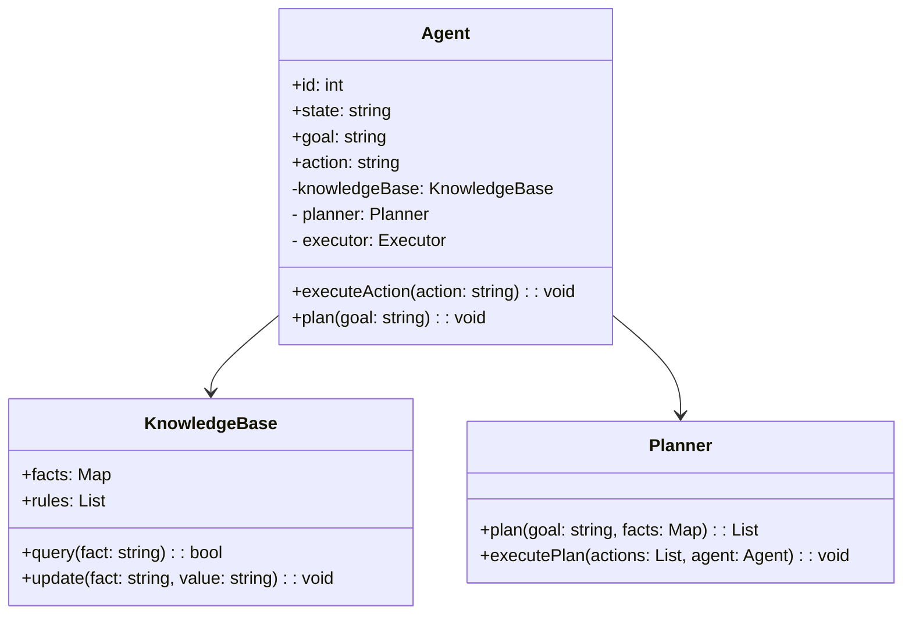

                 


# AI Agent的架构设计：从概念到实现

## 关键词：
- AI Agent
- 架构设计
- 多智能体系统
- 知识表示
- 行为规划

## 摘要：
本文将从AI Agent的基本概念出发，逐步深入探讨其核心架构设计、算法原理、系统实现及项目实战。通过对AI Agent的体系结构、感知与行动机制、算法选择与优化等方面进行详细分析，结合实际案例，为读者提供从理论到实践的全面指导。

---

# 第一部分: AI Agent的基本概念与背景

## 第1章: AI Agent的基本概念与背景

### 1.1 AI Agent的定义与核心概念
AI Agent（智能代理）是指能够感知环境、自主决策并执行任务的智能体。它具备以下核心属性：
- **自主性**：能够在没有外部干预的情况下自主运行。
- **反应性**：能够实时感知环境并做出反应。
- **目标导向性**：基于目标驱动行为。
- **社交能力**：能够与其他智能体或人类进行交互和协作。

AI Agent与传统程序的区别在于，传统程序依赖于预定义的规则和输入，而AI Agent能够通过学习和适应环境来完成任务。

### 1.2 AI Agent的发展背景
人工智能技术的快速发展为AI Agent的应用提供了技术基础。从早期的单智能体系统到现代的多智能体协作系统，AI Agent逐步在各个领域得到广泛应用。当前，AI Agent技术在自动驾驶、智能助手、机器人协作等领域展现出巨大潜力。

### 1.3 AI Agent的分类与应用场景
AI Agent可以分为以下几类：
- **基于知识的AI Agent**：依赖知识库进行推理和决策。
- **基于模型的AI Agent**：通过建模环境来实现智能决策。
- **基于规则的AI Agent**：通过预定义规则进行行为决策。

AI Agent的应用场景包括：
- **自动驾驶**：通过感知环境和路径规划实现自主驾驶。
- **智能助手**：通过自然语言处理和任务执行为用户提供服务。
- **机器人协作**：通过多智能体协作完成复杂任务。

---

# 第2章: AI Agent的核心概念与体系结构

## 2.1 AI Agent的体系结构
AI Agent的体系结构是其设计的核心。常见的体系结构包括：
- **单智能体体系结构**：适用于简单的任务，如路径规划。
- **多智能体体系结构**：适用于复杂的协作任务，如机器人协作。
- **分层体系结构**：将任务分解为多个层次，逐层进行决策和执行。

### 2.2 AI Agent的感知与行动
AI Agent的感知和行动机制是其核心能力：
- **感知机制**：通过传感器或数据源获取环境信息。
- **决策机制**：基于感知信息进行推理和决策。
- **行动机制**：根据决策结果执行动作。

### 2.3 AI Agent的核心要素
- **知识表示**：将知识以适当的形式表示，以便智能体理解和推理。
- **行为规划**：制定实现目标的行为序列。
- **通信与协作**：与其他智能体或人类进行信息交换和协作。

---

# 第3章: AI Agent的算法原理

## 3.1 基于搜索的AI Agent算法
基于搜索的算法是AI Agent的核心算法之一。常见的算法包括：
- **Dijkstra算法**：用于寻找最短路径。
- **A*算法**：在Dijkstra的基础上优化，加入启发式函数。

### 3.1.1 Dijkstra算法
Dijkstra算法用于寻找图中两点之间的最短路径。其步骤如下：
1. 初始化起点的距离为0，其他点的距离为无穷大。
2. 选择距离最小的节点，更新其邻居的距离。
3. 重复直到所有节点的距离被确定。

### 3.1.2 A*算法
A*算法在Dijkstra的基础上加入了启发式函数，优先搜索更接近目标的节点。

### 3.1.3 算法优缺点分析
- **优点**：路径规划准确。
- **缺点**：计算量较大，适用于简单环境。

## 3.2 基于规则的AI Agent算法
基于规则的算法通过预定义规则进行决策。

### 3.2.1 规则表示
规则通常以条件-动作（If-Then）形式表示。

### 3.2.2 规则推理
通过推理引擎对规则进行推理，得出决策。

### 3.2.3 规则优化
通过学习和优化规则，提高决策的准确性。

## 3.3 基于模型的AI Agent算法
基于模型的算法通过建模环境进行决策。

### 3.3.1 状态空间模型
将环境状态表示为状态空间，通过状态转移进行决策。

### 3.3.2 动作空间模型
定义可能的动作，并预测动作的结果。

### 3.3.3 模型训练与优化
通过机器学习对模型进行训练和优化。

---

# 第4章: AI Agent的系统架构设计

## 4.1 系统架构设计概述
AI Agent的系统架构设计需要考虑以下几个方面：
- **系统目标与需求分析**：明确系统的功能和性能要求。
- **系统架构的选择与优化**：选择合适的体系结构。
- **系统架构的实现与部署**：将架构转化为实际系统。

## 4.2 领域模型设计
领域模型是AI Agent的核心模型，通常包括以下几个部分：
- **实体识别**：识别系统中的实体。
- **关系建模**：描述实体之间的关系。
- **行为建模**：描述实体的行为和动作。

### 4.2.1 领域模型类图
以下是领域模型的类图：



---

# 第5章: AI Agent的项目实战

## 5.1 项目环境与工具安装
### 5.1.1 环境搭建
- **操作系统**：建议使用Linux或macOS。
- **编程语言**：Python 3.8以上版本。
- **开发工具**：建议使用PyCharm或VS Code。
- **依赖库**：安装numpy、scipy、matplotlib等库。

## 5.2 系统核心实现
### 5.2.1 知识表示
知识表示可以通过知识库或规则库实现。以下是知识库的实现：

```python
class KnowledgeBase:
    def __init__(self):
        self.facts = {}
        self.rules = []

    def query(self, fact):
        return fact in self.facts

    def update(self, fact, value):
        self.facts[fact] = value
```

### 5.2.2 行为规划
行为规划可以通过规划器实现。以下是规划器的实现：

```python
class Planner:
    def plan(self, goal, facts):
        # 简单的规划算法，仅用于示例
        pass

    def executePlan(self, actions, agent):
        for action in actions:
            agent.executeAction(action)
```

### 5.2.3 系统实现
以下是AI Agent的核心实现：

```python
class Agent:
    def __init__(self, knowledge_base, planner):
        self.id = id
        self.state = "idle"
        self.goal = None
        self.action = None
        self.knowledge_base = knowledge_base
        self.planner = planner

    def executeAction(self, action):
        self.action = action
        self.state = "executing"

    def plan(self, goal):
        self.goal = goal
        self.planner.plan(goal, self.knowledge_base.facts)
```

## 5.3 案例分析
### 5.3.1 案例描述
以智能助手为例，设计一个简单的AI Agent，能够理解用户的指令并执行相应的操作。

### 5.3.2 系统实现
以下是智能助手的实现：

```python
agent = Agent(KnowledgeBase(), Planner())
agent.plan("打开灯")
agent.executeAction("打开灯")
```

### 5.3.3 项目总结
通过本项目，我们了解了AI Agent的基本实现方法，包括知识表示、行为规划和系统实现。

---

# 第6章: AI Agent的最佳实践

## 6.1 经验总结
- **明确目标**：在设计AI Agent时，明确其目标和功能。
- **选择合适的算法**：根据任务需求选择合适的算法。
- **优化知识表示**：优化知识表示，提高推理效率。
- **测试与优化**：通过测试优化系统性能。

## 6.2 注意事项
- **数据质量**：确保数据的准确性和完整性。
- **系统安全性**：确保系统的安全性和隐私性。
- **可扩展性**：设计可扩展的系统架构。

## 6.3 拓展阅读
- 推荐阅读《Multi-Agent Systems》和《Artificial Intelligence: A Modern Approach》。

---

# 总结

本文从AI Agent的基本概念出发，逐步深入探讨了其核心架构设计、算法原理、系统实现及项目实战。通过详细分析和实际案例，为读者提供了从理论到实践的全面指导。希望本文能够帮助读者更好地理解和实现AI Agent。

