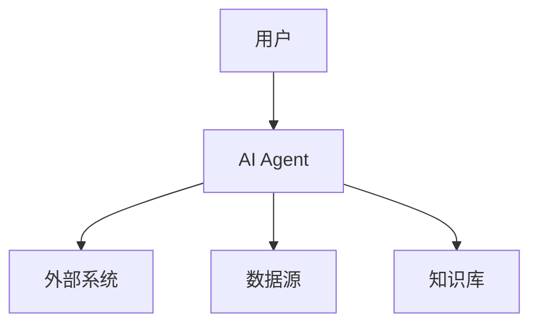
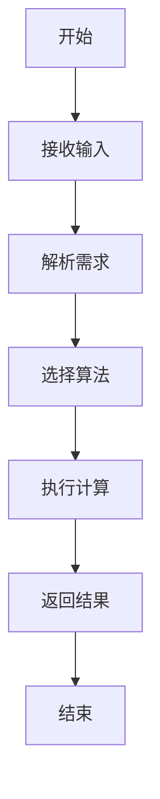
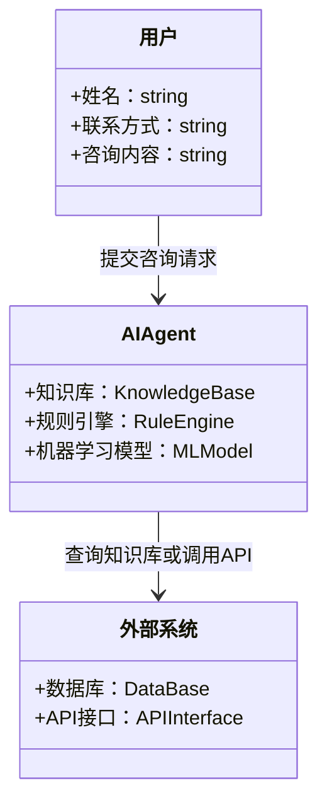
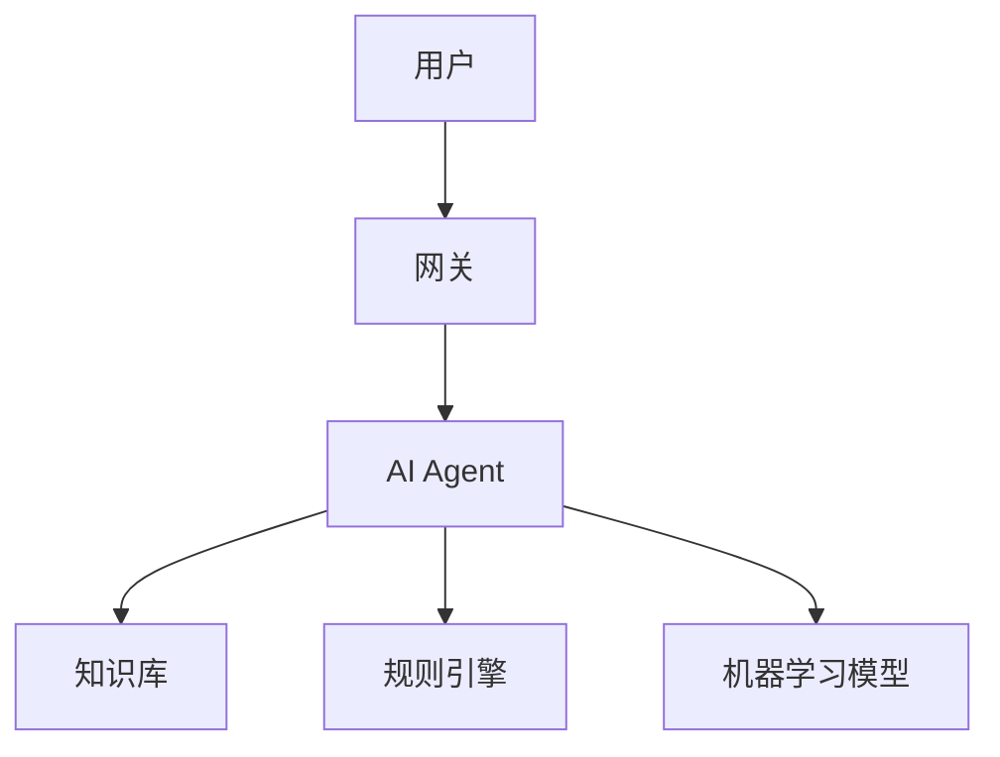
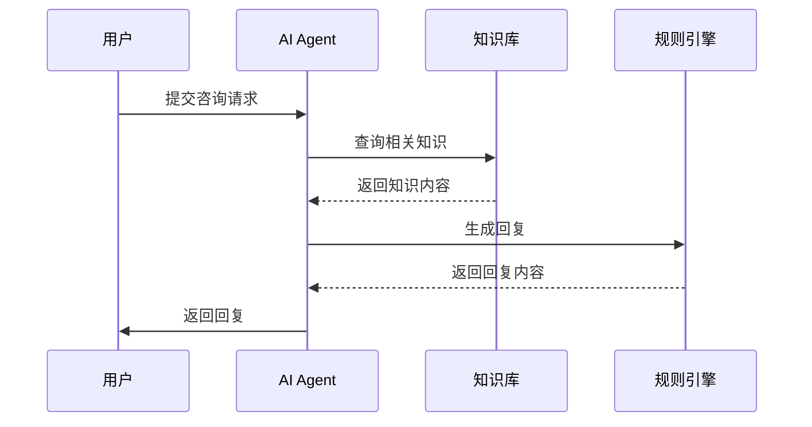

                 


# AI Agent的架构设计：从需求分析到系统规划

## 关键词
AI Agent, 架构设计, 需求分析, 系统规划, 人工智能, 系统架构

## 摘要
本文详细探讨了AI Agent的架构设计，从需求分析到系统规划的全过程。首先，介绍了AI Agent的基本概念和分类，分析了其核心概念与技术基础。接着，深入讲解了AI Agent的算法原理和数学模型，并通过Mermaid图展示了系统架构设计。然后，通过一个实际项目案例，详细阐述了从需求分析到系统实现的全过程，包括环境搭建、核心代码实现和测试优化。最后，总结了设计AI Agent系统时的最佳实践和注意事项，为读者提供了全面的指导。

---

## 第一部分: AI Agent的架构设计基础

### 第1章: AI Agent概述

#### 1.1 AI Agent的基本概念
AI Agent（人工智能代理）是一种能够感知环境、自主决策并执行任务的智能实体。它通过与用户或系统的交互，完成特定的目标，如信息查询、任务执行、决策支持等。

- **核心要素**：
  - **感知能力**：通过传感器或API获取环境数据。
  - **决策能力**：基于感知数据，选择最优行动方案。
  - **执行能力**：通过API或脚本执行决策结果。
  - **学习能力**：通过机器学习模型优化自身行为。

- **与传统Agent的区别**：
  | 特性          | 传统Agent          | AI Agent           |
  |---------------|--------------------|--------------------|
  | 智能水平      | 基于规则或简单逻辑 | 基于机器学习模型   |
  | 自主性        | 较低               | 较高               |
  | 适应性        | 固定               | 动态优化           |

#### 1.2 AI Agent的分类与特点
AI Agent可以根据智能水平和应用场景分为以下几类：

- **简单反射型**：基于固定的规则执行任务，适用于简单场景。
- **基于模型的反应型**：通过环境模型调整行为，适用于复杂场景。
- **目标驱动型**：以实现特定目标为导向，适用于任务型代理。
- **效用驱动型**：通过最大化效用函数来优化决策，适用于复杂优化问题。

**对比表**：
| 类型             | 适用场景       | 决策方式           | 优缺点           |
|------------------|----------------|--------------------|------------------|
| 简单反射型       | 简单任务       | 基于规则           | 实现简单，效率高  |
| 基于模型的反应型 | 中等复杂场景   | 基于环境模型       | 灵活性高，但计算量大 |
| 目标驱动型       | 任务导向场景   | 基于目标规划       | 目标明确，但需要复杂规划 |
| 效用驱动型       | 优化问题场景   | 基于效用函数       | 最优化，但实现复杂 |

#### 1.3 AI Agent的分类与特点（续）
通过以下Mermaid图，展示了AI Agent与其他系统的交互关系：


### 第2章: AI Agent的设计原则与技术基础

#### 2.1 设计原则
AI Agent的设计需要遵循以下原则：

- **目标明确性**：确保AI Agent的目标清晰，避免模糊需求。
- **系统可扩展性**：设计模块化架构，便于功能扩展。
- **交互简洁性**：简化与用户或系统的交互流程，提升用户体验。
- **智能性与效率的平衡**：在追求智能性的同时，确保系统的运行效率。

#### 2.2 技术基础
AI Agent的技术基础主要涉及以下几个方面：

- **感知技术**：
  - **自然语言处理**：用于理解和生成人类语言。
  - **计算机视觉**：用于处理图像和视频数据。

- **决策技术**：
  - **规则引擎**：基于预定义规则进行决策。
  - **机器学习模型**：用于复杂场景下的智能决策。

- **执行技术**：
  - **API调用**：通过API与外部系统交互。
  - **自动化脚本**：用于自动化任务执行。

### 第3章: AI Agent的核心概念与联系

#### 3.1 核心概念原理
AI Agent的设计需要考虑以下几个核心概念：

- **实体关系图（ER图）**：展示AI Agent与其他系统的交互关系。
- **领域模型**：描述用户需求、系统功能和数据流。
- **用例分析**：分析典型场景和边界条件。

通过以下Mermaid图，展示了AI Agent的核心概念关系：


#### 3.2 核心概念对比表
以下表格对比了传统Agent与AI Agent的特点：

| 特性          | 传统Agent          | AI Agent           |
|---------------|--------------------|--------------------|
| 智能水平      | 基于规则或简单逻辑 | 基于机器学习模型   |
| 自主性        | 较低               | 较高               |
| 适应性        | 固定               | 动态优化           |

### 第4章: AI Agent的算法原理

#### 4.1 算法原理概述
AI Agent的算法选择取决于具体应用场景。以下是一个典型的算法实现步骤：

1. **接收输入**：获取用户的请求或系统的状态。
2. **解析需求**：分析输入数据，提取关键信息。
3. **选择算法**：根据需求选择合适的算法。
4. **执行计算**：运行算法，生成结果。
5. **返回结果**：将结果传递给用户或系统。

通过以下Mermaid图，展示了算法的流程：


#### 4.2 算法流程图
以下是一个简单的线性回归模型示例：

- **数学模型**：$y = a + bx + \epsilon$
- **逻辑回归模型**：$P(y=1|x) = \frac{1}{1 + e^{- (w \cdot x + b)}}$

---

## 第二部分: AI Agent的系统架构设计

### 第5章: 系统分析与架构设计方案

#### 5.1 问题场景介绍
假设我们正在设计一个智能客服AI Agent，用于处理用户的咨询请求。

#### 5.2 项目介绍
**项目名称**：智能客服AI Agent  
**项目目标**：实现一个能够理解用户问题、提供准确答案的智能客服系统。

#### 5.3 系统功能设计
通过以下Mermaid图，展示了系统的领域模型：


#### 5.4 系统架构设计
通过以下Mermaid图，展示了系统的架构设计：


#### 5.5 系统接口设计
系统接口设计主要涉及以下几个方面：

- **输入接口**：接收用户的咨询请求。
- **输出接口**：返回处理结果。
- **知识库接口**：查询知识库数据。
- **API接口**：调用外部系统的API。

#### 5.6 系统交互设计
通过以下Mermaid图，展示了系统的交互过程：


---

## 第三部分: AI Agent的项目实战

### 第6章: 项目实战

#### 6.1 环境搭建
**工具选择**：
- **编程语言**：Python
- **深度学习框架**：TensorFlow或PyTorch
- **自然语言处理库**：spaCy或jieba
- **机器学习库**：scikit-learn

**安装依赖**：
```bash
pip install python-torch transformers
```

#### 6.2 系统核心实现源代码
以下是AI Agent的核心代码实现：

```python
import torch
from transformers import AutoTokenizer, AutoModelForSequenceClassification

class AI_Agent:
    def __init__(self):
        self.tokenizer = AutoTokenizer.from_pretrained('bert-base-uncased')
        self.model = AutoModelForSequenceClassification.from_pretrained('bert-base-uncased')

    def perceive(self, input_text):
        inputs = self.tokenizer(input_text, return_tensors='np')
        outputs = self.model(**inputs)
        return outputs.logits

    def decide(self, inputs):
        # 假设这是一个简单的分类任务
        logits = self.perceive(inputs)
        predicted = torch.argmax(logits, dim=1)
        return predicted.item()

    def execute(self, action):
        # 假设这是一个简单的API调用
        print(f"执行操作：{action}")

    def run(self, input_text):
        action = self.decide(input_text)
        self.execute(action)
```

#### 6.3 代码应用解读与分析
- **perceive方法**：使用BERT模型对输入文本进行编码。
- **decide方法**：基于编码结果进行分类，选择最优动作。
- **execute方法**：根据决策结果执行具体操作。
- **run方法**：整合感知、决策和执行过程。

#### 6.4 实际案例分析
**案例分析**：
假设用户输入“如何重置密码？”，AI Agent会通过分类模型识别这是一个密码重置请求，并调用相应的API完成操作。

**代码实现**：
```python
agent = AI_Agent()
agent.run("如何重置密码？")
```

#### 6.5 测试优化
- **单元测试**：测试每个模块的功能是否正常。
- **性能测试**：评估系统的响应时间和吞吐量。
- **用户体验测试**：收集用户反馈，优化交互流程。

---

## 第四部分: 最佳实践与总结

### 第7章: 最佳实践 tips

#### 7.1 设计注意事项
- **模块化设计**：确保系统模块清晰，便于维护和扩展。
- **容错设计**：处理可能出现的异常情况，确保系统稳定性。
- **数据安全**：保护用户数据，防止数据泄露。

#### 7.2 小结
AI Agent的架构设计需要从需求分析、系统设计到项目实现的全生命周期进行规划。通过模块化设计、选择合适的算法和工具，可以构建高效、稳定的AI Agent系统。

#### 7.3 拓展阅读
- **推荐书籍**：《设计模式：可复用面向对象的软件组件》
- **在线资源**：推荐访问[AI-Agent-Tutorial](https://example.com)了解更多详细内容。

---

## 附录: 工具参考与术语表

### 附录A: 工具参考
- **编程语言**：Python
- **深度学习框架**：TensorFlow, PyTorch
- **自然语言处理库**：spaCy, jieba
- **机器学习库**：scikit-learn

### 附录B: 术语表
- **AI Agent**：人工智能代理
- **感知**：获取环境信息
- **决策**：选择最优行动方案
- **执行**：完成具体任务

---

## 总结
本文详细探讨了AI Agent的架构设计，从需求分析到系统规划的全过程。通过理论与实践的结合，为读者提供了全面的指导。希望本文能帮助读者更好地理解和实现AI Agent系统。

