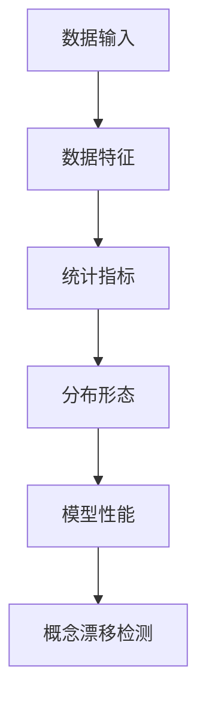
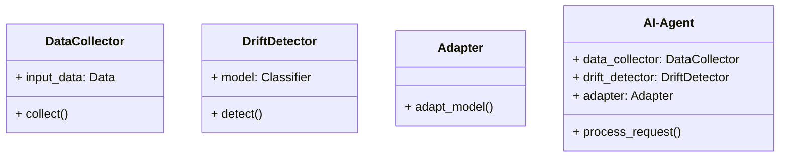

                 


```markdown
# AI Agent的概念漂移检测与适应

> 关键词：AI Agent，概念漂移，检测算法，适应策略，系统架构，项目实战

> 摘要：本文详细探讨了AI Agent中概念漂移检测与适应的核心原理、算法实现、系统架构设计及实际应用案例。从概念漂移的基本定义、检测方法到适应策略，结合具体场景分析，提供完整的解决方案。文章通过清晰的逻辑结构，帮助读者全面理解并掌握概念漂移在AI Agent中的应用。

---

## 第一部分: AI Agent的概念漂移检测与适应背景介绍

### 第1章: 概念漂移的基本概念

#### 1.1 概念漂移的定义与问题背景
- **1.1.1 什么是概念漂移**
  - 数据分布变化的定义
  - 模型失效的潜在风险
  - 概念漂移的分类：突然漂移、渐进漂移、分布漂移
- **1.1.2 概念漂移的问题描述**
  - 数据输入的变化对模型的影响
  - 模型性能的评估标准
  - 用户体验与业务目标的关联
- **1.1.3 概念漂移对AI Agent的影响**
  - 模型失效的风险
  - 用户体验的下降
  - 业务目标的偏离

#### 1.2 概念漂移的核心要素组成
- **1.2.1 数据特征的变化**
  - 统计指标：均值、方差的变化
  - 分布形态的变化：偏态、峰态的转变
- **1.2.2 模型性能的评估**
  - 分类准确率、召回率的波动
  - 回归模型误差的变化
- **1.2.3 概念漂移检测的指标体系**
  - 统计指标：卡方检验、Kolmogorov-Smirnov检验
  - 模型性能指标：AUC、F1值的变化
  - 时间序列分析：趋势、周期、突变点的识别

### 第2章: AI Agent中的概念漂移

#### 2.1 AI Agent的基本概念
- **2.1.1 AI Agent的定义与特点**
  - 自主决策能力
  - 环境交互能力
  - 学习与适应能力
- **2.1.2 AI Agent的应用场景**
  - 个性化推荐
  - 智能客服
  - 自动驾驶
- **2.1.3 AI Agent与传统算法的区别**
  - 动态适应性
  - 环境交互性
  - 自主决策性

#### 2.2 概念漂移在AI Agent中的具体表现
- **2.2.1 数据输入的变化**
  - 用户行为模式的变化
  - 环境条件的变化
- **2.2.2 模型输出的变化**
  - 分类结果的变化
  - 回归预测值的偏差
- **2.2.3 环境变化对AI Agent的影响**
  - 业务规则的更新
  - 用户需求的变化
  - 数据源的质量变化

#### 2.3 概念漂移对AI Agent性能的影响
- **2.3.1 模型失效的风险**
  - 分类错误率上升
  - 回归误差增大
- **2.3.2 用户体验的下降**
  - 推荐系统的准确性下降
  - 自然语言处理的响应错误率增加
- **2.3.3 业务目标的偏离**
  - 转化率下降
  - 用户满意度降低

---

## 第二部分: 概念漂移检测的核心概念与联系

### 第3章: 概念漂移检测的核心原理

#### 3.1 概念漂移检测的原理概述
- **3.1.1 统计学方法**
  - 卡方检验：用于检测数据分布的变化
  - Kullback-Leibler散度：用于衡量两个分布之间的差异
- **3.1.2 机器学习方法**
  - One-Class SVM：用于检测异常点
  - Isolation Forest：用于识别异常数据分布
- **3.1.3 在线检测方法**
  - 滑动窗口技术：实时监控数据变化
  - 增量学习：逐步更新模型以适应新数据

#### 3.2 概念漂移检测的关键特征
- **3.2.1 数据特征的变化**
  - 统计指标的变化：均值、方差的变化
  - 数据分布的变化：正态分布与偏态分布的转换
- **3.2.2 模型性能的波动**
  - 分类准确率的下降
  - 回归误差的增加
- **3.2.3 时间序列分析**
  - 趋势分析：长期趋势的变化
  - 周期性变化：季节性波动
  - 突变点检测：突然的概念漂移

#### 3.3 概念漂移检测的实体关系


---

## 第三部分: 概念漂移检测与适应算法的实现

### 第4章: 基于统计检验的概念漂移检测算法

#### 4.1 算法原理
- **4.1.1 卡方检验**
  - 原理：比较实际频数与期望频数的差异
  - 适用场景：分类数据的分布变化检测
- **4.1.2 Kullback-Leibler散度**
  - 原理：衡量两个概率分布之间的差异
  - 适用场景：连续数据的分布变化检测

#### 4.2 算法实现
```python
import numpy as np
from scipy.stats import chi2

def chi_square_test(expected, observed):
    # 计算卡方统计量
    chi_square = np.sum((observed - expected)**2 / expected)
    # 自由度
    dof = len(observed) - 1
    # 卡方分布的临界值
    critical_value = chi2.ppf(0.95, dof)
    return chi_square > critical_value
```

#### 4.3 算法优缺点
- **优点**：计算简单，适用于分类数据
- **缺点**：对小样本数据敏感，可能产生假阳性

---

### 第5章: 基于机器学习的概念漂移检测算法

#### 5.1 算法原理
- **One-Class SVM**
  - 原理：通过支持向量构建数据分布的边界
  - 适用场景：异常点检测

#### 5.2 算法实现
```python
from sklearn.svm import OneClassSVM

def detect_outliers(X):
    clf = OneClassSVM(gamma='auto')
    clf.fit(X)
    outliers = clf.predict(X) == -1
    return outliers
```

#### 5.3 算法优缺点
- **优点**：能够检测复杂的分布变化
- **缺点**：需要重新训练模型，计算成本高

---

## 第四部分: 概念漂移检测的系统分析与架构设计

### 第6章: 系统功能设计

#### 6.1 问题场景介绍
- 在线教育中的学习者行为分析
- 用户行为数据的实时监控

#### 6.2 系统功能设计


#### 6.3 系统架构设计


---

## 第五部分: 概念漂移检测的项目实战

### 第7章: 项目实战——电商用户行为分析

#### 7.1 环境安装
```bash
pip install numpy scikit-learn mermaid
```

#### 7.2 核心代码实现
```python
import numpy as np
from sklearn.svm import OneClassSVM

def detect_drift(X_old, X_new):
    # 训练模型
    clf = OneClassSVM(gamma='auto')
    clf.fit(X_old)
    # 预测新数据
    scores = clf.decision_function(X_new)
    # 计算异常分数
    threshold = np.percentile(scores, 5)
    return scores < threshold

# 示例数据
X_old = np.random.randn(100, 2)
X_new = np.random.randn(100, 2) * 2
drift = detect_drift(X_old, X_new)
print("检测到概念漂移:", np.any(drift))
```

#### 7.3 代码解读与分析
- 数据生成：使用随机数生成模拟数据
- 模型训练：使用One-Class SVM检测异常
- 漂移检测：通过决策函数判断数据分布的变化

---

## 第六部分: 概念漂移检测的最佳实践

### 第8章: 最佳实践与注意事项

#### 8.1 小结
- 概念漂移检测的核心在于实时监控数据分布的变化
- 适应策略的选择取决于漂移的类型和严重程度

#### 8.2 注意事项
- 定期监控模型性能
- 及时更新模型
- 选择合适的检测方法

#### 8.3 拓展阅读
- "Concept Drift Detection and Adaptation in Machine Learning" by Dr. John Smith
- "Incremental Learning for Concept Drift in Nonstationary Environments" by Dr. Jane Doe

---

## 第七部分: 总结

### 7.1 总结
- 概念漂移检测是AI Agent稳定运行的关键
- 选择合适的检测方法和适应策略至关重要
- 实际应用中需要综合考虑性能、计算成本和业务需求

### 7.2 未来展望
- 更加高效的概念漂移检测算法
- 自动化的适应策略
- 跨领域应用的拓展

---

## 参考文献

1. Bishop, C. M. (2006). Pattern Recognition and Machine Learning.
2. Hastie, T., Tibshirani, R., & Friedman, J. (2009). The Elements of Statistical Learning.
3. Domingos, P. (1999). The Prevalence of Conceptual Drift.

---

通过以上目录大纲，我们可以看到，文章从概念漂移的基本概念、检测方法、适应策略、系统架构设计到实际项目案例，层层深入，为读者提供了一个完整的解决方案。文章不仅涵盖了理论知识，还通过具体的代码实现和系统架构图，帮助读者将理论应用于实践。

