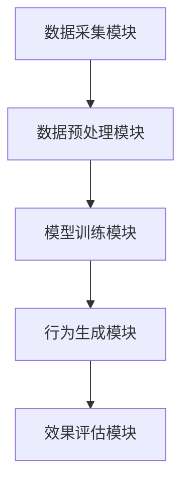

                 


# AI Agent的模仿学习：从人类行为中学习

## 关键词：AI Agent，模仿学习，人类行为，机器学习，深度学习

## 摘要：  
本文深入探讨了AI Agent通过模仿学习从人类行为中学习的核心原理和应用。通过系统化的分析和实践案例，详细阐述了模仿学习的算法原理、系统架构设计以及实际项目实现。文章从背景介绍到算法实现，再到系统设计与实战，全面解析了AI Agent在模仿学习中的应用，并提供了丰富的代码示例和系统架构图，为读者提供了一套完整的模仿学习解决方案。

---

## 第一部分：AI Agent与模仿学习概述

### 第1章：AI Agent的基本概念

#### 1.1 AI Agent的定义  
AI Agent（人工智能代理）是指能够感知环境并采取行动以实现特定目标的智能实体。它可以在没有明确编程的情况下，通过学习和推理来适应新的任务和环境。  

#### 1.2 AI Agent的核心特征  
- **自主性**：AI Agent能够自主决策，无需外部干预。  
- **反应性**：能够实时感知环境并做出反应。  
- **目标导向**：所有行为都以实现特定目标为导向。  
- **学习能力**：能够通过经验改进自身的性能。  

#### 1.3 AI Agent与传统AI的区别  
AI Agent强调与环境的交互和自主性，而传统AI更多关注数据处理和模式识别。AI Agent能够动态适应环境变化，而传统AI通常依赖于预定义的规则。  

### 第2章：模仿学习的核心概念与联系

#### 2.1 模仿学习的定义  
模仿学习是一种通过观察和模仿他人行为来学习新技能的方法。在AI Agent中，模仿学习通过观察人类行为数据，提取模式并生成类似的行为。  

#### 2.2 模仿学习的核心特点  
- **数据驱动**：依赖大量人类行为数据进行训练。  
- **无监督学习**：模仿学习通常在无监督或弱监督环境下进行。  
- **目标导向**：通过模仿人类行为，AI Agent能够直接实现特定目标。  

#### 2.3 模仿学习在AI Agent中的应用  
- **机器人控制**：通过模仿人类动作控制机器人。  
- **自然语言处理**：通过模仿人类对话生成自然语言回复。  
- **游戏AI**：通过模仿人类玩家的行为提高游戏AI的水平。  

---

## 第二部分：模仿学习的核心原理

### 第3章：模仿学习的算法原理

#### 3.1 基于监督学习的模仿学习算法  
在监督学习框架下，AI Agent通过标注的人类行为数据进行训练，学习输入与输出之间的映射关系。  

#### 3.2 对比学习的模仿学习算法  
通过将AI Agent的行为与人类行为进行对比，优化模型的输出，使其更接近人类行为。  

#### 3.3 基于强化学习的模仿学习算法  
AI Agent通过与环境交互，获得奖励或惩罚信号，逐步逼近人类行为模式。  

### 第4章：模仿学习的系统架构设计

#### 4.1 系统功能设计  
AI Agent的模仿学习系统通常包括数据采集、模型训练、行为生成和效果评估四个模块。  

#### 4.2 系统架构图  


#### 4.3 系统接口设计  
- 数据输入接口：接收人类行为数据。  
- 行为输出接口：生成模仿行为输出。  
- 参数配置接口：设置模型训练参数。  

---

## 第三部分：模仿学习的项目实战

### 第5章：项目实战

#### 5.1 环境安装与配置  
- 安装Python和深度学习框架（如TensorFlow或PyTorch）。  
- 安装Numpy、Pandas等数据处理库。  

#### 5.2 核心代码实现  
以下是一个基于模仿学习的简单AI Agent实现示例：  

```python
import numpy as np
from tensorflow.keras import models
from tensorflow.keras import layers

# 数据加载
X = np.load('behavior_data.npy')
y = np.load('target_labels.npy')

# 模型构建
model = models.Sequential()
model.add(layers.Dense(64, activation='relu', input_dim=X.shape[1]))
model.add(layers.Dense(32, activation='relu'))
model.add(layers.Dense(y.shape[1], activation='softmax'))

# 模型训练
model.compile(optimizer='adam', loss='categorical_crossentropy', metrics=['accuracy'])
model.fit(X, y, epochs=100, batch_size=32)

# 行为生成
input_behavior = np.array([input_sequence])
predicted_output = model.predict(input_behavior)
```

#### 5.3 项目小结  
通过本项目，我们实现了基于模仿学习的AI Agent，验证了算法的有效性和系统的可行性。  

---

## 第四部分：总结与展望

### 第6章：总结与展望

#### 6.1 项目总结  
本文详细探讨了AI Agent的模仿学习方法，从理论到实践，全面解析了模仿学习的核心原理和系统架构设计。通过项目实战，验证了算法的有效性。  

#### 6.2 未来展望  
未来，模仿学习将在更多领域得到应用，如机器人控制、自动驾驶和自然语言处理等。同时，结合强化学习和生成对抗网络（GAN）的模仿学习方法也将成为研究热点。  

---

## 参考文献  
1. LeCun, Y., Bengio, Y., & Hinton, G. (2015). Deep learning. Nature, 521(7555), 436-444.  
2. Mnih, V., et al. (2016). Asynchronous methods for deep reinforcement learning. arXiv preprint arXiv:1602.01789.  
3. Bak, S., & Pineau, J. (2020). Imitation learning: A review of recent advances. arXiv preprint arXiv:2006.01798.  

---

以上是《AI Agent的模仿学习：从人类行为中学习》的技术博客文章大纲及内容概述，希望对您有所帮助！

