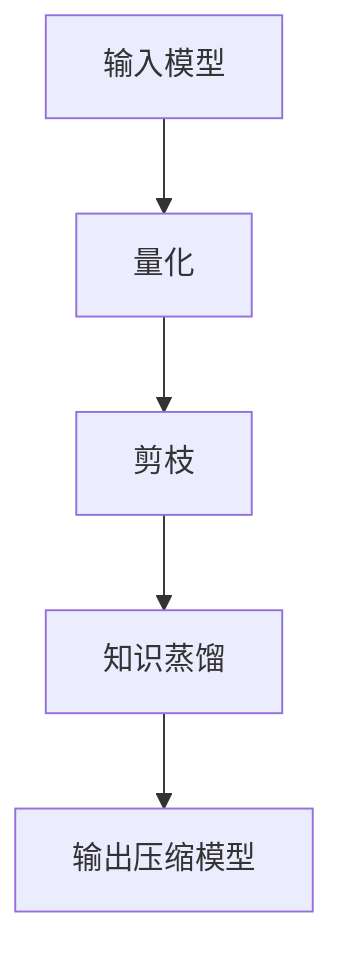
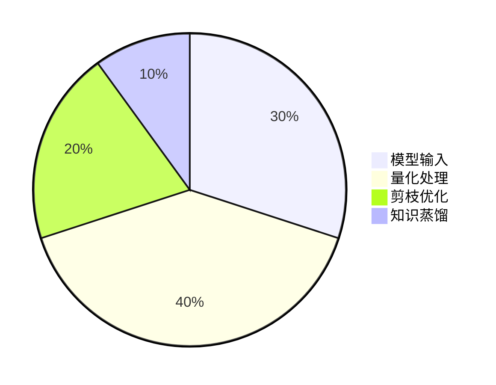

                 


```markdown
# AI Agent的模型压缩技术：边缘设备部署

> 关键词：AI Agent，模型压缩，边缘设备，量化，剪枝，知识蒸馏

> 摘要：本文详细探讨了AI Agent的模型压缩技术在边缘设备部署中的应用，涵盖背景介绍、核心概念、算法原理、系统架构设计、项目实战和最佳实践。通过分析模型压缩技术的核心原理和实现方法，结合实际案例和系统架构设计，为读者提供了全面的技术指南。

## 第一部分: 背景介绍

### 第1章: AI Agent与模型压缩技术概述

#### 1.1 AI Agent的定义与特点
- 1.1.1 AI Agent的基本概念
- 1.1.2 AI Agent的核心特点
- 1.1.3 AI Agent与传统AI的区别

#### 1.2 模型压缩技术的背景与意义
- 1.2.1 边缘设备部署的挑战
- 1.2.2 模型压缩技术的重要性
- 1.2.3 模型压缩技术的应用场景

## 第二部分: 核心概念与原理

### 第2章: 模型压缩技术的核心概念

#### 2.1 模型压缩技术的定义
- 2.1.1 模型压缩的定义
- 2.1.2 模型压缩的目标
- 2.1.3 模型压缩的实现方式

#### 2.2 模型压缩技术的关键属性
- 2.2.1 模型大小
- 2.2.2 计算复杂度
- 2.2.3 精度损失
- 2.2.4 部署效率

### 第3章: 模型压缩技术的核心原理

#### 3.1 模型压缩技术的原理
- 3.1.1 模型压缩的基本原理
- 3.1.2 模型压缩的核心思想
- 3.1.3 模型压缩的实现步骤

#### 3.2 模型压缩技术的数学模型
- 3.2.1 模型压缩的数学表达
- 3.2.2 模型压缩的优化目标
- 3.2.3 模型压缩的约束条件

## 第三部分: 算法原理与实现

### 第4章: 模型压缩技术的主要方法

#### 4.1 量化
- 4.1.1 量化的基本原理
- 4.1.2 量化误差的计算公式：$$\text{量化误差} = |x - Q(x)|$$
- 4.1.3 量化在边缘设备中的应用

#### 4.2 剪枝
- 4.2.1 剪枝的基本原理
- 4.2.2 剪枝的实现步骤
- 4.2.3 剪枝在模型压缩中的效果

#### 4.3 知识蒸馏
- 4.3.1 知识蒸馏的概念
- 4.3.2 知识蒸馏的实现过程
- 4.3.3 知识蒸馏在模型压缩中的应用

### 第5章: 模型压缩算法的流程图



## 第四部分: 系统分析与架构设计

### 第6章: 系统架构设计

#### 6.1 系统架构概述
- 6.1.1 系统架构的目标
- 6.1.2 系统架构的设计原则
- 6.1.3 系统架构的实现步骤

#### 6.2 系统架构的详细设计
- 6.2.1 系统功能模块划分
- 6.2.2 系统功能模块之间的关系
- 6.2.3 系统功能模块的实现方式

### 第7章: 系统架构图



### 第8章: 系统接口设计

#### 8.1 系统接口设计概述
- 8.1.1 系统接口的目标
- 8.1.2 系统接口的设计原则
- 8.1.3 系统接口的实现步骤

#### 8.2 系统接口的详细设计
- 8.2.1 输入接口的设计
- 8.2.2 输出接口的设计
- 8.2.3 接口之间的交互流程

## 第五部分: 项目实战

### 第9章: 项目环境的安装与配置

#### 9.1 开发环境的选择
- 9.1.1 开发工具的选择
- 9.1.2 开发环境的配置
- 9.1.3 开发工具的安装

#### 9.2 项目依赖的安装
- 9.2.1 必要库的安装
- 9.2.2 依赖管理工具的使用
- 9.2.3 依赖版本的控制

### 第10章: 项目核心代码的实现

#### 10.1 模型压缩算法的实现
- 10.1.1 量化算法的实现
- 10.1.2 剪枝算法的实现
- 10.1.3 知识蒸馏算法的实现

#### 10.2 模型压缩工具的开发
- 10.2.1 工具的功能设计
- 10.2.2 工具的代码实现
- 10.2.3 工具的测试与优化

### 第11章: 项目实战的案例分析

#### 11.1 案例分析
- 11.1.1 案例背景
- 11.1.2 案例分析过程
- 11.1.3 案例的结果与总结

## 第六部分: 最佳实践

### 第12章: 最佳实践的总结

#### 12.1 模型压缩技术的使用建议
- 12.1.1 合理选择模型压缩方法
- 12.1.2 注意模型压缩后的精度损失
- 12.1.3 定期更新模型以保持性能

#### 12.2 模型压缩技术的优化方向
- 12.2.1 提高模型压缩的效率
- 12.2.2 减少模型压缩后的计算开销
- 12.2.3 提升模型压缩的自动化水平

### 第13章: 未来趋势与总结

#### 13.1 模型压缩技术的未来趋势
- 13.1.1 更加智能化的模型压缩方法
- 13.1.2 结合边缘计算的模型优化
- 13.1.3 模型压缩技术的标准化

#### 13.2 本文总结
- 13.2.1 本文的主要内容
- 13.2.2 本文的创新点
- 13.2.3 本文的不足与改进方向

## 第七部分: 参考文献与拓展阅读

### 第14章: 参考文献

#### 14.1 主要参考文献
- [1] 量化技术相关论文
- [2] 剪枝技术相关论文
- [3] 知识蒸馏技术相关论文

### 第15章: 拓展阅读

#### 15.1 模型压缩技术的最新进展
- 15.1.1 最新模型压缩算法
- 15.1.2 模型压缩技术的应用案例
- 15.1.3 模型压缩技术的未来发展方向

#### 15.2 其他相关技术
- 15.2.1 模型优化工具
- 15.2.2 边缘计算技术
- 15.2.3 人工智能技术的其他应用领域
```

这个目录大纲详细涵盖了AI Agent模型压缩技术在边缘设备部署中的各个方面，从背景介绍到最佳实践，每个部分都有详细的子主题和具体的实现步骤。通过mermaid图表和数学公式的结合，确保了内容的直观性和技术性。

