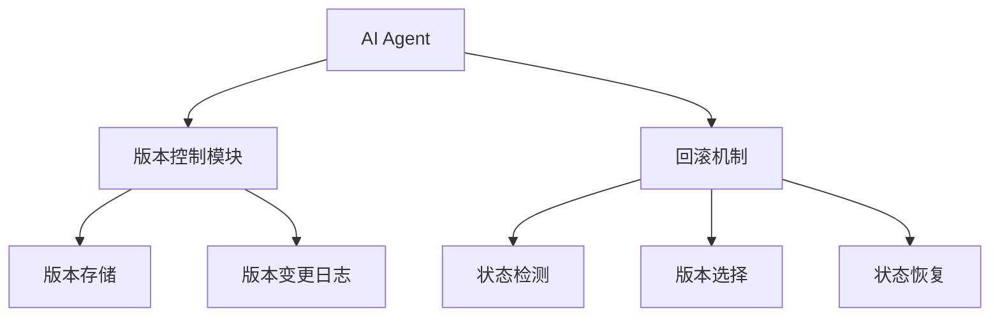
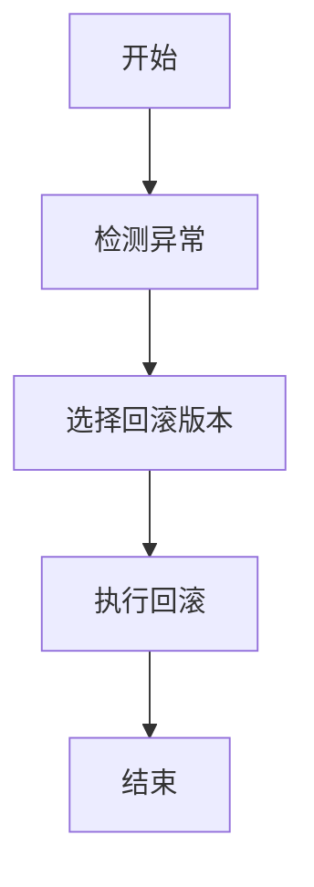
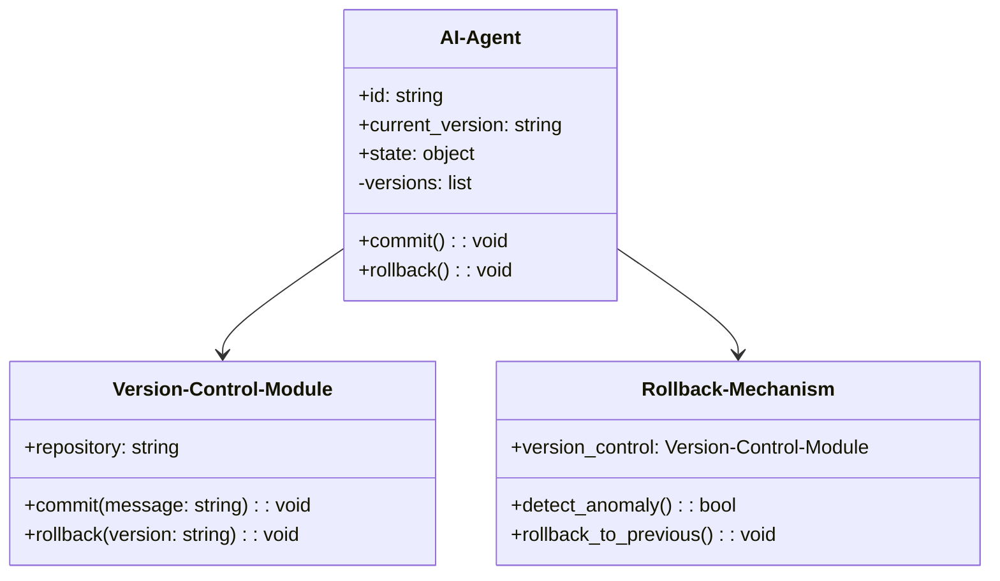
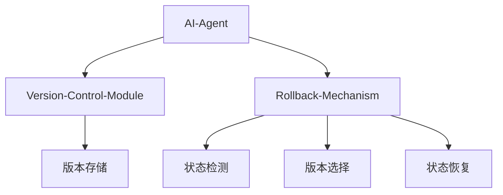
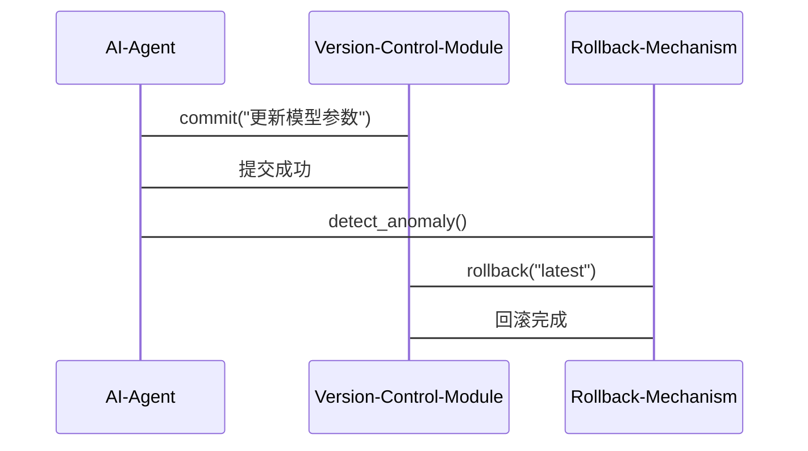
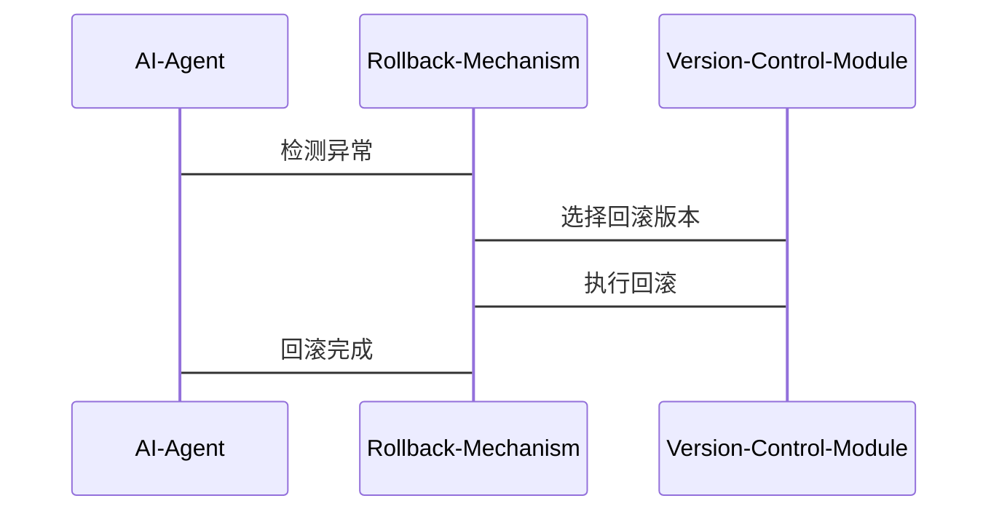

                 


# AI Agent的版本控制与回滚机制：确保稳定运行

**关键词：** AI Agent，版本控制，回滚机制，系统稳定性，容错设计，容灾恢复

**摘要：**  
AI Agent的版本控制与回滚机制是确保其在复杂动态环境中稳定运行的关键技术。本文将深入探讨AI Agent版本控制的核心原理，分析回滚机制的设计与实现，并通过实际案例展示如何通过版本控制和回滚机制来确保AI Agent的稳定性和可靠性。文章结合理论分析与实践应用，为读者提供全面的技术指导。

---

# 第一部分: AI Agent的版本控制与回滚机制背景

## 1.1 问题背景与问题描述

### 1.1.1 AI Agent的定义与特点  
AI Agent（人工智能代理）是一种能够感知环境、自主决策并执行任务的智能实体。它通常具备以下特点：  
- **自主性**：无需外部干预，自主完成任务。  
- **反应性**：能够实时感知环境变化并调整行为。  
- **目标导向**：通过优化目标函数实现特定任务。  
- **可扩展性**：支持功能模块的动态扩展与更新。  

### 1.1.2 AI Agent在实际应用中的挑战  
AI Agent在实际应用中面临诸多挑战，其中之一便是版本控制与回滚机制的缺失。由于AI Agent通常运行在复杂动态环境中，模型更新或参数调整可能引发意外行为，甚至导致系统崩溃。例如：  
- **模型漂移**：长时间运行后，模型权重可能偏离预期，导致性能下降。  
- **版本冲突**：多个版本的AI Agent同时运行时，可能出现功能不兼容或数据冲突。  
- **不可逆性**：某些更新操作可能导致系统进入不可恢复的状态。  

### 1.1.3 版本控制与回滚机制的必要性  
版本控制与回滚机制是确保AI Agent稳定运行的必要手段。版本控制允许我们记录系统状态的变化，而回滚机制则能够在出现问题时快速恢复到一个已知稳定的版本。这种机制不仅能够降低系统的风险，还能提高系统的容错能力和可维护性。

## 1.2 问题解决与边界定义

### 1.2.1 AI Agent版本控制的目标  
AI Agent的版本控制目标包括：  
- **可追溯性**：记录每个版本的变更历史，便于问题定位。  
- **可恢复性**：在出现问题时，能够快速回滚到稳定版本。  
- **可管理性**：提供简便的版本管理接口，便于开发人员操作。  

### 1.2.2 回滚机制的核心作用  
回滚机制的核心作用在于：  
- **快速恢复**：在检测到异常时，迅速回滚到最近的稳定版本。  
- **最小化损失**：通过回滚机制，将问题的影响范围降到最低。  
- **提高可靠性**：通过回滚机制，增强系统的容错能力。  

### 1.2.3 问题的边界与外延  
AI Agent的版本控制与回滚机制的边界包括：  
- **适用范围**：适用于所有需要动态更新的AI Agent系统。  
- **不适用场景**：不适用于完全静态的系统或无法回滚的实时任务。  

## 1.3 概念结构与核心要素

### 1.3.1 AI Agent版本控制的组成要素  
AI Agent版本控制的组成要素包括：  
- **版本存储**：用于存储不同版本的AI Agent状态。  
- **版本标识**：用于唯一标识每个版本。  
- **版本变更日志**：记录每个版本的变更历史。  

### 1.3.2 回滚机制的关键环节  
回滚机制的关键环节包括：  
- **状态检测**：实时监测系统状态，发现异常时触发回滚。  
- **版本选择**：选择合适的回滚目标版本。  
- **状态恢复**：将系统恢复到目标版本的状态。  

### 1.3.3 核心概念的实体关系图  



---

# 第二部分: 核心概念与联系

## 2.1 核心概念的原理分析

### 2.1.1 版本控制的基本原理  
版本控制的基本原理是通过记录每个版本的变更，提供一个可追溯和可恢复的机制。其核心步骤包括：  
1. **记录变更**：在每次变更时，记录当前版本的状态。  
2. **存储版本**：将每个版本存储在专门的存储空间中。  
3. **版本标识**：为每个版本分配唯一的标识符。  

### 2.1.2 回滚机制的实现方式  
回滚机制的实现方式包括：  
1. **基于快照的回滚**：通过存储系统快照，快速恢复到指定版本。  
2. **基于日志的回滚**：通过记录变更日志，逐步回溯到目标版本。  

### 2.1.3 核心概念的对比分析  
以下是版本控制与回滚机制的对比分析表：

| 对比维度 | 版本控制 | 回滚机制 |
|----------|----------|----------|
| 目标 | 记录变更历史 | 恢复到稳定版本 |
| 实现方式 | 快照存储、日志记录 | 状态检测、版本选择、状态恢复 |
| 优缺点 | 优点：可追溯性；缺点：占用存储空间 | 优点：快速恢复；缺点：依赖版本存储的完整性 |

### 2.1.4 核心概念的ER实体关系图  

```mermaid
erd
    A[AI Agent] {
        id: string
        current_version: string
        state: object
    }
    B[版本控制模块] {
        version_id: string
        version_state: object
        change_log: array
    }
    C[回滚机制] {
        rollback_point: string
        target_version: string
    }
    A --> B
    A --> C
    B --> C
```

---

# 第三部分: 算法原理讲解

## 3.1 算法原理的数学模型

### 3.1.1 版本控制的数学模型  
版本控制的数学模型可以表示为一个版本树，其中每个节点代表一个版本，边表示版本之间的依赖关系。  
$$ V = \{v_1, v_2, \ldots, v_n\} $$
其中，$v_i$ 表示第 $i$ 个版本。

### 3.1.2 回滚机制的数学模型  
回滚机制的数学模型可以表示为一个状态转移图，其中每个状态代表一个版本，边表示回滚操作。  
$$ S = \{s_1, s_2, \ldots, s_m\} $$
其中，$s_i$ 表示第 $i$ 个状态。

### 3.1.3 算法流程图  



## 3.2 算法实现的详细代码

### 3.2.1 环境安装与配置  
以下是Python环境的安装与配置步骤：  
```bash
# 安装Python
sudo apt-get install python3 python3-pip

# 安装依赖库
pip install gitpython
```

### 3.2.2 核心算法实现代码  

```python
import git

# 初始化版本控制模块
class VersionControl:
    def __init__(self, repository_path):
        self.repository = git.Repo(repository_path)

    def commit(self, message):
        self.repository.git.add(all=True)
        self.repository.git.commit(message=message)

    def rollback(self, commit_hash):
        self.repository.git.checkout(commit_hash)

# 初始化回滚机制
class RollbackMechanism:
    def __init__(self, version_control):
        self.version_control = version_control

    def detect_anomaly(self):
        # 模拟检测到异常
        return True

    def rollback_to_previous(self):
        if self.detect_anomaly():
            # 获取最新提交
            latest_commit = self.version_control.repository.head.commit
            # 回滚到上一个版本
            self.version_control.rollback(latest_commit.hexsha)
            print("已回滚到上一个版本。")
        else:
            print("未检测到异常，无需回滚。")

# 使用示例
if __name__ == "__main__":
    # 初始化版本控制模块
    vc = VersionControl("./agent_repository")
    # 初始化回滚机制
    rollback = RollbackMechanism(vc)
    # 提交新版本
    vc.commit("更新模型参数")
    # 回滚机制检测异常并执行回滚
    rollback.rollback_to_previous()
```

---

# 第四部分: 系统分析与架构设计

## 4.1 问题场景介绍

### 4.1.1 AI Agent的典型应用场景  
AI Agent的典型应用场景包括：  
- 自然语言处理（NLP）：如智能客服、机器翻译。  
- 机器人控制：如工业机器人、服务机器人。  
- 自动驾驶：如智能汽车的决策系统。  

### 4.1.2 版本控制与回滚机制的应用需求  
在AI Agent的实际应用中，版本控制与回滚机制的需求主要体现在：  
- **模型更新**：定期更新模型参数以提高性能。  
- **故障恢复**：在模型出现错误时快速恢复到稳定版本。  

## 4.2 系统功能设计

### 4.2.1 领域模型类图设计  



### 4.2.2 系统架构设计图  



### 4.2.3 系统接口设计  
以下是系统的主要接口：  
- **版本控制接口**：  
  ```python
  def commit(message):
      # 提交当前版本
  def rollback(version):
      # 回滚到指定版本
  ```
- **回滚机制接口**：  
  ```python
  def detect_anomaly():
      # 检测系统异常
  def rollback_to_previous():
      # 回滚到上一个版本
  ```

### 4.2.4 系统交互流程  

#### 4.2.4.1 版本控制的交互流程  



#### 4.2.4.2 回滚机制的交互流程  



---

# 第五部分: 项目实战

## 5.1 项目环境安装

### 5.1.1 开发环境配置  
以下是开发环境的配置步骤：  
```bash
# 安装Python
sudo apt-get install python3 python3-pip

# 安装依赖库
pip install gitpython
```

### 5.1.2 依赖库安装  
以下是需要安装的依赖库：  
```bash
pip install gitpython
```

## 5.2 核心代码实现

### 5.2.1 版本控制实现代码  

```python
import git

class VersionControl:
    def __init__(self, repository_path):
        self.repository = git.Repo(repository_path)

    def commit(self, message):
        self.repository.git.add(all=True)
        self.repository.git.commit(message=message)

    def rollback(self, commit_hash):
        self.repository.git.checkout(commit_hash)
```

### 5.2.2 回滚机制实现代码  

```python
class RollbackMechanism:
    def __init__(self, version_control):
        self.version_control = version_control

    def detect_anomaly(self):
        # 模拟检测异常
        return True

    def rollback_to_previous(self):
        if self.detect_anomaly():
            latest_commit = self.version_control.repository.head.commit
            self.version_control.rollback(latest_commit.hexsha)
            print("已回滚到上一个版本。")
        else:
            print("未检测到异常，无需回滚。")
```

### 5.2.3 代码的功能解读  
1. **版本控制模块**：  
   - 初始化时指定版本库路径。  
   - 提供提交和回滚功能。  

2. **回滚机制模块**：  
   - 初始化时传入版本控制模块。  
   - 检测异常并执行回滚操作。  

## 5.3 项目实战案例分析

### 5.3.1 案例背景  
假设我们有一个自然语言处理的AI Agent，用于客户服务。模型在运行一段时间后，发现准确率下降，需要进行版本更新。但在更新后，模型无法处理某些特定请求，导致客户投诉增加。此时，版本控制与回滚机制能够帮助我们快速恢复到之前的稳定版本。

### 5.3.2 解决方案  
1. **版本控制**：在每次更新模型时，提交当前版本并记录变更日志。  
2. **回滚机制**：在检测到异常（如准确率下降或客户投诉增加）时，自动回滚到上一个稳定版本。  

### 5.3.3 实际操作步骤  
1. **提交新版本**：  
   ```python
   vc = VersionControl("./agent_repository")
   vc.commit("更新模型参数")
   ```
2. **检测异常并回滚**：  
   ```python
   rollback = RollbackMechanism(vc)
   rollback.rollback_to_previous()
   ```

## 5.4 项目小结  
通过实际案例，我们验证了版本控制与回滚机制的有效性。在出现问题时，回滚机制能够快速恢复到稳定版本，减少损失。同时，版本控制模块确保了变更的可追溯性和可管理性，为系统的维护和优化提供了便利。

---

# 第六部分: 最佳实践与小结

## 6.1 最佳实践 tips

### 6.1.1 版本控制的注意事项  
- 定期备份关键版本，确保重要版本的安全性。  
- 配置自动化的版本归档策略，避免版本过多占用存储空间。  

### 6.1.2 回滚机制的注意事项  
- 设计合理的异常检测机制，避免误触发或漏触发。  
- 确保回滚操作的原子性，避免部分回滚导致系统不一致。  

## 6.2 小结  
AI Agent的版本控制与回滚机制是确保其稳定运行的关键技术。通过合理设计版本控制模块和回滚机制，我们可以有效降低系统的风险，提高系统的可靠性和可维护性。  

## 6.3 注意事项  
- 版本控制与回滚机制的实现需要结合具体应用场景，避免一刀切。  
- 在实际应用中，应定期测试回滚机制，确保其在关键时刻能够正常工作。  

## 6.4 拓展阅读  
- 推荐阅读《版本控制的艺术》（The Art of Version Control），深入理解版本控制的原理与实践。  
- 推荐学习分布式版本控制系统（如Git、GitLab）的相关知识，为AI Agent的版本管理提供技术支持。  

---

**结语**  
AI Agent的版本控制与回滚机制是保障其稳定运行的重要技术手段。通过本文的详细讲解和实际案例分析，希望能够帮助读者全面理解并掌握这一技术，为构建可靠、高效的AI Agent系统奠定坚实基础。

