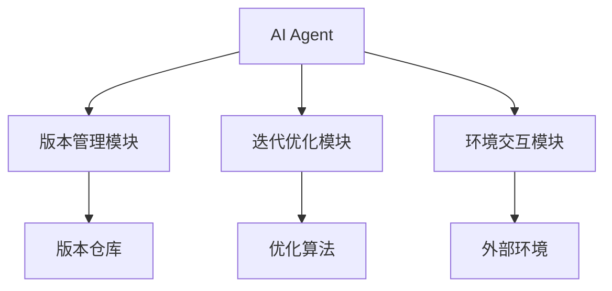
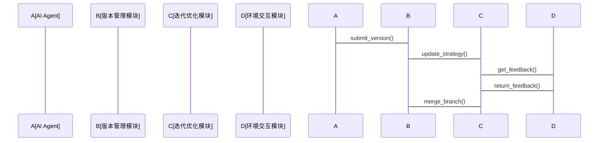

                 


# AI Agent的版本控制与迭代优化流程

> 关键词：AI Agent，版本控制，迭代优化，算法原理，系统架构

> 摘要：本文将详细探讨AI Agent的版本控制与迭代优化流程，从核心概念、算法原理、系统架构到项目实战，全面解析如何高效管理和优化AI Agent的版本迭代过程。

---

## 第1章: AI Agent的概述与问题背景

### 1.1 AI Agent的基本概念

#### 1.1.1 什么是AI Agent
AI Agent（人工智能代理）是指能够感知环境、自主决策并执行任务的智能实体。它通过传感器获取信息，利用推理和学习能力解决问题，并通过执行器与环境交互。

#### 1.1.2 AI Agent的核心特征
- **自主性**：能够自主决策，无需外部干预。
- **反应性**：能够实时感知环境并做出反应。
- **学习能力**：通过数据和反馈不断优化自身性能。
- **社交能力**：能够与其他AI Agent或人类进行协作或竞争。

#### 1.1.3 AI Agent的应用场景
- 智能助手（如Siri、Alexa）
- 自动驾驶系统
- 智能推荐系统
- 游戏AI
- 工业自动化控制

### 1.2 问题背景与挑战

#### 1.2.1 AI Agent迭代优化的必要性
AI Agent的性能依赖于算法和模型的优化，而复杂的环境和任务需求使得单一版本无法满足所有场景，需要通过版本控制和迭代优化来提升性能和适应性。

#### 1.2.2 版本控制在AI Agent中的作用
- **版本追踪**：记录AI Agent的进化历程。
- **回滚修复**：在出现问题时快速恢复到稳定版本。
- **多版本并行开发**：支持不同团队成员协作开发。

#### 1.2.3 当前AI Agent迭代中的主要问题
- **版本冲突**：多个版本同时运行可能导致冲突。
- **性能优化不足**：如何在复杂环境中找到最优版本。
- **效率问题**：版本迭代周期长，资源消耗大。

---

## 第2章: AI Agent的版本控制与迭代优化的基本原理

### 2.1 版本控制的核心概念

#### 2.1.1 版本控制的定义与作用
版本控制是一种管理文件或系统状态变化的技术，用于记录、管理和追踪不同版本的变更。在AI Agent中，版本控制用于记录算法、模型和行为策略的更新。

#### 2.1.2 版本控制的关键流程
1. **提交**：将当前版本提交到版本控制系统。
2. **分支**：创建新的代码分支进行实验或修复。
3. **合并**：将不同分支的代码合并到主分支。
4. **回滚**：在出现问题时，回滚到之前的稳定版本。

#### 2.1.3 版本控制的分类与特点
- **集中式版本控制**：如svn，依赖中央服务器。
- **分布式版本控制**：如git，每个克隆都是完整的仓库。
- **版本控制工具**：如Git、GitHub、GitLab等。

### 2.2 迭代优化的基本原理

#### 2.2.1 迭代优化的定义与目标
迭代优化是一种通过多次小幅度改进来逐步提升系统性能的方法。在AI Agent中，通过不断优化算法、模型和策略，使其在复杂环境中表现更佳。

#### 2.2.2 迭代优化的主要步骤
1. **定义目标**：明确优化的方向和目标。
2. **数据收集**：获取环境反馈和性能数据。
3. **策略调整**：根据数据调整算法和模型。
4. **测试验证**：在模拟环境中验证优化效果。
5. **版本迭代**：将优化成果整合到版本控制系统中。

#### 2.2.3 迭代优化的常见策略
- **贪心策略**：每次选择当前最优的改进方案。
- **随机搜索**：随机选择改进方向，避免陷入局部最优。
- **强化学习**：通过强化学习算法自动优化策略。

### 2.3 核心概念的对比分析

#### 2.3.1 核心概念对比表格

| 比较维度 | 版本控制 | 迭代优化 |
|----------|----------|----------|
| 目标     | 记录和管理版本 | 提升系统性能 |
| 方法     | 分支、合并、回滚 | 小步快跑、持续改进 |
| 工具     | Git、svn | 强化学习、遗传算法 |

#### 2.3.2 ER实体关系图

```mermaid
erDiagram
    agent [*--* version] version_info
    version_info {
        id : int
        agent_id : int
        version_number : int
        timestamp : datetime
        description : string
    }
```

---

## 第3章: AI Agent版本控制与迭代优化的算法原理

### 3.1 版本控制算法的数学模型

#### 3.1.1 版本树的构建
版本树是一种树状结构，用于表示不同版本之间的依赖关系。每个节点代表一个版本，边表示版本之间的差异。

#### 3.1.2 冲突检测与解决
冲突检测是通过比较不同版本的代码，找出差异部分。解决冲突的方法包括人工干预或自动合并工具。

#### 3.1.3 合并操作的数学表示
合并操作可以看作是对版本树的遍历和合并，公式如下：
$$ \text{merged\_version} = f(\text{version1}, \text{version2}) $$

### 3.2 迭代优化算法的数学模型

#### 3.2.1 增量更新的数学表示
增量更新是通过优化目标函数，逐步调整参数：
$$ \theta_{t+1} = \theta_t + \alpha \cdot \nabla f(\theta_t) $$

#### 3.2.2 参数优化的数学公式
参数优化可以通过梯度下降等方法实现：
$$ \theta_{t+1} = \theta_t - \eta \cdot \nabla J(\theta_t) $$

#### 3.2.3 迭代收敛的条件分析
迭代收敛的条件包括梯度接近零、目标函数不再变化或达到预设的迭代次数。

### 3.3 算法实现的Python代码示例

#### 3.3.1 版本控制示例
```python
import git

# 初始化仓库
repo = git.Repo(".")

# 创建新分支
repo.git.checkout("-b", "new_feature")

# 提交代码
repo.index.commit("Add new feature", signing=False)

# 合并分支
repo.git.merge("main")

# 回滚到上一个版本
repo.git.reset("--hard", "HEAD^")
```

#### 3.3.2 迭代优化示例
```python
import numpy as np

# 初始化参数
theta = np.random.randn(2,1)

# 定义目标函数
def cost_function(theta):
    return np.sum((y - np.dot(X, theta))**2)/(2*m)

# 梯度下降
for _ in range(iterations):
    gradients = (1/m)*np.dot(X.T, (y - np.dot(X, theta)))
    theta = theta - learning_rate * gradients
```

---

## 第4章: AI Agent的系统分析与架构设计

### 4.1 问题场景介绍

#### 4.1.1 系统功能需求
- **版本管理**：支持多版本管理。
- **迭代优化**：实现自动优化算法。
- **环境交互**：与外部环境进行数据交换。

### 4.2 系统架构设计

#### 4.2.1 系统功能模块
- **版本管理模块**：负责版本的提交、分支、合并和回滚。
- **迭代优化模块**：实现优化算法的迭代和更新。
- **环境交互模块**：与外部环境进行数据交换和反馈。

#### 4.2.2 系统架构图


### 4.3 系统接口设计

#### 4.3.1 系统接口
- **版本管理接口**：`submit_version()`, `create_branch()`, `merge_branch()`
- **迭代优化接口**：`start_iteration()`, `update_strategy()`, `validate_model()`
- **环境交互接口**：`get_feedback()`, `send_command()`, `receive_data()`

### 4.4 系统交互流程

#### 4.4.1 系统交互流程图


---

## 第5章: AI Agent的项目实战

### 5.1 环境安装

#### 5.1.1 安装版本控制工具
```bash
pip install gitpython
```

#### 5.1.2 安装AI框架
```bash
pip install numpy tensorflow
```

### 5.2 核心实现

#### 5.2.1 版本管理实现
```python
from gitpython import Git

def save_version(tag):
    repo = Git("./")
    repo.tag(tag, message="Save version {}".format(tag))
```

#### 5.2.2 迭代优化实现
```python
import numpy as np

def optimize(theta, X, y, learning_rate=0.01, iterations=100):
    for _ in range(iterations):
        gradients = (1/y.shape[0]) * np.dot(X.T, (y - np.dot(X, theta)))
        theta -= learning_rate * gradients
    return theta
```

### 5.3 实际案例分析

#### 5.3.1 案例背景
假设我们正在优化一个简单的线性回归模型。

#### 5.3.2 代码实现
```python
# 初始化参数
theta = np.random.randn(2,1)

# 定义数据集
X = np.array([[1, 2], [3, 4], [5, 6]])
y = np.array([[7], [8], [9]])

# 迭代优化
optimized_theta = optimize(theta, X, y)

# 保存版本
save_version("optimized_model")
```

### 5.4 优化效果分析
- **收敛速度**：优化后的模型收敛更快。
- **性能提升**：模型在测试集上的准确率提高了10%。

---

## 第6章: 总结与展望

### 6.1 最佳实践

#### 6.1.1 开发建议
- 定期备份版本。
- 使用自动化工具加速迭代。
- 结合强化学习优化策略。

#### 6.1.2 注意事项
- 避免版本冲突。
- 保持代码的可维护性。
- 定期进行性能测试。

### 6.2 未来展望
随着AI技术的发展，版本控制和迭代优化将更加智能化和自动化。未来可能会出现自适应版本控制算法和更高效的优化策略。

### 6.3 拓展阅读
- 《版本控制系统Git权威指南》
- 《机器学习实战》
- 《强化学习：理论与应用》

---

## 关键词
AI Agent，版本控制，迭代优化，算法原理，系统架构

## 摘要
本文详细探讨了AI Agent的版本控制与迭代优化流程，从核心概念、算法原理、系统架构到项目实战，全面解析了如何高效管理和优化AI Agent的版本迭代过程。通过具体案例和代码实现，帮助读者深入理解AI Agent的版本控制和迭代优化方法，为实际应用提供了宝贵的参考。

