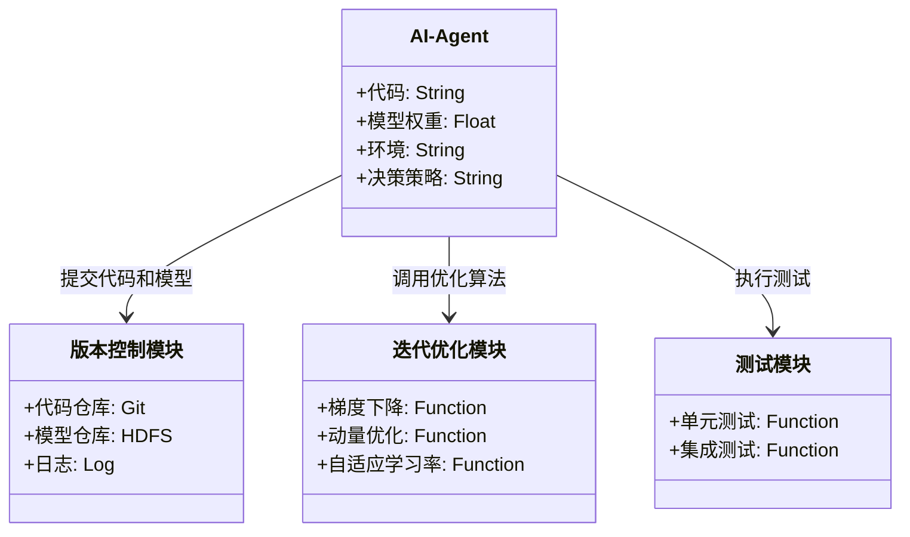
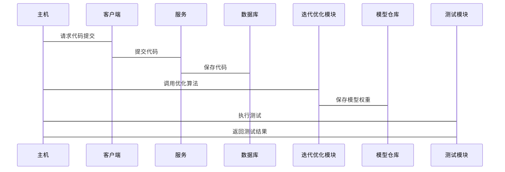

                 


# AI Agent的版本控制与迭代优化策略

> 关键词：AI Agent, 版本控制, 迭代优化, 系统架构, 优化策略

> 摘要：AI Agent的版本控制与迭代优化是人工智能领域的重要研究方向。本文从AI Agent的基本概念出发，详细探讨了版本控制的原理与实现，分析了迭代优化的策略与方法，并提出了基于系统架构设计的优化方案。通过实际案例分析和数学模型推导，本文为AI Agent的开发与优化提供了理论依据和实践指导。

---

# 第一部分: AI Agent的版本控制与迭代优化背景

## 第1章: AI Agent的版本控制与迭代优化概述

### 1.1 AI Agent的基本概念

#### 1.1.1 AI Agent的定义与核心特征
AI Agent（人工智能代理）是指能够感知环境、自主决策并执行任务的智能实体。其核心特征包括：
- **自主性**：能够在无外部干预的情况下独立运行。
- **反应性**：能够实时感知环境并做出响应。
- **目标导向性**：基于目标驱动行为。
- **学习能力**：通过数据和经验不断优化性能。

#### 1.1.2 AI Agent的分类与应用场景
AI Agent可以分为以下几类：
- **简单反射型**：基于规则的反应式代理。
- **基于模型的反射型**：结合内部模型进行决策。
- **目标驱动型**：以目标为导向进行规划和执行。
- **实用驱动型**：基于效用函数进行优化。

应用场景包括自动驾驶、智能助手、机器人控制、推荐系统等。

#### 1.1.3 AI Agent版本控制的必要性
随着AI Agent的复杂性不断提高，版本控制变得至关重要：
- **代码版本管理**：确保代码的可追溯性和可恢复性。
- **模型权重管理**：不同版本的模型权重需要妥善保存。
- **数据版本管理**：训练数据的更新和版本也需要控制。

### 1.2 AI Agent迭代优化的背景与挑战

#### 1.2.1 AI Agent的迭代优化需求
AI Agent需要不断优化以适应动态环境，主要优化方向包括：
- **性能优化**：提升响应速度和准确性。
- **模型优化**：优化模型结构和参数。
- **策略优化**：改进决策策略。

#### 1.2.2 迭代优化中的主要挑战
- **复杂性**：AI Agent的优化涉及算法、数据和模型的协同优化。
- **实时性**：需要在动态环境中快速迭代。
- **资源约束**：计算资源有限，需要高效优化方法。

#### 1.2.3 企业级AI Agent开发的特点
企业级AI Agent开发通常具有以下特点：
- **多团队协作**：开发团队庞大，版本控制需求复杂。
- **高可用性**：要求系统高度稳定。
- **可扩展性**：需要支持快速迭代和功能扩展。

---

# 第二部分: AI Agent版本控制的核心概念与原理

## 第2章: 版本控制的基本原理

### 2.1 版本控制的定义与分类

#### 2.1.1 集中式版本控制与分布式版本控制
- **集中式版本控制**：所有文件的版本都存储在中央服务器，如 SVN。
- **分布式版本控制**：每个开发者都有自己的本地仓库，如 Git。

对比分析：
| 特性          | 集中式版本控制 | 分布式版本控制 |
|---------------|----------------|----------------|
| 依赖中心服务器 | 是            | 否            |
| 离线开发能力 | 无            | 有            |
| 分支管理效率 | 低            | 高            |

#### 2.1.2 常见版本控制工具对比
- **Git**：分布式版本控制工具，支持高效的分支管理和合并。
- **SVN**：集中式版本控制工具，适合团队协作。

对比分析：
| 特性         | Git             | SVN            |
|--------------|-----------------|----------------|
| 分支管理     | 高效            | 低效            |
| 网络依赖     | 低              | 高              |

#### 2.1.3 版本控制的核心功能
- **检出（Checkout）**：获取代码的某个版本。
- **提交（Commit）**：保存当前版本的修改。
- **合并（Merge）**：将不同分支的代码合并到一起。
- **回滚（Rollback）**：恢复到之前的某个版本。

### 2.2 AI Agent版本控制的特殊性

#### 2.2.1 AI Agent代码的复杂性
AI Agent的代码通常包含以下部分：
- **感知模块**：负责环境数据的采集。
- **决策模块**：负责策略的选择和优化。
- **执行模块**：负责动作的执行。

代码结构复杂，版本控制需要考虑模块之间的依赖关系。

#### 2.2.2 模型权重与数据版本管理
- **模型权重**：神经网络模型的权重需要定期备份。
- **训练数据**：训练数据的更新也需要版本控制。
- **模型版本管理**：需要记录每个版本的模型性能指标。

#### 2.2.3 多团队协作中的版本控制策略
- **分支策略**：主分支用于稳定版本，特性分支用于功能开发。
- **代码审查**：通过代码审查确保代码质量。
- **自动化测试**：自动化测试确保新版本的稳定性。

### 2.3 版本控制的数学模型与公式

#### 2.3.1 版本树的构建原理
版本树可以表示为一棵树，其中每个节点代表一个版本。树的结构反映了代码的分支和合并情况。

#### 2.3.2 分支与合并的数学模型
分支和合并操作可以用图论中的树结构表示。每个分支对应一棵子树，合并操作则是将两棵子树合并为一棵树。

#### 2.3.3 版本冲突解决的算法
版本冲突解决的算法基于文件内容的差异性，可以采用以下策略：
- **优先保留最新版本**：保留最新的修改。
- **基于投票的冲突解决**：通过投票机制决定保留哪个版本。

---

## 第3章: AI Agent迭代优化的策略与方法

### 3.1 AI Agent迭代优化的基本原理

#### 3.1.1 迭代优化的核心概念
迭代优化是指通过不断更新模型参数或算法策略来提升AI Agent的性能。常见的迭代优化方法包括梯度下降、动量优化和自适应学习率优化。

#### 3.1.2 基于反馈的优化方法
基于反馈的优化方法通过环境反馈不断调整模型参数。例如，在强化学习中，通过奖励函数指导模型的优化。

#### 3.1.3 模型更新与版本控制的结合
模型更新需要与版本控制结合，确保每次优化都有可追溯的记录。

### 3.2 常见迭代优化算法

#### 3.2.1 随机梯度下降算法
随机梯度下降算法（SGD）是一种常用的一阶优化算法，适用于大规模数据集。

- **算法流程**：
  1. 随机选择一个样本。
  2. 计算梯度。
  3. 更新参数。

- **数学公式**：
  $$\theta_{t+1} = \theta_t - \eta \cdot \nabla J(\theta_t)$$
  其中，$\theta$表示参数，$\eta$表示学习率，$\nabla J$表示损失函数的梯度。

#### 3.2.2 动量优化算法
动量优化算法（Momentum）通过引入动量项加速收敛。

- **算法流程**：
  1. 计算梯度。
  2. 更新动量。
  3. 更新参数。

- **数学公式**：
  $$v_{t+1} = \beta v_t + (1-\beta) \cdot \nabla J(\theta_t)$$
  $$\theta_{t+1} = \theta_t - \eta \cdot v_{t+1}$$
  其中，$v$表示动量，$\beta$表示动量系数。

#### 3.2.3 自适应学习率优化算法
自适应学习率优化算法（如Adam）通过自适应调整学习率来加速收敛。

- **算法流程**：
  1. 计算梯度。
  2. 计算动量和方差。
  3. 调整学习率。
  4. 更新参数。

- **数学公式**：
  $$m_{t+1} = \beta_1 m_t + (1-\beta_1) \cdot \nabla J(\theta_t)$$
  $$n_{t+1} = \beta_2 n_t + (1-\beta_2) \cdot (\nabla J(\theta_t))^2$$
  $$\theta_{t+1} = \theta_t - \eta \cdot \frac{m_{t+1}}{\sqrt{n_{t+1}} + \epsilon}$$
  其中，$m$表示动量，$n$表示方差，$\beta_1$和$\beta_2$表示动量系数，$\epsilon$表示防止除以零的常数。

### 3.3 AI Agent迭代优化的数学模型

#### 3.3.1 梯度下降的数学推导
梯度下降的数学推导基于优化理论，目标是最小化损失函数$J(\theta)$。

$$\theta_{t+1} = \theta_t - \eta \cdot \nabla J(\theta_t)$$

其中，$\eta$是学习率，$\nabla J$是损失函数的梯度。

#### 3.3.2 动量优化的公式表示
动量优化通过引入动量项$v$来加速收敛：

$$v_{t+1} = \beta v_t + (1-\beta) \cdot \nabla J(\theta_t)$$
$$\theta_{t+1} = \theta_t - \eta \cdot v_{t+1}$$

#### 3.3.3 自适应学习率算法的实现
自适应学习率算法（如Adam）通过自适应调整学习率来加速收敛：

$$m_{t+1} = \beta_1 m_t + (1-\beta_1) \cdot \nabla J(\theta_t)$$
$$n_{t+1} = \beta_2 n_t + (1-\beta_2) \cdot (\nabla J(\theta_t))^2$$
$$\theta_{t+1} = \theta_t - \eta \cdot \frac{m_{t+1}}{\sqrt{n_{t+1}} + \epsilon}$$

---

## 第4章: 系统分析与架构设计

### 4.1 问题场景介绍

#### 4.1.1 AI Agent开发的典型场景
在实际开发中，AI Agent通常需要处理复杂的环境和任务，如自动驾驶中的路径规划和避障。

#### 4.1.2 版本控制与迭代优化的系统需求
系统需要支持以下功能：
- **代码版本管理**：支持代码的版本控制。
- **模型版本管理**：支持模型权重的版本控制。
- **迭代优化**：支持基于反馈的模型优化。
- **自动化测试**：支持自动化测试和验证。

#### 4.1.3 系统目标与约束条件
- **目标**：实现高效的版本控制和迭代优化。
- **约束条件**：资源有限，需要高效算法。

### 4.2 系统功能设计

#### 4.2.1 领域模型设计（Mermaid类图）
以下是领域模型设计的Mermaid类图：



---

### 4.2.2 系统架构设计（Mermaid架构图）
以下是系统架构设计的Mermaid架构图：


---

### 4.2.3 系统接口设计与交互流程图（Mermaid序列图）

以下是系统接口设计的Mermaid序列图：



---

## 第5章: 项目实战

### 5.1 环境安装

#### 5.1.1 安装Git
在Linux系统中，安装Git的命令如下：

```bash
sudo apt-get install git
```

#### 5.1.2 安装Python依赖
安装必要的Python依赖：

```bash
pip install numpy
pip install pandas
pip install matplotlib
```

---

## 第6章: 最佳实践与总结

### 6.1 最佳实践

#### 6.1.1 版本控制策略
- 使用分布式版本控制工具（如Git）进行代码管理。
- 采用分支策略，主分支用于稳定版本，特性分支用于功能开发。
- 定期进行代码审查和自动化测试。

#### 6.1.2 迭代优化策略
- 使用高效的优化算法（如Adam）进行模型优化。
- 定期保存模型权重，确保优化过程可追溯。
- 结合环境反馈不断调整优化策略。

### 6.2 本章小结
通过本文的详细讲解，读者可以全面理解AI Agent的版本控制与迭代优化策略。从基本概念到系统架构设计，再到实际项目案例，本文为AI Agent的开发与优化提供了全面的指导。

---

### 6.3 注意事项
- 在实际开发中，需要根据具体需求选择合适的版本控制工具和优化算法。
- 确保系统的安全性和稳定性，避免版本混乱和数据丢失。
- 定期备份代码和模型，确保优化过程的可恢复性。

### 6.4 拓展阅读
- 推荐阅读《版本控制工具Git的使用与实践》和《深度学习中的优化算法综述》。

---

通过以上内容，读者可以系统地了解AI Agent的版本控制与迭代优化策略，掌握相关的理论知识和实践技巧。希望本文能为AI Agent的开发与优化提供有价值的参考。

