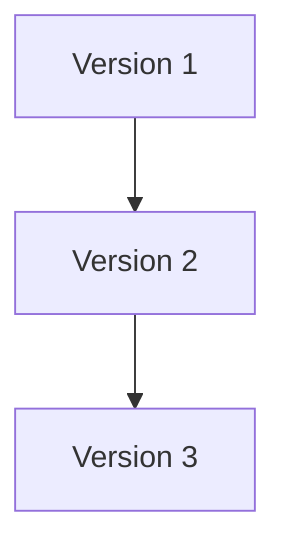
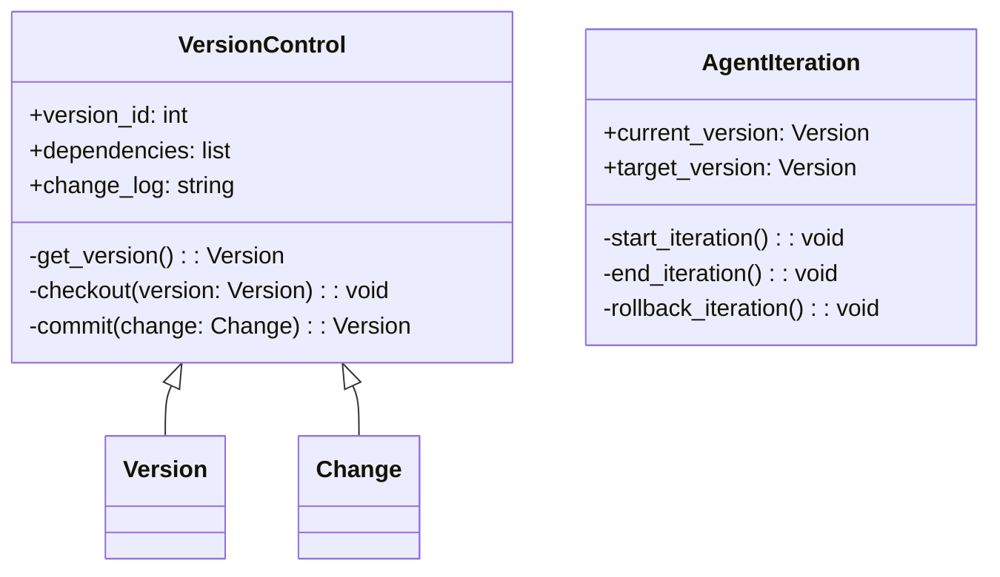
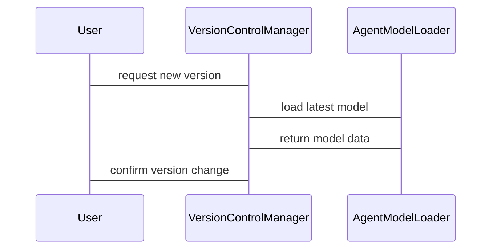

                 


# AI Agent的版本控制与迭代管理

---

## 关键词：
AI Agent, 版本控制, 迭代管理, 软件架构, 算法原理, 系统设计

---

## 摘要：
本文详细探讨了AI Agent的版本控制与迭代管理方法，结合技术背景、核心概念、算法原理、系统架构和项目实战，提出了有效的解决方案和实施策略。文章从问题背景出发，分析了版本控制与迭代管理的核心概念，通过数学模型和算法流程图，详细阐述了实现方法，并结合实际案例进行了系统设计与代码实现，最后总结了最佳实践和注意事项。

---

## 第1章 AI Agent的背景与概念

### 1.1 AI Agent的基本概念
#### 1.1.1 AI Agent的定义
AI Agent（人工智能代理）是指能够感知环境并采取行动以实现目标的智能实体。它通过传感器获取信息，利用推理机制做出决策，并通过执行器与环境交互。

#### 1.1.2 AI Agent的核心特点
- **自主性**：能够在没有外部干预的情况下自主决策。
- **反应性**：能够实时感知环境并做出反应。
- **目标导向**：所有行为都以实现特定目标为导向。
- **可扩展性**：能够通过学习和适应不断进化。

#### 1.1.3 AI Agent的应用场景
- 智能助手（如Siri、Alexa）。
- 自动交易系统。
- 智能客服机器人。
- 自动驾驶系统。

### 1.2 问题背景与挑战
#### 1.2.1 AI Agent开发中的问题背景
随着AI技术的发展，AI Agent的应用越来越广泛。然而，在开发过程中，版本控制和迭代管理成为一大挑战，尤其是当AI模型频繁更新时，如何确保系统稳定性和一致性成为难题。

#### 1.2.2 版本控制与迭代管理的必要性
- **版本控制**：确保不同版本的AI Agent能够协同工作，避免冲突。
- **迭代管理**：通过持续优化模型，提升AI Agent的性能和适应性。

#### 1.2.3 当前存在的主要挑战
- **数据依赖**：AI Agent的性能高度依赖训练数据，数据变化可能导致版本间不兼容。
- **模型复杂性**：深度学习模型通常复杂度高，难以直接进行版本控制。
- **实时性要求**：部分应用场景需要AI Agent实时响应，增加了版本迭代的难度。

### 1.3 问题描述与解决思路
#### 1.3.1 AI Agent版本控制的复杂性
AI Agent的版本控制不仅仅是代码层面的，还包括模型参数、训练数据等多个方面。

#### 1.3.2 迭代管理的核心问题
如何在不影响现有功能的前提下，逐步优化AI Agent的行为和性能。

#### 1.3.3 解决方案的初步思路
采用分层版本控制策略，结合自动化测试和持续集成，确保每次迭代都能稳定发布。

---

## 第2章 AI Agent版本控制的核心概念

### 2.1 版本控制的基本原理
#### 2.1.1 版本控制的定义与作用
版本控制是指对AI Agent的不同版本进行记录、管理和控制的过程。它能够追踪变更历史，方便回滚和协作开发。

#### 2.1.2 AI Agent版本控制的独特性
- **模型版本控制**：不仅仅是代码，还包括训练模型和数据。
- **可解释性**：版本变更需要可追溯，便于问题排查。

#### 2.1.3 版本控制的关键要素
- **版本标识**：唯一标识每个版本的编号或标签。
- **变更日志**：记录每个版本的修改内容和原因。
- **依赖管理**：处理不同版本之间的依赖关系。

### 2.2 迭代管理的定义与特点
#### 2.2.1 迭代管理的定义
迭代管理是指通过周期性的小规模改进，逐步优化AI Agent的性能和功能。

#### 2.2.2 迭代管理的核心特点
- **小步快跑**：每次迭代只做小幅改动，快速验证和发布。
- **持续反馈**：通过用户反馈和性能监控，指导下一步改进方向。

#### 2.2.3 迭代管理与版本控制的关系
迭代管理是版本控制的一部分，每次迭代可以生成一个新的版本。

### 2.3 核心概念对比分析
#### 2.3.1 AI Agent版本控制与传统软件版本控制的对比
| 对比维度         | 传统软件版本控制       | AI Agent版本控制           |
|------------------|------------------------|-----------------------------|
| 核心内容         | 代码和文档的变更记录   | 代码、模型和数据的变更记录 |
| 复杂性           | 较低                   | 较高，涉及模型和数据的复杂性 |
| 可回滚性         | 易于回滚               | 回滚模型可能影响性能和效果   |

#### 2.3.2 迭代管理与持续集成的区别
- **持续集成**：频繁集成代码到主分支，确保代码始终处于可发布状态。
- **迭代管理**：关注功能和性能的逐步优化，可能涉及模型的重新训练和部署。

---

## 第3章 AI Agent版本控制与迭代管理的数学模型

### 3.1 版本控制的数学模型
#### 3.1.1 版本号的计算公式
版本号可以通过递增计数的方式生成：
$$ version\_id = version\_id + 1 $$

#### 3.1.2 版本依赖关系的图表示
使用图论中的有向图表示版本之间的依赖关系，节点表示版本，边表示依赖关系。



### 3.2 迭代管理的数学模型
#### 3.2.1 迭代更新的公式
假设每次迭代更新一个参数θ，学习率为α：
$$ θ_{new} = θ_{old} - α \cdot \nabla L $$

其中，L是损失函数，∇L是损失函数的梯度。

#### 3.2.2 迭代优化策略
使用随机梯度下降（SGD）优化器进行迭代更新：
$$ θ_{t+1} = θ_t - \eta \cdot \nabla J(θ_t) $$

其中，η是学习率，J是目标函数。

---

## 第4章 系统分析与架构设计方案

### 4.1 项目背景
本项目旨在开发一个支持版本控制和迭代管理的AI Agent系统，应用于智能客服领域，提升用户体验和系统稳定性。

### 4.2 系统功能设计
#### 4.2.1 领域模型
使用Mermaid绘制领域模型类图：



#### 4.2.2 系统架构设计
使用Mermaid绘制系统架构图：

```mermaid
architectural
    title AI Agent Version Control System
    Data Layer
    {
        Data Layer
        ├── Model Repository
        ├── Training Data Store
        └── Version Log Database
    }
    
    Agent Layer
    {
        Agent Layer
        ├── VersionControlManager
        ├── AgentModelLoader
        └── ChangeProcessor
    }
    
    Application Layer
    {
        Application Layer
        ├── AgentIterationController
        ├── AgentInterface
        └── ChangeValidator
    }
```

#### 4.2.3 系统接口设计
主要接口包括：
- `get_latest_version()`: 获取最新版本。
- `checkout_version(version_id)`: 切换到指定版本。
- `commit_change(change_log)`: 提交变更并生成新版本。

#### 4.2.4 系统交互设计
使用Mermaid绘制交互序列图：



---

## 第5章 项目实战

### 5.1 环境配置
- **Python版本**：Python 3.8+
- **框架依赖**：TensorFlow 2.5+, PyTorch 1.9+
- **工具依赖**：Git, Docker

### 5.2 核心代码实现
#### 5.2.1 版本控制管理器
```python
class VersionControlManager:
    def __init__(self):
        self.current_version = 1
        self.change_log = []
    
    def commit_change(self, change_description):
        self.current_version += 1
        self.change_log.append(f"Version {self.current_version}: {change_description}")
        return self.current_version
    
    def checkout_version(self, version_id):
        # 实现版本回滚逻辑
        pass
```

#### 5.2.2 迭代管理控制器
```python
class AgentIterationController:
    def __init__(self):
        self.current_iteration = 0
        self.target_version = None
    
    def start_iteration(self):
        self.current_iteration += 1
        print(f"Iteration {self.current_iteration} started")
    
    def end_iteration(self):
        print(f"Iteration {self.current_iteration} ended")
        self.target_version = self.commit_change(f"Iteration {self.current_iteration} completed")
```

### 5.3 代码应用解读与分析
- **版本控制管理器**：通过`commit_change`方法生成新版本，并记录变更日志。
- **迭代管理控制器**：通过`start_iteration`和`end_iteration`方法控制迭代过程，并在每次迭代结束时生成新版本。

### 5.4 案例分析
假设我们有一个自然语言处理模型，每次迭代优化模型的准确性。通过版本控制管理器，我们可以记录每次迭代的具体变更，并在需要时回滚到之前的版本。

---

## 第6章 最佳实践与小结

### 6.1 最佳实践
- **定期备份**：确保每次迭代都有备份，避免数据丢失。
- **自动化测试**：通过自动化测试确保新版本的稳定性。
- **监控与反馈**：实时监控AI Agent的性能，根据反馈进行优化。

### 6.2 小结
本文详细探讨了AI Agent的版本控制与迭代管理方法，从理论到实践，结合数学模型和系统架构设计，提出了可行的解决方案。通过分层版本控制和迭代优化，可以有效提升AI Agent的性能和稳定性。

### 6.3 注意事项
- **版本兼容性**：确保不同版本之间的兼容性，避免功能冲突。
- **数据一致性**：保持训练数据的一致性，防止因数据变化导致模型性能下降。
- **性能监控**：持续监控AI Agent的性能，及时发现和解决问题。

### 6.4 拓展阅读
- 推荐阅读《Continuous Delivery: Reliable Software through Incremental, Repeatable and Scalable Deliveries》。
- 关注AI领域的新技术，如可解释AI（XAI）和自适应模型管理。

---

# 结语
通过本文的系统讲解，读者可以全面了解AI Agent的版本控制与迭代管理方法，并能够将其应用于实际项目中。希望本文的内容能为AI开发者和架构师提供有价值的参考和指导。

