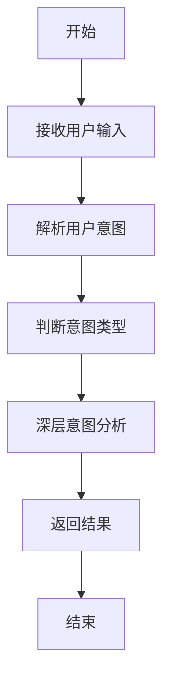
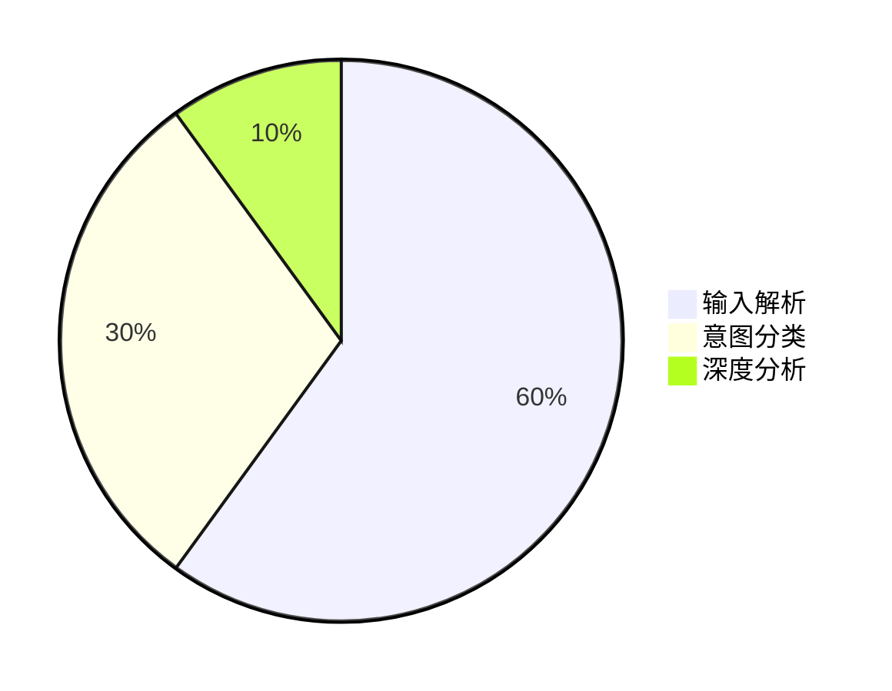

                 


# AI Agent的用户意图理解：从表层到深层

## 关键词：
AI Agent, 用户意图, 表层意图, 深层意图, 自然语言处理, 语义理解, 机器学习

## 摘要：
本文深入探讨了AI Agent在用户意图理解中的应用，从表层意图到深层意图的分析方法，结合实际案例和系统设计，详细讲解了意图理解的算法原理、系统架构和项目实现。通过对比分析和图表展示，帮助读者全面理解用户意图理解的核心概念和实现技巧。

---

# 第1章: 用户意图理解的概述

## 1.1 用户意图理解的定义与重要性
### 1.1.1 用户意图理解的定义
用户意图理解是指通过分析用户输入（如文本、语音或行为数据）来识别其潜在的需求、目标或情感的过程。它是人机交互中的关键环节，能够帮助AI Agent更准确地响应用户需求。

### 1.1.2 用户意图理解的重要性
在AI Agent应用中，意图理解是实现智能化交互的基础。准确理解用户意图可以提升用户体验，优化系统决策，降低错误率。

### 1.1.3 用户意图理解的边界与外延
用户意图理解的边界包括输入数据的范围和系统处理能力的限制。外延则涉及多模态数据融合、情感分析和上下文理解。

## 1.2 用户意图理解的核心要素
### 1.2.1 表层意图与深层意图的对比
| 特性         | 表层意图              | 深层意图              |
|--------------|-----------------------|-----------------------|
| 定义         | 用户直接表达的需求    | 用户潜在的需求或情感  |
| 示例         | "播放音乐"            | "希望放松心情"        |
| 处理难度     | 较低                  | 较高                  |

### 1.2.2 意图理解的核心属性特征对比表格
| 属性         | 表层意图              | 深层意图              |
|--------------|-----------------------|-----------------------|
| 表达方式     | 明确的指令或请求        | 隐含的需求或情感       |
| 理解难度     | 较低                  | 较高                  |
| 应用场景     | 系统响应              | 个性化推荐            |

### 1.2.3 意图理解的ER实体关系图
```mermaid
entity User {
  id: int
  name: string
}
entity Intent {
  id: int
  name: string
  description: string
}
relationship User-Intent {
  user Intent
}
```

---

# 第2章: AI Agent与用户意图理解的关系

## 2.1 AI Agent的基本概念
### 2.1.1 AI Agent的定义
AI Agent是一种能够感知环境、自主决策并执行任务的智能体。它通过与用户交互，理解需求并提供服务。

### 2.1.2 AI Agent的核心功能
- 感知环境
- 分析数据
- 制定决策
- 执行任务

### 2.1.3 AI Agent的分类
- 单智能体
- 分布式智能体
- 人机协作智能体

## 2.2 用户意图理解在AI Agent中的作用
### 2.2.1 用户意图理解对AI Agent交互的影响
通过准确理解用户意图，AI Agent能够提供更精准的响应，提升交互效率。

### 2.2.2 用户意图理解对AI Agent决策的支持
深层意图分析能够帮助AI Agent更好地预测用户需求，优化决策过程。

### 2.2.3 用户意图理解对AI Agent优化的意义
通过分析用户意图数据，AI Agent可以不断优化自身算法和用户体验。

## 2.3 表层意图与深层意图的联系与区别
### 2.3.1 表层意图的特征与应用场景
- 明确性高
- 直接触发系统操作
- 适用于简单的任务请求

### 2.3.2 深层意图的特征与应用场景
- 隐含性
- 需要上下文理解
- 适用于个性化推荐和情感分析

### 2.3.3 表层意图与深层意图的关联分析
深层意图是表层意图的潜在驱动因素，理解深层意图可以提升表层意图的理解准确率。

---

# 第3章: 用户意图理解的算法原理

## 3.1 意图理解的基本算法
### 3.1.1 基于规则的意图理解算法
通过预定义的规则匹配用户输入，识别意图。

### 3.1.2 基于模型的意图理解算法
使用机器学习模型（如SVM、随机森林）进行意图分类。

### 3.1.3 基于图模型的意图理解算法
利用图神经网络分析意图之间的关联关系。

## 3.2 意图理解的算法流程图


## 3.3 意图理解的数学模型与公式
### 意图理解的概率模型
$$ P(\text{intent} | \text{input}) = \frac{P(\text{input} | \text{intent}) \cdot P(\text{intent})}{P(\text{input})} $$

### 意图理解的损失函数
$$ \text{Loss} = -\sum_{i=1}^{n} \log P(y_i | x_i) $$

---

# 第4章: 用户意图理解的系统分析与架构设计

## 4.1 用户意图理解系统的功能需求
### 4.1.1 系统输入与输出
- 输入：文本、语音、行为数据
- 输出：意图标签、意图描述

### 4.1.2 系统功能模块划分
- 输入解析模块
- 意图分类模块
- 深度分析模块

### 4.1.3 系统性能指标
- 准确率
- 召回率
- 响应时间

## 4.2 用户意图理解系统的架构设计
### 4.2.1 系统架构图


### 4.2.2 系统功能模块设计
- 输入解析模块：处理用户输入数据，提取关键信息。
- 意图分类模块：基于机器学习模型进行意图分类。
- 深度分析模块：分析深层意图，优化系统响应。

---

# 第5章: 用户意图理解的项目实战

## 5.1 项目背景与需求分析
### 5.1.1 项目背景
以电商客服系统为例，分析用户意图理解的应用场景。

## 5.2 项目环境安装与配置
### 5.2.1 环境要求
- Python 3.8+
- 机器学习库（如scikit-learn、TensorFlow）
- 自然语言处理库（如spaCy、NLTK）

## 5.3 项目核心代码实现
### 5.3.1 输入解析模块
```python
def parse_input(user_input):
    # 示例代码
    return user_input.lower()
```

### 5.3.2 意图分类模块
```python
from sklearn.svm import SVC
model = SVC()
model.fit(X_train, y_train)
```

### 5.3.3 深度分析模块
```python
def analyze_deep_intent(intents):
    # 示例代码
    return max(intents, key=lambda x: x['probability'])
```

## 5.4 项目代码解读与分析
- 输入解析模块负责处理用户输入，提取关键信息。
- 意图分类模块基于机器学习模型进行分类。
- 深度分析模块优化意图理解，提升准确率。

## 5.5 项目小结
通过实战案例，展示了用户意图理解在实际应用中的实现过程和关键步骤。

---

# 第6章: 总结与扩展阅读

## 6.1 最佳实践 tips
- 数据质量是意图理解的关键。
- 结合上下文信息可以提升理解准确率。
- 定期优化模型以适应新需求。

## 6.2 小结
用户意图理解是AI Agent实现智能化交互的核心，从表层到深层的理解过程需要结合多种技术手段。

## 6.3 注意事项
- 数据隐私保护
- 算法可解释性
- 系统性能优化

## 6.4 拓展阅读
推荐相关书籍和论文，进一步深入学习用户意图理解的技术细节。

---

通过以上结构，文章详细讲解了用户意图理解的核心概念、算法原理和实际应用，帮助读者全面掌握AI Agent中的意图理解技术。

