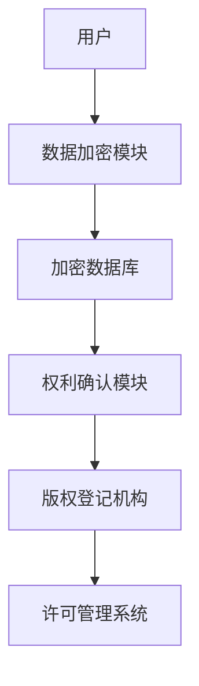

                 


# AI Agent的知识产权保护策略

> 关键词：AI Agent, 知识产权保护, 技术保护策略, 法律保护策略, 项目实战案例

> 摘要：本文将详细探讨AI Agent的知识产权保护策略，从技术、法律和管理三个维度进行分析。通过系统的概念分析、策略制定、案例分析和代码实现，为读者提供全面的保护方案。

---

# 第一部分: AI Agent的知识产权保护背景

# 第1章: AI Agent与知识产权保护概述

## 1.1 AI Agent的基本概念

### 1.1.1 AI Agent的定义
AI Agent（人工智能代理）是指能够感知环境并采取行动以实现目标的智能实体。它可以是一个软件程序、机器人或其他形式的智能系统。

### 1.1.2 AI Agent的核心功能与特点
AI Agent的核心功能包括：
- **感知环境**：通过传感器或其他输入方式获取环境信息。
- **推理与决策**：基于获取的信息进行逻辑推理，制定行动策略。
- **执行操作**：根据决策结果执行具体操作。

### 1.1.3 AI Agent在现代社会中的应用领域
AI Agent广泛应用于：
- 自动化系统（如智能家居）
- 金融服务（如算法交易）
- 医疗健康（如辅助诊断系统）
- 智能客服（如聊天机器人）

## 1.2 知识产权保护的重要性

### 1.2.1 知识产权的基本概念
知识产权是指对智力劳动成果的法律保护，包括专利、商标、版权、商业秘密等。

### 1.2.2 知识产权保护在AI Agent中的必要性
AI Agent的核心技术（算法、数据）需要通过知识产权保护防止他人非法使用。

### 1.2.3 知识产权保护的法律框架
主要法律框架包括：
- 《专利法》：保护发明的独占权。
- 《版权法》：保护作品的原创性。
- 《商业秘密法》：保护未公开的技术信息。

## 1.3 本章小结
本章介绍了AI Agent的基本概念和知识产权保护的重要性，为后续内容奠定了基础。

---

# 第二部分: AI Agent的知识产权保护核心概念

# 第2章: AI Agent的知识产权属性

## 2.1 知识产权的核心要素

### 2.1.1 创意与创新的关系
创意是创新的前提，而创新是创意的实现。AI Agent的知识产权保护需要从创意到创新的全过程进行。

### 2.1.2 知识产权的分类与特点
| 知识产权类型 | 特点 |
|----------------|------|
| 专利 | 保护发明的实用性 |
| 商标 | 保护商业标识的识别性 |
| 版权 | 保护作品的原创性 |

### 2.1.3 AI Agent的创新成果与知识产权的关系
AI Agent的算法、数据结构等创新成果可以通过专利、版权等方式进行保护。

## 2.2 AI Agent与知识产权的关联性

### 2.2.1 AI Agent的输出成果与知识产权保护
AI Agent生成的内容（如报告、图像）可以通过版权法进行保护。

### 2.2.2 AI Agent的开发过程中的知识产权保护
开发过程中产生的技术文档、源代码等需要通过商业秘密法进行保护。

### 2.2.3 AI Agent的使用中的知识产权保护
使用AI Agent时，需要遵守相关知识产权许可协议。

## 2.3 本章小结
本章分析了AI Agent与知识产权的关联性，明确了保护的必要性和方向。

---

# 第三部分: AI Agent的知识产权保护策略

# 第3章: AI Agent的知识产权保护策略

## 3.1 技术层面的保护策略

### 3.1.1 数据加密与保护
使用对称加密算法（如AES）保护敏感数据。

```python
# AES加密示例
from cryptography.hazmat.primitives.ciphers import Cipher, algorithms, modes
from cryptography.hazmat.primitives.asymmetric import padding
from cryptography.hazmat.primitives.asymmetric.rsa import RSAPublicKey, RSAPrivateKey

key = RSAPrivateKey.generate(2048)
ciphertext = key.encrypt(b'secret', padding.OAEP())
```

### 3.1.2 算法保护与专利申请
将创新算法申请专利保护。

### 3.1.3 开源协议的选择与应用
选择合适的开源协议（如GPL、MIT）来保护代码。

## 3.2 法律层面的保护策略

### 3.2.1 知识产权法律框架的适用
根据具体情况选择适用的法律。

### 3.2.2 专利申请与保护
详细描述发明的技术方案，撰写专利申请文件。

### 3.2.3 商标与版权的保护
注册商标，申请版权保护。

## 3.3 管理层面的保护策略

### 3.3.1 企业内部知识产权管理
建立内部知识产权管理制度，规范员工行为。

### 3.3.2 合同与合作协议中的知识产权条款
在合同中明确知识产权归属。

### 3.3.3 知识产权培训与意识提升
定期开展知识产权培训，提高员工保护意识。

## 3.4 本章小结
本章从技术、法律和管理三个层面详细阐述了AI Agent的知识产权保护策略。

---

# 第四部分: AI Agent知识产权保护的系统分析

# 第4章: AI Agent知识产权保护的系统架构

## 4.1 系统功能设计

### 4.1.1 知识产权保护模块的功能需求
- 数据加密功能
- 权利归属确认功能
- 许可管理功能

### 4.1.2 系统功能架构设计（Mermaid图）



## 4.2 系统架构设计

### 4.2.1 系统架构设计（Mermaid图）


## 4.3 系统接口设计

### 4.3.1 系统接口设计（Mermaid图）

```mermaid
sequence
    用户 -> 数据加密模块: 提供数据
    数据加密模块 -> 加密数据库: 存储加密数据
    用户 -> 权利确认模块: 提供权利证明
    权利确认模块 -> 版权登记机构: 登记版权
```

---

# 第五部分: 项目实战案例分析

# 第5章: 项目实战案例分析

## 5.1 环境安装

```bash
pip install cryptography
pip install mermaid
```

## 5.2 核心代码实现

### 5.2.1 加密算法实现

```python
from cryptography.hazmat.primitives.ciphers import Cipher, algorithms, modes
from cryptography.hazmat.primitives.asymmetric import padding
from cryptography.hazmat.primitives.asymmetric.rsa import RSAPublicKey, RSAPrivateKey

# 生成RSA密钥对
key = RSAPrivateKey.generate(2048)
public_key = key.public_key()

# 加密数据
plaintext = b"Secret message"
ciphertext = public_key.encrypt(plaintext, padding.OAEP())
```

### 5.2.2 系统功能实现

```python
# 数据加密功能
def encrypt_data(data, public_key):
    return public_key.encrypt(data, padding.OAEP())

# 权利确认功能
def confirm_rights(owner, copyright):
    return f"Copyright {owner} {copyright}"
```

## 5.3 案例分析

### 5.3.1 案例介绍
假设我们开发了一款AI绘画工具，核心算法申请专利保护，生成的作品通过版权法保护。

### 5.3.2 代码应用解读
通过上述代码实现数据加密和版权确认功能，确保AI生成作品的知识产权安全。

## 5.4 本章小结
通过实际案例分析和代码实现，验证了AI Agent知识产权保护策略的有效性。

---

# 第六部分: 最佳实践与未来展望

# 第6章: 最佳实践与未来展望

## 6.1 最佳实践 tips

- **定期审查**：定期检查知识产权保护措施的有效性。
- **多团队协作**：技术、法律和管理团队紧密合作。
- **持续学习**：关注知识产权保护的最新法律和技术动态。

## 6.2 本章小结
本文从多个维度探讨了AI Agent的知识产权保护策略，并通过实际案例和代码实现，验证了策略的有效性。

---

# 结语

AI Agent的知识产权保护是一个复杂而重要的任务，需要技术、法律和管理的协同努力。通过本文的分析和实践，读者可以更好地理解和实施AI Agent的知识产权保护策略。

