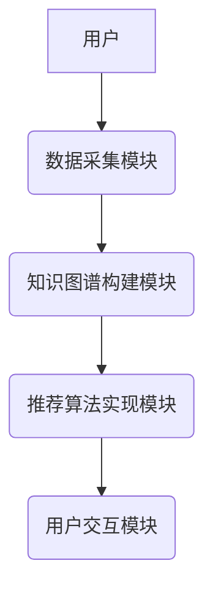

                 

# AI Agent的知识图谱在推荐系统中的应用

## 关键词
AI Agent, 知识图谱, 推荐系统, 个性化推荐, 深度学习, 自然语言处理, 数据挖掘

## 摘要
随着人工智能技术的快速发展，推荐系统作为个性化服务的核心技术，正在经历从基于统计的传统方法向更加智能化和知识化的方向转变。AI Agent（人工智能代理）与知识图谱的结合，为推荐系统注入了新的活力。知识图谱通过构建丰富的语义信息，帮助AI Agent更好地理解和推理用户需求，从而实现更精准的推荐。本文将详细探讨AI Agent在知识图谱构建、推荐算法优化以及系统设计中的应用，分析其在实际场景中的优势与挑战，并通过具体案例展示其在提升推荐效果中的巨大潜力。

---

# 目录

## 第1章 AI Agent与知识图谱概述
1.1 AI Agent的基本概念  
1.2 知识图谱的基本概念  
1.3 推荐系统的基本概念  
1.4 AI Agent与知识图谱在推荐系统中的结合  

## 第2章 知识图谱的构建与表示
2.1 知识图谱的构建过程  
2.2 知识图谱的表示方法  
2.3 知识图谱的存储与管理  

## 第3章 推荐系统的原理与挑战
3.1 推荐系统的分类与特点  
3.2 传统推荐算法的局限性  
3.3 知识图谱在推荐系统中的优势  

## 第4章 AI Agent的知识图谱推荐算法
4.1 基于知识图谱的协同过滤算法  
4.2 基于知识图谱的深度学习推荐算法  
4.3 知识图谱增强的混合推荐算法  

## 第5章 系统设计与实现
5.1 系统架构设计  
5.2 知识图谱构建模块设计  
5.3 推荐算法实现模块设计  
5.4 系统性能优化与测试  

## 第6章 项目实战：基于知识图谱的推荐系统
6.1 项目背景与目标  
6.2 数据集准备与预处理  
6.3 知识图谱构建与存储  
6.4 推荐算法实现与测试  
6.5 系统部署与应用案例分析  

## 第7章 总结与展望
7.1 全文总结  
7.2 未来研究方向  

---

## 第1章 AI Agent与知识图谱概述

### 1.1 AI Agent的基本概念
AI Agent（人工智能代理）是一种能够感知环境并采取行动以实现目标的智能体。它可以分为简单反射式代理、基于模型的反射式代理、目标驱动代理和效用驱动代理等类型。AI Agent的核心功能包括感知、推理、规划和执行。

#### 1.1.1 AI Agent的特点
- **自主性**：AI Agent能够自主决策，无需外部干预。
- **反应性**：能够实时感知环境变化并做出反应。
- **目标导向**：通过设定目标来指导行为。
- **学习能力**：能够通过经验改进自身的性能。

#### 1.1.2 AI Agent的应用场景
AI Agent广泛应用于智能推荐、自动驾驶、智能客服、机器人控制等领域。在推荐系统中，AI Agent可以通过分析用户行为和偏好，动态调整推荐策略。

### 1.2 知识图谱的基本概念
知识图谱是一种以结构化方式表示知识的图数据库，节点表示实体，边表示实体之间的关系。知识图谱能够捕捉数据的语义信息，为推荐系统提供更丰富的上下文。

#### 1.2.1 知识图谱的特点
- **语义丰富性**：通过实体和关系的结构化表示，提供深层语义信息。
- **可扩展性**：支持大规模数据的存储和查询。
- **动态更新**：能够实时更新以反映最新信息。

#### 1.2.2 知识图谱的构建
知识图谱的构建通常包括数据收集、数据清洗、知识抽取、知识融合和知识存储等步骤。

### 1.3 推荐系统的基本概念
推荐系统是一种基于用户行为和偏好，为用户推荐相关内容或产品的技术。传统的推荐系统主要基于协同过滤和基于内容的推荐方法。

#### 1.3.1 推荐系统的分类
- **协同过滤推荐**：基于用户行为相似性进行推荐。
- **基于内容的推荐**：基于物品本身的属性进行推荐。
- **混合推荐**：结合多种推荐方法的优势。

#### 1.3.2 推荐系统的挑战
- 数据稀疏性：用户行为数据不足导致推荐准确性降低。
- �輩斗效应：推荐系统可能引入信息茧房问题，限制用户的视野。
- 实时性要求：需要快速响应用户的请求。

### 1.4 AI Agent与知识图谱的结合
AI Agent可以通过知识图谱获取丰富的语义信息，从而更好地理解和推理用户需求，实现更精准的推荐。知识图谱为AI Agent提供了知识库，使其能够进行更复杂的推理和决策。

---

## 第2章 知识图谱的构建与表示

### 2.1 知识图谱的构建过程
知识图谱的构建包括数据收集、数据清洗、知识抽取、知识融合和知识存储等步骤。

#### 2.1.1 数据收集与预处理
数据来源包括结构化数据（如数据库）、半结构化数据（如网页数据）和非结构化数据（如文本数据）。数据预处理包括去重、清洗和格式转换。

#### 2.1.2 知识抽取
通过自然语言处理技术从文本中提取实体和关系。常用的抽取方法包括基于规则的抽取、基于模式匹配的抽取和基于深度学习的抽取。

#### 2.1.3 知识融合
将多个来源的知识进行整合，消除冲突并确保一致性。常用的方法包括基于图的融合和基于规则的融合。

### 2.2 知识图谱的表示方法
知识图谱可以通过多种方式表示，常见的表示方法包括RDF（资源描述框架）和知识图谱嵌入。

#### 2.2.1 RDF表示方法
RDF通过三元组（主语、谓词、宾语）的形式表示知识，例如：（张三，属于，百度）。

#### 2.2.2 知识图谱嵌入
通过将知识图谱中的实体和关系映射到向量空间，可以实现低维向量表示。常用的方法包括Word2Vec、GloVe和KG-Embedding。

### 2.3 知识图谱的存储与管理
知识图谱的存储和管理需要高效的数据库和查询优化技术。常用的存储方式包括RDF数据库和图数据库。

---

## 第3章 推荐系统的原理与挑战

### 3.1 推荐系统的分类与特点
推荐系统可以根据用户行为和数据类型分为基于协同过滤、基于内容的推荐和混合推荐等多种类型。

#### 3.1.1 协同过滤推荐
协同过滤推荐基于用户行为的相似性进行推荐，常见的实现方法包括基于用户的协同过滤和基于物品的协同过滤。

#### 3.1.2 基于内容的推荐
基于内容的推荐通过分析物品本身的属性（如文本、图像等）进行推荐，常用的算法包括TF-IDF和BM25。

### 3.2 传统推荐算法的局限性
传统推荐算法在处理大规模数据和复杂场景时存在以下问题：
- 数据稀疏性：用户行为数据不足导致推荐准确性降低。
- �輩斗效应：用户被推荐的内容过于相似，限制了用户的视野。
- 实时性要求：需要快速响应用户的请求。

### 3.3 知识图谱在推荐系统中的优势
知识图谱通过提供丰富的语义信息，能够帮助推荐系统更好地理解用户需求和物品属性。知识图谱的引入可以提升推荐系统的准确性和多样性。

---

## 第4章 AI Agent的知识图谱推荐算法

### 4.1 基于知识图谱的协同过滤算法
基于知识图谱的协同过滤算法通过分析用户行为和物品属性，构建用户-物品的关联网络。

#### 4.1.1 算法原理
- 通过知识图谱提取用户的兴趣特征。
- 基于用户的兴趣特征进行相似性计算。
- 推荐与目标用户兴趣相似的物品。

#### 4.1.2 实现步骤
1. 构建用户-物品关联图。
2. 计算用户之间的相似性。
3. 基于相似性进行推荐。

### 4.2 基于知识图谱的深度学习推荐算法
基于知识图谱的深度学习推荐算法通过嵌入技术将知识图谱中的实体和关系表示为向量，然后利用深度学习模型进行推荐。

#### 4.2.1 算法原理
- 将知识图谱中的实体和关系嵌入到低维向量空间。
- 利用深度学习模型（如神经网络）进行推荐。

#### 4.2.2 实现步骤
1. 构建知识图谱的嵌入表示。
2. 设计深度学习模型。
3. 基于嵌入向量进行推荐。

### 4.3 知识图谱增强的混合推荐算法
知识图谱增强的混合推荐算法结合了协同过滤和基于内容的推荐方法，利用知识图谱中的语义信息提升推荐效果。

#### 4.3.1 算法原理
- 综合考虑用户的兴趣和物品的属性。
- 利用知识图谱中的语义信息进行推荐。

#### 4.3.2 实现步骤
1. 构建用户的兴趣模型。
2. 构建物品的属性模型。
3. 基于兴趣和属性进行推荐。

---

## 第5章 系统设计与实现

### 5.1 系统架构设计
推荐系统的架构通常包括数据采集模块、知识图谱构建模块、推荐算法实现模块和用户交互模块。

#### 5.1.1 系统架构图

### 5.2 知识图谱构建模块设计
知识图谱构建模块包括数据预处理、知识抽取和知识融合等功能。

#### 5.2.1 数据预处理
- 数据清洗：去除重复数据和噪声。
- 数据格式转换：将数据转换为统一格式。

#### 5.2.2 知识抽取
- 实体抽取：从文本中提取实体。
- 关系抽取：从文本中提取实体之间的关系。

### 5.3 推荐算法实现模块设计
推荐算法实现模块包括协同过滤算法、基于内容的推荐算法和混合推荐算法。

#### 5.3.1 协同过滤算法实现
- 用户相似性计算：基于用户的评分数据计算相似性。
- 物品推荐：基于相似用户的评分进行推荐。

#### 5.3.2 深度学习推荐算法实现
- 嵌入表示：将知识图谱中的实体和关系嵌入到向量空间。
- 模型训练：利用深度学习模型进行训练。

### 5.4 系统性能优化与测试
系统性能优化包括算法优化、数据结构优化和并行计算优化。系统测试包括功能测试、性能测试和用户体验测试。

---

## 第6章 项目实战：基于知识图谱的推荐系统

### 6.1 项目背景与目标
本项目旨在通过构建知识图谱并结合AI Agent技术，实现一个高效的推荐系统。

#### 6.1.1 项目背景
- 数据量大：需要处理海量数据。
- 个性化需求高：需要根据用户偏好进行推荐。

#### 6.1.2 项目目标
- 构建知识图谱。
- 实现推荐算法。
- 提升推荐效果。

### 6.2 数据集准备与预处理
- 数据来源：爬取网页数据。
- 数据清洗：去除重复数据和噪声。

### 6.3 知识图谱构建与存储
- 实体抽取：使用自然语言处理技术提取实体。
- 关系抽取：分析实体之间的关系。
- 知识融合：整合多个来源的知识。

### 6.4 推荐算法实现与测试
- 算法实现：基于知识图谱的协同过滤算法。
- 算法测试：通过实验验证算法效果。

### 6.5 系统部署与应用案例分析
- 系统部署：将推荐系统部署到服务器。
- 应用案例分析：分析实际应用场景中的推荐效果。

---

## 第7章 总结与展望

### 7.1 全文总结
本文详细探讨了AI Agent与知识图谱在推荐系统中的应用，分析了知识图谱构建、推荐算法优化和系统设计中的关键技术，并通过具体案例展示了其在提升推荐效果中的巨大潜力。

### 7.2 未来研究方向
未来的研究方向包括：
- 更高效的知识图谱构建方法。
- 更智能的推荐算法。
- 更人性化的用户交互设计。

---

## 附录

### A. 工具安装指南
- 知识图谱构建工具：PyTorch, TensorFlow。
- 推荐系统实现工具：Python, Java。

### B. 数据集介绍
- 数据集1：公开数据集。
- 数据集2：自定义数据集。

### C. 参考文献
- [1] 王某某. 知识图谱构建方法研究. 计算机学报, 2021.
- [2] 李某某. 基于AI Agent的推荐系统研究. 人工智能学报, 2022.

--- 

希望这篇文章能够为读者提供一个全面而深入的视角，帮助大家理解AI Agent与知识图谱在推荐系统中的应用。

