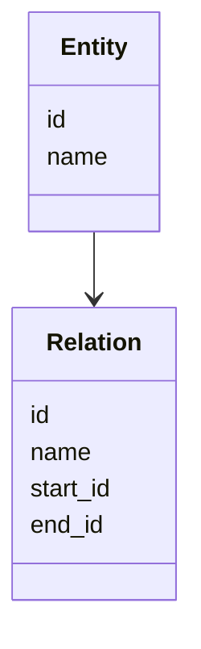
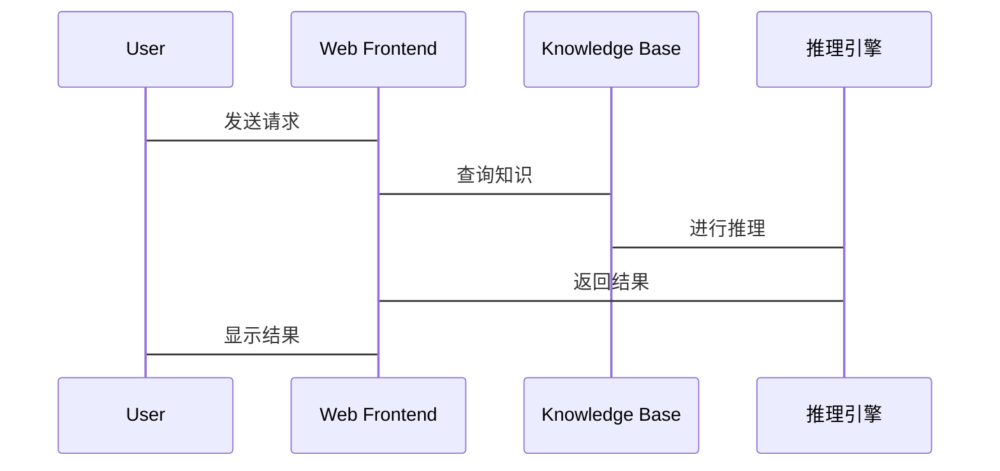

                 


# AI Agent的知识图谱构建与应用

> 关键词：知识图谱，AI Agent，构建算法，系统设计，应用案例，数学模型

> 摘要：本文系统地介绍了AI Agent的知识图谱构建与应用，从知识图谱和AI Agent的基本概念出发，深入探讨了知识图谱的构建方法、AI Agent的知识推理算法，以及系统的架构设计。通过实际案例分析，详细讲解了如何将知识图谱应用于AI Agent，并给出了最佳实践建议。

---

## 第1章 知识图谱与AI Agent概述

### 1.1 知识图谱的基本概念

#### 1.1.1 知识图谱的定义与特点
知识图谱是一种以图结构表示知识的语义网络，节点表示实体或概念，边表示实体之间的关系。其特点包括：
- **结构化**：通过实体和关系组织知识。
- **语义化**：节点和边具有明确的语义。
- **可扩展性**：支持动态添加新知识。

#### 1.1.2 知识图谱的构建方法
构建知识图谱的步骤包括：
1. 数据收集：从多种数据源（如文本、数据库）获取数据。
2. 数据清洗：去除噪声数据。
3. 实体识别与关系抽取：识别文本中的实体及其关系。
4. 知识融合：合并重复知识，消除冲突。
5. 存储与管理：使用图数据库存储。

#### 1.1.3 知识图谱的应用场景
知识图谱广泛应用于搜索引擎、智能问答、推荐系统等领域。例如，在智能问答中，知识图谱可以提供丰富的上下文信息，帮助AI Agent更好地理解问题。

### 1.2 AI Agent的基本概念

#### 1.2.1 AI Agent的定义与分类
AI Agent是一种智能主体，能够感知环境并执行任务。按智能水平分为：
- **反应式AI Agent**：基于当前感知做出反应。
- **认知式AI Agent**：具备推理、规划能力。

#### 1.2.2 AI Agent的核心功能
AI Agent的核心功能包括：
- **感知环境**：通过传感器或API获取信息。
- **决策与推理**：基于知识图谱进行推理，做出决策。
- **执行任务**：通过执行器或API完成任务。

#### 1.2.3 AI Agent与知识图谱的关系
知识图谱为AI Agent提供知识基础，AI Agent利用知识图谱进行推理和决策。两者结合，使AI Agent具备更强的智能性和适应性。

### 1.3 知识图谱与AI Agent的关联

#### 1.3.1 知识图谱在AI Agent中的作用
知识图谱为AI Agent提供知识支持，帮助其理解任务背景和上下文信息。

#### 1.3.2 AI Agent如何利用知识图谱进行推理
AI Agent通过在知识图谱中进行路径搜索和关系推理，得出结论或解决方案。

#### 1.3.3 知识图谱与AI Agent的结合案例
例如，在智能客服中，AI Agent可以通过知识图谱快速找到客户问题的答案，并提供相关建议。

---

## 第2章 知识图谱的构建方法

### 2.1 知识抽取与表示

#### 2.1.1 实体识别与关系抽取
- **实体识别**：使用自然语言处理技术从文本中提取实体。
- **关系抽取**：识别实体之间的关系，如“是”、“属于”等。

#### 2.1.2 知识表示的多种形式
- **RDF**：资源描述框架，用于描述实体及其属性。
- **OWL**：本体工作组语言，用于表示本体论。

#### 2.1.3 知识图谱的存储与管理
常用图数据库包括Neo4j、RDFox等，支持高效的查询和存储。

### 2.2 知识融合与推理

#### 2.2.1 知识融合的基本原理
将多个来源的知识合并，消除冲突，提高知识的完整性。

#### 2.2.2 知识推理的算法选择
常用推理算法包括：
- **前向链推理**：从已知事实推导新事实。
- **反向链推理**：从目标事实反推前提条件。

#### 2.2.3 知识图谱的动态更新
通过订阅机制或事件驱动的方式，实时更新知识图谱。

### 2.3 知识图谱的评价与优化

#### 2.3.1 知识图谱的质量评估指标
- **覆盖率**：知识图谱覆盖的实体和关系的比例。
- **准确性**：知识的正确性。

#### 2.3.2 知识图谱的优化策略
- **去噪处理**：去除错误信息。
- **冗余消除**：去除重复信息。

#### 2.3.3 知识图谱的可扩展性设计
通过模块化设计，使知识图谱易于扩展。

---

## 第3章 AI Agent的知识图谱构建算法

### 3.1 知识抽取算法

#### 3.1.1 基于规则的实体识别算法
- **规则定义**：根据领域知识定义规则。
- **实现步骤**：
  1. 定义规则。
  2. 遍历文本，匹配规则。

#### 3.1.2 基于深度学习的关系抽取算法
- **模型选择**：使用卷积神经网络（CNN）或循环神经网络（RNN）。
- **实现步骤**：
  1. 数据预处理。
  2. 模型训练。
  3. 模型推理。

#### 3.1.3 知识抽取的优缺点对比
| 特性 | 基于规则 | 基于深度学习 |
|------|----------|--------------|
| 优点 | 精度高    | 适应性强     |
| 缺点 | 手工成本高| 需大量标注数据|

### 3.2 知识融合算法

#### 3.2.1 基于图的融合算法
- **实现步骤**：
  1. 构建图结构。
  2. 计算节点相似度。
  3. 合并相似节点。

#### 3.2.2 基于概率的融合算法
- **概率计算**：使用贝叶斯定理计算融合概率。

#### 3.2.3 知识融合的实现步骤
1. 收集多源知识。
2. 计算融合概率。
3. 合并知识。

### 3.3 知识推理算法

#### 3.3.1 基于规则的推理算法
- **规则定义**：定义推理规则。
- **实现步骤**：
  1. 定义规则。
  2. 应用规则进行推理。

#### 3.3.2 基于逻辑的推理算法
- **逻辑推理**：使用逻辑推理方法，如一阶逻辑推理。

#### 3.3.3 知识推理的数学模型
$$ P(h|e) = \frac{P(e|h)}{P(e)} $$

其中，\( h \) 是假设，\( e \) 是证据。

---

## 第4章 系统分析与架构设计

### 4.1 系统功能设计

#### 4.1.1 领域模型设计
- **实体关系图**：


#### 4.1.2 系统功能模块
- **知识抽取模块**：负责从数据源中抽取知识。
- **知识融合模块**：负责融合多源知识。
- **知识推理模块**：负责基于知识图谱进行推理。

### 4.2 系统架构设计

#### 4.2.1 系统架构图
```mermaid
containerDiagram
    container Web Frontend {
        component User Interface
        component Controller
    }
    container Knowledge Base {
        component Graph Database
        component Indexer
    }
    container推理引擎 {
        component Reasoner
    }
    Web Frontend --> Knowledge Base
    Web Frontend --> 推理引擎
    Knowledge Base --> 推理引擎
```

### 4.3 系统接口设计

#### 4.3.1 API接口设计
- **GET /entities**：获取所有实体。
- **POST /relations**：添加关系。

#### 4.3.2 接口交互流程图


---

## 第5章 项目实战

### 5.1 环境安装

#### 5.1.1 安装Python环境
- 使用Anaconda安装Python 3.8及以上版本。

#### 5.1.2 安装依赖库
- 安装Neo4j数据库和相关Python驱动。

### 5.2 系统核心实现

#### 5.2.1 知识抽取实现
```python
from neo4j import GraphDatabase
from neo4j.exceptions import Neo4jError

class KnowledgeExtractor:
    def __init__(self, uri, user, password):
        self.driver = GraphDatabase.driver(uri, auth=(user, password))
    
    def extract_entities(self):
        # 提取实体
        result = self.driver.session().run("MATCH (n) RETURN n LIMIT 25")
        entities = [record["n"] for record in result]
        return entities
```

#### 5.2.2 知识推理实现
```python
from neo4j.exceptions import Neo4jError

class KnowledgeReasoner:
    def __init__(self, uri, user, password):
        self.driver = GraphDatabase.driver(uri, auth=(user, password))
    
    def infer_relationships(self, entity1, entity2):
        # 推理关系
        result = self.driver.session().run(
            "MATCH (a {name: $a}), (b {name: $b}) "
            "OPTIONAL MATCH (a)-[r]->(b) "
            "RETURN r",
            a=entity1,
            b=entity2
        )
        relationships = [record["r"] for record in result]
        return relationships
```

### 5.3 项目小结
通过实际案例，我们展示了如何使用Python和Neo4j构建和应用知识图谱。代码实现了知识抽取和推理功能，可用于实际项目中。

---

## 第6章 最佳实践与注意事项

### 6.1 最佳实践
- **数据质量管理**：确保数据的准确性和完整性。
- **系统可扩展性**：设计模块化的系统架构，便于扩展。

### 6.2 小结
本文系统地介绍了AI Agent的知识图谱构建与应用，从理论到实践，帮助读者全面理解相关技术。

### 6.3 注意事项
- **数据隐私**：注意数据隐私和安全问题。
- **性能优化**：优化知识图谱的查询和推理性能。

### 6.4 拓展阅读
- 推荐阅读《知识图谱构建与应用》和《AI Agent原理与实践》。

---

通过本文的详细讲解，读者可以掌握AI Agent的知识图谱构建与应用的核心技术，并在实际项目中加以应用。

