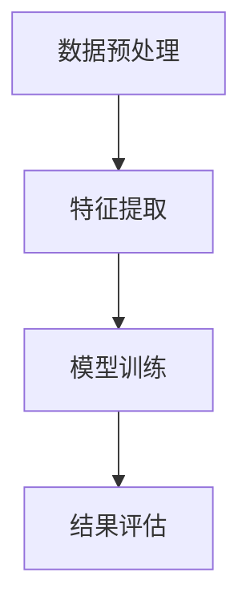
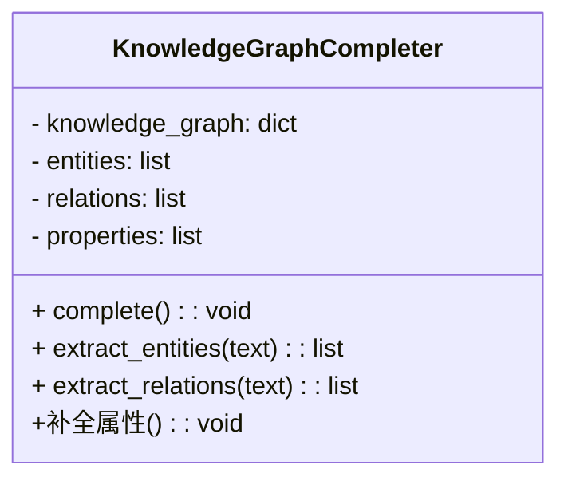
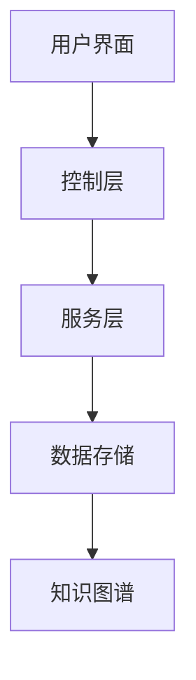

                 


# AI Agent的知识图谱补全技术在推理中的应用

**关键词**：AI Agent，知识图谱补全，推理，实体识别，关系抽取，属性补全，系统架构

**摘要**：  
本文探讨了AI Agent在知识图谱补全技术中的应用，重点分析了知识图谱补全技术在推理中的关键作用。文章从背景、核心概念、算法原理、系统架构到实际应用进行了全面阐述，通过具体案例和代码实现，深入剖析了知识图谱补全技术在AI Agent推理中的实际应用价值和未来发展方向。

---

## 第一部分: AI Agent与知识图谱补全技术概述

### 第1章: AI Agent与知识图谱补全技术的背景与应用

#### 1.1 知识图谱补全技术的背景  
知识图谱是一种结构化的数据表示方式，由实体（Entity）、关系（Relation）和属性（Property）组成，广泛应用于搜索引擎、智能问答、推荐系统等领域。然而，知识图谱的不完整性（如缺失实体、关系或属性）限制了其在复杂推理任务中的应用。知识图谱补全技术通过自动化填补这些缺失部分，极大地提升了知识图谱的完整性和可用性。

#### 1.2 AI Agent的定义与特点  
AI Agent（智能体）是一种能够感知环境、自主决策并执行任务的智能系统。与传统AI相比，AI Agent具有以下特点：  
- **自主性**：能够在无外部干预的情况下完成任务。  
- **反应性**：能够实时感知环境并做出响应。  
- **目标导向**：基于目标进行推理和决策。  
- **学习能力**：能够通过经验优化自身性能。  

#### 1.3 知识图谱补全技术在AI Agent推理中的应用前景  
知识图谱补全技术为AI Agent提供了更全面的知识表示，使其能够更好地理解复杂场景并做出准确推理。例如，在智能问答系统中，知识图谱补全技术可以帮助AI Agent填补问题中缺失的知识，从而生成更准确的回答。此外，在推荐系统中，知识图谱补全技术能够帮助AI Agent发现用户潜在的需求，提供更个性化的推荐。

---

### 第2章: 知识图谱补全技术的核心概念与联系

#### 2.1 知识图谱补全技术的核心原理  
知识图谱补全技术主要包含以下三个核心步骤：  
1. **实体识别**：通过自然语言处理技术从文本中提取实体。  
2. **关系抽取**：识别实体之间的关系。  
3. **属性补全**：补充实体的属性信息。  

#### 2.2 知识图谱补全技术的关键特征对比  
以下是一个对比表格，展示了三种常见的知识图谱补全方法的特征：  

| 特征               | 基于规则的方法       | 基于统计学习的方法   | 基于深度学习的方法   |
|--------------------|----------------------|--------------------|----------------------|
| **核心思想**       | 使用预定义规则       | 基于数据统计特征     | 基于深度神经网络     |
| **优点**           | 实现简单，可解释性高   | 适用于大规模数据     | 表现能力强，可自动学习 |
| **缺点**           | 需要大量人工规则       | 对特征工程依赖较高     | 计算资源消耗大       |

#### 2.3 知识图谱补全技术的ER实体关系图架构  
以下是一个简单的ER实体关系图示例：  

```mermaid
erDiagram
    entity(Entity) {
        id : integer
        name : string
    }
    entity(Relation) {
        id : integer
        name : string
    }
    entity(Property) {
        id : integer
        name : string
    }
    Entity o-- Relation
    Entity o-- Property
```

---

## 第3章: 知识图谱补全技术的算法原理

### 3.1 算法原理概述  
知识图谱补全技术的算法主要分为以下三类：  
1. **基于规则的补全方法**：通过预定义的规则进行实体识别和关系抽取。  
2. **基于统计学习的补全方法**：利用机器学习模型（如SVM、随机森林）进行特征提取和分类。  
3. **基于深度学习的补全方法**：采用神经网络（如LSTM、Transformer）进行端到端学习。  

### 3.2 基于深度学习的算法流程  
以下是一个基于深度学习的算法流程图：  



### 3.3 数学模型与公式  
知识图谱补全技术的数学模型可以通过概率论和向量空间模型来表示。例如，实体相似度计算公式如下：  

$$ \text{sim}(e1, e2) = \frac{e1 \cdot e2}{\|e1\| \cdot \|e2\|} $$  

其中，$e1$ 和 $e2$ 分别是两个实体的向量表示，$\cdot$ 表示点积，$\| \cdot \| 表示向量的模长。

---

## 第4章: 知识图谱补全系统的系统分析与架构设计

### 4.1 系统功能设计  
以下是一个知识图谱补全系统的领域模型：  



### 4.2 系统架构设计  
以下是一个典型的系统架构图：  



---

## 第5章: 项目实战

### 5.1 环境安装  
安装所需的Python库：  
```bash
pip install numpy
pip install scikit-learn
pip install spacy
```

### 5.2 系统核心实现  
以下是一个基于规则的实体识别示例代码：  

```python
import spacy

nlp = spacy.load("en_core_web_sm")
text = "Apple is a company based in California."

doc = nlp(text)
entities = [ent.text for ent in doc.ents]
print(entities)  # 输出：['Apple', 'California']
```

### 5.3 案例分析  
以智能问答系统为例，假设用户输入问题：“告诉我关于Apple公司的更多信息。” 知识图谱补全技术可以自动填补缺失的实体信息，如公司成立时间、主要业务等。

---

## 第6章: 最佳实践、小结与拓展阅读

### 6.1 最佳实践  
1. 在实际应用中，建议结合多种方法（如规则和深度学习）进行知识图谱补全。  
2. 注意数据质量和多样性，以提高模型的泛化能力。  
3. 定期更新知识图谱，以适应快速变化的环境。  

### 6.2 小结  
本文详细介绍了AI Agent的知识图谱补全技术在推理中的应用，从核心概念到算法原理，再到系统设计和实际案例，为读者提供了一个全面的视角。  

### 6.3 注意事项  
- 知识图谱补全技术的实现需要结合具体场景，避免“一刀切”。  
- 深度学习模型的计算资源消耗较大，需考虑实际环境的限制。  

### 6.4 拓展阅读  
- 《Deep Learning for NLP》  
- 《Knowledge Graph Construction: A Survey》  

---

**结束语**：  
知识图谱补全技术作为AI Agent的核心技术之一，正在推动人工智能系统向更智能、更自然的方向发展。未来，随着技术的不断进步，知识图谱补全技术将在更多领域发挥重要作用。

