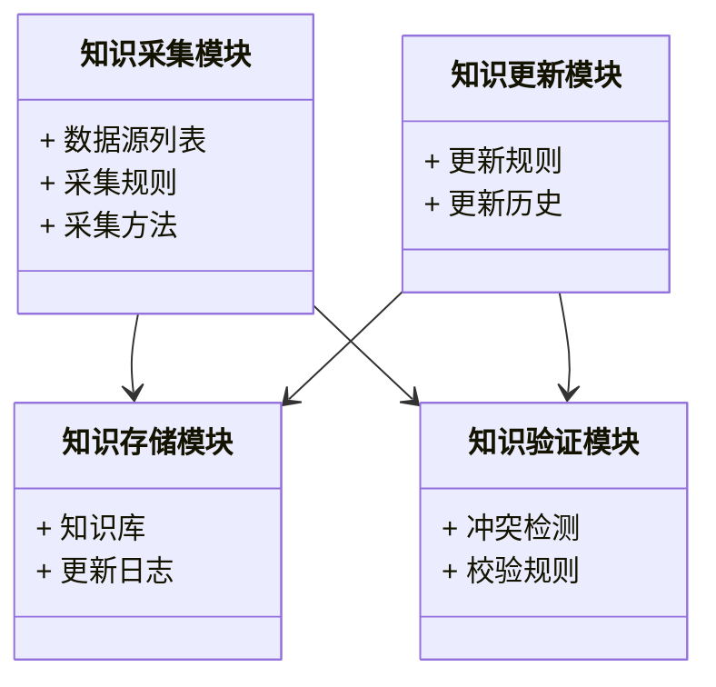

                 


# 第3章: 知识库增量更新的算法原理

## 3.4 数学模型与公式

### 3.4.1 增量更新触发概率模型
在知识库增量更新中，为了减少不必要的更新操作，我们可以采用概率模型来触发更新。假设知识库的更新频率为 $f$，每次更新的概率为 $p$，则：

$$ p = \frac{1}{f} $$

其中，$f$ 表示知识库的预期更新周期（以单位时间计算）。当随机触发的概率大于 $p$ 时，系统将执行知识库的增量更新。

### 3.4.2 基于时间戳的更新算法
假设当前时间戳为 $t$，知识库的上次更新时间戳为 $t_{last}$，则更新触发的条件为：

$$ t - t_{last} \geq \Delta t $$

其中，$\Delta t$ 为知识库的更新周期。为了提高更新效率，我们可以引入自适应更新周期：

$$ \Delta t_{new} = \Delta t_{old} \times (1 + \alpha) $$

其中，$\alpha$ 是自适应调整系数，$0 < \alpha \leq 1$。当知识库的更新延迟增加时，$\alpha$ 可以适当调大，以加快更新频率。

### 3.4.3 知识更新的权重分配模型
在知识库增量更新过程中，不同来源的知识可能具有不同的权重。我们可以采用加权平均的方法来合并新旧知识。假设新知识的权重为 $\omega_{new}$，旧知识的权重为 $\omega_{old}$，则更新后的知识权重为：

$$ \omega_{new} = \frac{1}{1 + e^{-k \cdot t}} $$

其中，$k$ 是更新速率常数，$t$ 是知识的有效时间。

## 3.5 本章小结

### 3.5.1 算法原理的系统性分析
本章从算法原理的角度，详细讲解了知识库增量更新的触发机制、更新周期的自适应调整以及知识权重的动态分配方法。

### 3.5.2 数学模型的应用价值
通过数学模型的引入，我们能够更精确地控制知识库的更新频率和更新内容的权重分配，从而在保证知识时效性的同时，减少不必要的更新操作。

---

# 第4章: 系统分析与架构设计

## 4.1 系统分析

### 4.1.1 问题场景介绍
知识库增量更新系统需要处理以下问题：
- 知识源的多样性和异构性
- 知识更新的实时性与效率
- 知识冲突的检测与处理

### 4.1.2 项目介绍
本系统旨在为AI Agent提供一个高效、可靠的增量更新机制，确保知识库中的信息始终保持最新状态。

### 4.1.3 系统功能设计
- 知识采集模块：负责从多种数据源采集知识
- 知识存储模块：负责知识的存储与管理
- 知识更新模块：负责增量更新的触发与执行
- 知识验证模块：负责知识的校验与冲突处理

### 4.1.4 领域模型（Mermaid 类图）


## 4.2 系统架构设计

### 4.2.1 系统架构（Mermaid 架构图）


### 4.2.2 系统接口设计
- 数据采集接口：`collectKnowledge(dataSource, timestamp)`
- 更新触发接口：`triggerUpdate(timestamp, updateRule)`
- 知识验证接口：`validateKnowledge(newKnowledge, oldKnowledge)`
- 更新日志接口：`logUpdate(changeSet, timestamp)`

## 4.3 本章小结

### 4.3.1 系统分析的深度解析
通过系统分析，我们明确了知识库增量更新系统的功能模块、数据流和交互关系，为后续的设计奠定了基础。

### 4.3.2 架构设计的可扩展性
采用分层架构设计，使得系统具有良好的扩展性和维护性，能够适应不同场景下的增量更新需求。

---

# 第5章: 项目实战

## 5.1 环境安装

### 5.1.1 开发环境要求
- Python 3.8+
- Mermaid 图形库
- Git 版本控制工具

### 5.1.2 依赖库安装
```bash
pip install mermaid
pip install python-dotenv
```

## 5.2 系统核心实现源代码

### 5.2.1 知识库更新模块实现
```python
import datetime

class KnowledgeUpdater:
    def __init__(self, knowledge_storage, update_rule):
        self.knowledge_storage = knowledge_storage
        self.update_rule = update_rule

    def trigger_update(self, timestamp):
        if self.should_update(timestamp):
            self.perform_update()

    def should_update(self, timestamp):
        last_update = self.knowledge_storage.get_last_update()
        return timestamp - last_update >= self.update_rule.update_interval

    def perform_update(self):
        # 执行增量更新
        new_knowledge = self.collect_new_knowledge()
        self.knowledge_storage.update_knowledge(new_knowledge)
        self.log_update(new_knowledge)

    def collect_new_knowledge(self):
        # 从数据源获取新知识
        pass

    def log_update(self, change_set):
        self.knowledge_storage.log_change(change_set, datetime.datetime.now())
```

### 5.2.2 知识验证模块实现
```python
class KnowledgeValidator:
    def __init__(self, knowledge_storage):
        self.knowledge_storage = knowledge_storage

    def validate(self, new_knowledge, old_knowledge):
        # 验证新知识与旧知识的冲突
        conflicts = []
        for key in new_knowledge:
            if key in old_knowledge and new_knowledge[key] != old_knowledge[key]:
                conflicts.append(key)
        return conflicts
```

## 5.3 代码应用解读与分析

### 5.3.1 知识更新模块的代码解读
- `KnowledgeUpdater` 类负责管理知识库的更新操作。
- `trigger_update` 方法根据当前时间戳判断是否需要触发更新。
- `perform_update` 方法执行实际的增量更新，并记录日志。

### 5.3.2 知识验证模块的代码解读
- `KnowledgeValidator` 类负责验证新知识与旧知识是否存在冲突。
- `validate` 方法返回冲突的键列表，供后续处理使用。

## 5.4 实际案例分析与详细讲解剖析

### 5.4.1 案例背景
假设我们的知识库存储的是产品价格信息，数据源为多个电商平台，更新周期为每天一次。

### 5.4.2 系统运行流程
1. 知识采集模块从各数据源获取最新的产品价格信息。
2. 知识更新模块判断当前时间是否满足更新条件。
3. 若满足条件，执行增量更新，将新知识写入知识库，并记录日志。
4. 知识验证模块检查新知识与旧知识是否存在冲突，若有冲突，触发人工或自动的冲突处理机制。

## 5.5 项目小结

### 5.5.1 核心代码的功能实现
通过上述代码实现，我们能够实现一个高效的增量更新系统，确保知识库的信息始终保持最新状态。

### 5.5.2 项目实战的可复用性
本项目采用模块化设计，各模块之间耦合性低，具有良好的可扩展性和可复用性，能够适应不同的应用场景。

---

# 第6章: 总结与展望

## 6.1 核心内容回顾

### 6.1.1 知识库增量更新的背景与意义
知识库的增量更新是保持AI Agent信息时效性的重要手段，能够显著提高系统的实用性和用户体验。

### 6.1.2 核心算法与系统架构
通过概率模型、自适应调整算法以及模块化架构设计，我们实现了高效的知识库增量更新机制。

## 6.2 实践中的注意事项

### 6.2.1 监控与日志管理
建议在系统中集成监控模块，实时跟踪知识库的更新状态和日志信息，便于后续的维护和优化。

### 6.2.2 容错与回滚机制
在知识更新过程中，应设计容错机制，确保在更新失败时能够回滚到之前的稳定状态。

## 6.3 未来研究方向

### 6.3.1 智能化更新策略
结合机器学习和强化学习技术，进一步优化知识库的增量更新策略，实现更智能的更新决策。

### 6.3.2 分布式知识库的增量更新
研究分布式环境下知识库的增量更新方法，提高系统的可扩展性和容错性。

## 6.4 本章小结

### 6.4.1 核心内容的系统性回顾
通过本章的总结，我们全面回顾了知识库增量更新的核心内容和实现方法。

### 6.4.2 未来研究的展望
展望了知识库增量更新的智能化和分布式方向，为后续的研究提供了方向性的指导。

---

# 关键词
AI Agent, 知识库增量更新, 信息时效性, 算法原理, 系统架构, 项目实战

# 摘要
本文详细探讨了AI Agent知识库增量更新的策略与实现方法。通过背景分析、核心概念讲解、算法原理阐述、系统架构设计以及项目实战演示，全面揭示了如何保持知识库信息的时效性。文章结合理论与实践，提出了高效的增量更新机制，并通过实际案例验证了其可行性和有效性。

