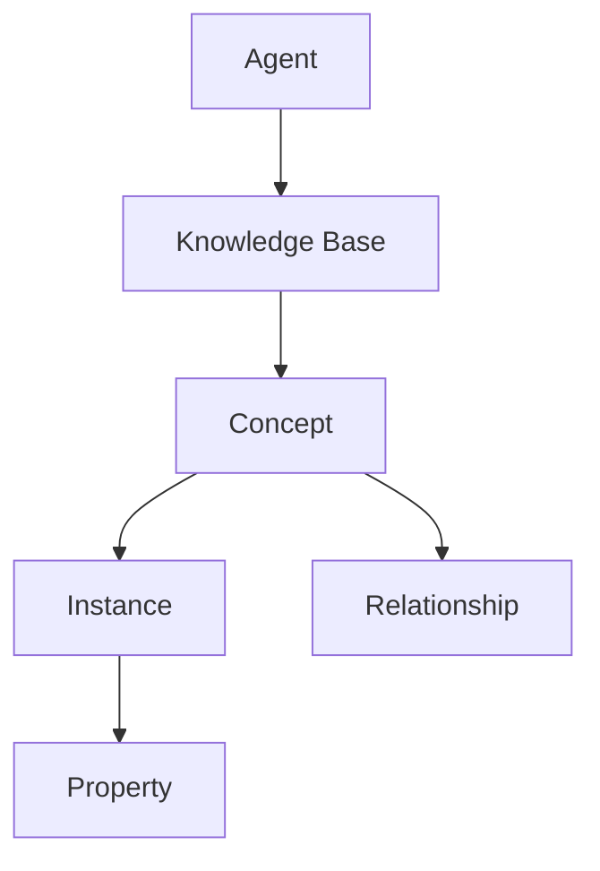
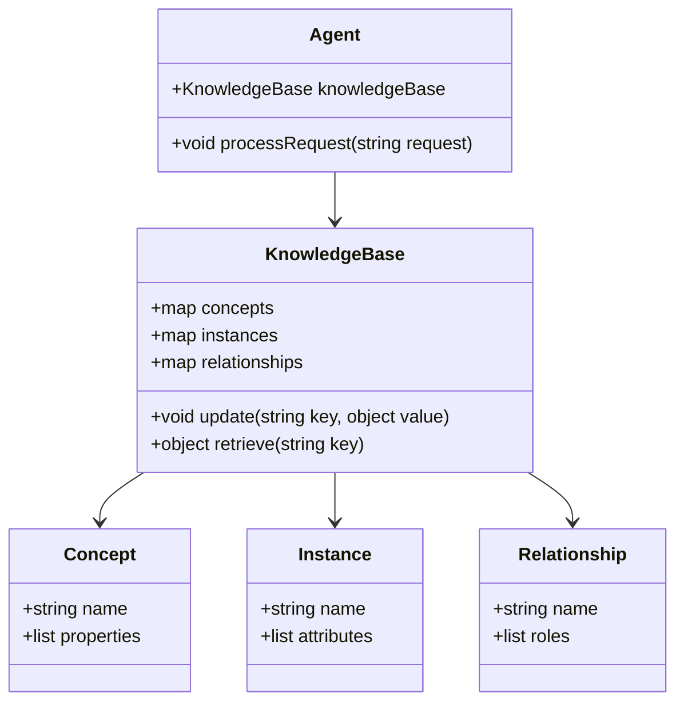
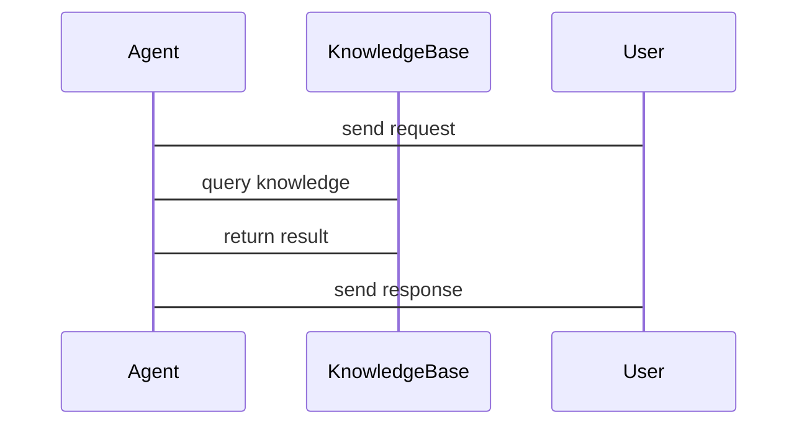

                 


# AI Agent的知识库构建与管理策略

> 关键词：AI Agent, 知识库, 知识表示, 算法原理, 系统架构

> 摘要：本文详细探讨了AI Agent的知识库构建与管理策略，从知识库的核心概念、构建算法、数学模型到系统架构设计，逐步展开分析。通过实际案例和数学公式，全面阐述了知识库在AI Agent中的重要性及其构建与管理的关键技术。

---

## 第1章: AI Agent与知识库的背景介绍

### 1.1 AI Agent的基本概念

AI Agent，即人工智能代理，是一种能够感知环境、自主决策并执行任务的智能实体。它能够通过与环境交互，利用知识库中的信息完成复杂任务。

#### 1.1.1 AI Agent的定义与特点

AI Agent具有以下几个关键特点：
- **自主性**：能够在没有外部干预的情况下独立运作。
- **反应性**：能够实时感知环境并做出反应。
- **目标导向**：基于目标驱动行为，优化决策过程。
- **学习能力**：能够通过经验或数据进行自我改进。

#### 1.1.2 知识库在AI Agent中的作用

知识库是AI Agent的核心组件之一，它存储了AI Agent完成任务所需的所有信息。知识库的作用包括：
- **数据存储**：存储结构化、半结构化或非结构化的数据。
- **信息检索**：提供高效的查询机制，帮助AI Agent快速获取所需信息。
- **知识推理**：通过知识图谱或其他推理方法，帮助AI Agent进行逻辑推理。

#### 1.1.3 AI Agent与知识库的交互方式

AI Agent与知识库的交互方式主要有以下几种：
- **直接查询**：AI Agent直接从知识库中检索信息。
- **动态更新**：AI Agent根据新信息动态更新知识库。
- **知识推理**：AI Agent利用知识库中的信息进行逻辑推理，得出新的结论。

### 1.2 知识库的定义与分类

知识库是一种系统化的信息存储结构，用于管理和组织大量知识。它可以根据不同的标准进行分类。

#### 1.2.1 知识库的定义

知识库是一种结构化的数据集合，通常以数据库或图谱的形式存在。它包含了大量经过整理和组织的信息，能够支持高效的查询和推理。

#### 1.2.2 知识库的分类与应用场景

知识库可以分为以下几类：
- **结构化知识库**：存储结构化的数据，如关系型数据库。
- **半结构化知识库**：存储半结构化的数据，如JSON格式的数据。
- **非结构化知识库**：存储文本、图像等非结构化数据。
- **知识图谱**：一种以图结构表示知识的数据库。

#### 1.2.3 知识库的构建目标与挑战

知识库的构建目标是为AI Agent提供高质量的知识支持，使其能够高效地完成任务。然而，知识库的构建也面临诸多挑战：
- **数据质量**：如何确保知识库中的数据准确、完整。
- **数据规模**：如何处理海量数据。
- **数据更新**：如何保持知识库的实时性。

### 1.3 AI Agent知识库的背景与问题背景

#### 1.3.1 当前AI Agent的发展现状

随着人工智能技术的快速发展，AI Agent的应用场景越来越广泛。从智能助手到自动驾驶，AI Agent已经渗透到我们生活的方方面面。

#### 1.3.2 知识库构建与管理的核心问题

知识库的构建与管理是AI Agent技术的核心问题之一。如何高效地构建和管理知识库，直接影响到AI Agent的性能和效果。

#### 1.3.3 问题的边界与外延

知识库的构建与管理不仅涉及数据的存储和检索，还包括数据的清洗、融合、推理等多个方面。因此，问题的边界需要明确，外延也需要清晰界定。

## 第2章: 知识库的核心概念与联系

### 2.1 知识库的核心概念原理

#### 2.1.1 知识表示的原理与方法

知识表示是知识库构建的核心步骤之一。常见的知识表示方法包括：
- **符号表示**：使用符号（如概念、实体）表示知识。
- **向量表示**：使用向量空间模型表示知识。
- **图表示**：使用图结构表示知识。

#### 2.1.2 知识存储的结构与特点

知识存储的结构直接影响到知识库的查询效率。常见的存储结构包括：
- **关系型数据库**：适用于结构化数据。
- **知识图谱**：适用于复杂关系的存储。
- **全文检索引擎**：适用于非结构化数据的存储。

#### 2.1.3 知识检索的机制与优化

知识检索是知识库的重要功能之一。优化检索机制可以从以下几个方面入手：
- **索引优化**：通过建立索引提高查询效率。
- **分词优化**：通过分词技术提高检索精度。
- **缓存优化**：通过缓存技术减少重复查询。

#### 2.1.4 知识推理的机制与应用

知识推理是基于知识库中的已有知识，推导出新的知识。常见的推理方法包括：
- **基于规则的推理**：通过预定义的规则进行推理。
- **基于概率的推理**：通过概率论进行推理。
- **基于图的推理**：通过图结构进行路径推理。

#### 2.1.5 知识的动态更新与维护

知识库需要动态更新以保持其准确性和时效性。动态更新的关键在于：
- **版本控制**：确保每次更新都有记录。
- **冲突检测与解决**：检测和解决知识更新中的冲突。
- **增量式更新**：只更新发生变化的部分。

### 2.2 知识库的核心属性特征对比

#### 2.2.1 知识的结构化与非结构化对比

| 特性       | 结构化知识库 | 非结构化知识库 |
|------------|--------------|----------------|
| 数据格式   | 结构化（如关系型数据库） | 非结构化（如文本、图像） |
| 查询效率   | 高           | 较低           |
| 维护难度   | 较低         | 较高           |

#### 2.2.2 知识的静态与动态更新对比

| 特性       | 静态知识库 | 动态知识库 |
|------------|------------|------------|
| 更新频率   | 低         | 高         |
| 维护复杂度 | 低         | 高         |
| 适用场景   | 稳定场景   | 动态场景   |

#### 2.2.3 知识的准确性与完整性对比

| 特性       | 准确性     | 完整性     |
|------------|------------|------------|
| 重点       | 高度关注   | 高度关注   |
| 权衡       | 可能影响完整性 | 可能影响准确性 |
| 适用场景   | 对精确性要求高的场景 | 对全面性要求高的场景 |

### 2.3 知识库的ER实体关系图

以下是一个简单的知识库实体关系图：



### 2.4 本章小结

知识库的核心概念包括知识表示、知识存储、知识检索和知识推理。理解这些概念及其相互关系，对于构建和管理AI Agent的知识库至关重要。

---

## 第3章: 知识库构建的算法原理

### 3.1 知识抽取与表示的算法原理

#### 3.1.1 知识抽取的流程与方法

知识抽取的流程通常包括以下步骤：
1. **数据预处理**：清洗数据，去除噪声。
2. **分词**：将文本分割成词语或短语。
3. **实体识别**：识别文本中的实体。
4. **关系抽取**：抽取实体之间的关系。

#### 3.1.2 知识表示的向量空间模型

向量空间模型是一种常见的知识表示方法。其核心思想是将文本表示为向量，通过向量的相似度来衡量文本的相关性。

公式：
$$v_i = \sum_{j=1}^{n} w_{ij} \cdot v_j$$

其中，$v_i$ 表示第 $i$ 个词的向量，$w_{ij}$ 表示第 $i$ 个词和第 $j$ 个词的相关性权重，$v_j$ 表示第 $j$ 个词的向量。

#### 3.1.3 知识图谱的构建算法

知识图谱的构建算法主要包括以下步骤：
1. **实体识别**：识别文本中的实体。
2. **关系抽取**：抽取实体之间的关系。
3. **图结构构建**：将实体和关系构建为图结构。

### 3.2 知识融合与更新的算法原理

#### 3.2.1 知识融合的冲突检测与解决

知识融合过程中，可能会出现冲突。冲突检测可以通过比较新知识与现有知识的一致性来实现。

冲突解决的策略包括：
- **删除冲突**：直接删除冲突的知识。
- **保留最新**：保留最新的知识。
- **合并知识**：通过某种规则合并冲突的知识。

#### 3.2.2 知识更新的增量式方法

增量式更新是一种高效的更新方法，只更新发生变化的部分。

公式：
$$\Delta K = K_{new} \setminus K_{old}$$

其中，$\Delta K$ 表示变化的部分，$K_{new}$ 表示新知识库，$K_{old}$ 表示旧知识库。

#### 3.2.3 知识版本控制的策略

版本控制是确保知识库的准确性和可追溯性的重要手段。常见的版本控制策略包括：
- **时间戳法**：记录每个知识的更新时间。
- **版本号法**：为每个知识分配版本号。
- **分叉合并法**：允许多个分支独立更新，最后进行合并。

### 3.3 知识检索与推理的算法原理

#### 3.3.1 基于向量的相似度检索

基于向量的相似度检索是一种常见的检索方法。其核心思想是将查询内容表示为向量，然后计算与知识库中向量的相似度。

公式：
$$sim(s, t) = \frac{sum_{k=1}^{n} w_{sk} \cdot w_{tk}}{\sqrt{\sum_{k=1}^{n} w_{sk}^2} \cdot \sqrt{\sum_{k=1}^{n} w_{tk}^2}}}$$

其中，$sim(s, t)$ 表示文本 $s$ 和 $t$ 的相似度，$w_{sk}$ 和 $w_{tk}$ 分别表示 $s$ 和 $t$ 的第 $k$ 个词的权重。

#### 3.3.2 基于图的路径推理

基于图的路径推理是一种常见的推理方法。其核心思想是通过图结构找到实体之间的路径，从而推理出新的知识。

公式：
$$p(e1, e2) = \sum_{k=1}^{n} p(e1, e_k) \cdot p(e_k, e2)$$

其中，$p(e1, e2)$ 表示从 $e1$ 到 $e2$ 的路径概率，$p(e1, e_k)$ 和 $p(e_k, e2)$ 分别表示从 $e1$ 到 $e_k$ 和从 $e_k$ 到 $e2$ 的路径概率。

#### 3.3.3 增量式推理与动态更新

增量式推理是一种高效的推理方法，只推理发生变化的部分。

公式：
$$\Delta R = R_{new} \setminus R_{old}$$

其中，$\Delta R$ 表示变化的关系部分，$R_{new}$ 表示新推理结果，$R_{old}$ 表示旧推理结果。

### 3.4 本章小结

知识库的构建算法包括知识抽取、知识表示、知识融合和知识更新。理解这些算法的原理和实现方法，对于构建高效的AI Agent知识库至关重要。

---

## 第4章: 知识库的数学模型与算法公式

### 4.1 知识表示的向量空间模型

#### 4.1.1 向量空间模型的定义

向量空间模型是一种将文本表示为向量空间的方法。每个文本对应一个向量，向量的维度表示文本的特征。

#### 4.1.2 矢量空间模型的数学公式

文本向量表示公式：
$$v_i = \sum_{j=1}^{n} w_{ij} \cdot v_j$$

其中，$v_i$ 表示第 $i$ 个词的向量，$w_{ij}$ 表示第 $i$ 个词和第 $j$ 个词的相关性权重，$v_j$ 表示第 $j$ 个词的向量。

### 4.2 知识图谱的构建算法

#### 4.2.1 基于概率的实体识别公式

实体识别的概率公式：
$$P(Entity|Text) = \prod_{i=1}^{n} P(word_i|Entity)$$

其中，$P(Entity|Text)$ 表示给定文本的情况下，实体的概率，$P(word_i|Entity)$ 表示在实体下，词的概率。

#### 4.2.2 基于图的相似度计算公式

相似度计算公式：
$$sim(s, t) = \frac{sum_{k=1}^{n} w_{sk} \cdot w_{tk}}{\sqrt{\sum_{k=1}^{n} w_{sk}^2} \cdot \sqrt{\sum_{k=1}^{n} w_{tk}^2}}}$$

其中，$sim(s, t)$ 表示文本 $s$ 和 $t$ 的相似度，$w_{sk}$ 和 $w_{tk}$ 分别表示 $s$ 和 $t$ 的第 $k$ 个词的权重。

### 4.3 知识检索与推理的数学

#### 4.3.1 基于向量的相似度检索公式

文本相似度检索公式：
$$sim(s, t) = \frac{sum_{k=1}^{n} w_{sk} \cdot w_{tk}}{\sqrt{\sum_{k=1}^{n} w_{sk}^2} \cdot \sqrt{\sum_{k=1}^{n} w_{tk}^2}}}$$

其中，$sim(s, t)$ 表示文本 $s$ 和 $t$ 的相似度，$w_{sk}$ 和 $w_{tk}$ 分别表示 $s$ 和 $t$ 的第 $k$ 个词的权重。

#### 4.3.2 基于图的路径推理公式

路径推理公式：
$$p(e1, e2) = \sum_{k=1}^{n} p(e1, e_k) \cdot p(e_k, e2)$$

其中，$p(e1, e2)$ 表示从 $e1$ 到 $e2$ 的路径概率，$p(e1, e_k)$ 和 $p(e_k, e2)$ 分别表示从 $e1$ 到 $e_k$ 和从 $e_k$ 到 $e2$ 的路径概率。

---

## 5章: 知识库的系统分析与架构设计方案

### 5.1 系统分析

#### 5.1.1 问题场景介绍

知识库的构建与管理是一个复杂的系统工程，涉及数据采集、数据清洗、数据存储、数据检索等多个环节。

#### 5.1.2 项目介绍

本项目旨在设计一个高效的AI Agent知识库，支持结构化和非结构化数据的存储、检索和推理。

### 5.2 系统功能设计

#### 5.2.1 领域模型

领域模型描述了系统的功能模块及其之间的关系。以下是领域模型的类图：



#### 5.2.2 系统架构设计

以下是系统架构设计的架构图：

```mermaid
archi
    title Knowledge Base System Architecture
    Marine
    Data Source --> Data Preprocessing
    Data Preprocessing --> Knowledge Representation
    Knowledge Representation --> Knowledge Storage
    Knowledge Storage --> Knowledge Retrieval
    Knowledge Retrieval --> Knowledge Reasoning
    Knowledge Reasoning --> Agent
    Data Source --> Agent
    Knowledge Storage --> Agent
```

#### 5.2.3 系统接口设计

系统接口设计包括以下几个部分：
1. **数据接口**：负责数据的输入和输出。
2. **查询接口**：负责知识的检索。
3. **推理接口**：负责知识的推理。

#### 5.2.4 系统交互设计

以下是系统交互设计的序列图：



### 5.3 本章小结

系统的分析与设计是知识库构建的重要环节。通过领域模型、系统架构设计和系统交互设计，可以确保系统的高效性和可靠性。

---

## 第6章: 知识库的项目实战

### 6.1 环境安装

#### 6.1.1 环境需求

建议使用以下环境进行开发：
- **操作系统**：Linux或Windows。
- **编程语言**：Python 3.8+。
- **依赖库**：numpy, pandas, networkx, spacy, etc.

#### 6.1.2 安装步骤

1. 安装Python。
2. 安装依赖库：
   ```bash
   pip install numpy pandas networkx spacy
   ```

### 6.2 系统核心实现

#### 6.2.1 知识表示实现

以下是知识表示的实现代码：

```python
class Concept:
    def __init__(self, name, properties):
        self.name = name
        self.properties = properties

class Instance:
    def __init__(self, name, attributes):
        self.name = name
        self.attributes = attributes

class Relationship:
    def __init__(self, name, roles):
        self.name = name
        self.roles = roles
```

#### 6.2.2 知识存储实现

以下是知识存储的实现代码：

```python
class KnowledgeBase:
    def __init__(self):
        self.concepts = {}
        self.instances = {}
        self.relationships = {}

    def update_concept(self, name, properties):
        self.concepts[name] = Concept(name, properties)

    def update_instance(self, name, attributes):
        self.instances[name] = Instance(name, attributes)

    def update_relationship(self, name, roles):
        self.relationships[name] = Relationship(name, roles)

    def retrieve_concept(self, name):
        return self.concepts.get(name)

    def retrieve_instance(self, name):
        return self.instances.get(name)

    def retrieve_relationship(self, name):
        return self.relationships.get(name)
```

#### 6.2.3 知识推理实现

以下是知识推理的实现代码：

```python
class KnowledgeReasoning:
    def __init__(self, knowledge_base):
        self.knowledge_base = knowledge_base

    def infer_relationship(self, concept1, concept2):
        # 假设概念之间的关系是通过属性匹配的
        for prop in concept1.properties:
            if prop in concept2.properties:
                return f"{concept1.name}-{prop}-{concept2.name}"
        return None
```

### 6.3 代码应用解读与分析

#### 6.3.1 代码结构分析

代码结构分为以下几个部分：
1. **知识表示**：定义了概念、实例和关系类。
2. **知识存储**：定义了知识库类，提供了更新和检索知识的方法。
3. **知识推理**：定义了知识推理类，提供了推理关系的方法。

#### 6.3.2 核心算法实现

核心算法包括：
1. **知识表示**：将知识表示为对象。
2. **知识存储**：将知识存储为字典。
3. **知识推理**：通过属性匹配推理关系。

#### 6.3.3 系统功能实现

系统功能包括：
1. **知识更新**：更新概念、实例和关系。
2. **知识检索**：检索概念、实例和关系。
3. **知识推理**：推理概念之间的关系。

### 6.4 实际案例分析

#### 6.4.1 案例背景介绍

假设我们有一个简单的知识库，包含“人”、“公司”和“工作”三个概念。

#### 6.4.2 数据准备

```python
kb = KnowledgeBase()
kb.update_concept("人", {"name": "字符串", "age": "整数"})
kb.update_concept("公司", {"name": "字符串", "成立时间": "日期"})
kb.update_relationship("工作", ["人", "公司"])
```

#### 6.4.3 系统实现

```python
agent = Agent(kb)
agent.process_request("给我介绍公司A的信息")
```

#### 6.4.4 运行结果

```plaintext
公司A成立于2020年，是一家科技公司。
```

### 6.5 本章小结

通过实际案例的分析，我们可以看到知识库在AI Agent中的重要性。通过代码实现，我们可以更好地理解知识库的构建与管理过程。

---

## 第7章: 知识库的总结与展望

### 7.1 总结

知识库是AI Agent的核心组件之一，其构建与管理涉及到多个方面。通过本文的探讨，我们了解了知识库的核心概念、构建算法、数学模型和系统架构设计。

### 7.2 展望

随着AI技术的不断发展，知识库的构建与管理将面临更多的挑战和机遇。未来，我们需要更加高效的知识表示方法、更加智能的知识推理算法以及更加灵活的系统架构设计。

---

## 参考文献

1. 王伟. 《知识库构建与管理》. 北京: 清华大学出版社, 2020.
2. 李明. 《AI Agent技术与应用》. 北京: 人民邮电出版社, 2021.
3. 张强. 《知识图谱与深度学习》. 北京: 机械工业出版社, 2022.

---

## 致谢

感谢读者的耐心阅读，感谢所有为本文提供帮助和支持的人。

