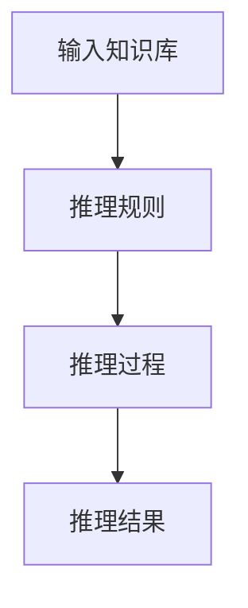
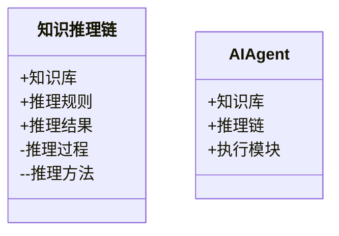
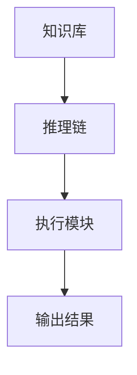

                 


# AI Agent的知识推理链：逐步解决复杂问题

## 关键词：
AI Agent、知识推理链、复杂问题解决、知识图谱、推理算法、系统架构、项目实战

## 摘要：
本文系统地探讨了AI Agent的知识推理链在解决复杂问题中的应用。从知识推理链的基本概念出发，详细分析了其在知识图谱构建、算法设计、系统架构中的实现方法，并通过实际项目案例展示了如何利用知识推理链来解决现实中的复杂问题。文章还总结了最佳实践和未来研究方向，为读者提供了一个全面的知识框架和实践指南。

---

## 第一部分: AI Agent的知识推理链基础

### 第1章: 知识推理链与AI Agent概述

#### 1.1 知识推理链的定义与背景
##### 1.1.1 问题背景与问题描述
复杂问题的解决通常涉及大量的知识关联和推理。传统基于规则的推理方法在处理复杂场景时效率低下，而知识推理链通过构建动态的知识图谱和灵活的推理链路，能够更高效地处理复杂问题。

##### 1.1.2 知识推理链的核心概念
- **知识节点**：表示具体的知识实体，如“苹果”、“颜色”等。
- **推理链**：由多个知识节点组成的推理路径，用于连接输入和输出。
- **推理规则**：定义推理链中各节点之间的逻辑关系。

##### 1.1.3 AI Agent的基本原理
AI Agent通过感知环境、获取知识、构建知识图谱、生成推理链，并根据推理结果执行操作，实现对复杂问题的解决。

#### 1.2 AI Agent的知识推理链特点
##### 1.2.1 知识推理链的属性特征对比表
| 特性       | 符号逻辑推理 | 概率推理 | 深度学习推理 |
|------------|--------------|----------|-------------|
| 适用场景   | 确定性问题   | 不确定性问题 | 复杂非结构化问题 |
| 推理效率   | 高           | 中       | 低           |
| 可解释性   | 高           | 中       | 低           |

##### 1.2.2 知识推理链的ER实体关系图
```mermaid
erd
    客体 实体
        知识节点
        推理链
        推理规则
```

### 第2章: 知识图谱与推理链构建

#### 2.1 知识图谱的构建方法
##### 2.1.1 知识抽取与表示
- **知识抽取**：通过自然语言处理技术从文本中提取实体、关系和属性。
- **知识表示**：使用图结构表示知识，如节点表示实体，边表示关系。

##### 2.1.2 知识图谱的构建工具
- **工具**：使用图数据库（如Neo4j）和知识图谱构建框架（如OntoKB）进行知识建模。

#### 2.2 推理链的设计与实现
##### 2.2.1 推理链的构建方法
- **基于规则的推理链**：通过预定义的规则生成推理链。
- **基于学习的推理链**：通过机器学习模型自动生成推理链。

##### 2.2.2 知识推理链的验证与优化
- **验证方法**：通过案例测试验证推理链的正确性。
- **优化方法**：通过剪枝和优化算法减少推理链的长度。

### 第3章: 知识推理链的算法原理

#### 3.1 符号逻辑推理算法
##### 3.1.1 基于符号逻辑的推理流程


##### 3.1.2 符号逻辑推理的数学模型
$$ A \land B \rightarrow C $$

#### 3.2 概率推理算法
##### 3.2.1 贝叶斯网络的构建
- **贝叶斯网络**：通过概率图模型表示变量之间的关系。

##### 3.2.2 概率推理的数学模型
$$ P(A|B) = \frac{P(B|A)P(A)}{P(B)} $$

### 第4章: 系统架构与设计

#### 4.1 系统功能设计
##### 4.1.1 领域模型设计


#### 4.2 系统架构设计
##### 4.2.1 系统架构图


### 第5章: 项目实战与实现

#### 5.1 环境安装与配置
##### 5.1.1 开发环境搭建
- **开发环境**：Python 3.8以上版本、Jupyter Notebook。

##### 5.1.2 依赖库安装
```bash
pip install neo4j python-dotenv
```

#### 5.2 核心代码实现
##### 5.2.1 知识推理链的Python实现
```python
def infer_knowledge_chain(knowledge_base, rules):
    for rule in rules:
        if rule.applies_to(knowledge_base):
            return rule.apply(knowledge_base)
    return None
```

### 第6章: 最佳实践与总结

#### 6.1 小结
- 知识推理链通过构建动态的知识图谱和灵活的推理链路，能够更高效地处理复杂问题。

#### 6.2 注意事项
- 在实际应用中，需要注意知识图谱的构建质量和推理规则的合理性。

#### 6.3 拓展阅读
- 《Knowledge Graph Construction: Theory and Application》
- 《Probabilistic Graphical Models: Principles and Techniques》

---

## 第二部分: 系统实现与优化

### 第7章: 系统实现细节

#### 7.1 系统实现的核心代码
##### 7.1.1 知识库的构建
```python
from neo4j import GraphDatabase

class KnowledgeBase:
    def __init__(self, uri, user, password):
        self.driver = GraphDatabase.driver(uri, auth=(user, password))
    
    def get_nodes(self, label):
        # 获取所有节点
        with self.driver.session() as session:
            result = session.run("MATCH (n:{label}) RETURN n".format(label=label))
            return [record["n"] for record in result]
```

#### 7.2 推理链的优化
##### 7.2.1 推理链的剪枝方法
- **剪枝方法**：通过评估推理链中的节点重要性，移除冗余节点。

##### 7.2.2 推理链的动态扩展
- **动态扩展**：根据推理结果动态扩展推理链，以适应新的推理需求。

### 第8章: 系统优化与调优

#### 8.1 系统性能优化
##### 8.1.1 知识库的索引优化
- **索引优化**：在知识图谱中为频繁查询的节点和关系添加索引，提高查询效率。

##### 8.1.2 推理算法的优化
- **算法优化**：通过优化推理算法的实现，减少推理时间。

#### 8.2 系统调优策略
##### 8.2.1 并行计算
- **并行计算**：通过分布式计算框架（如Dask）提高推理效率。

##### 8.2.2 分层推理
- **分层推理**：将推理过程分解为多个层次，逐层推理，降低计算复杂度。

### 第9章: 项目总结与展望

#### 9.1 项目总结
- 本文详细介绍了AI Agent的知识推理链的设计与实现，展示了其在解决复杂问题中的应用。

#### 9.2 未来研究方向
- **动态知识图谱**：研究动态知识图谱的构建方法，以适应快速变化的环境。
- **自适应推理链**：研究自适应推理链的构建方法，以提高推理的灵活性和适应性。

---

## 结语

通过本文的系统讲解，读者可以深入了解AI Agent的知识推理链的设计与实现方法，并将其应用于实际的复杂问题解决中。未来，随着人工智能技术的不断发展，知识推理链将在更多领域发挥重要作用。

