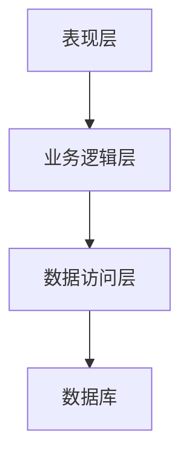

                 


# AI Agent的知识整合：融合多源信息

## 关键词
AI Agent, 知识整合, 多源信息, 信息融合, 数据处理, 系统架构

## 摘要
AI Agent通过整合多源信息，能够更高效地处理复杂任务。本文从背景、核心概念、算法原理到系统架构和项目实战，详细探讨了知识整合的重要性、挑战和解决方案。通过实际案例分析，展示了如何设计高效的系统架构，并给出了最佳实践和总结。

---

# 第1章: AI Agent与知识整合概述

## 1.1 AI Agent的基本概念

### 1.1.1 什么是AI Agent
AI Agent（人工智能代理）是能够感知环境并采取行动以实现目标的智能实体。它们通过处理信息做出决策，广泛应用于推荐系统、自动驾驶等领域。

### 1.1.2 AI Agent的核心特征
- **自主性**：无需外部干预，自主决策。
- **反应性**：实时感知并响应环境变化。
- **主动性**：主动采取行动以实现目标。
- **社会性**：与其他系统或人类交互协作。

### 1.1.3 知识整合在AI Agent中的作用
知识整合帮助AI Agent有效利用多源信息，提升决策的准确性和效率，是其实现复杂任务的关键。

---

## 1.2 多源信息融合的背景与意义

### 1.2.1 当前信息融合的挑战
- 数据异构性：不同来源的数据格式和语义差异。
- 数据冗余：同一信息来自多个来源，存在重复。
- 数据不一致：不同来源的信息可能存在矛盾。

### 1.2.2 多源信息融合的重要性
- 提高信息准确性：通过融合多源数据，减少片面性。
- 增强系统鲁棒性：单一数据源的局限性被多源数据弥补。
- 优化决策效率：快速整合信息，提升决策速度。

### 1.2.3 知识整合在AI Agent中的应用前景
知识整合技术的进步将推动AI Agent在各领域的广泛应用，如智能客服、自动驾驶等。

---

# 第2章: 知识整合的核心概念与联系

## 2.1 知识整合的基本原理

### 2.1.1 知识表示与表达
知识表示是将信息以计算机可处理的形式表达的过程。常用方法包括符号逻辑、语义网络和本体论。

### 2.1.2 知识关联与推理
知识关联通过建立实体间的关联关系，推理出潜在信息。推理方法包括归纳推理和演绎推理。

### 2.1.3 知识融合的流程
知识融合通常包括数据预处理、特征提取、融合和结果验证四个阶段。

---

## 2.2 多源信息融合的模型与方法

### 2.2.1 基于图的融合模型
基于图的模型通过节点和边表示实体及其关系，适用于复杂关联的场景。

### 2.2.2 基于概率的融合方法
概率模型通过计算概率分布，量化信息的不确定性，常用于处理模糊信息。

### 2.2.3 基于规则的融合策略
基于规则的方法利用预定义的规则进行信息融合，适用于规则明确的场景。

---

# 第3章: 知识整合的算法原理

## 3.1 加权融合算法

### 3.1.1 加权融合的基本思想
加权融合根据信息源的可靠性分配权重，计算加权和。

### 3.1.2 加权融合的数学模型
$$ y = \sum_{i=1}^{n} w_i x_i $$
其中，$w_i$为权重，$x_i$为信息源数据。

### 3.1.3 算法实现与优化
权重计算可基于信息源的准确性，采用归一化处理优化结果。

---

## 3.2 基于图的融合算法

### 3.2.1 图结构表示
使用节点和边表示实体及其关系，如知识图谱。

### 3.2.2 图融合算法
通过图遍历算法（如DFS、BFS）进行信息融合。

### 3.2.3 算法实现与案例分析
案例：将多个来源的信息整合到一个知识图谱中，提升信息的连通性。

---

## 3.3 基于概率的融合算法

### 3.3.1 概率融合的基本原理
利用概率论处理信息的不确定性，如贝叶斯网络。

### 3.3.2 贝叶斯网络的应用
构建贝叶斯网络模型，计算条件概率，进行信息融合。

### 3.3.3 算法实现与优化
通过最大似然估计优化模型参数，提升融合效果。

---

# 第4章: 系统分析与架构设计方案

## 4.1 系统功能设计

### 4.1.1 领域模型设计
构建领域模型，明确系统功能模块及交互关系。

### 4.1.2 功能模块划分
- 数据采集模块：收集多源数据。
- 数据处理模块：清洗和预处理数据。
- 知识融合模块：整合多源信息。
- 决策推理模块：基于融合后的知识做出决策。

### 4.1.3 模块之间的交互关系
数据流从采集到处理，再到融合和决策，各模块协同工作。

---

## 4.2 系统架构设计

### 4.2.1 分层架构设计
- 表现层：用户交互界面。
- 业务逻辑层：处理用户请求。
- 数据访问层：访问数据库或API。

### 4.2.2 模块化设计
各功能模块独立开发，便于维护和扩展。

### 4.2.3 系统接口设计
定义模块间接口，确保数据格式和交互协议一致。

---

## 4.3 系统交互流程

### 4.3.1 数据采集与预处理
从多个数据源采集数据，清洗和标准化处理。

### 4.3.2 知识融合与推理
将预处理后的数据进行融合，通过推理得到结果。

### 4.3.3 结果输出与反馈
将融合后的结果输出，并根据反馈优化系统。

---

# 第5章: 项目实战与案例分析

## 5.1 项目环境搭建

### 5.1.1 开发环境配置
选择合适的开发工具和框架，如Python、TensorFlow。

### 5.1.2 数据集准备
收集多源数据，确保数据多样性。

### 5.1.3 工具链安装
安装必要的库和工具，如pandas、numpy。

---

## 5.2 系统核心实现

### 5.2.1 数据处理模块实现
编写代码进行数据清洗和预处理。

### 5.2.2 知识融合模块实现
实现加权融合或基于图的融合算法。

### 5.2.3 决策推理模块实现
基于融合后的知识进行推理和决策。

---

## 5.3 案例分析

### 5.3.1 案例背景
一个智能客服系统，整合来自多个渠道的客户信息。

### 5.3.2 数据处理与融合
清洗数据，使用加权融合算法整合信息。

### 5.3.3 结果分析
分析融合后的信息对客服决策的支持效果。

---

# 第6章: 最佳实践与总结

## 6.1 小结
知识整合是AI Agent的核心能力，多源信息融合提升决策的准确性和效率。

## 6.2 注意事项
- 数据预处理：确保数据质量。
- 算法选择：根据场景选择合适的融合方法。
- 系统架构：模块化设计，便于维护。

## 6.3 拓展阅读
推荐相关书籍和论文，深入学习知识整合技术。

---

# 附录

## 附录A: 算法代码示例
```python
def weighted_fusion(data_sources, weights):
    return sum(w * d for w, d in zip(weights, data_sources))
```

## 附录B: 系统架构图


---

通过以上结构，文章详细探讨了AI Agent的知识整合，从理论到实践，为读者提供了全面的指导和深入的分析。

