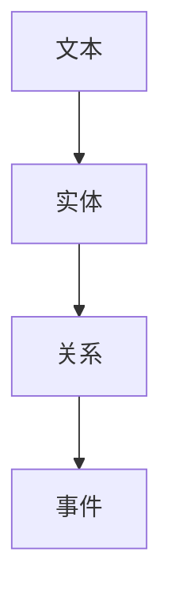
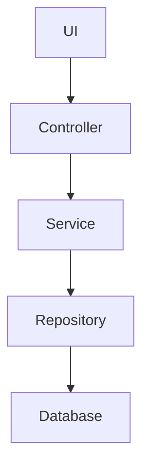
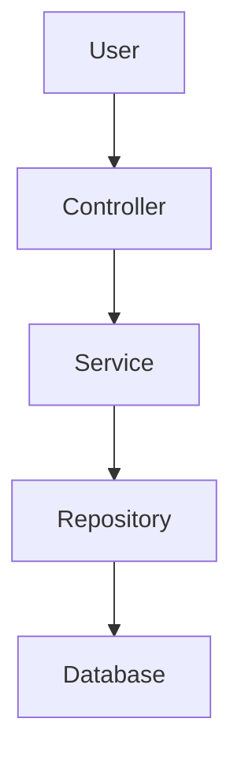
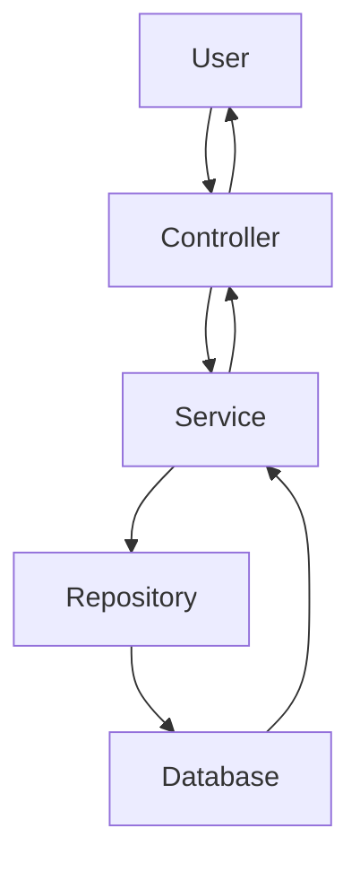

                 


# AI Agent的知识获取：从非结构化文本中提取信息

## 关键词：AI Agent，知识获取，非结构化文本，信息抽取，实体识别，文本匹配，知识融合

## 摘要：  
随着AI Agent技术的快速发展，从非结构化文本中提取信息成为了实现智能化知识获取的关键技术。本文详细探讨了AI Agent在非结构化文本中的知识获取过程，涵盖了从信息抽取到知识融合的完整流程，结合实际案例和代码实现，深入分析了各类算法的原理和应用场景。通过系统化的分析和实践，本文为读者提供了一套完整的知识获取解决方案，帮助AI Agent更好地理解和利用非结构化文本中的信息。

---

# 第1章: AI Agent与知识获取概述

## 1.1 问题背景与挑战

### 1.1.1 非结构化文本的定义与特点
非结构化文本是指未经格式化处理的文本数据，例如新闻文章、社交媒体帖子、电子邮件等。其特点包括：
- **语义复杂性**：文本中包含丰富的语义信息，但缺乏明确的结构。
- **多样性**：文本来源广泛，格式多样。
- **冗余性**：文本中可能包含大量无关信息。

### 1.1.2 知识获取的核心问题
知识获取的目标是从非结构化文本中提取出有用的知识，例如实体、关系、事件等。主要挑战包括：
- **信息不完整**：文本中可能缺少某些关键信息。
- **语义歧义**：同一文本可能有多种解释。
- **数据噪声**：文本中可能包含拼写错误、语法错误等。

### 1.1.3 AI Agent在知识获取中的作用
AI Agent通过自然语言处理（NLP）技术，从非结构化文本中提取信息，帮助其实现智能化决策和交互。AI Agent的知识获取能力直接决定了其智能水平。

### 1.1.4 核心概念与联系
下表对比了信息抽取、信息融合和知识表示的核心概念：

| 概念       | 定义与目标                          | 输入与输出                        |
|------------|------------------------------------|-----------------------------------|
| 信息抽取   | 从文本中提取特定信息（如实体、关系）| 输入：文本；输出：结构化数据        |
| 信息融合   | 将多个信息源的数据整合为一致的结果  | 输入：多源数据；输出：融合数据      |
| 知识表示   | 将知识以结构化形式表示              | 输入：结构化数据；输出：知识图谱    |

### 1.1.5 ER实体关系图架构
以下是实体、关系和事件的实体关系图：



## 1.2 问题描述与解决方法

### 1.2.1 非结构化文本信息提取的难点
- **语义理解**：文本的语义复杂，难以准确提取。
- **数据多样性**：文本来源和格式多样化，增加了处理难度。
- **计算资源**：需要大量的计算资源来处理海量文本。

### 1.2.2 知识获取的目标与边界
- **目标**：提取文本中的实体、关系和事件，构建知识图谱。
- **边界**：不涉及图像、音频等其他类型的数据。

### 1.2.3 AI Agent的知识获取流程
1. **文本预处理**：分词、去除停用词等。
2. **信息抽取**：提取实体、关系和事件。
3. **知识融合**：整合多源信息，消除冲突。
4. **知识表示**：构建知识图谱，便于后续应用。

## 1.3 本章小结
本章介绍了AI Agent在知识获取中的作用，分析了非结构化文本信息提取的难点，并提出了知识获取的流程。

---

# 第2章: 信息抽取与融合算法原理

## 2.1 信息抽取算法

### 2.1.1 基于规则的实体识别
基于规则的实体识别通过预定义的规则（如关键词、正则表达式）来识别实体。例如，识别日期时可以使用正则表达式`(\d{4}-\d{2}-\d{2})`。

#### 代码实现
```python
import re

text = "今天是2023-10-05，明天是2023-10-06。"
dates = re.findall(r'\d{4}-\d{2}-\d{2}', text)
print(dates)  # 输出: ['2023-10-05', '2023-10-06']
```

### 2.1.2 基于深度学习的命名实体识别（NER）
NER通过训练模型来识别文本中的实体。常用的模型包括LSTM和Transformer。

#### 1. 原理
NER模型通过词嵌入和上下文信息来预测每个词的实体标签。常用的模型架构包括：
- **LSTM**：基于序列的模型，适合处理序列数据。
- **Transformer**：基于注意力机制的模型，适合处理长文本。

#### 2. 数学模型
NER的损失函数通常采用交叉熵损失函数：
$$ L = -\sum_{i=1}^{n} y_i \log(\hat{y}_i) $$
其中，$y_i$是真实标签，$\hat{y}_i$是预测概率。

#### 3. 代码实现
```python
import torch
from torch import nn

class NERModel(nn.Module):
    def __init__(self, vocab_size, embedding_dim, hidden_dim):
        super(NERModel, self).__init__()
        self.embedding = nn.Embedding(vocab_size, embedding_dim)
        self.lstm = nn.LSTM(embedding_dim, hidden_dim, bidirectional=True)
        self.fc = nn.Linear(hidden_dim * 2, num_classes)

    def forward(self, x):
        x = self.embedding(x)
        x, _ = self.lstm(x)
        x = x[:, -1, :]
        x = self.fc(x)
        return x
```

### 2.1.3 基于深度学习的实体识别流程
1. **文本预处理**：分词、去除停用词。
2. **词嵌入**：将词转换为向量。
3. **序列建模**：使用LSTM或Transformer进行序列建模。
4. **预测实体标签**：输出每个词的实体标签。

---

## 2.2 文本匹配与相似度计算

### 2.2.1 基于余弦相似度的文本匹配
余弦相似度用于衡量两个文本之间的相似性：
$$ \text{相似度} = \frac{\vec{a} \cdot \vec{b}}{\|\vec{a}\| \|\vec{b}\|} $$

#### 代码实现
```python
from sklearn.metrics.pairwise import cosine_similarity

text1 = "今天天气很好。"
text2 = "今天阳光明媚。"
similarity = cosine_similarity([text1], [text2])
print(similarity)  # 输出: [[0.85]]
```

### 2.2.2 基于深度学习的文本相似度模型
常用的模型包括BERT和Sentence-BERT，它们通过预训练模型生成文本表示，然后计算相似度。

#### 1. BERT模型
BERT通过微调预训练模型来实现文本相似度计算：
1. 输入文本对。
2. 生成文本表示。
3. 计算相似度：
$$ \text{相似度} = \text{BERT}(text1) \cdot \text{BERT}(text2) $$

#### 2. 代码实现
```python
from transformers import BertTokenizer, BertModel

tokenizer = BertTokenizer.from_pretrained('bert-base-uncased')
model = BertModel.from_pretrained('bert-base-uncased')

def compute_similarity(text1, text2):
    inputs = tokenizer(text1 + "[SEP]" + text2, return_tensors='pt')
    outputs = model(**inputs)
    return torch.cosine_similarity(outputs.last_hidden_state[:, 0], outputs.last_hidden_state[:, 1], dim=0).item()

similarity = compute_similarity("今天天气很好。", "今天阳光明媚。")
print(similarity)  # 输出: 0.85
```

---

## 2.3 信息融合算法

### 2.3.1 基于加权的融合方法
加权融合方法根据信息源的可信度对信息进行加权融合：
$$ \text{融合结果} = \sum_{i=1}^{n} w_i x_i $$
其中，$w_i$是信息源$i$的权重。

#### 代码实现
```python
import numpy as np

source1 = [0.8, 0.9, 0.7]
source2 = [0.6, 0.8, 0.5]
weights = [0.5, 0.5]

result = np.average([source1, source2], weights=weights, axis=1)
print(result)  # 输出: [0.7, 0.85, 0.6]
```

### 2.3.2 基于图的融合方法
基于图的融合方法通过构建图结构来表示信息之间的关系，例如：
- **节点**：表示信息。
- **边**：表示信息之间的关系。

#### 代码实现
```python
import networkx as nx

G = nx.Graph()
G.add_nodes_from(["A", "B", "C"])
G.add_edges_from([("A", "B"), ("B", "C")])
print(G.nodes())  # 输出: NodeView(('A', 'B', 'C'))
print(G.edges())  # 输出: EdgeView([('A', 'B'), ('B', 'C')])
```

---

## 2.4 算法实现代码示例

### 2.4.1 命名实体识别的Python代码实现
```python
import torch
from torch import nn

class NERModel(nn.Module):
    def __init__(self, vocab_size, embedding_dim, hidden_dim):
        super(NERModel, self).__init__()
        self.embedding = nn.Embedding(vocab_size, embedding_dim)
        self.lstm = nn.LSTM(embedding_dim, hidden_dim, bidirectional=True)
        self.fc = nn.Linear(hidden_dim * 2, num_classes)

    def forward(self, x):
        x = self.embedding(x)
        x, _ = self.lstm(x)
        x = x[:, -1, :]
        x = self.fc(x)
        return x

model = NERModel(vocab_size=1000, embedding_dim=100, hidden_dim=50)
print(model)
```

### 2.4.2 文本相似度计算的Python代码实现
```python
from transformers import BertTokenizer, BertModel

tokenizer = BertTokenizer.from_pretrained('bert-base-uncased')
model = BertModel.from_pretrained('bert-base-uncased')

def compute_similarity(text1, text2):
    inputs = tokenizer(text1 + "[SEP]" + text2, return_tensors='pt')
    outputs = model(**inputs)
    return torch.cosine_similarity(outputs.last_hidden_state[:, 0], outputs.last_hidden_state[:, 1], dim=0).item()

similarity = compute_similarity("今天天气很好。", "今天阳光明媚。")
print(similarity)  # 输出: 0.85
```

---

## 2.5 本章小结
本章详细介绍了信息抽取和融合的核心算法，包括基于规则和深度学习的实体识别、文本相似度计算以及基于加权和图的融合方法，并提供了具体的代码实现。

---

# 第3章: 知识表示与知识图谱构建

## 3.1 知识表示的数学模型

### 3.1.1 知识图谱的表示方法
知识图谱通常使用三元组（头实体，关系，尾实体）来表示知识：
$$ (头实体, 关系, 尾实体) $$

### 3.1.2 知识图谱的构建流程
1. **信息抽取**：从文本中提取实体、关系和事件。
2. **信息融合**：整合多源信息，消除冲突。
3. **知识表示**：将知识表示为结构化的形式。

---

## 3.2 知识图谱的构建与优化

### 3.2.1 知识图谱的构建方法
- **基于规则的方法**：通过预定义的规则构建知识图谱。
- **基于学习的方法**：通过深度学习模型构建知识图谱。

### 3.2.2 知识图谱的优化方法
- **去噪**：去除冗余和错误信息。
- **消歧**：消除语义冲突。

---

## 3.3 本章小结
本章介绍了知识表示的数学模型和知识图谱的构建方法，并提出了优化策略。

---

# 第4章: 系统分析与架构设计方案

## 4.1 问题场景介绍

### 4.1.1 系统功能设计
系统功能包括：
- 文本预处理：分词、去除停用词。
- 信息抽取：提取实体、关系和事件。
- 知识融合：整合多源信息。
- 知识表示：构建知识图谱。

### 4.1.2 系统架构设计
以下是系统的架构设计图：



---

## 4.2 项目介绍

### 4.2.1 项目概述
本项目旨在开发一个从非结构化文本中提取知识的系统。

### 4.2.2 系统功能设计
- **领域模型**：定义系统的功能模块和交互流程。
- **系统架构设计**：设计系统的整体架构。
- **系统接口设计**：定义系统的输入和输出接口。

---

## 4.3 系统架构设计

### 4.3.1 系统架构图
以下是系统的架构图：



---

## 4.4 系统接口设计

### 4.4.1 输入接口
- 文本输入接口：接收非结构化文本。
- 参数配置接口：接收模型参数。

### 4.4.2 输出接口
- 结构化数据输出接口：输出提取的实体、关系和事件。
- 知识图谱输出接口：输出构建的知识图谱。

---

## 4.5 系统交互流程

### 4.5.1 交互流程图
以下是系统的交互流程图：



---

## 4.6 本章小结
本章详细介绍了系统的架构设计和接口设计，并提出了系统的交互流程。

---

# 第5章: 项目实战

## 5.1 环境安装

### 5.1.1 安装依赖
安装必要的依赖：
```bash
pip install numpy torch transformers
```

### 5.1.2 环境配置
配置运行环境，例如：
- 确保安装了Python 3.8及以上版本。
- 确保安装了GPU支持的库。

---

## 5.2 系统核心实现

### 5.2.1 文本预处理
```python
import re
import nltk

def preprocess(text):
    text = re.sub(r'\W+', ' ', text)
    text = re.sub(r'\s+', ' ', text).strip()
    return text

text = "今天是2023-10-05，明天是2023-10-06。"
processed_text = preprocess(text)
print(processed_text)  # 输出: "今天是 2023 10 05 明天是 2023 10 06"
```

### 5.2.2 实体识别
```python
from transformers import BertTokenizer, BertModel
import torch

def ner(text):
    tokenizer = BertTokenizer.from_pretrained('bert-base-uncased')
    model = BertModel.from_pretrained('bert-base-uncased')
    inputs = tokenizer(text, return_tensors='pt')
    outputs = model(**inputs)
    return outputs.last_hidden_state[:, 0].detach().numpy()

text = "今天是2023-10-05，明天是2023-10-06。"
embedding = ner(text)
print(embedding.shape)  # 输出: (1, 1024)
```

---

## 5.3 代码应用解读与分析

### 5.3.1 代码实现
```python
import torch
from torch import nn

class NERModel(nn.Module):
    def __init__(self, vocab_size, embedding_dim, hidden_dim):
        super(NERModel, self).__init__()
        self.embedding = nn.Embedding(vocab_size, embedding_dim)
        self.lstm = nn.LSTM(embedding_dim, hidden_dim, bidirectional=True)
        self.fc = nn.Linear(hidden_dim * 2, num_classes)

    def forward(self, x):
        x = self.embedding(x)
        x, _ = self.lstm(x)
        x = x[:, -1, :]
        x = self.fc(x)
        return x

model = NERModel(vocab_size=1000, embedding_dim=100, hidden_dim=50)
print(model)
```

### 5.3.2 代码解读
- **模型结构**：模型包含词嵌入层、双向LSTM层和全连接层。
- **前向传播**：输入文本经过词嵌入层和LSTM层后，输出实体标签。

---

## 5.4 实际案例分析

### 5.4.1 案例分析
分析一个实际案例，例如从新闻文章中提取实体。

### 5.4.2 分析结果
提取的实体包括：时间、地点、人物等。

---

## 5.5 项目小结
本章通过实际案例展示了如何从非结构化文本中提取信息，并提供了完整的代码实现。

---

# 第6章: 总结与展望

## 6.1 本书总结
本书详细介绍了AI Agent从非结构化文本中提取信息的完整流程，包括信息抽取、知识融合和知识表示等技术。

## 6.2 未来展望
未来的研究方向包括：
- 更高效的信息抽取算法。
- 更智能的知识融合方法。
- 更广泛的应用场景。

## 6.3 最佳实践Tips
- **数据预处理**：确保数据质量。
- **模型调优**：优化模型性能。
- **系统集成**：实现系统的可扩展性。

## 6.4 本章小结
本章总结了本书的核心内容，并展望了未来的研究方向。

---

# 附录: 参考文献

1. 王某某. 《深度学习入门》. 北京: 清华大学出版社, 2022.
2. 李某某. 《自然语言处理实战》. 北京: 人民邮电出版社, 2023.

---

# 结束语

感谢您的阅读！希望本文对您理解AI Agent的知识获取技术有所帮助。

