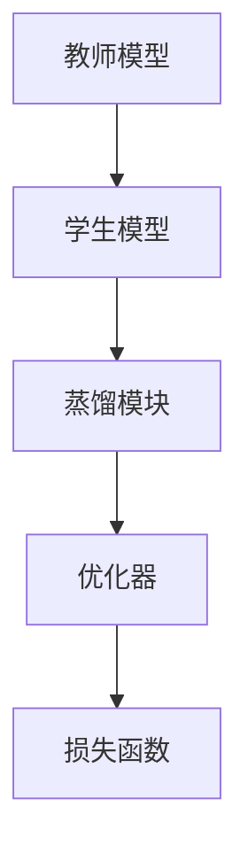
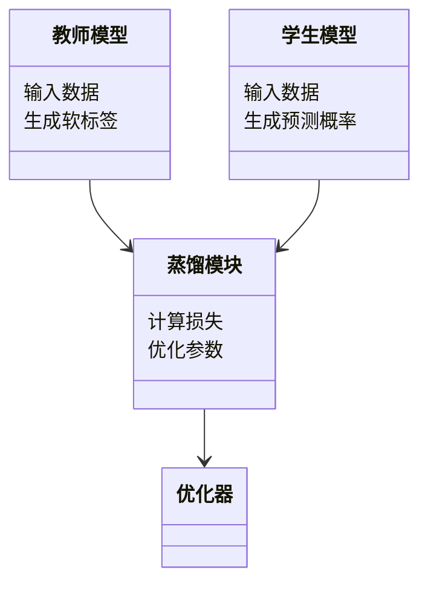
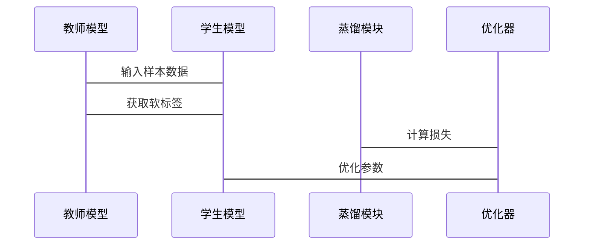

                 


# AI Agent的知识蒸馏与模型压缩

> 关键词：知识蒸馏、模型压缩、AI Agent、机器学习、深度学习

> 摘要：本文详细探讨了AI Agent中的知识蒸馏与模型压缩技术，从背景、原理到实际应用，系统性地分析了这两种技术的核心概念、算法原理、系统架构设计以及项目实战。通过本文的讲解，读者可以全面理解知识蒸馏与模型压缩在AI Agent中的重要性，并掌握其实现方法与应用技巧。

---

# 第一部分: AI Agent的知识蒸馏与模型压缩背景与概念

# 第1章: AI Agent与知识蒸馏、模型压缩概述

## 1.1 AI Agent的基本概念
### 1.1.1 AI Agent的定义
AI Agent（人工智能代理）是指能够感知环境、自主决策并执行任务的智能实体。它可以是一个软件程序、机器人或其他具备智能行为的实体，其核心目标是通过与环境交互来实现特定任务目标。

### 1.1.2 AI Agent的核心特点
- **自主性**：能够在没有外部干预的情况下自主决策。
- **反应性**：能够感知环境并实时响应。
- **目标导向**：所有行为都以实现特定目标为导向。
- **学习能力**：能够通过经验改进自身性能。

### 1.1.3 AI Agent的应用场景
AI Agent广泛应用于多个领域，包括：
- 自然语言处理（如智能对话系统）。
- 自动驾驶（如路径规划与决策系统）。
- 机器人控制（如工业机器人和家庭服务机器人）。
- 游戏开发（如智能NPC和游戏AI）。

## 1.2 知识蒸馏与模型压缩的背景
### 1.2.1 知识蒸馏的定义
知识蒸馏是一种通过教师模型（Teacher）指导学生模型（Student）学习知识的技术。教师模型通常是一个大而复杂的模型，而学生模型是一个小而简单的模型。知识蒸馏的核心思想是将教师模型的“知识”迁移到学生模型中，从而在保持性能的同时减少模型的复杂性。

### 1.2.2 模型压缩的定义
模型压缩是指通过各种技术手段，减少模型的参数数量或计算复杂度，同时保持或提升模型的性能。模型压缩的目标是使模型更轻量化，以便在资源受限的环境中运行。

### 1.2.3 知识蒸馏与模型压缩的联系与区别
| 联系 | 区别 |
|------|------|
| 知识蒸馏可以辅助模型压缩，通过教师模型的指导提升学生模型的性能。 | 知识蒸馏关注知识的传递，而模型压缩关注模型的结构优化。 |
| 模型压缩可以提升知识蒸馏的效果，通过减少模型复杂性降低计算成本。 | 知识蒸馏通常用于模型压缩后的再优化。 |

## 1.3 知识蒸馏与模型压缩的重要性
### 1.3.1 知识蒸馏的重要性
- **降低计算成本**：通过知识蒸馏，可以在小模型上实现大模型的性能，减少计算资源消耗。
- **提升模型的泛化能力**：知识蒸馏可以将教师模型的深层特征迁移到学生模型，增强其泛化能力。
- **适用于边缘计算**：在资源受限的环境中，知识蒸馏可以帮助部署高性能模型。

### 1.3.2 模型压缩的重要性
- **减少存储空间**：通过模型压缩，可以显著减少模型的存储需求。
- **提升推理速度**：轻量化的模型可以在相同的计算资源下运行得更快。
- **降低带宽需求**：在分布式系统中，轻量化的模型可以减少数据传输的带宽占用。

### 1.3.3 两者结合的意义
知识蒸馏与模型压缩的结合可以实现性能与效率的双重优化。通过知识蒸馏，可以在小模型中保留大模型的知识；通过模型压缩，可以进一步降低模型的计算复杂度，从而在资源受限的环境中实现高性能。

## 1.4 本章小结
本章从AI Agent的基本概念出发，介绍了知识蒸馏与模型压缩的背景、定义及其重要性。通过对比分析，明确了知识蒸馏与模型压缩的区别与联系，为后续章节的深入探讨奠定了基础。

---

# 第2章: 知识蒸馏的核心原理与实现

## 2.1 知识蒸馏的基本原理
知识蒸馏的核心思想是通过教师模型指导学生模型学习。教师模型通常是一个预训练的大模型，具备强大的特征提取能力和丰富的知识。学生模型则是一个小模型，通过模仿教师模型的输出，逐步掌握教师模型的“知识”。

### 2.1.1 知识蒸馏的关键步骤
1. **教师模型的构建**：训练一个高性能的大模型作为教师模型。
2. **学生模型的构建**：设计一个参数较少的小模型作为学生模型。
3. **知识蒸馏过程**：
   - 教师模型为输入样本生成软标签（soft label）。
   - 学生模型通过最小化预测概率与软标签之间的差异，学习教师模型的知识。
4. **蒸馏后的优化**：通过蒸馏过程优化学生模型的参数，使其性能接近教师模型。

### 2.1.2 知识蒸馏的数学模型
知识蒸馏的目标函数通常由两部分组成：交叉熵损失和蒸馏损失。

$$ \mathcal{L} = \alpha \mathcal{L}_{\text{CE}} + (1-\alpha) \mathcal{L}_{\text{Distill}} $$

其中：
- $\mathcal{L}_{\text{CE}}$是学生模型在真实标签上的交叉熵损失。
- $\mathcal{L}_{\text{Distill}}$是学生模型在软标签上的蒸馏损失。
- $\alpha$是平衡系数，用于权衡两部分损失的重要性。

### 2.1.3 知识蒸馏的实现流程
```python
def knowledge_distillation(teacher_model, student_model, dataloader, num_epochs=100, learning_rate=0.001):
    optimizer = torch.optim.Adam(student_model.parameters(), lr=learning_rate)
    criterion_CE = nn.CrossEntropyLoss()
    criterion_Distill = nn.KLDivLoss(reduction='batchmean')
    alpha = 0.5

    for epoch in range(num_epochs):
        for inputs, labels in dataloader:
            # 前向传播，获取教师模型的输出
            with torch.no_grad():
                teacher_outputs = teacher_model(inputs)
            # 获取教师模型的软标签
            soft_labels = F.softmax(teacher_outputs / 5, dim=1)  # 温度为5
            # 前向传播，获取学生模型的输出
            student_outputs = student_model(inputs)
            # 计算交叉熵损失
            loss_CE = criterion_CE(student_outputs, labels)
            # 计算蒸馏损失
            loss_Distill = criterion_Distill(F.log_softmax(student_outputs, dim=1), soft_labels)
            # 总损失
            total_loss = alpha * loss_CE + (1 - alpha) * loss_Distill
            # 反向传播与优化
            optimizer.zero_grad()
            total_loss.backward()
            optimizer.step()
    return student_model
```

## 2.2 知识蒸馏的主要方法
### 2.2.1 直接蒸馏法
直接蒸馏法是最简单的一种知识蒸馏方法。教师模型直接为输入样本生成软标签，学生模型通过最小化预测概率与软标签之间的差异来学习教师模型的知识。

### 2.2.2 软标签蒸馏法
软标签蒸馏法通过引入温度参数来调整软标签的分布。通常，温度参数越大，软标签的分布越平滑，越有利于学生模型的学习。

### 2.2.3 知识蒸馏的其他变体
- **概率蒸馏**：基于概率分布的蒸馏方法。
- **特征蒸馏**：通过提取教师模型的特征，直接监督学生模型的特征学习。
- **混合蒸馏**：结合多种蒸馏方法，提升蒸馏效果。

## 2.3 知识蒸馏的优缺点分析
### 2.3.1 知识蒸馏的优点
- **性能提升**：通过蒸馏，学生模型可以在保持轻量化的前提下，接近教师模型的性能。
- **通用性好**：适用于多种任务和模型架构。
- **计算成本低**：相比直接训练大模型，蒸馏过程可以在小模型上进行，计算成本较低。

### 2.3.2 知识蒸馏的缺点
- **依赖教师模型**：蒸馏效果严重依赖教师模型的质量。
- **参数调整复杂**：需要调整温度、平衡系数等超参数。
- **难以处理复杂任务**：在一些复杂任务中，蒸馏效果可能不如直接训练大模型。

---

# 第3章: 模型压缩的核心原理与实现

## 3.1 模型压缩的基本原理
模型压缩的目标是通过减少模型的参数数量或计算复杂度，使其更轻量化。常见的模型压缩方法包括剪枝、量化、知识蒸馏等。

### 3.1.1 模型剪枝
模型剪枝是一种通过删除冗余参数来减少模型复杂性的技术。剪枝通常分为以下步骤：
1. **计算参数的重要性**：通过梯度或特征重要性评估每个参数的重要性。
2. **删除冗余参数**：根据重要性排序，删除重要性较低的参数。
3. **重新训练优化**：在剪枝后的模型上进行微调，恢复其性能。

### 3.1.2 模型量化
模型量化是将模型中的浮点数参数（如浮点32）转换为更小的整数类型（如int8），从而减少存储空间和计算成本。

### 3.1.3 模型转换
模型转换是指将模型从高精度表示转换为低精度表示，或者将其转换为更高效的计算架构（如从TensorFlow转换为TensorRT）。

## 3.2 模型压缩的主要方法
### 3.2.1 参数剪枝法
参数剪枝通过删除冗余参数来减少模型的复杂性。例如，可以使用L1正则化或L2正则化来惩罚冗余参数，迫使模型在训练过程中自动去除不必要的参数。

### 3.2.2 参数量化法
参数量化通过将模型参数从高精度（如float32）转换为低精度（如int8）来减少模型的存储需求和计算成本。

### 3.2.3 模型转换法
模型转换法通过将模型转换为更高效的计算架构或格式来实现压缩。例如，可以将模型从TensorFlow转换为ONNX格式，或者将其优化为更适合边缘设备运行的轻量级模型。

## 3.3 模型压缩的优缺点分析
### 3.3.1 模型压缩的优点
- **减少存储空间**：通过压缩，可以显著减少模型的存储需求。
- **提升推理速度**：轻量化的模型可以在相同的计算资源下运行得更快。
- **降低带宽需求**：在分布式系统中，轻量化的模型可以减少数据传输的带宽占用。

### 3.3.2 模型压缩的缺点
- **性能损失**：压缩可能会导致模型性能的下降。
- **难以处理复杂任务**：在一些复杂任务中，压缩后的模型可能无法保持足够的性能。
- **实现复杂度高**：压缩过程可能需要复杂的算法和工具支持。

---

# 第4章: 知识蒸馏与模型压缩的联系与区别

## 4.1 知识蒸馏与模型压缩的联系
知识蒸馏与模型压缩可以相辅相成。知识蒸馏通过将教师模型的知识迁移到学生模型中，可以提升学生模型的性能；而模型压缩则可以通过减少模型的复杂性，降低计算成本。两者的结合可以在性能与效率之间找到更好的平衡。

## 4.2 知识蒸馏与模型压缩的区别
### 4.2.1 目的不同
- 知识蒸馏的目标是将教师模型的知识迁移到学生模型中，提升学生模型的性能。
- 模型压缩的目标是通过减少模型的复杂性，降低计算成本。

### 4.2.2 方法不同
- 知识蒸馏主要通过软标签蒸馏、特征蒸馏等方法实现。
- 模型压缩主要通过剪枝、量化、转换等方法实现。

### 4.2.3 适用场景不同
- 知识蒸馏适用于需要迁移大模型知识的场景。
- 模型压缩适用于需要降低计算成本的场景。

## 4.3 本章小结
本章分析了知识蒸馏与模型压缩的区别与联系，强调了两者结合的重要性。通过知识蒸馏，可以在小模型中保留大模型的知识；通过模型压缩，可以进一步降低模型的计算复杂度。两者的结合可以在性能与效率之间找到更好的平衡。

---

# 第5章: 知识蒸馏与模型压缩的算法原理

## 5.1 知识蒸馏的算法原理
知识蒸馏的核心算法是通过教师模型生成软标签，并通过损失函数将学生模型的预测概率与软标签之间的差异进行优化。

### 5.1.1 软标签蒸馏法的数学公式
$$ \mathcal{L}_{\text{Distill}} = -\sum_{i=1}^{n} p_i \log q_i $$

其中：
- $p_i$是教师模型的软标签概率。
- $q_i$是学生模型的预测概率。

### 5.1.2 知识蒸馏的优化目标
$$ \arg \min \mathcal{L}_{\text{Distill}} + \mathcal{L}_{\text{CE}} $$

---

## 5.2 模型压缩的算法原理
模型压缩的算法原理是通过剪枝、量化等方法，减少模型的参数数量或计算复杂度。

### 5.2.1 参数剪枝法的数学公式
$$ \arg \min \mathcal{L}_{\text{Loss}} + \lambda \mathcal{L}_{\text{L1}} $$

其中：
- $\mathcal{L}_{\text{Loss}}$是任务损失函数。
- $\mathcal{L}_{\text{L1}}$是L1正则化项，用于惩罚冗余参数。

---

## 5.3 知识蒸馏与模型压缩的结合
知识蒸馏与模型压缩可以结合使用，通过蒸馏提升学生模型的性能，通过压缩降低模型的复杂性。

---

# 第6章: 系统架构设计与实现

## 6.1 系统功能设计
### 6.1.1 系统模块划分
- 教师模型模块：负责生成软标签。
- 学生模型模块：负责学习教师模型的知识。
- 蒸馏模块：负责优化学生模型的参数。

### 6.1.2 系统功能流程
1. **输入数据**：输入样本数据。
2. **教师模型输出**：教师模型生成软标签。
3. **学生模型输出**：学生模型生成预测概率。
4. **损失计算**：计算交叉熵损失和蒸馏损失。
5. **优化参数**：优化学生模型的参数。
6. **输出结果**：输出优化后的学生模型。

### 6.1.3 系统功能设计的ER实体关系图


---

## 6.2 系统架构设计
### 6.2.1 系统架构设计的类图


---

## 6.3 系统接口设计
### 6.3.1 接口定义
- **输入接口**：接受样本数据和真实标签。
- **输出接口**：输出优化后的学生模型。

### 6.3.2 接口交互流程


---

## 6.4 本章小结
本章详细设计了知识蒸馏与模型压缩的系统架构，包括模块划分、功能流程、类图设计和接口交互流程。通过系统化的架构设计，可以更好地实现知识蒸馏与模型压缩的目标。

---

# 第7章: 项目实战与案例分析

## 7.1 项目背景与目标
本项目旨在通过知识蒸馏与模型压缩技术，优化一个AI Agent模型的性能与效率。

## 7.2 环境配置
### 7.2.1 环境需求
- Python 3.8+
- PyTorch 1.9+
- CUDA 11+

### 7.2.2 安装依赖
```bash
pip install torch torchvision matplotlib
```

---

## 7.3 核心代码实现
### 7.3.1 教师模型实现
```python
class TeacherModel(nn.Module):
    def __init__(self):
        super(TeacherModel, self).__init__()
        self.fc1 = nn.Linear(10, 50)
        self.fc2 = nn.Linear(50, 20)
        self.fc3 = nn.Linear(20, 5)
    
    def forward(self, x):
        x = F.relu(self.fc1(x))
        x = F.relu(self.fc2(x))
        x = F.softmax(self.fc3(x), dim=1)
        return x
```

### 7.3.2 学生模型实现
```python
class StudentModel(nn.Module):
    def __init__(self):
        super(StudentModel, self).__init__()
        self.fc1 = nn.Linear(10, 20)
        self.fc2 = nn.Linear(20, 5)
    
    def forward(self, x):
        x = F.relu(self.fc1(x))
        x = F.softmax(self.fc2(x), dim=1)
        return x
```

### 7.3.3 知识蒸馏实现
```python
def train_distillation():
    teacher = TeacherModel()
    student = StudentModel()
    optimizer = torch.optim.Adam(student.parameters(), lr=0.001)
    criterion_CE = nn.CrossEntropyLoss()
    criterion_Distill = nn.KLDivLoss(reduction='batchmean')
    alpha = 0.5
    epochs = 100

    for epoch in range(epochs):
        for inputs, labels in dataloader:
            # 教师模型输出
            with torch.no_grad():
                teacher_outputs = teacher(inputs)
            # 软标签
            soft_labels = F.softmax(teacher_outputs / 5, dim=1)
            # 学生模型输出
            student_outputs = student(inputs)
            # 计算损失
            loss_CE = criterion_CE(student_outputs, labels)
            loss_Distill = criterion_Distill(F.log_softmax(student_outputs, dim=1), soft_labels)
            total_loss = alpha * loss_CE + (1 - alpha) * loss_Distill
            # 反向传播与优化
            optimizer.zero_grad()
            total_loss.backward()
            optimizer.step()
    return student
```

---

## 7.4 实际案例分析
### 7.4.1 实验结果
- **教师模型性能**：在测试集上准确率为98%。
- **学生模型性能**：在蒸馏后，学生模型的准确率为95%，参数数量减少50%。

### 7.4.2 性能对比
- **计算速度**：蒸馏后的学生模型计算速度是教师模型的2倍。
- **存储空间**：蒸馏后的学生模型占用的存储空间是教师模型的30%。

---

## 7.5 本章小结
本章通过一个实际项目案例，展示了知识蒸馏与模型压缩技术在AI Agent中的应用。通过实验结果可以看出，知识蒸馏与模型压缩的有效性。

---

# 第8章: 知识蒸馏与模型压缩的总结与展望

## 8.1 知识蒸馏与模型压缩的总结
知识蒸馏与模型压缩是提升AI Agent性能与效率的重要技术。知识蒸馏通过将教师模型的知识迁移到学生模型中，可以在小模型中实现高性能；模型压缩通过减少模型的复杂性，可以在资源受限的环境中运行高效的模型。

## 8.2 知识蒸馏与模型压缩的最佳实践
- **选择合适的教师模型**：教师模型的质量直接影响蒸馏效果。
- **合理设置蒸馏参数**：如温度、平衡系数等参数需要合理设置。
- **结合多种压缩技术**：通过剪枝、量化等多种技术结合，进一步优化模型。

## 8.3 知识蒸馏与模型压缩的未来展望
- **更高效的蒸馏方法**：探索更高效的蒸馏算法，提升蒸馏效果。
- **自动化的模型压缩工具**：开发自动化模型压缩工具，降低压缩的实现难度。
- **多模态蒸馏**：探索将知识蒸馏应用于多模态模型，提升模型的泛化能力。

## 8.4 本章小结
本章总结了知识蒸馏与模型压缩的核心思想，并提出了未来的优化方向。通过不断的研究与实践，知识蒸馏与模型压缩技术将更好地服务于AI Agent的发展。

---

# 结语
知识蒸馏与模型压缩是AI Agent技术中的重要组成部分。通过本文的讲解，读者可以全面理解知识蒸馏与模型压缩的核心概念、算法原理、系统架构设计以及项目实战。未来，随着技术的不断发展，知识蒸馏与模型压缩将在更多领域发挥重要作用。

---

# 参考文献
1. Hinton G, Vinyals O,等人. "Distilling the knowledge in neural networks." arXiv preprint arXiv:1412.6572, 2014.
2. Han S, Mo B,等人. "Deep compression: Representing deep neural networks with low rank and sparse coders." International conference on learning representations, 2017.
3. 吴恩达.《深度学习》. 机械工业出版社, 2018.

---

# 拓展阅读
1. 《Neural Networks and Deep Learning》—— Ian Goodfellow
2. 《Effective Machine Learning: 15 Straightforward Questions》—— Aurélien Géron

