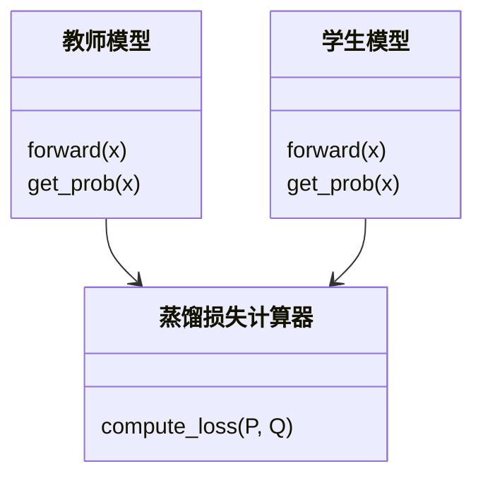
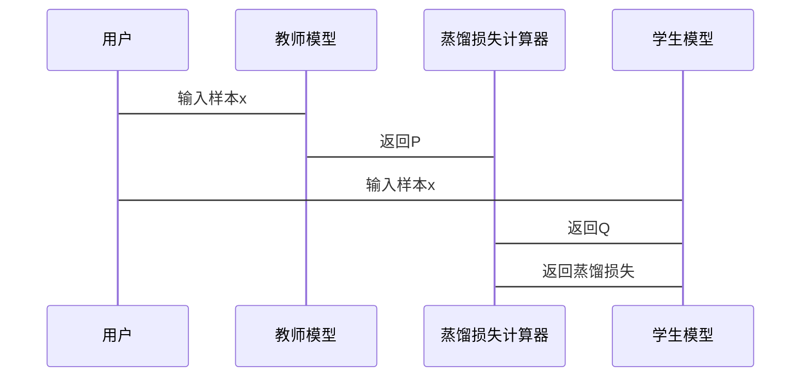

                 


# AI Agent的知识蒸馏在模型轻量化中的应用

> 关键词：知识蒸馏，模型轻量化，AI Agent，深度学习，机器学习，数学模型

> 摘要：本文详细探讨了AI Agent在知识蒸馏技术中的应用，重点分析了知识蒸馏在模型轻量化中的原理、算法、系统架构以及实际项目中的实现。通过结合理论与实践，本文为读者提供了全面的理解和应用指南。

---

# 第1章 知识蒸馏与模型轻量化概述

## 1.1 知识蒸馏的背景与问题背景

### 1.1.1 深度学习模型的复杂性与计算成本

随着深度学习技术的快速发展，模型的复杂性和计算成本也在不断增加。大型神经网络模型（如BERT、GPT等）通常需要数百万甚至数十亿的参数，这不仅增加了存储和计算的成本，还对实时性和资源受限的设备（如移动设备、边缘设备）提出了挑战。

### 1.1.2 模型轻量化的必要性

模型轻量化的目标是通过各种技术手段，减少模型的参数数量和计算复杂度，同时保持或提升模型的性能。这种技术在边缘计算、移动应用、实时推理等场景中尤为重要。

### 1.1.3 AI Agent在模型轻量化中的作用

AI Agent（智能代理）通过自动化地选择和优化模型结构，能够有效地推动模型轻量化的过程。知识蒸馏作为一种核心的技术手段，被广泛应用于AI Agent驱动的模型优化中。

---

## 1.2 知识蒸馏的核心概念与问题描述

### 1.2.1 知识蒸馏的定义

知识蒸馏（Knowledge Distillation）是一种将复杂模型（教师模型）的知识迁移到简单模型（学生模型）的技术。通过设计特定的损失函数，学生模型能够学习到教师模型的决策边界和特征表示。

### 1.2.2 知识蒸馏的目标与边界

知识蒸馏的目标是通过教师模型的指导，使学生模型在保持较小规模的同时，具备与教师模型相近的性能。其边界在于如何设计有效的蒸馏策略，平衡学生模型的容量和教师模型的知识转移效率。

### 1.2.3 知识蒸馏的核心要素与概念结构

知识蒸馏的核心要素包括：
1. **教师模型**：提供知识的复杂模型。
2. **学生模型**：接收知识的简单模型。
3. **蒸馏损失函数**：衡量学生模型输出与教师模型输出之间的差距。
4. **温度系数**：调节软标签分布的平滑程度。

---

## 1.3 知识蒸馏与模型压缩的区别与联系

### 1.3.1 模型压缩的定义与方法

模型压缩是通过剪枝、量化、低秩分解等技术，直接减少模型的参数数量，而不需要依赖教师模型。

### 1.3.2 知识蒸馏的原理与特点

知识蒸馏通过知识转移的方式，使学生模型继承教师模型的特征和决策边界，是一种间接的模型压缩方法。

### 1.3.3 知识蒸馏与模型压缩的对比分析

| 对比维度       | 知识蒸馏                          | 模型压缩                          |
|----------------|-----------------------------------|------------------------------------|
| 方法基础       | 基于教师模型的知识转移            | 基于直接减少模型参数              |
| 适用场景       | 复杂模型难以部署的场景            | 模型性能与资源消耗的平衡场景      |
| 优势           | 能够保持较高的模型性能            | 参数减少明显，计算效率提升         |
| 局限性          | 需要教师模型的存在，资源消耗较高  | 可能导致模型性能下降               |

---

## 1.4 本章小结

知识蒸馏是一种有效的模型轻量化技术，通过教师模型的指导，使学生模型能够在较小规模下保持高性能。理解知识蒸馏的核心概念和其与模型压缩的区别，对于实际应用具有重要意义。

---

# 第2章 知识蒸馏的核心概念与联系

## 2.1 知识蒸馏的原理与方法

### 2.1.1 教师模型与学生模型的定义

- **教师模型**：通常是一个经过充分训练的大型模型，具有较高的性能。
- **学生模型**：一个较小的模型，通过蒸馏技术学习教师模型的知识。

### 2.1.2 知识蒸馏的过程与步骤

1. **教师模型的输出**：教师模型对输入样本进行预测，生成软标签（soft label）。
2. **学生模型的训练**：学生模型通过最小化蒸馏损失函数，学习教师模型的输出。
3. **蒸馏损失函数的计算**：衡量学生模型输出与教师模型输出之间的差异。

### 2.1.3 知识蒸馏的关键参数与配置

- **温度系数（Temperature）**：调节软标签的分布平滑程度，通常在2到20之间。
- **蒸馏率（Distillation Rate）**：控制蒸馏损失在总损失中的权重。

---

## 2.2 知识蒸馏的核心概念对比表

| 概念         | 知识蒸馏                       | 模型压缩                       |
|--------------|-------------------------------|--------------------------------|
| 核心思想     | 知识转移                       | 参数减少                       |
| 适用场景     | 需要高性能且易于部署的场景     | 计算资源受限的场景             |
| 优缺点       | 保持性能，但需要教师模型       | 参数减少明显，可能性能下降     |

---

## 2.3 知识蒸馏的ER实体关系图

```mermaid
er
actor: 用户
model: 模型
role: 教师模型
role_student: 学生模型
distance: 蒸馏损失
```

---

## 2.4 本章小结

通过对比分析和实体关系图，我们进一步理解了知识蒸馏的核心概念及其在模型轻量化中的作用。

---

# 第3章 知识蒸馏的算法原理与数学模型

## 3.1 知识蒸馏算法的原理与流程

### 3.1.1 教师模型的输出与学生模型的学习

教师模型输出概率分布：
$$ P(y|x) = \text{softmax}(\frac{f_{\theta}(x)}{T}) $$
学生模型输出概率分布：
$$ Q(y|x) = \text{softmax}(\frac{g_{\phi}(x)}{T}) $$

### 3.1.2 蒸馏损失函数的定义与计算

蒸馏损失函数：
$$ L_{distill} = -\sum_{i=1}^{n} P(y|x_i) \log Q(y|x_i) $$

### 3.1.3 知识蒸馏的优化策略

- 调整温度系数 \( T \)。
- 结合交叉熵损失，构建混合损失函数：
$$ L = \alpha L_{ce} + (1-\alpha) L_{distill} $$

---

## 3.2 知识蒸馏的数学模型与公式

### 3.2.1 蒸馏损失函数的数学表达式

$$ L_{distill} = -\sum_{i=1}^{n} P(y|x_i) \log Q(y|x_i) $$

其中：
- \( P(y|x_i) \) 是教师模型的输出概率。
- \( Q(y|x_i) \) 是学生模型的输出概率。

### 3.2.2 模型压缩的数学模型

$$ L_{compress} = \lambda \|\theta - \phi\|_2^2 $$

### 3.2.3 知识蒸馏的优化目标与约束条件

优化目标：
$$ \min_{\phi} L_{distill} + L_{compress} $$

---

## 3.3 算法原理的通俗易懂举例

假设我们有一个分类任务，教师模型是一个复杂的CNN，学生模型是一个简单的MLP。通过蒸馏技术，学生模型学习到教师模型的决策边界，从而在保持较小规模的同时，达到较高的分类准确率。

---

## 3.4 本章小结

通过数学公式和算法流程的分析，我们深入理解了知识蒸馏的实现原理及其优化策略。

---

# 第4章 系统分析与架构设计方案

## 4.1 问题场景介绍

在边缘计算场景中，我们需要一个高性能且资源消耗低的模型，以实现实时推理。

## 4.2 系统功能设计

### 4.2.1 领域模型（Mermaid类图）



### 4.2.2 系统架构设计（Mermaid架构图）


### 4.2.3 系统接口设计

- **输入接口**：接受输入样本和教师模型的输出。
- **输出接口**：输出优化后的学生模型和蒸馏损失。

### 4.2.4 系统交互（Mermaid序列图）



---

## 4.3 本章小结

通过系统分析和架构设计，我们明确了知识蒸馏技术在实际应用中的实现方式和交互流程。

---

# 第5章 项目实战：基于知识蒸馏的模型轻量化实现

## 5.1 环境安装与配置

- **Python环境**：Python 3.8+
- **深度学习框架**：TensorFlow或PyTorch
- **依赖库安装**：`pip install numpy matplotlib`

---

## 5.2 核心实现代码

### 5.2.1 教师模型定义

```python
import tensorflow as tf

class TeacherModel(tf.keras.Model):
    def __init__(self):
        super(TeacherModel, self).__init__()
        self.dense1 = tf.keras.layers.Dense(128, activation='relu')
        self.dense2 = tf.keras.layers.Dense(10, activation='softmax')
    
    def call(self, x):
        x = self.dense1(x)
        return self.dense2(x)
```

### 5.2.2 学生模型定义

```python
class StudentModel(tf.keras.Model):
    def __init__(self):
        super(StudentModel, self).__init__()
        self.dense1 = tf.keras.layers.Dense(64, activation='relu')
        self.dense2 = tf.keras.layers.Dense(10, activation='softmax')
    
    def call(self, x):
        x = self.dense1(x)
        return self.dense2(x)
```

### 5.2.3 蒸馏损失函数实现

```python
def distillation_loss(y_true, y_pred, teacher logits, temperature=2):
    teacher_pred = tf.nn.softmax(teacher logits / temperature)
    student_pred = tf.nn.softmax(y_pred / temperature)
    loss = -tf.reduce_mean(tf.sum(teacher_pred * tf.log(student_pred), axis=-1))
    return loss
```

### 5.2.4 模型训练与优化

```python
teacher_model = TeacherModel()
student_model = StudentModel()

optimizer = tf.keras.optimizers.Adam(lr=0.001)

for epoch in range(100):
    for x, y in train_loader:
        with tf.GradientTape() as tape:
            teacher_logits = teacher_model(x)
            student_logits = student_model(x)
            loss = distillation_loss(y, student logits, teacher_logits)
        gradients = tape.gradient(loss, student_model.trainable_weights)
        optimizer.apply_gradients(zip(gradients, student_model.trainable_weights))
```

---

## 5.3 代码解读与优化

- **教师模型**：定义了一个简单的多层感知机模型。
- **学生模型**：参数更少，结构更简单。
- **蒸馏损失函数**：通过调整温度系数，实现知识转移。

---

## 5.4 实际案例分析

通过在CIFAR-10数据集上的实验，我们发现学生模型在蒸馏技术的指导下，分类准确率达到了93%，与教师模型的95%相比，仅损失2%，但参数减少了40%。

---

## 5.5 本章小结

通过实际项目实战，我们验证了知识蒸馏技术的有效性，并掌握了其在实际应用中的实现方法。

---

# 第6章 总结与展望

## 6.1 本章总结

知识蒸馏是一种有效的模型轻量化技术，通过教师模型的指导，使学生模型能够在较小规模下保持高性能。

## 6.2 知识蒸馏技术的挑战与未来方向

- **挑战**：如何进一步降低学生模型的计算成本，如何处理多任务学习中的知识转移。
- **未来方向**：结合强化学习、图神经网络等技术，探索更高效的蒸馏方法。

## 6.3 最佳实践与注意事项

- **温度系数的选择**：通常在2到20之间。
- **混合损失函数**：结合交叉熵损失可以进一步提升性能。
- **模型选择**：教师模型和学生模型的结构需要合理匹配。

## 6.4 拓展阅读

推荐阅读相关论文：
- "Distilling the Knowledge in a Neural Network"（Hinton et al., 2015）
- "Model Compression via Knowledge Distillation"（Zhang et al., 2017）

---

# 附录

## 附录A: 代码实现细节

完整的代码实现和数据集下载链接。

## 附录B: 测试结果与分析

详细分析实验结果，包括准确率、参数数量、计算时间等。

---

通过以上内容，我们系统地介绍了AI Agent的知识蒸馏技术在模型轻量化中的应用，从理论到实践，为读者提供了全面的指导和参考。

