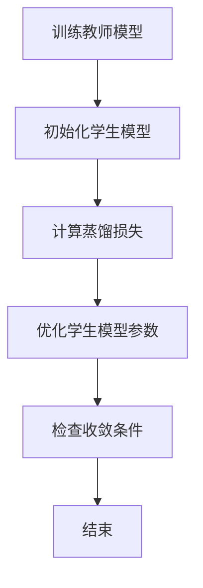
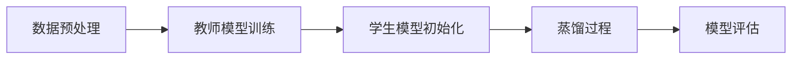

                 


# AI Agent的知识蒸馏技术应用

> 关键词：知识蒸馏，AI Agent，模型压缩，自然语言处理，计算机视觉

> 摘要：知识蒸馏是一种将大型AI模型的知识迁移到小型模型的技术，具有重要的应用价值。本文详细介绍了知识蒸馏的基本概念、核心原理、算法实现、系统设计、项目实战以及高级应用，帮助读者全面理解并掌握这一技术。

---

## 第一部分: AI Agent的知识蒸馏技术基础

### 第1章: 知识蒸馏技术的背景与概念

#### 1.1 知识蒸馏技术的起源与发展

知识蒸馏技术（Knowledge Distillation）是机器学习领域中的一种模型压缩技术，旨在将大型模型的知识迁移到小型模型中。其起源可以追溯到20世纪90年代，但真正的发展得益于深度学习的兴起。随着模型规模的不断扩大，知识蒸馏技术逐渐成为解决模型部署问题的重要手段。

##### 1.1.1 知识蒸馏技术的起源  
知识蒸馏技术的灵感来源于人类的教学过程。大型模型（教师模型）通过蒸馏的方式，将复杂的知识传递给小型模型（学生模型）。这一过程类似于导师向新手传授经验。

##### 1.1.2 知识蒸馏技术的发展历程  
知识蒸馏技术从最初的软标签蒸馏（Soft Label Distillation）发展到多种变体，如硬标签蒸馏（Hard Label Distillation）、特征蒸馏（Feature Distillation）等。近年来，随着Transformer模型的广泛应用，知识蒸馏技术也在不断进化。

##### 1.1.3 知识蒸馏技术的现状与趋势  
目前，知识蒸馏技术已经广泛应用于自然语言处理、计算机视觉等领域。未来，随着AI Agent技术的发展，知识蒸馏将在更复杂的场景中发挥重要作用。

#### 1.2 知识蒸馏技术的基本概念

##### 1.2.1 知识蒸馏技术的定义  
知识蒸馏是一种通过教师模型指导学生模型，使其在特定任务上表现接近教师模型的技术。教师模型通常是一个复杂的大型模型，而学生模型是一个小型模型。

##### 1.2.2 知识蒸馏技术的核心要素  
1. **教师模型**：复杂的大型模型，用于生成指导信息。
2. **学生模型**：需要学习的小型模型。
3. **蒸馏过程**：通过优化目标函数，将教师模型的知识迁移到学生模型中。

##### 1.2.3 知识蒸馏技术的分类与特点  
知识蒸馏技术可以分为以下几类：
1. **软标签蒸馏**：基于概率分布的蒸馏。
2. **硬标签蒸馏**：基于类别标签的蒸馏。
3. **特征蒸馏**：基于中间特征的蒸馏。

#### 1.3 知识蒸馏技术的技术优势

##### 1.3.1 知识蒸馏技术的优势分析  
1. **模型压缩**：通过蒸馏技术，可以将大型模型压缩成更小的模型。
2. **推理速度提升**：小型模型在推理阶段速度更快。
3. **资源消耗降低**：压缩后的模型在内存和计算资源上的消耗更低。

##### 1.3.2 知识蒸馏技术的适用场景  
1. **边缘计算**：在资源受限的环境中部署AI模型。
2. **实时应用**：需要快速响应的任务，如实时语音识别。
3. **多任务学习**：将多个任务的知识迁移到一个小型模型中。

##### 1.3.3 知识蒸馏技术的局限性  
1. **性能损失**：蒸馏后的模型性能可能不如原模型。
2. **训练时间增加**：蒸馏过程需要额外的训练步骤。

#### 1.4 知识蒸馏技术的应用场景

##### 1.4.1 知识蒸馏技术在AI Agent中的应用  
AI Agent需要在复杂环境中进行决策，蒸馏技术可以帮助其在资源受限的情况下高效运行。

##### 1.4.2 知识蒸馏技术在自然语言处理中的应用  
在自然语言处理任务中，蒸馏技术可以用于压缩大型语言模型，如BERT。

##### 1.4.3 知识蒸馏技术在计算机视觉中的应用  
在图像分类任务中，蒸馏技术可以用于压缩大型视觉模型，如ResNet。

---

## 第2章: 知识蒸馏技术的核心原理

### 第2章: 知识蒸馏技术的核心原理

#### 2.1 知识蒸馏技术的原理概述

##### 2.1.1 知识蒸馏的基本原理  
蒸馏技术的核心思想是通过教师模型的输出或中间特征，指导学生模型的训练。具体来说，学生模型需要在优化目标函数的同时，尽可能接近教师模型的输出。

##### 2.1.2 知识蒸馏的核心流程  
1. **教师模型训练**：先训练一个复杂的教师模型。
2. **学生模型初始化**：初始化一个小型学生模型。
3. **蒸馏过程**：通过蒸馏损失函数，优化学生模型的参数。

##### 2.1.3 知识蒸馏的数学模型  
蒸馏损失函数可以表示为：
$$
L_{\text{distill}} = \alpha L_{\text{student}} + (1-\alpha) L_{\text{teacher}}
$$

其中，$L_{\text{student}}$是学生模型的损失，$L_{\text{teacher}}$是教师模型的损失，$\alpha$是平衡系数。

#### 2.2 知识蒸馏技术的核心概念与联系

##### 2.2.1 知识蒸馏技术的核心概念  
1. **教师模型**：负责生成指导信息。
2. **学生模型**：负责学习教师模型的知识。
3. **蒸馏损失**：用于衡量学生模型与教师模型的差距。

##### 2.2.2 知识蒸馏技术与其它模型压缩技术的对比  
以下是知识蒸馏技术与其他模型压缩技术的对比表格：

| 技术         | 原理描述                                                                 |
|--------------|--------------------------------------------------------------------------|
| 知识蒸馏     | 通过教师模型的输出或特征，指导学生模型的训练。                            |
| 知识剪枝     | 剪枝技术通过删除冗余参数，减少模型大小。                                  |
| 知识量化     | 通过量化技术，将模型参数压缩为低比特表示。                                |

##### 2.2.3 知识蒸馏技术的ER实体关系图  
以下是知识蒸馏技术的ER实体关系图：

```mermaid
er
actor LanguageTeacher {
    id
    name
}
actor StudentModel {
    id
    name
}
actor DistillationProcess {
    id
    name
}
```

---

#### 2.3 知识蒸馏技术的算法流程

##### 2.3.1 知识蒸馏算法的流程图  
以下是知识蒸馏算法的流程图：



##### 2.3.2 知识蒸馏算法的实现步骤  
1. **训练教师模型**：先在大规模数据上训练一个复杂的教师模型。
2. **初始化学生模型**：初始化一个小型学生模型。
3. **计算蒸馏损失**：根据教师模型的输出或特征，计算蒸馏损失。
4. **优化学生模型参数**：通过反向传播优化学生模型的参数。

##### 2.3.3 知识蒸馏算法的优化策略  
1. **调整蒸馏温度**：通过调整温度参数，控制蒸馏过程的软化程度。
2. **平衡蒸馏损失**：通过调整平衡系数$\alpha$，控制蒸馏损失在整体损失中的权重。

#### 2.4 知识蒸馏技术的数学模型与公式

##### 2.4.1 知识蒸馏的数学模型  
蒸馏损失函数可以表示为：
$$
L_{\text{distill}} = \alpha L_{\text{student}} + (1-\alpha) L_{\text{teacher}}
$$

其中，$L_{\text{student}}$是学生模型的损失，$L_{\text{teacher}}$是教师模型的损失，$\alpha$是平衡系数。

##### 2.4.2 知识蒸馏技术的实现代码  
以下是知识蒸馏技术的Python实现代码：

```python
import torch
import torch.nn as nn
import torch.optim as optim

# 定义教师模型
class TeacherModel(nn.Module):
    def __init__(self):
        super(TeacherModel, self).__init__()
        self.fc = nn.Linear(10, 1)

    def forward(self, x):
        return self.fc(x)

# 定义学生模型
class StudentModel(nn.Module):
    def __init__(self):
        super(StudentModel, self).__init__()
        self.fc = nn.Linear(10, 1)

    def forward(self, x):
        return self.fc(x)

# 初始化模型
teacher_model = TeacherModel()
student_model = StudentModel()

# 定义损失函数
criterion = nn.MSELoss()
optimizer = optim.SGD(student_model.parameters(), lr=0.1)

# 训练过程
for epoch in range(100):
    inputs = torch.randn(10, 10)
    labels = torch.randn(10, 1)
    
    # 计算教师模型输出
    with torch.no_grad():
        teacher_outputs = teacher_model(inputs)
    
    # 前向传播学生模型
    student_outputs = student_model(inputs)
    
    # 计算蒸馏损失
    distillation_loss = torch.mean((student_outputs - teacher_outputs) ** 2)
    
    # 反向传播和优化
    optimizer.zero_grad()
    distillation_loss.backward()
    optimizer.step()
```

---

## 第3章: 知识蒸馏技术的数学模型与公式

### 第3章: 知识蒸馏技术的数学模型与公式

#### 3.1 知识蒸馏技术的数学模型

##### 3.1.1 蒸馏损失函数  
蒸馏损失函数可以表示为：
$$
L_{\text{distill}} = \alpha L_{\text{student}} + (1-\alpha) L_{\text{teacher}}
$$

其中，$L_{\text{student}}$是学生模型的损失，$L_{\text{teacher}}$是教师模型的损失，$\alpha$是平衡系数。

##### 3.1.2 蒸馏温度  
蒸馏温度$T$用于控制软标签的软化程度：
$$
P(y|x) = \text{softmax}(\frac{z}{T})
$$

其中，$z$是教师模型的 logits，$T$是温度参数。

##### 3.1.3 知识蒸馏的数学推导  
通过调整温度参数$T$，可以控制软标签的分布。当$T$趋近于1时，软标签趋近于硬标签；当$T$增大时，软标签的分布更加均匀。

#### 3.2 知识蒸馏技术的数学公式

##### 3.2.1 软标签蒸馏  
软标签蒸馏的目标是最小化学生模型输出与教师模型输出之间的差异：
$$
\min_{\theta} \sum_{i=1}^{N} \text{KL}(P_{\text{student}}(y|x) || P_{\text{teacher}}(y|x))
$$

其中，$\text{KL}$表示相对熵。

##### 3.2.2 硬标签蒸馏  
硬标签蒸馏的目标是最小化学生模型输出与教师模型预测结果之间的差异：
$$
\min_{\theta} \sum_{i=1}^{N} \text{CrossEntropy}(P_{\text{student}}(y|x), y)
$$

其中，$y$是教师模型的预测结果。

##### 3.2.3 特征蒸馏  
特征蒸馏的目标是最小化学生模型特征与教师模型特征之间的差异：
$$
\min_{\theta} \sum_{i=1}^{N} \text{L2}(F_{\text{student}}(x), F_{\text{teacher}}(x))
$$

其中，$F_{\text{student}}$和$F_{\text{teacher}}$分别表示学生模型和教师模型的中间特征。

---

## 第4章: 知识蒸馏技术的系统设计与实现

### 第4章: 知识蒸馏技术的系统设计与实现

#### 4.1 系统分析与架构设计

##### 4.1.1 问题场景介绍  
在实际应用中，AI Agent需要在资源受限的环境中运行，因此需要通过知识蒸馏技术将大型模型压缩为小型模型。

##### 4.1.2 系统功能设计  
1. **数据预处理**：将数据进行归一化、增强等处理。
2. **教师模型训练**：训练一个复杂的教师模型。
3. **学生模型初始化**：初始化一个小型学生模型。
4. **蒸馏过程**：通过蒸馏损失函数优化学生模型参数。
5. **模型评估**：评估蒸馏后模型的性能。

##### 4.1.3 系统架构设计  
以下是知识蒸馏技术的系统架构设计图：



#### 4.2 系统实现与代码解读

##### 4.2.1 环境安装  
需要安装以下依赖：
```bash
pip install torch
pip install matplotlib
pip install seaborn
```

##### 4.2.2 核心实现代码  
以下是知识蒸馏技术的核心实现代码：

```python
import torch
import torch.nn as nn
import torch.optim as optim

# 定义教师模型
class TeacherModel(nn.Module):
    def __init__(self):
        super(TeacherModel, self).__init__()
        self.fc = nn.Linear(10, 1)

    def forward(self, x):
        return self.fc(x)

# 定义学生模型
class StudentModel(nn.Module):
    def __init__(self):
        super(StudentModel, self).__init__()
        self.fc = nn.Linear(10, 1)

    def forward(self, x):
        return self.fc(x)

# 初始化模型
teacher_model = TeacherModel()
student_model = StudentModel()

# 定义损失函数
criterion = nn.MSELoss()
optimizer = optim.SGD(student_model.parameters(), lr=0.1)

# 训练过程
for epoch in range(100):
    inputs = torch.randn(10, 10)
    labels = torch.randn(10, 1)
    
    # 计算教师模型输出
    with torch.no_grad():
        teacher_outputs = teacher_model(inputs)
    
    # 前向传播学生模型
    student_outputs = student_model(inputs)
    
    # 计算蒸馏损失
    distillation_loss = torch.mean((student_outputs - teacher_outputs) ** 2)
    
    # 反向传播和优化
    optimizer.zero_grad()
    distillation_loss.backward()
    optimizer.step()
```

##### 4.2.3 代码应用解读与分析  
1. **教师模型训练**：先训练一个复杂的教师模型。
2. **学生模型初始化**：初始化一个小型学生模型。
3. **蒸馏过程**：通过蒸馏损失函数优化学生模型参数。
4. **模型评估**：评估蒸馏后模型的性能。

#### 4.3 项目实战与案例分析

##### 4.3.1 项目实战  
以下是一个简单的知识蒸馏技术实战项目：

```python
import torch
import torch.nn as nn
import torch.optim as optim

# 定义教师模型
class TeacherModel(nn.Module):
    def __init__(self):
        super(TeacherModel, self).__init__()
        self.fc = nn.Linear(10, 1)

    def forward(self, x):
        return self.fc(x)

# 定义学生模型
class StudentModel(nn.Module):
    def __init__(self):
        super(StudentModel, self).__init__()
        self.fc = nn.Linear(10, 1)

    def forward(self, x):
        return self.fc(x)

# 初始化模型
teacher_model = TeacherModel()
student_model = StudentModel()

# 定义损失函数
criterion = nn.MSELoss()
optimizer = optim.SGD(student_model.parameters(), lr=0.1)

# 训练过程
for epoch in range(100):
    inputs = torch.randn(10, 10)
    labels = torch.randn(10, 1)
    
    # 计算教师模型输出
    with torch.no_grad():
        teacher_outputs = teacher_model(inputs)
    
    # 前向传播学生模型
    student_outputs = student_model(inputs)
    
    # 计算蒸馏损失
    distillation_loss = torch.mean((student_outputs - teacher_outputs) ** 2)
    
    # 反向传播和优化
    optimizer.zero_grad()
    distillation_loss.backward()
    optimizer.step()
```

##### 4.3.2 案例分析  
通过上述代码，我们可以看到知识蒸馏技术的核心流程：
1. **训练教师模型**：先训练一个复杂的教师模型。
2. **初始化学生模型**：初始化一个小型学生模型。
3. **计算蒸馏损失**：通过蒸馏损失函数优化学生模型参数。
4. **优化学生模型**：通过反向传播优化学生模型参数。

#### 4.4 项目小结  
通过上述实战项目，我们可以看到知识蒸馏技术的核心流程和实现方法。在实际应用中，需要根据具体任务调整蒸馏温度、平衡系数等参数，以达到最佳效果。

---

## 第5章: 知识蒸馏技术的高级应用与最佳实践

### 第5章: 知识蒸馏技术的高级应用与最佳实践

#### 5.1 知识蒸馏技术的高级应用

##### 5.1.1 多任务蒸馏  
多任务蒸馏技术可以将多个任务的知识迁移到一个小型模型中。

##### 5.1.2 领域适应蒸馏  
领域适应蒸馏技术可以将一个领域的知识迁移到另一个领域。

##### 5.1.3 连续蒸馏  
连续蒸馏技术可以在模型部署后，持续更新模型知识。

#### 5.2 知识蒸馏技术的最佳实践

##### 5.2.1 蒸馏温度的选择  
蒸馏温度$T$的大小直接影响软标签的软化程度。通常，$T$在1到3之间时，效果较好。

##### 5.2.2 平衡系数的调整  
平衡系数$\alpha$用于控制蒸馏损失在整体损失中的权重。通常，$\alpha$在0.5到0.8之间时，效果较好。

##### 5.2.3 模型压缩策略  
在模型压缩过程中，可以结合知识蒸馏技术与其他压缩技术（如剪枝、量化）一起使用，以达到更好的压缩效果。

#### 5.3 知识蒸馏技术的注意事项

##### 5.3.1 模型性能损失  
蒸馏后的模型性能可能不如原模型，因此需要根据具体任务调整蒸馏参数。

##### 5.3.2 训练时间增加  
蒸馏过程需要额外的训练步骤，因此需要合理安排训练时间。

##### 5.3.3 模型适用性  
蒸馏技术适用于需要模型压缩的场景，但在模型性能要求极高的场景中，可能不适用。

#### 5.4 知识蒸馏技术的拓展阅读  
建议读者阅读以下论文：
1. "Distilling the Knowledge in a Neural Network" (Hinton et al., 2015)
2. "Progressive Knowledge Distillation for Deep Neural Networks" (Zhang et al., 2017)

---

## 第六部分: 知识蒸馏技术的总结与展望

### 第6章: 知识蒸馏技术的总结与展望

#### 6.1 知识蒸馏技术的总结  
知识蒸馏技术是一种有效的模型压缩技术，通过将大型模型的知识迁移到小型模型中，可以在资源受限的环境中高效运行AI模型。

#### 6.2 知识蒸馏技术的展望  
随着AI Agent技术的发展，知识蒸馏技术将在更复杂的场景中发挥重要作用。未来的研究方向包括多任务蒸馏、领域适应蒸馏等。

#### 6.3 知识蒸馏技术的未来发展  
1. **多模态蒸馏**：将图像、文本等多种模态的知识迁移到小型模型中。
2. **自适应蒸馏**：根据任务需求自适应调整蒸馏参数。
3. **分布式蒸馏**：在分布式环境中进行知识蒸馏。

---

## 第七部分: 知识蒸馏技术的附录与参考文献

### 第7章: 知识蒸馏技术的附录与参考文献

#### 7.1 知识蒸馏技术的附录  
以下是知识蒸馏技术的附录内容：

##### 7.1.1 术语表  
1. **知识蒸馏**：通过教师模型指导学生模型，使其在特定任务上表现接近教师模型的技术。
2. **教师模型**：复杂的大型模型，用于生成指导信息。
3. **学生模型**：需要学习的小型模型。

##### 7.1.2 工具与库  
1. **PyTorch**：深度学习框架，支持知识蒸馏技术的实现。
2. **TensorFlow**：深度学习框架，支持知识蒸馏技术的实现。

##### 7.1.3 资源与链接  
1. [知识蒸馏技术论文](https://arxiv.org/abs/1503.02533)
2. [知识蒸馏技术教程](https://pytorch.org/tutorials/)

#### 7.2 知识蒸馏技术的参考文献  
1. Hinton, G., Vinyals, O., & Dean, J. (2015). Distilling the knowledge in a neural network. arXiv preprint arXiv:1503.02533.
2. Zhang, H., & Pan, B. J. (2017). Progressive knowledge distillation for deep neural networks. arXiv preprint arXiv:1707.00559.

---

## 结语

知识蒸馏技术是一种重要的模型压缩技术，通过将大型模型的知识迁移到小型模型中，可以在资源受限的环境中高效运行AI模型。本文详细介绍了知识蒸馏技术的基本概念、核心原理、算法实现、系统设计、项目实战以及高级应用，帮助读者全面理解并掌握这一技术。未来，随着AI Agent技术的发展，知识蒸馏技术将在更复杂的场景中发挥重要作用。

