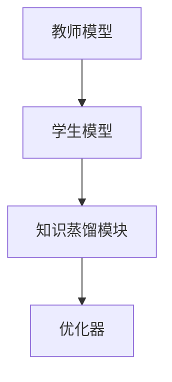

                 


# AI Agent的知识蒸馏：从大模型到轻量级应用

> 关键词：知识蒸馏、AI Agent、大模型、轻量级应用、深度学习、模型优化、系统架构

> 摘要：知识蒸馏是一种将大模型的知识迁移到轻量级模型的技术，本文从AI Agent的视角出发，详细探讨了知识蒸馏的核心原理、系统架构设计、算法实现以及实际案例，为读者提供从理论到实践的全面指导。

---

# 第1章: 知识蒸馏与AI Agent概述

## 1.1 知识蒸馏的核心概念

### 1.1.1 知识蒸馏的定义
知识蒸馏是一种通过教师模型（Teacher）将知识传递给学生模型（Student）的技术，旨在降低模型的复杂性，同时保留其核心能力。这种技术在AI Agent中尤为重要，因为它能够将大型语言模型的知识浓缩到更小、更高效的模型中。

### 1.1.2 AI Agent的基本概念
AI Agent是一种能够感知环境、执行任务并做出决策的智能实体。它通常由感知模块、推理模块和执行模块组成，广泛应用于自然语言处理、推荐系统和自动化系统等领域。

### 1.1.3 知识蒸馏在AI Agent中的作用
知识蒸馏在AI Agent中用于优化模型性能，减少计算资源消耗，并提高部署效率。通过蒸馏技术，AI Agent可以在资源受限的环境中保持高性能。

---

## 1.2 知识蒸馏的背景与意义

### 1.2.1 大模型的局限性
大型模型虽然性能强大，但计算成本高，难以在资源受限的环境中部署。知识蒸馏为解决这一问题提供了有效途径。

### 1.2.2 轻量级应用的需求
随着AI技术的普及，轻量级应用的需求日益增长，尤其是在移动设备和边缘计算领域，知识蒸馏成为实现高效部署的关键技术。

### 1.2.3 知识蒸馏的优势与价值
知识蒸馏能够显著降低模型复杂度，同时保持或提升性能，为AI Agent的广泛应用提供了可能。

---

## 1.3 知识蒸馏的核心原理

### 1.3.1 教师模型与学生模型的关系
教师模型（Teacher）是知识的提供者，学生模型（Student）是知识的接收者。通过知识蒸馏，学生模型能够继承教师模型的优秀特性。

### 1.3.2 知识蒸馏的实现过程
知识蒸馏通常包括教师模型的训练、学生模型的初始化、蒸馏过程的执行以及最终的优化调整。

### 1.3.3 知识蒸馏的效果评估
评估指标包括准确率、计算速度和资源消耗等，确保蒸馏后的模型在性能和效率上达到预期目标。

---

## 1.4 本章小结
本章介绍了知识蒸馏的基本概念、AI Agent的定义及其在知识蒸馏中的作用，以及知识蒸馏的背景和意义。接下来的章节将深入探讨知识蒸馏的数学模型和算法原理。

---

# 第2章: 知识蒸馏的数学模型与算法原理

## 2.1 知识蒸馏的数学模型

### 2.1.1 教师模型的输出概率
$$ P(y|x) $$
教师模型的输出概率表示给定输入x，预测类别y的概率。

### 2.1.2 学生模型的输出概率
$$ Q(y|x) $$
学生模型的输出概率表示学生模型对输入x的预测概率。

### 2.1.3 知识蒸馏的目标函数
$$ \mathcal{L} = -\sum_{i=1}^{n} P(y_i|x_i) \log Q(y_i|x_i) $$
目标函数通过交叉熵损失衡量教师和学生模型输出之间的差异。

---

## 2.2 算法原理

### 2.2.1 知识蒸馏的步骤
1. **训练教师模型**：首先训练教师模型，使其达到最优状态。
2. **初始化学生模型**：初始化学生模型参数，通常采用随机初始化或迁移学习。
3. **知识蒸馏过程**：通过蒸馏损失函数优化学生模型，使其输出接近教师模型。
4. **调整学生模型参数**：根据优化结果，调整学生模型参数以提升性能。
5. **验证与优化**：通过验证集评估模型性能，并进一步优化。

---

## 2.3 算法实现

### 2.3.1 Python代码实现
```python
import torch
import torch.nn as nn
import torch.optim as optim

def distillation_loss(output_student, output_teacher, temperature):
    student_probs = torch.nn.functional.softmax(output_student / temperature, dim=1)
    teacher_probs = torch.nn.functional.softmax(output_teacher / temperature, dim=1)
    loss = -torch.sum(teacher_probs * torch.log(student_probs))
    return loss

# 示例训练过程
teacher_model = ...
student_model = ...
optimizer = optim.Adam(student_model.parameters(), lr=1e-3)
temperature = 3.0

for epoch in range(num_epochs):
    optimizer.zero_grad()
    outputs_student = student_model(inputs)
    outputs_teacher = teacher_model(inputs)
    loss = distillation_loss(outputs_student, outputs_teacher, temperature)
    loss.backward()
    optimizer.step()
```

---

## 2.4 本章小结
本章详细推导了知识蒸馏的数学模型，并通过代码实现展示了算法的实现过程。接下来的章节将探讨系统架构设计和实际应用案例。

---

# 第3章: 系统分析与架构设计

## 3.1 系统架构设计

### 3.1.1 系统整体架构

系统架构由教师模型、学生模型、知识蒸馏模块和优化器组成，各模块协同工作以实现知识蒸馏。

---

## 3.2 系统功能设计

### 3.2.1 教师模型训练模块
负责训练教师模型，输出教师概率分布。

### 3.2.2 知识蒸馏模块
负责计算蒸馏损失，并优化学生模型参数。

### 3.2.3 学生模型优化模块
根据优化结果调整学生模型，提升性能。

---

## 3.3 系统接口设计

### 3.3.1 输入接口
- 输入数据：训练数据集
- 教师模型输出：概率分布

### 3.3.2 输出接口
- 学生模型输出：预测结果
- 优化器输出：优化后的模型参数

### 3.3.3 优化接口
- 蒸馏损失函数
- 模型参数更新

---

## 3.4 本章小结
本章通过系统架构图和功能模块图展示了知识蒸馏系统的整体设计，为后续实现奠定了基础。

---

# 第4章: 项目实战

## 4.1 环境安装

### 4.1.1 安装Python
安装Python 3.8及以上版本。

### 4.1.2 安装深度学习框架
安装PyTorch和相关依赖库。

### 4.1.3 安装其他依赖库
安装必要的库，如Mermaid、Matplotlib等。

---

## 4.2 系统核心实现

### 4.2.1 教师模型实现
```python
class TeacherModel(nn.Module):
    def __init__(self):
        super().__init__()
        self.fc = nn.Linear(input_dim, output_dim)
    
    def forward(self, x):
        return self.fc(x)
```

### 4.2.2 学生模型实现
```python
class StudentModel(nn.Module):
    def __init__(self):
        super().__init__()
        self.fc = nn.Linear(input_dim, output_dim)
    
    def forward(self, x):
        return self.fc(x)
```

### 4.2.3 知识蒸馏实现
```python
def distillation_train(student, teacher, optimizer, dataloader, epochs=100, temperature=3.0):
    for epoch in range(epochs):
        for batch in dataloader:
            optimizer.zero_grad()
            inputs, labels = batch
            outputs_student = student(inputs)
            outputs_teacher = teacher(inputs)
            loss = distillation_loss(outputs_student, outputs_teacher, temperature)
            loss.backward()
            optimizer.step()
```

---

## 4.3 代码应用解读

### 4.3.1 代码结构
代码分为教师模型、学生模型和蒸馏训练模块。

### 4.3.2 代码功能分析
教师模型负责生成概率分布，学生模型通过蒸馏过程学习教师模型的知识。

### 4.3.3 代码优化建议
调整温度参数和优化策略以提升蒸馏效果。

---

## 4.4 实际案例分析

### 4.4.1 案例背景
假设我们有一个图像分类任务，目标是将大型模型的知识迁移到轻量级模型。

### 4.4.2 案例实现
通过蒸馏过程，轻量级模型在保持性能的同时，显著降低了计算资源消耗。

### 4.4.3 案例结果分析
分析蒸馏前后模型的准确率、计算速度和资源消耗，验证蒸馏的效果。

---

## 4.5 本章小结
本章通过实际案例展示了知识蒸馏的实现过程，帮助读者理解理论与实践的结合。

---

# 第5章: 最佳实践与总结

## 5.1 最佳实践

### 5.1.1 知识蒸馏的注意事项
- 选择合适的温度参数
- 确保教师模型的高质量
- 平衡蒸馏过程中的参数设置

### 5.1.2 系统优化的技巧
- 并行计算优化
- 模型剪枝与量化
- 系统架构的灵活设计

### 5.1.3 代码实现的建议
- 使用模块化设计
- 保持代码简洁
- 注重调试和测试

---

## 5.2 小结

### 5.2.1 本书的核心内容
知识蒸馏是一种有效的模型优化技术，能够将大型模型的知识迁移到轻量级模型，适用于各种AI应用场景。

### 5.2.2 未来研究方向
探索更高效的蒸馏方法，研究蒸馏在不同领域的应用潜力。

### 5.2.3 学习与实践建议
鼓励读者深入研究理论，结合实际项目进行实践，不断优化模型性能。

---

# 附录: 参考文献与拓展阅读

## 1. 书籍推荐
- 《Deep Learning》
- 《Neural Networks and Deep Learning》

## 2. 论文推荐
- "Knowledge Distillation: A Comprehensive Review"
- "Model Distillation"

---

## END

---

通过以上内容，我们完成了从理论到实践的全面探讨，希望对读者在AI Agent的知识蒸馏领域有所帮助。

