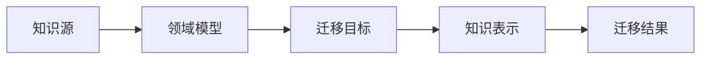
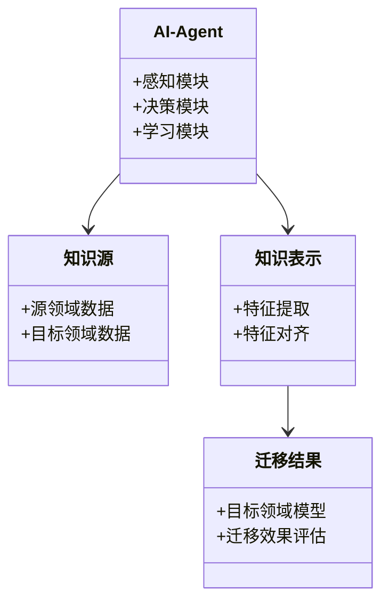
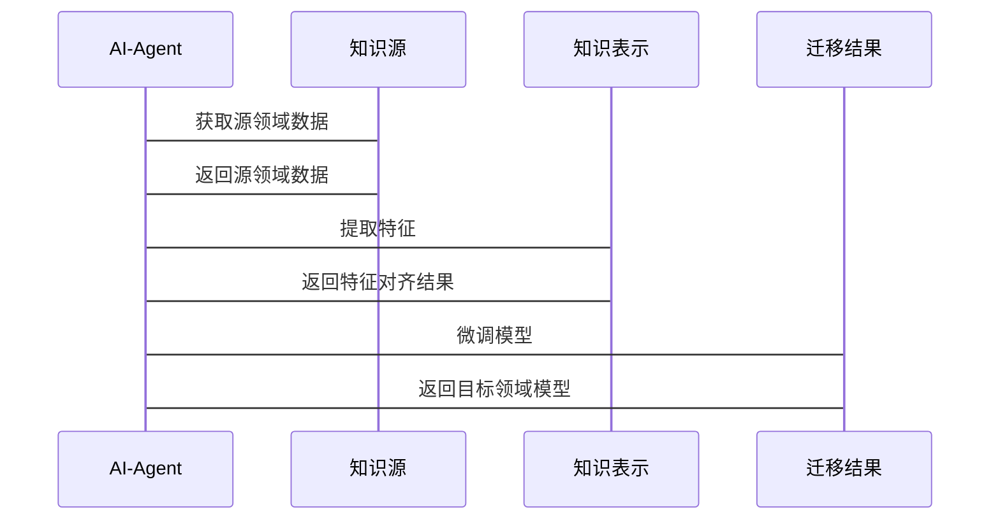

                 


# AI Agent的知识迁移能力：跨领域学习

> 关键词：AI Agent, 知识迁移, 跨领域学习, 迁移学习, 机器学习, 深度学习, 领域适应

> 摘要：AI Agent的知识迁移能力是实现跨领域学习的核心，通过知识表示与编码、迁移学习算法、系统架构设计等多方面的结合，AI Agent能够有效地将一个领域的知识迁移到另一个领域，提升其在复杂场景中的适应能力和智能化水平。本文将从背景、核心概念、算法原理、系统架构、项目实战等多方面详细探讨AI Agent的跨领域学习能力。

---

## 第1章: 背景介绍

### 1.1 知识迁移的基本概念

知识迁移（Knowledge Transfer）是指将一个领域的知识、经验或技能应用到另一个领域的过程。在人工智能领域，知识迁移的核心在于如何让AI系统在不同领域之间共享知识，从而提升其在新任务中的表现。例如，将图像分类任务中学到的知识应用到自然语言处理任务中。

#### 1.1.1 知识迁移的定义

知识迁移是一种学习策略，通过将已有的知识或经验应用到新的情境中，以提高学习效率和效果。在AI领域，知识迁移通常涉及模型或算法在不同数据集或任务之间的迁移。

#### 1.1.2 知识迁移的核心要素

- **源领域（Source Domain）**：提供原始数据或任务的领域。
- **目标领域（Target Domain）**：需要应用迁移知识的新领域。
- **共享特征（Shared Features）**：源领域和目标领域之间的共同特征。
- **迁移策略（Transfer Strategy）**：如何将源领域的知识迁移到目标领域。

#### 1.1.3 知识迁移的分类与特点

知识迁移可以分为以下几类：
- **跨任务迁移（Cross-task Transfer）**：将一个任务中学到的知识应用到另一个任务中。
- **跨领域迁移（Cross-domain Transfer）**：将一个领域中学到的知识应用到另一个领域中。
- **跨模态迁移（Cross-modality Transfer）**：在不同数据模态（如图像、文本）之间迁移知识。

---

### 1.2 AI Agent的定义与特点

#### 1.2.1 AI Agent的基本定义

AI Agent（人工智能代理）是一种智能系统，能够感知环境、自主决策并执行任务。与传统程序不同，AI Agent具有以下特点：
- **自主性**：能够在没有外部干预的情况下自主运行。
- **反应性**：能够实时感知环境并做出反应。
- **目标导向**：具有明确的目标，并通过行为实现目标。

#### 1.2.2 AI Agent的核心能力

- **感知能力**：通过传感器或其他输入方式获取环境信息。
- **决策能力**：基于感知信息做出决策。
- **学习能力**：通过学习算法提升自身的知识和能力。
- **推理能力**：通过逻辑推理解决问题。

#### 1.2.3 AI Agent与传统程序的区别

- **自主性**：AI Agent具有自主性，而传统程序通常需要外部干预。
- **学习能力**：AI Agent能够通过学习提升能力，而传统程序无法自主学习。
- **适应性**：AI Agent能够适应环境变化，而传统程序通常无法做到。

---

### 1.3 跨领域学习的背景与意义

#### 1.3.1 跨领域学习的定义

跨领域学习（Cross-domain Learning）是指在多个领域之间迁移知识，以提升AI Agent在不同环境中的适应能力。例如，一个AI Agent可以在医疗领域学习疾病诊断的知识，然后将这些知识应用到农业领域，帮助识别作物病害。

#### 1.3.2 跨领域学习的重要性

- **提升通用性**：通过跨领域学习，AI Agent可以在更多领域中发挥作用。
- **降低数据依赖性**：在目标领域数据不足时，可以通过迁移学习利用其他领域的数据。
- **提高效率**：通过知识迁移，可以减少在每个新领域从头训练模型的时间和资源。

#### 1.3.3 跨领域学习的应用场景

- **医疗领域**：将医学知识应用到健康管理、疾病预测等领域。
- **金融领域**：将金融数据分析的技巧应用到风险评估、投资决策等领域。
- **教育领域**：将学习策略应用到不同学科的教学中。

---

### 1.4 本章小结

本章从知识迁移的基本概念、AI Agent的定义与特点以及跨领域学习的背景与意义三个方面进行了详细探讨。通过理解这些内容，我们可以更好地理解AI Agent的跨领域学习能力及其重要性。

---

## 第2章: 知识迁移的核心概念与联系

### 2.1 知识表示与编码

#### 2.1.1 知识表示的基本方法

知识表示是知识迁移的基础，常用的表示方法包括：
- **符号表示**：使用符号（如文字、数字）表示知识。
- **向量表示**：使用向量（如词向量、句子向量）表示知识。
- **图表示**：使用图结构（如知识图谱）表示知识。

#### 2.1.2 知识编码的特征分析

- **维度性**：向量表示的维度决定了知识的复杂程度。
- **语义性**：符号表示和图表示能够更好地捕捉语义信息。
- **可迁移性**：向量表示通常具有更好的迁移能力。

#### 2.1.3 知识表示的优缺点对比

| 表示方法 | 优点 | 缺点 |
|----------|------|------|
| 符号表示 | 明确的语义 | 难以捕捉语境信息 |
| 向量表示 | 高维特征，易于计算 | 语义不明确 |
| 图表示 | 丰富的语义 | 复杂性高 |

---

### 2.2 知识迁移的算法原理

#### 2.2.1 知识迁移的核心算法

知识迁移的核心算法包括：
- **特征匹配（Feature Matching）**：通过匹配源领域和目标领域的特征分布，实现知识迁移。
- **对抗训练（Adversarial Training）**：通过生成对抗网络（GAN）实现领域适应。
- **自适应集成（Adaptive Ensembling）**：通过集成多个模型实现领域适应。

#### 2.2.2 算法的数学模型与公式

以特征匹配为例，假设源领域数据集为$D_s$，目标领域数据集为$D_t$，特征匹配的目标是最小化源领域和目标领域的特征分布差异：

$$ \min_{\theta} \mathbb{E}_{x \sim D_s} [f_\theta(x)] - \mathbb{E}_{x \sim D_t} [f_\theta(x)] $$

其中，$f_\theta$是特征提取函数。

#### 2.2.3 算法的优缺点分析

| 算法 | 优点 | 缺点 |
|------|------|------|
| 特征匹配 | 简单易实现 | 依赖特征分布假设 |
| 对抗训练 | 高效的领域适应 | � prone to模式坍塌 |
| 自适应集成 | 高精度 | 计算复杂度高 |

---

### 2.3 知识迁移的实体关系图



---

### 2.4 本章小结

本章详细探讨了知识表示与编码的核心概念，以及知识迁移算法的原理与实现。通过理解这些内容，我们可以更好地设计和实现AI Agent的跨领域学习能力。

---

## 第3章: 知识迁移的算法实现

### 3.1 基于特征的迁移学习

#### 3.1.1 特征提取的基本方法

- **线性变换**：通过线性变换将源领域和目标领域的特征对齐。
- **非线性变换**：使用深度学习模型提取高维特征。

#### 3.1.2 特征匹配的实现流程

1. 训练源领域模型，提取源特征。
2. 在目标领域上微调模型，提取目标特征。
3. 使用对抗训练或其他方法对齐源特征和目标特征。

#### 3.1.3 特征对齐的优缺点分析

- **优点**：能够有效降低特征分布差异。
- **缺点**：依赖特征分布的假设。

---

### 3.2 基于模型的迁移学习

#### 3.2.1 模型适应的基本原理

模型适应的核心在于通过调整模型参数，使得模型在目标领域上表现更好。

#### 3.2.2 模型微调的实现步骤

1. 在源领域数据上预训练模型。
2. 在目标领域数据上微调模型。
3. 使用交叉验证优化模型参数。

#### 3.2.3 模型迁移的数学公式

假设源领域损失函数为$L_s$，目标领域损失函数为$L_t$，模型参数为$\theta$：

$$ \theta^* = \arg \min_{\theta} L_s(\theta) + \lambda L_t(\theta) $$

---

### 3.3 知识迁移的自适应算法

#### 3.3.1 自适应学习的基本概念

自适应学习是指模型能够根据环境变化自动调整其行为或参数。

#### 3.3.2 自适应算法的实现流程

1. 初始化模型参数。
2. 在目标领域数据上训练模型。
3. 根据训练结果调整模型参数。

#### 3.3.3 自适应学习的优缺点分析

- **优点**：能够快速适应新领域。
- **缺点**：可能需要更多的计算资源。

---

### 3.4 本章小结

本章详细探讨了基于特征和基于模型的迁移学习算法，以及自适应学习的实现方法。通过这些算法，我们可以实现AI Agent在不同领域的知识迁移。

---

## 第4章: 知识迁移的系统架构设计

### 4.1 系统功能设计

#### 4.1.1 领域模型设计

使用Mermaid类图展示领域模型的设计：



#### 4.1.2 系统功能模块

- **感知模块**：负责获取环境信息。
- **决策模块**：基于感知信息做出决策。
- **学习模块**：负责知识迁移的实现。

---

### 4.2 系统架构设计

#### 4.2.1 系统架构图

使用Mermaid架构图展示系统架构设计：


---

### 4.3 系统接口设计

- **输入接口**：接收源领域和目标领域的数据。
- **输出接口**：输出目标领域模型和迁移效果评估结果。

---

### 4.4 系统交互流程图

使用Mermaid序列图展示系统交互流程：



---

### 4.5 本章小结

本章详细探讨了AI Agent的系统架构设计，包括功能模块、系统架构、接口设计和交互流程图。通过这些设计，我们可以更好地实现知识迁移。

---

## 第5章: 项目实战

### 5.1 环境安装

- **Python版本**：3.8及以上
- **深度学习框架**：TensorFlow或PyTorch
- **依赖库**：scikit-learn、numpy

### 5.2 核心实现代码

以下是一个简单的迁移学习实现代码（基于TensorFlow）：

```python
import tensorflow as tf
from tensorflow import keras

# 源领域数据
train_data = ...
train_labels = ...

# 目标领域数据
test_data = ...
test_labels = ...

# 定义模型
model = keras.Sequential([
    keras.layers.Dense(128, activation='relu'),
    keras.layers.Dense(10, activation='softmax')
])

# 编译模型
model.compile(optimizer='adam', loss='sparse_categorical_crossentropy', metrics=['accuracy'])

# 训练模型
model.fit(train_data, train_labels, epochs=10, batch_size=32)

# 微调模型
model.fit(test_data, test_labels, epochs=5, batch_size=32)
```

### 5.3 代码应用解读与分析

- **特征提取**：使用模型的第一层提取特征。
- **特征对齐**：通过微调模型实现特征对齐。
- **模型迁移**：在目标领域上微调模型，提升迁移效果。

### 5.4 实际案例分析

以图像分类任务为例，假设我们已经在源领域（猫狗分类）上训练了一个模型，现在将其迁移到目标领域（花卉分类）。我们可以通过微调模型实现花卉分类任务。

### 5.5 本章小结

本章通过一个具体的案例展示了AI Agent的跨领域学习能力，详细讲解了环境配置、数据处理、模型实现和结果分析。

---

## 第6章: 总结与展望

### 6.1 本章总结

本文从知识迁移的基本概念、AI Agent的定义与特点、跨领域学习的背景与意义、知识表示与编码、知识迁移的算法原理、系统架构设计、项目实战等多方面详细探讨了AI Agent的跨领域学习能力。通过这些内容，我们可以更好地理解AI Agent的知识迁移能力及其在实际应用中的重要性。

### 6.2 未来展望

未来，随着深度学习和迁移学习技术的不断发展，AI Agent的跨领域学习能力将更加智能化和高效化。我们可以期待以下几方面的进展：
- **更高效的迁移学习算法**：进一步降低计算复杂度，提升迁移效果。
- **更强大的知识表示方法**：通过图神经网络等技术，实现更丰富的知识表示。
- **更广泛的应用场景**：在医疗、教育、金融等领域，AI Agent将发挥更大的作用。

---

## 附录

### 附录A: 术语表

- **知识迁移（Knowledge Transfer）**：将一个领域的知识应用到另一个领域。
- **AI Agent（AI Agent）**：人工智能代理，能够自主感知、决策和学习。

### 附录B: 参考文献

1. Pan, S. J., et al. "Domain-Adaptive Neural Networks for Natural Language Processing." arXiv preprint arXiv:1601.01746, 2016.
2. Goodfellow, Ian, et al. *Deep Learning*. MIT Press, 2016.

---

# 结语

通过本文的探讨，我们深入理解了AI Agent的知识迁移能力及其在跨领域学习中的应用。希望本文能够为相关领域的研究者和实践者提供有价值的参考和启发。

